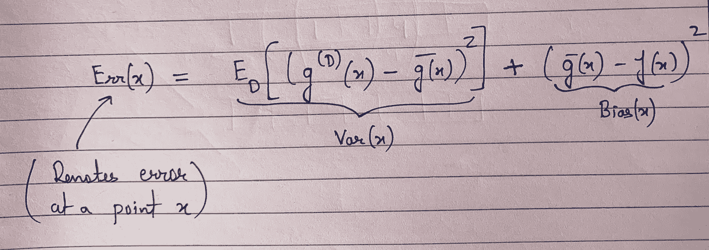

# 偏差方差权衡的数学理解

> 原文：<https://towardsdatascience.com/mathematical-understanding-of-bias-variance-tradeoff-9366dbc8439a?source=collection_archive---------24----------------------->

## 从方程理解偏差-方差权衡

我们中的许多人已经在人工智能文献的不同地方读到了偏差和方差，但仍然有许多人努力用数学方程来解释它。每当人们建立一个模型时，他们总是对偏差-方差进行评论，以确定该模型是否可以在现实世界中使用以及其性能有多好。在本文中，我们将关注描述偏差-方差的数学方程，并尝试从数学角度理解这个方程的不同部分。让我首先强调一些对理解这个等式至关重要的假设:

## 假设

1.  我们在训练模型时使用假设集 H。
2.  有一个实际的目标函数 f，我们试图使用学习算法和数据集 d 来逼近它。这个函数 f 总是未知的。
3.  当我们获取一个数据集 D 并对其应用学习算法时，我们将得到一个预测函数 g，它试图逼近实际的目标函数 f。
4.  有一个数据点 x 属于数据集 d。

我们将在下面的等式中使用上述假设。

由于本文的主要重点是从数学角度理解偏差-方差方程，我们将直接查看该方程，而不深入其背后的推导过程(如果您想要理解推导过程，请查看参考文献)。

在深入解释之前，我们先来看看偏差和方差的等式:

作者图片

## 说明

在上面的等式中，我们假设我们正在查看一个数据点 x 并找出错误。现在为了理解右手边，我们使用上面提到的假设。假设我们有一个假设集 H(它表示我们在训练时可能会用到的函数类)。现在，假设我们通过获取数据集 d 并对其运行经验风险最小化(使用优化算法训练模型以最小化经验损失)来应用学习算法，以获得预测器函数 g。在上面的等式中，g^D(x 表示 g 明确地附属于数据集 d，因为对于数据集 d 的不同实现，我们将获得不同的预测器函数。例如:假设我们有一个数据集 D 的 10 种不同实现:D1，D2，D3，…..，D10。现在，当我们取其中每一个并运行经验风险最小化时，我们将分别得到不同的预测值 g1，g2，g3，…，g10。请注意，我只取了 10 个数据集，对应于此，有 10 个不同的预测器，只是为了解释，但可以有无限多的实现。

现在想象我们有许多不同的预测值，用 g_i 表示，我们取它们的平均值得到 g^bar(x).从数学上来说，g^bar(x)可以显示为比其他学习到的预测器更好，并且更接近实际的目标函数 f。现在，上述等式中右手侧的第一部分简单地表示预测器函数 g^D(x).的方差通过数据集 d 的单一实现(这简单地意味着我们明确拥有或给予我们的数据集),我们将获得一些预测值 g^D(x，并且我们测量不同预测值在简单指示方差的平均预测值 g^bar(x 周围的分布。

理解上述等式的第二部分非常简单，我们试图测量我们的最佳平均预测器 g^bar(x 的预测相对于实际目标函数 f(x)有多远。这种差异表明我们对数据点 x 的预测有偏差。

实际上，当我们训练一个模型并测量误差时，我们永远无法访问这个平均预测值以及实际的目标函数，我们所拥有的是一些数据集，我们试图使用这些数据集来训练模型和一些基于我们建模决策的假设集。假设我们选择假设集作为神经网络来训练给定的数据集。训练之后，我们将得到一些预测函数 g^D(i.e.，一种神经网络，使用它我们可以测量测试集中数据点的误差。从理论上讲，无论我们测量什么样的误差，都会有一部分归因于偏差，一部分归因于方差，还有一些不可约误差没有显示在上述等式中。

看了上面的等式后，我们可以很快地将过拟合等概念联系起来，每当我们看到训练误差很低但测试误差很高时，我们很快就会说这是过拟合，这是低偏差和高方差的情况。这里，低偏差表示平均预测值非常接近实际目标函数 f，而高方差表示我们的假设集中的预测值相对于平均预测值(即 g^bar(x)过于分散，这意味着不同的数据集 I 将获得不同的预测值，并且它们彼此不接近。因此，为了解决这种情况，我们很快开始应用正则化技术，该技术通过对模型参数施加约束(尝试将 L1 和 L2 正则化公式联系起来),在理论上减小了假设集的大小。直观地说，由于这些约束，随着假设集的减少，方差开始减少，但偏差又开始增加。偏差增加的原因是，由于我们有一个受限制的假设集，平均预测值现在将会改变，并且将只依赖于存在于减少的假设集中的那些预测值，由于这些预测值，它与实际目标函数 f 的接近度可能会降低，这将导致偏差增加。

## 注意

当你在文献中看到偏差-方差方程时，对数据点 x 有另一个期望，它只是表明我们报告了测试集中所有数据点的期望误差，但在本文中，我们只是试图理解关于一个数据点的方程。

如果您想更深入地了解这个等式是如何推导出来的，请随意查看参考资料:

## 参考

[https://www.youtube.com/watch?v=zrEyxfl2-a8&list = PLD 63 a 284 b 7615313 a&index = 8](https://www.youtube.com/watch?v=zrEyxfl2-a8&list=PLD63A284B7615313A&index=8)