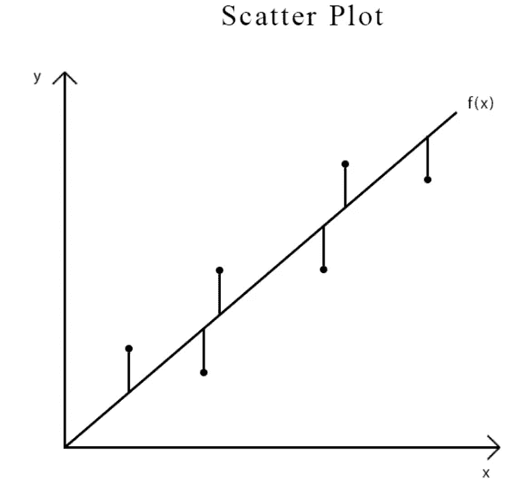
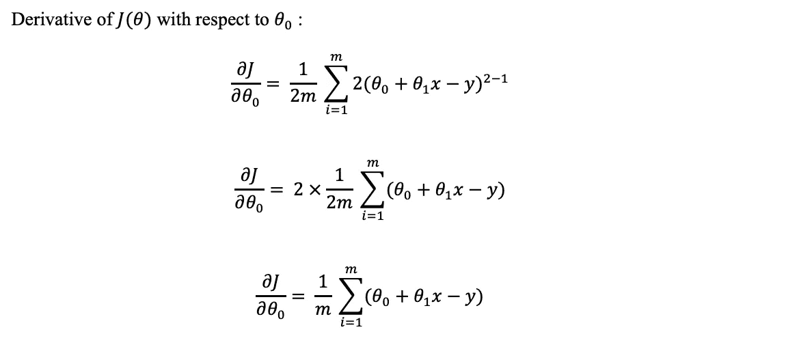
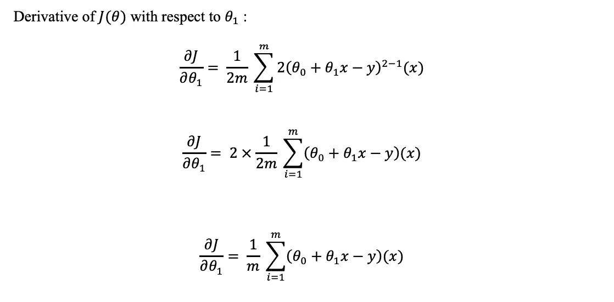
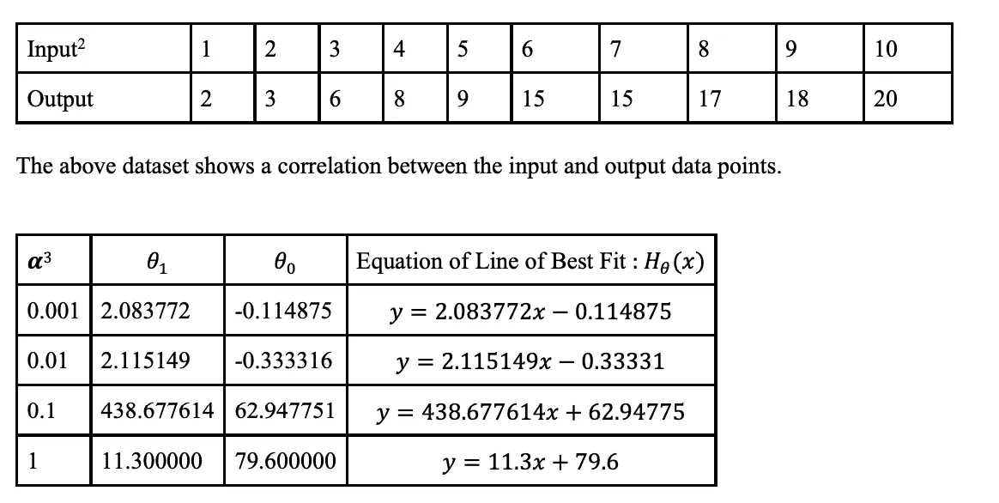
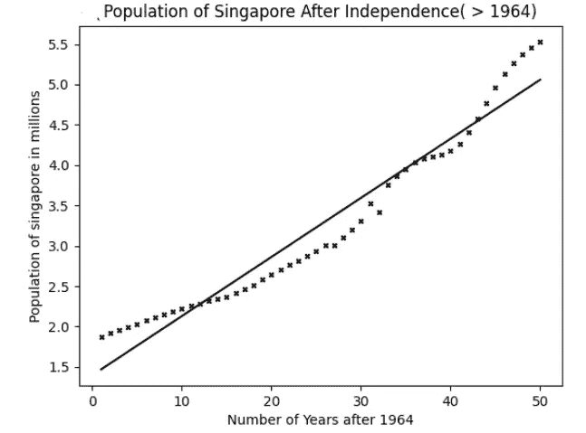
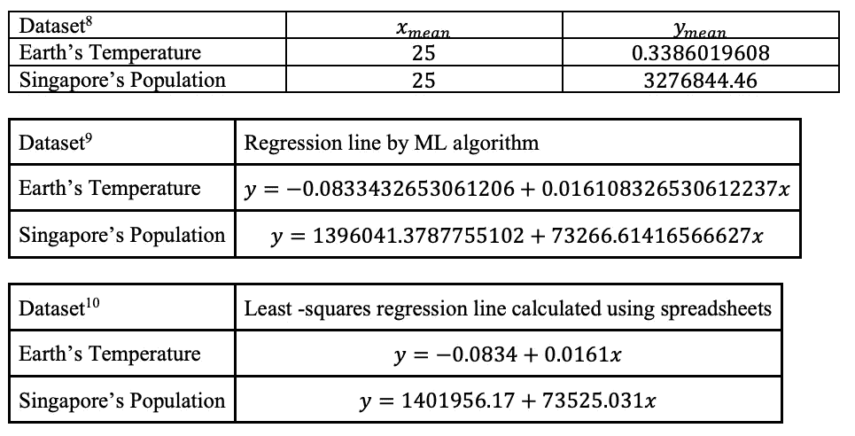

# 线性回归背后的数学

> 原文：<https://towardsdatascience.com/mathematics-hidden-behind-linear-regression-431fe4d11969?source=collection_archive---------16----------------------->

## 使用微积分探索统计学

大家好，

这是关于线性回归(梯度下降)算法中使用的数学。这是我 IB HL 数学探索的一部分。

# **线性回归:是什么？**

线性回归是一种统计工具，通过分析为给定数据集生成最佳拟合线。为了手动产生回归线，需要执行诸如均方误差和优化成本函数的操作；这两者将在本文档的后面详细解释。当数据集的规模如此之大，以至于手动操作在计算上变得低效时，主要问题就出现了。因此，当数据集变大时，计算机只需用任何语言编写几行简单的代码就可以更快地执行任务。

线性回归算法使用数据集(成对的输入和输出值)来生成该数据集的最佳拟合线。首先，该算法以𝑦 = 𝑎𝑥 + 𝑏的形式生成一个假设，因为该算法旨在输出 a 和 b 的值

# ***计算机程序:它如何找到这些常数(a 和 b)？***

Python 有自己的线性回归方法来寻找最佳拟合线中的这些常数。下面简单介绍一下算法及其计算方法。它使用最小二乘回归的修改版本，在一定次数的迭代后得到这些值。在这个场景中，迭代是基于先前的值重复给定的过程。下面是最小二乘回归的修正方法。

它使用通过使用所有输入-输出对计算的均方误差函数；计算每一对的输出和输入之间的差值，并对该差值求平方。这是为了确保输入-输出对最接近算法预测的线。一旦计算出总和，总值除以输入-输出对的数量。这是因为算法计算的是均方误差。为了使线性回归工作良好，并为给定数据集生成一条精确的最佳拟合线，需要最小化这个被称为“成本函数”的均方误差函数。

# MSE 函数适合

成本函数基于均方误差的统计概念。下图准确描述了计算和产生均方误差的过程。

(图 1:散点图示例，作者提供的图片)

均方误差的计算方法是，将给定输入值的预测值减去该输入的实际值。然后求差的平方。这是针对特定图形上的所有点进行的。求和完成后，将总值除以图上的数据点数，得到误差的平均值。

实际值和预测值之间的差异是通过减去最佳拟合线上给定输入的输出值得出的。这是因为均方误差的目的是计算与预测相关的数据集中的差异。这是通过放置回归线以使所有𝑥值的实际值和预测值之间的绝对差值最小来实现的。这导致平方差最小，从而获得最小的均方误差。

计算均方误差以显示分散点相对于回归线的接近程度。一次计算一个成本函数的这一部分的问题是，如果数据集的大小通常是数千或数百万，这将花费很长时间。因此，由于技术的进步，计算机可以非常快速地处理大量数据。

在这一点上，均方差很清楚，它是预测值和实际值之间的总误差。然而，仅计算误差是没有帮助的，因为它并不真正返回值以形成最佳拟合线的方程。因此，我们需要某种假设或函数，允许计算那些形成最佳拟合线的值:“成本函数”。

# “成本函数”

如上所述,“成本函数”是从均方误差中导出的。

(表格:成本函数中的变量)

让我们从一个假设开始:

上面我已经为具有参数(x，θ1 和θ0)的最佳拟合线定义了一个假设。这些是构成“成本函数”的一些参数。

(图 2:成本函数)

(图 3:进一步关于成本函数)

θ1 和θ0 是写在列表中的一组 2 个值，使得在编程时，θ1 和θ0 的值存储在列表中，使得计算机可以有效地存储更新，并且通过在列表中更新占用较少的存储器。

“成本函数”显示了预测线和实际数据点之间的差异。因此，成本函数值越高，数据中的差异就越大。

现在顾名思义；我想最小化“成本函数”,因为我无意预测不准确和不精确的变量值，这些变量可能对全球问题有重大影响，如地球温度上升导致全球变暖(本文稍后详述)。因此，下面是最小化成本函数的概述，以便预测尽可能准确。

**最小化成本函数**

一个函数的全局最小值是指一个函数在一个特别定义的输入域中的最小点，也就是说，对于一个 2D 图，每个输出都有一个输入。然而，在 3D 绘图中，每个输出有 2 个输入。因此，目标是确定能够产生平面最小值的 2 个输入值。继续，通过取给定输入的实际值和预测值之间的差并对该差求平方来计算如上所述的成本函数。对差值进行平方，以消除实际值大于预测值时可能出现的任何负差值。

顾名思义,“成本函数”返回特定值θ0 和θ1 的总平方误差，以构建数据集的最佳回归线。因此，为了找出θ0 和θ1 的最佳值，成本函数必须处于它能取的最低 y 值。因此，这就是优化成本函数的原因。优化特定函数是指找到该函数的输入值，使得该函数根据情况处于最大值或最小值。在这种情况下，目标是实现最低的差异，因此成本函数将需要收敛于全局最小值。

为了解决这个问题，参数值应该使得“成本函数”最小。因此，将“成本函数”最小化到其全局最小值将产生最精确的最佳拟合线。最小化“成本函数”的过程称为梯度下降。

到目前为止，我已经回顾了算法的基础，以及它是如何试图实现产生精确的最佳拟合线的目标的。回想一下，最小化成本函数是非常重要的。然而，成本函数有两个变量。这可能吗？

现在，当处理只有一个变量的函数时，可以应用常规微积分规则对函数进行微分，然后将导数等于 0，以获得值

其构成给定函数的最小值。然而，在这种情况下，必须使用一个叫做偏导数的新概念。

# **偏导数**

偏导数是微积分中的一个概念，它考虑了函数的多变量分量；对涉及多个变量的函数求导。导数被分成两个或更多部分，因为每当函数对给定变量求导时，所有其他变量都被视为常数。

找到“成本函数”的最小值和相应的θ1 和θ0 值需要使用在一组称为梯度下降的指令中应用的偏导数。

# 梯度下降:为什么？

如上所述，我将以相同的方式计算，除了我将计算𝐽(𝜃对θ0 和θ1 的偏导数。

(成本函数，待区分)

将对θ1 和θ0 求导，因为函数中有两个变量。

**计算偏导数**

(图 4:相对于θ0 的偏导数)

(图 5:相对于θ1 的偏导数)

因此，使用这些计算的偏导数，可以计算梯度下降。现在，梯度下降作为一个过程是试图收敛到“成本函数”的全局最小值的算法(参见:最小化成本函数部分)。通过将θ0、θ1 的值更新一定的量来最小化“成本函数”的过程被称为梯度下降。

下面是梯度下降和计算机如何计算这一过程的概述:

对θ0 和θ1 的更新是从求解微分方程的欧拉方法中导出的。因为有两个变量需要考虑:θ0 和θ1。欧拉数值方法同时但分别应用于两者，表明θ0 计算对θ1 没有直接影响。

*对于θ0:*

该算法更新𝜃#.的第 n 个值因此，使用θ0 的第(n-1)个值和θ0 的第 n 个值处的均方误差，这就是算法的开发者必须将θ0 初始化为随机值的原因，使得算法在运行时有第(n-1)项要参考。

学习率乘以均方误差，然后从θ值中减去，因为在更新θ0 时必须考虑程序计算的平均误差

*为 Theta1 :*

θ1 的区别在于更新函数。由于偏导数计算，更新函数是不同的。与θ1 类似，θ1 的第 n 个值通过使用θ1 的第(n- 1)个值来计算。这使用与θ1 的更新过程相同的逻辑。

因此，这就是计算机在返回构成成本函数的最小点的θ1 和θ0 的值时如何具有高度决定性和确定性。然而，这方面的一个主要限制是确定要使用的学习率。

在更新时，学习率和成本函数在θ0(n)和θ1(n)处的乘积被减去，因为该算法试图达到成本函数的最小点。

# **学习率及其相关性**

𝜶 =算法的学习率。

学习率表示算法为“成本函数”收敛于全局最小值而必须运行的次数。它是一个常数值，但是线性回归算法的学习率的值是基于开发者的个人选择的。学习率表示算法可以最小化成本函数并输出相应值以形成回归线的速度。

既然已经简单介绍了学习率，让我们回到观察θ0 和θ1 是如何同时更新的。

(图 6:更新θ0)

(图 7:更新θ1)

θ0 和θ1 的组合更新如下所示:

(图 8:θ0 和θ1 的组合更新)

由于梯度下降的计算是基于欧拉数值方法，即使欧拉数值方法可以手动执行，对于大数据集，计算机可以更快地执行，并且具有更高的精度。因此，这简化了大型公司和组织的数据建模。

这个过程将对所有的输入输出对(𝑥，𝑦)重复。因此，变量“I”表示第 n(𝑥，𝑦)对，因为计算机将𝑥和𝑦(input-output 对作为 n×1 阶的 n 长度矩阵读取，因为梯度下降是一种迭代算法。引入这些更新是为了获得最佳拟合线常数的结果。该算法在机器学习行业中广泛用于实现各种回归工具，如多项式回归和逻辑回归。我是在网上做机器学习课程的时候偶然发现这个概念的。短语“重复直到收敛”表示该算法将对(𝑥，𝑦)的所有值进行迭代，直到“成本函数”收敛于其全局最小值。

仔细观察更新，可以看到学习率:𝜶对更新有重大影响，因为学习率乘以给定点的成本。

**改变学习率(𝜶)**

如果为学习率选择的值太大，这意味着“成本函数”收敛的步骤数很少，因此算法是有效的。然而，情况可能并非如此，因为将学习率选择得太高会导致算法可能过冲，而不是收敛到最小值。

如果为学习速率选择的值太低，这意味着“成本函数”收敛的步骤数很少，因此该算法可能不是非常有效，因为它将花费更长的时间来达到全局最小值。

在变量没有很强相关性的情况下，有必要将学习率对样本数据集的影响可视化。

我使用了一个由 10 个元素组成的小样本数据集来展示不同学习速度的影响。

上表中的数据非常明显地表明，选择合适的学习速率是影响算法在给定数据集上的性能的关键因素。这被视为从 0.01 到 0.1 的增加(仅仅是 10 倍)导致最佳拟合线的不准确预测。然而，从 0.001 到 0.01 的 10 倍的相同增加并没有在直线方程中给出非常高的差异。

至此，我已经完全理解了我所编写的线性回归算法。现在，我将在数据集的背景下评估线性回归算法:新加坡的人口和地表温度。

# **线性回归:有用吗？**

我之前说过，线性回归算法可以预测不同类型数据的未知值，如股票价格、人口、天气等。因此，下面是我选择的两个场景，它们都处于所谓的线性回归适用性范围的极端。我选择的第一个情景是新加坡人口在 50 年内的增长。尽管人口增长通常是指数模型，但我在仔细研究了数据集后觉得；当数据集显示非常接近的线性关系时，也可以应用线性回归。此外，由于我最近刚从新加坡搬来，我非常喜欢这个地方:这是我在决定使用什么数据时考虑的另一个因素。

我使用了来自 *WorldOMeter* 的新加坡人口数据集，其中有自 1950 年以来的所有数据记录。尽管由于过去缺乏高质量的测量工具，这可能是一个非常不确定的人口测量，但我没有调整或计算任何可能操纵和改变数据库中提供的数据的不确定性。

(图 9:新加坡人口数据，图片由作者提供)

上图是使用 python 编程语言生成的，它显示了新加坡在 1965 年独立后 51 年间的人口增长情况。然而，从视觉上看，回归线并没有显示给定数据的精确概括。这是因为从图上可以看出，回归线上所有标绘点的比例非常低，表明 r 平方值很低，为 0.664。r 平方值是使用 python 库计算的，该库允许我确定我必须使用的最佳学习率，以便我可以实现给定数据集的最高可能 r 平方值。对于我选择的数据集，程序指示我设置学习率的值；alpha 为 0.1，以找到最佳拟合线。

(方程后线性回归)

为了在不同类型的数据集上有效地测试线性回归算法的性能，我选择使用地球表面温度数据，因为它的性质是在很长一段时间内逐渐增加；在这种情况下是 50 年。全世界的科学家都在使用线性回归来预测地球表面的预期温度。这种知识可以成为人类为可能的最坏情况做准备的工具。

为了验证线性回归是否有助于预测未来的地球温度，我获得了自 1965 年以来地球表面温度的变化。我将对 1965 年至 2014 年的数据进行线性回归，得出一条回归线。然后，我将使用 2015 年地表温度数据的变化来验证回归线。

(图 10:地球表面温度数据，图片由作者提供)

如上图所示，线性回归对数据集的表现相当不错。这是显而易见的，因为线前后的点的平衡很高，并且考虑到由于数据收集和处理中的巨大不确定性而可能影响这些类型数据的大量因素，它返回了相当高的 r 平方值 0.845。这表明它可以低误差地预测未来数据。

(方程后线性回归)

# 奏效了吗？

观察地球表面的温度:

为了确保使用算法得到的回归线是准确和精确的，我将使用 2015 年的增长值作为目标。

尽管预测值与实际值相比存在误差，但误差非常非常小，这表明线性回归在预测地球表面温度变化的情况下非常有用。这表明，使用线性回归的预测分析只能应用于存在大量受控变量且用于识别相关性的变量是连续变量的某些情况。

以下是对新加坡 50 年人口的研究，以显示线性回归如何因错误预测而损害决策:

从一开始画的图可以看出，决定系数很低。这表明相关性很弱。考虑到 r 平方值的范围为 0 到 1，即使 0.664 看起来是一个很高的值，使用这条最佳拟合线进行的预测也会充满误差，并且不会非常准确。为了说明这一点，我特意从我的数据集中排除了 2016 年、2017 年和 2018 年，以便我可以将预测值与人口的实际值进行比较。

使用 2016、2017 和 2018 作为该算法性能的测试值

因此，如上表所示，当将线性回归应用于该数据集时，由于基于前 50 年预测的数量非常不准确，因此表现不佳。因此，可以看出，线性回归不太适合人口数据。这是线性回归的一个局限性，它只能在极少数情况下有用，即使它可能是预测未来情况的一个非常广泛使用的工具。

上述两个数据集都已应用于机器学习的线性回归算法。但是，算法并不是计算回归线的唯一方法。因此，下面是使用最小二乘回归方法对同一数据集进行的一些计算。

(样本数据集)

理论上，最小二乘回归方法如下:

𝑐可以通过将 point(𝑥mean、𝑦mean 代入𝑦 = 𝑚𝑥 + 𝑐.来计算这是因为最佳拟合线肯定会经过𝑥mean 和𝑦mean

在这种情况下，

通过比较，可以看出，与 ML 算法相比，最小二乘回归方法生成了非常相似的回归线。这表明 ML 算法在给定的数据集上表现良好。此外，这表明训练数据集的残差非常小，因为系数值非常相似。因此，这解释了 ML 算法在预测不同类型数据集的未来值时的有效性。

# **结论**

总之，线性回归是非常有用的，但需要一个非常具体的问题类型，如体重指数数据集，股票交易数据集等。首先，线性回归不能很好地处理人口数据，因此可以得出结论，线性回归可能对增长率/下降率变化的数据表现不佳。因此，作为一种替代解决方案，可以使用指数曲线来概括新加坡的人口数据，因为指数曲线最能代表一定数量的增长。

其次，即使这个程序能够为我选择一个学习速度，它也不是在每种情况下都一样。因此，这表明了线性回归算法的另一个局限性。确定成本函数需要多快收敛是非常困难和令人困惑的。

第三，当应用于非线性关系时，线性回归会导致非常高的误差，并且由于当今世界已经在与不确定性作斗争，编程工具不应该产生错误和不准确预测的进一步问题。

最后，回想最初的目的，可以看出线性回归算法根据数据集、学习率、成本函数的参数表现出非常不同的行为。这表明，根据具体情况，线性回归算法可以表现得非常好，也可以表现得非常差。

感谢您阅读我对线性回归背后的数学的探索！。

有些数据集和概念不是我的，所以我在最后列了几个功劳。此外，我欢迎你的任何批评/反馈，无论是在评论中还是通过电子邮件。

电子邮件 ID:rahulr280623@gmail.com，将尽我所能及时回复

# 信用

布朗利，杰森。"线性回归教程使用梯度下降的机器学习."*机器学习掌握*，2019 年 8 月 12 日，machinelementmastery . com/linear-regression-tutorial-using-gradient-descent-for-Machine-Learning/。

甘地，罗希。"机器学习算法简介:线性回归."*中*，走向数据科学，2018 年 5 月 28 日，towardsdatascience.com/introduction- to-机器学习-算法-线性-回归-14c4e325882a。

内吉，萨姆尔。“线性回归——详细概述。”*中*，走向数据科学，2018 年 9 月 21 日，towardsdatascience.com/linear-regression-cost-function-梯度-下降-正规-方程组-1d2a6c878e2c。

联合国。“新加坡人口(活)。” *Worldometer* ，2020 年，[www . world ometers . info/world-population/Singapore-population/。](http://www.worldometers.info/world-population/singapore-population/.)

Anuveyatsu。“全球气温。”全球，2018。