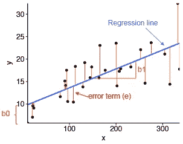
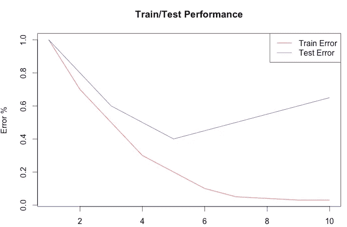
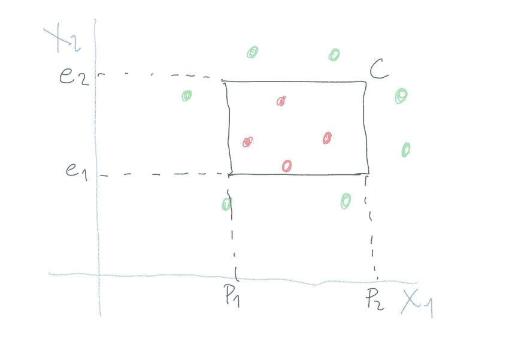
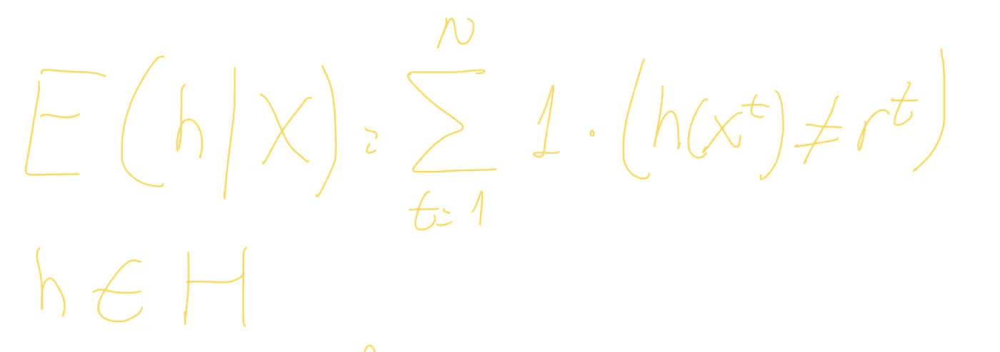
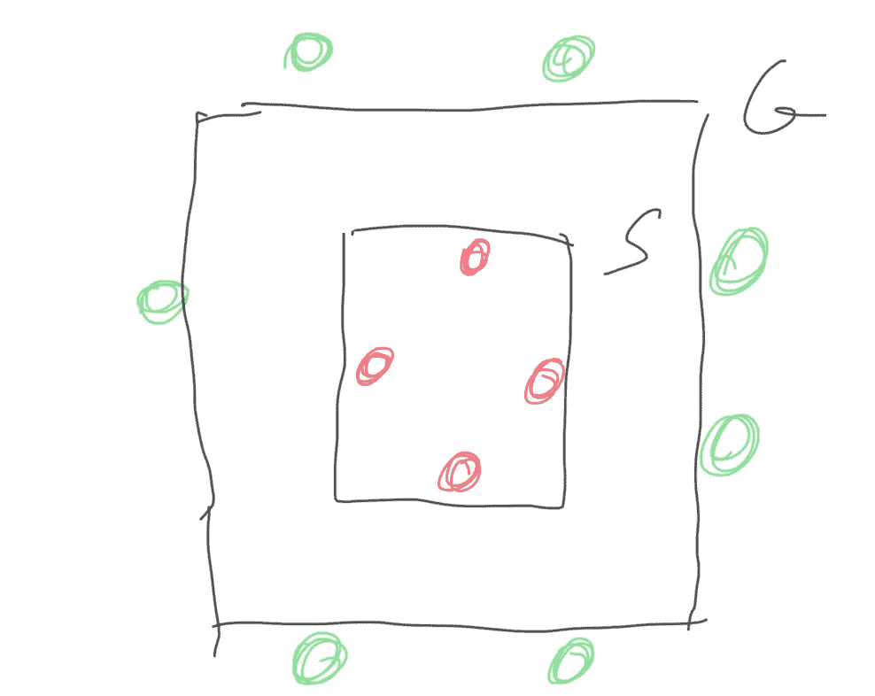
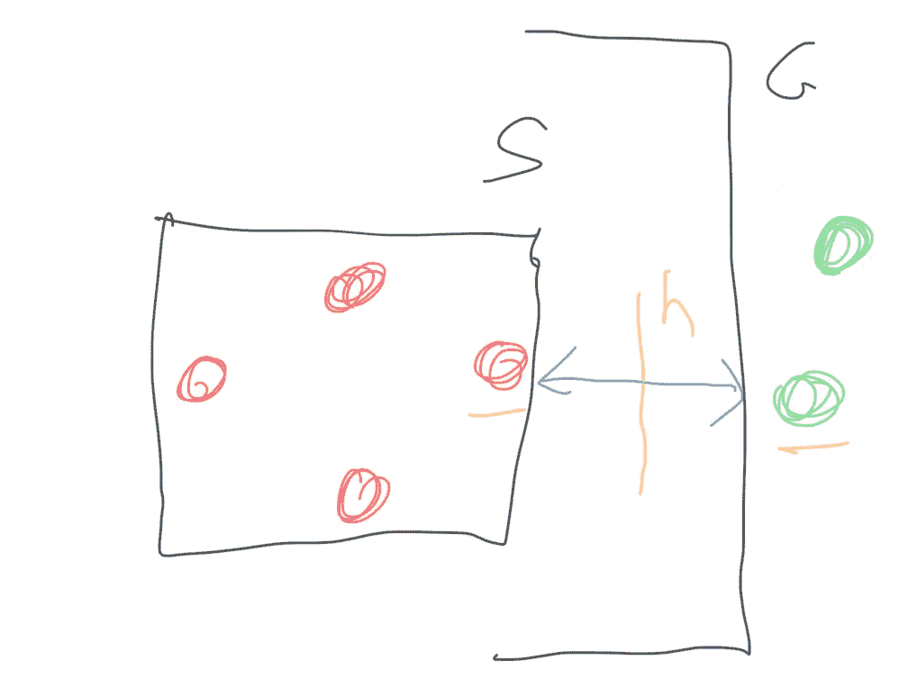

# 傻瓜监督学习背后的数学:浅显易懂的理论(第一部分)。

> 原文：<https://towardsdatascience.com/maths-behind-supervised-learning-for-dummies-the-theory-in-plain-words-part-i-8f9be4d7e33a?source=collection_archive---------23----------------------->

蒂姆·莫斯霍尔德在 [Unsplash](https://unsplash.com?utm_source=medium&utm_medium=referral) 上的照片

*机器学习是当今最酷技术的基础。*这是 Ethem Alpaydin 为他的书《*机器学习简介*》写的序言，这本书是我几年前开始接触数据科学世界时必须要读的。今天，这本书仍然被认为是学术界的圣经。你可以在亚马逊找到的许多书的不同之处在于，它没有谈论技术，它只显示了机器学习的算法部分。这才是重点。大多数今天从事机器学习的人，他们只是使用技术，但不知道这项技术封装的算法的数学基础。在熊猫数据帧上调用 python 中的“LDA”算法非常简单；但是在 R 数据帧上用插入符号执行线性回归更容易。如果您需要建立一个具有一定精确度的模型，这是很好的；但是如果你想真正开发你的资源，你真的需要完全理解你所使用的库或包背后的算法和数学。

我写中型故事，因为这是一个简单的方法来回顾概念，不要忘记它们。因此，我将写几个关于机器学习背后的数学的系列文章，从监督学习开始。不要担心，我知道理论很无聊，所以我会把理论和实践技巧结合起来，以便尽可能有所帮助。

# 什么是监督学习？怎么可能？

我们都知道，算法是一系列的指令，可以将输入转化为输出。然而，很多时候我们不知道将输入转换成输出所需的命令或指令；尽管进行了多年的研究，我们还是无法建立算法。我们所做的是学会完成任务，即使我们不知道算法的确切步骤。我们的方法从一个基于不同参数的非常通用的模型开始，我们将看到该模型在这些参数下对输出的逼近程度。该学习通过改进参数，直到找到最精确的输出。学习对应于调整那些参数的值。我们知道我们不能建立完美的方法，但是是的，一个好的和有用的近似。

在这个过程中，有一个统计学的观点，因为核心任务是从可用数据的样本中进行推断:获得更适合这些数据样本的参数，基于这些参数创建一个*模型*，并为全球情况外推该模型。

这个模型可以是预测性的，也可以是描述性的，这取决于我们是想做预测，还是想从数据中获得可解释性。有了它，我们就能够构建不同的应用程序:关联规则、分类任务、回归、模式识别、知识提取、压缩或异常值检测等等。

回归和分类都是监督学习。标准的简化方法是将输入变量称为 X，将输出变量称为 Y(回归中的数字和分类中的类别代码)。任务是学习从 X 到 Y 的映射，我们假设我们可以通过一个定义了一组参数的模型来做到这一点:Y *=G(X|P)* 其中 G *( )* 是模型， *P* 是参数。在学习过程中，机器学习算法优化参数以最小化误差，试图尽可能接近正确的值。

在继续之前，这里有一个重要的注意事项:机器学习算法和模型之间的差异，因为我们似乎可以互换使用这两个概念。模型是从具有特定和定义的参数的特定数据中学习到的最终表示；而算法则是建立那个模型的过程:*模型=算法(数据)。*线性回归是一种机器学习算法；但是 *y=3x1+3x2+1* 是一个模型。

# 参数与非参数。有人监督与无人监督

资料来源: [STHDA](http://www.sthda.com/english/articles/40-regression-analysis/167-simple-linear-regression-in-r/)

在前一节中，我们使用了一个学习目标函数 *G( )* ，它将输入变量 X 最佳地映射到输出 Y，试图表示我们不知道并且试图近似的真实函数 *F( )* 。如果我们知道 *F( )* 的样子，我们会直接使用它，并跳过学习阶段。

> Y=G(X)+E

我们的估计有误差，我们的模型是准确的，但并不完美。这种误差可以有三种不同的成分:偏差误差、方差误差和不可约误差。我们稍后会见到他们。

**参数 vs 非参数**

在参数算法中，我们将模型映射到一种形式，而非参数算法可以学习从输入到输出的任何映射。

在参数算法的情况下，我们假设形式。这简化了过程，但也限制了它能学到的东西。所以我们必须决定模型的形式，然后寻找这种形式的参数。在线性回归的情况下，我们对算法说:“嘿，伙计，你将通过这种形式学到一些东西: *Y=B2X2 + B1X1+ B0"* ，算法将寻找使给定数据上的表达式的误差最小化的 *B2、B1* 和 *B0* 参数。参数算法的其他例子是 LDA 或逻辑回归。优势是显而易见的:更简单，更快，需要的数据更少。这样做的后果是，你强迫模型去适应一种形式，而这种形式对你的情况来说可能不是最好的，因此准确性会更差。

相比之下，非参数算法可以自由地学习形状，它们不需要先验知识(SVM、随机森林、贝叶斯、DNN)，但是它们当然需要更多的数据，并且存在对训练数据过度拟合的更高风险。

**有人监督与无人监督**

这两种算法之间的区别很明显:如果你有真实的输出，可以用来比较训练期间的准确性，那么这就是监督学习(你可以回答*我的估计有多好？*)；但是如果你对输出没有任何线索，那么这就是无监督学习(*这个人更适合聚类 1 还是聚类 2？谁能告诉我这个人的真实集群？*)。

在监督学习的情况下，我们有一个关于我们的模型有多好的参考，因为我们有一个在训练期间与之比较的目标输出。当相对于训练数据的给定输出达到可接受的精度时，学习停止。然而，对于无监督算法，你只有输入数据(X)而没有输出目标；所以没有办法计算你的估计的准确性。这发生在聚类或发现关联规则(HDBScan，Apriori，k-medoids)时。

**监督算法中的偏差、方差和不可约误差**

上面一些段落，我们看到 *Y=G(X)+E* 在监督学习。这些监督算法可以被视为偏差和方差之间的权衡。*偏差*是当我们说模型必须符合特定形式时所做的错误假设。这使得问题更容易解决。*方差*是模型对训练数据的敏感度。

在监督学习中，算法从训练数据中学习模型。我们从训练数据中估计出 *G( )* ， *G( )* 几乎是 *Y* ，但是有一个误差 *E.* 这个误差可以拆分为:偏倚误差、方差误差和不可约误差。

不可避免的错误。不管你用于训练的数据集或你选择的算法如何，这种情况总是会发生。这个误差是由像隐藏变量这样的外部因素引起的。不管你怎么努力，你总是会犯这个错误。

*偏向错误。*我们做这些假设是为了让 *G()函数*更容易学习。因此，参数算法具有更高的偏差。高偏差使算法学习速度更快，但灵活性较低。例如，线性回归和逻辑回归是高偏差算法；而 SVM 或 kNN 是低偏差算法。

*方差误差。*如果我们选择另一部分训练数据，我们的模型会有多么不同。理想情况下，它不应该改变，但不幸的是，它在许多情况下发生了变化。高方差表明训练数据集中的变化将在很大程度上改变 *G()函数*。高方差算法的例子有:kNN 和 SVM。

由于我们无法控制不可约误差，我们将集中讨论偏差和方差误差。理想情况下，目标是获得低偏差和低方差。但这两者很难同时实现，所以我们必须平衡它们。参数或线性算法通常实现高偏差但低方差；而非参数或非线性算法通常得到低偏差但高方差。

**过拟合和欠拟合**

我们的学习过程是通过从训练数据中学习一个 G()函数，试图从具体例子中*推断*一般模式，与从一般规则中学习具体概念的*推断*形成对比。机器学习的最终目标是*将*从特定数据很好地推广到问题领域的任何其他数据。

一方面，o *过拟合*意味着从训练数据中学习太多，但不能很好地推广到其他数据。这是实践中最常见的问题，因为它会带来培训中的噪音。过度拟合在非参数和非线性模型中更常见(低偏差)。另一方面，*欠拟合*意味着用不足的数据来训练我们的模型。这就是为什么我们通常迭代，直到达到一定程度的误差。

在实践中，除了测试集*的误差之外，我们通常还会绘制出*训练集*的误差演变。*如果迭代太多，我们会到达一个点，在这个点上，训练误差持续减小，但突然测试的误差开始变大。这是因为模型在迭代过程中从训练数据中挑选噪声。甜点可以就在测试误差开始上升之前；然而，我们在实践中使用重采样和验证数据集来找到最佳点。

作者图片

# 分类

到目前为止，我们已经描述了理解任何机器学习分析所应该知道的不同概念。现在让我们分析分类背后的数学，这是机器学习中最重要的领域之一。

当从训练数据中学习时，我们希望有一个所有 A 类例子(也称为正面例子)共享的特定模式，而没有 B 类例子(也称为负面例子)。例如，我们用数百万个汽车描述来训练我们的数据，这些描述表明每个描述是否属于家庭汽车。我们的模型已经学习了，之后，它能够根据给定的描述，判断一辆我们以前没有见过的汽车是否是家用汽车。

想象下面的例子，我们有一个数据集 X，它描述了不同的汽车型号。每个数据点 *x* 由两个特征 *x1，x2* 组成，分别代表每辆车的价格( *x1* 和发动机功率(*x2*)x .这些车中有些是熟悉的(红点)或不熟悉的(绿点):

作者图片

我们要做的是找到区分红绿点的 C 矩形。具体来说，我们必须找到价格(x1)的 *p1 和 p2* 值以及限制 C 矩形的发动机功率的 *e1 和 e2* 值( *x2* )。换句话说，成为一辆熟悉的汽车就如同在 *p1 < x1 < p2 和 e1 < x2 < e2* 之间绘制出 *p1、p2、e1* 和 *e2 的合适值。*这个方程代表 H，我们相信 C 就是从这个假设类中得出的，也就是可能的矩形的集合(算法)。然而，该学习找到由一组特定的 *p1、p2、e1* 和 *e2* 值(模型)指定的特定假设/矩形 *h(属于 H)* 。因此，参数学习从假设类 H 开始，并基于可用数据找到 *p1、p2、e1* 和 *e2* 的值，创建一个等于或最接近真实 C 的假设 *h* ，指出我们将搜索限制到这个假设类(我们强制绘制一个矩形，但可能真实 C 是一个圆)，从而引入偏差。另外，请注意，如果 C 内有一个绿点，这将是一个假阳性；而如果 C 外有一个红点，那就是假阴性。

在现实生活中，我们不知道 c。我们有一个数据集，每辆车的标签为“它熟悉”或“它不熟悉” *x.* 这个标签被命名为 *r* 。然后，我们比较 *h(x)* 和 *r* ，看看它们是否匹配。这被称为从数据集 X 训练的模型 *h* 的经验误差:

作者图片

要回答的问题是*它对未包含在训练集中的未来数据点的分类有多好？*这就是泛化的问题。根据我们在寻找 C 时绘制矩形 *h* 的宽松程度或限制程度，我们可以得到最紧的矩形 S 或最一般的 G:

作者图片

S 和 G 之间 H 的任何 *h* 都与训练集一致。然而，*对于未来的数据点哪个会更好？*

根据 H 和 X，我们将有不同的 S 和 g。让我们选择 S 和 g 中间的一个 *h* 。我们将*边距*定义为从边界到最近数据点的中间距离。所以我们选择具有最大余量的 *h* 来平衡可能性。黄色下划线的数据点定义或*支持*边缘:

作者图片

我们使用一个错误(损失)函数，它不是检查一个实例是否在正确的类上，而是包括它离边界有多远。在一些关键的应用中，如果有任何未来的实例落在 S 和 G 之间，则是有疑问的情况，其被自动丢弃。

在本系列的下一篇文章中，我们将回顾 Vapnik-Chervonenkis 维度、可能近似正确的学习、学习多类和回归。

*Adrian Perez 是一名数据科学家，拥有超级计算并行算法博士学位。你可以在他的* [*中型简介*](https://adrianpd.medium.com/) *中查看更多关于他的西班牙语和英语内容。*

**参考书目**

*机器学习入门。*第四版。埃塞姆·阿尔帕丁山。麻省理工学院出版社 2020 年出版。

*掌握机器学习算法*。杰森·布朗利博士。2016.