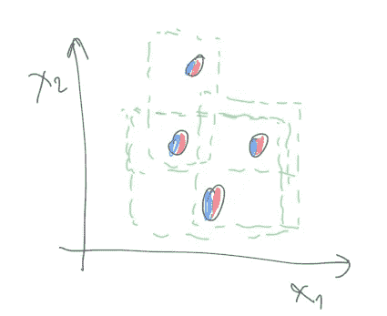
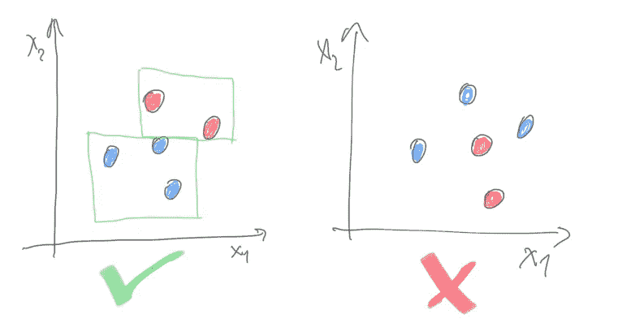
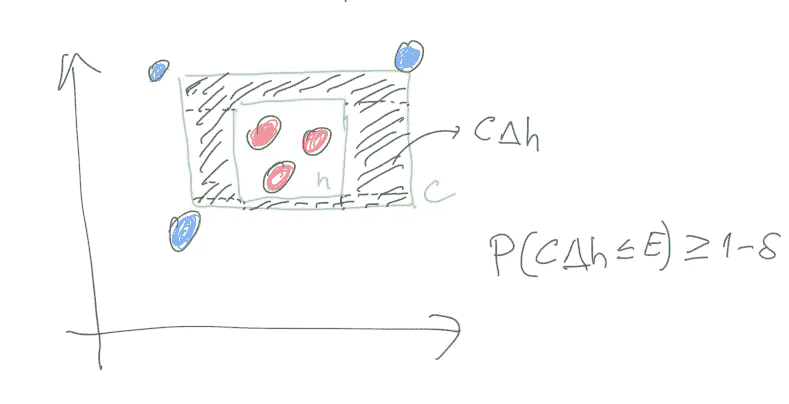
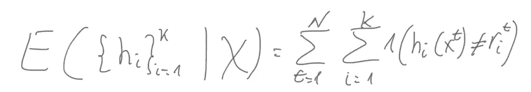
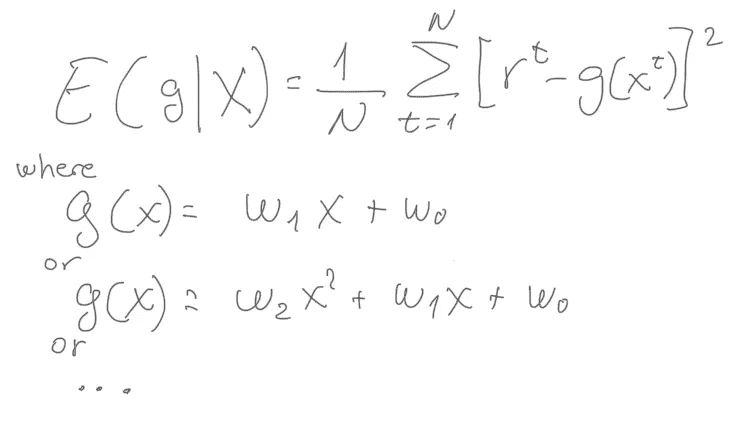

# 傻瓜监督学习背后的数学:浅显易懂的理论(下)

> 原文：<https://towardsdatascience.com/maths-behind-supervised-learning-for-dummies-the-theory-in-plain-words-part-ii-b3681d690c6e?source=collection_archive---------31----------------------->

## 每个人监督学习背后的代数和几何的快速概述。

乔希·里默尔在 [Unsplash](https://unsplash.com?utm_source=medium&utm_medium=referral) 上的照片

[在我之前的文章](/maths-behind-supervised-learning-for-dummies-the-theory-in-plain-words-part-i-8f9be4d7e33a)中，我写了这个系列的第一部分:*傻瓜监督学习背后的数学:简单明了的理论，*在这里我们看到了几何&代数是监督学习的基础的概述。在本系列的第二部分中，我将介绍 Vapnik-Chervonenkis 维度，可能近似正确的学习，如何将我们的二元分类器扩展到多个类，以及回归。

# 瓦普尼克-切尔沃嫩基斯维度也叫蛮力

如果四个个体( *x1，x2，x3，x4* )可以分为两类(a 类或 b 类)，那么就有 2^4=16 分类的可能性:(a 中的 *x1* ，a 中的 *x2* ，a 中的 *x3* ，a 中的 *x4* 或者(a 中的 *x1* ，a 中的 *x2* ，a 中的 *x3* 因此，2^N 学习问题(或可能的标签)可以由 n 个数据点给出。如果对于所有这些学习问题，我们可以建立一个 *h* (属于 H 类)将元素正确地分成它们的两个类，那么 H 粉碎了 N 个点。换句话说，给定的 N 个点总是被来自 H 类的假设 *h* 正确无误地分开。

被 H 粉碎的点的最大数量被称为 Vapnik-Chervonenkis 维数(它足以粉碎空间中 N 个点的特定样本，而不是 2 维中的任何 N 个点)。例如，四个点可以被矩形打碎，尽管它们不可能对齐，但我们已经找到了一个这样的例子。对于二维中给定的 4 个点，我们可以找到一个矩形 *h* ，它允许正确划分任何 2⁴=16 学习问题(或可能的标记)，因此 4 个点被 h:

作者图片

然而，在二维空间中，没有办法用矩形粉碎 5 个点。对于二维空间中的任意 5 个点，总有一些 2⁵=32 可能标号无法求解:

作者图片

当 H 是二维中轴对齐矩形的假设类时，H， *VC(H)，*的 Vapnik-Chervonenkis 维数等于 4。

为什么我说这也叫蛮力？好吧，大多数现实生活中的问题不能采取 2^N 的可能性。现实生活中的问题通常局限于一个分布，它们的点是从这个分布中提取的，并且空间中接近的点通常具有相同的标号。我们不必担心所有可能的学习问题，我们将使用一个具有较小 VC 维的假设类，而不是其他具有较高维度的假设类。这将简化我们的搜索，并且对于大多数给定的点都很有效(你还记得偏差的定义吗？).有些情况下，我们无法将所有绘制的点正确地分为两类。在这种情况下，我们将不得不说我们的假设类有多好或多准确，例如，*它以 94%的准确性工作良好，*或*它在超过 95%的情况下以小于 3%的误差工作。*

# 可能近似正确的学习又名现实生活中的近似

因此，假设我们有一个来自 H 的矩形假设 *h* 来解决一个现实生活中的问题，它的数据点来自一个未知的概率分布。我们要找出假设 *h* 以概率 *1-d* 最多误差 *E* 的点数 *N* 。换句话说，如果正确划分所有点的来自 H 的原始类是 *C，*那么当使用 *h* 作为假设*时，在 *C* 和 *h* 之间的差异区域会产生假阴性。*在 *1-d%* 的情况下(置信概率)，该区域内误分配点的概率必须小于 E(错误概率):

作者图片

C 和 h 之间的区域是另一个矩形(图像中的阴影矩形)，因此它可以被分成 4 个带(在角上重叠)。落在每一条中的概率是 E/4，随机抽取的点错过每一条的概率是 1-E/4。所有 n 个独立点错过该条的概率是(1-E/4)^N.另外，所有 n 个独立点错过四条中任何一条的概率是 4(1-E/4)^N.这个概率最多一定是 *d* ，因此 4(1-e/4)^n<d。我们不想深入细节，但是两边除以 4，取日志并重新排列，我们得到 N > (4/E)log(4/ *d* )。因此，我们至少需要这 N 个大小，以确保错误概率具有给定的置信概率。根据你的假设类别(我们用矩形)，这个公式必须被计算。

# 学习多种课程

到目前为止，我们已经关注了二元分类器，但是如果有几个类呢？如果我们有 K 个不同的类，其中每个实例只属于其中的一个，我们可以将此视为 K 个两类问题。来自训练集 X 的经验误差现在是所有实例(N)上所有类别(k)的预测的总和:

# 回归

在分类中，我们用二元行为计算经验误差:预测做得好或不好。对于给定的实例 x，C(x)要么是 0，要么是 1。当我们不预测类，而是预测值时，问题就不同了，叫做回归。现在， *r* 是一个实值，从输入中获得如下 *r=f(x)+E.* 我们必须将噪声 E 添加到输出中，它代表我们看不到的隐藏变量的影响。为了 100%准确，我们应该说 r=f*(x，z)，其中 z 表示隐藏变量。如果没有噪声，它将是一个插值而不是回归(例如 f*是插值)。请注意，自然输出函数中的噪声不是由于记录中的不精确或标记中的误差，这些误差仅在预测时产生影响。

所以我们想用我们的假设类 G()来逼近 f()，训练集 X 上的经验误差必须考虑输出中的数值距离，而不仅仅是分类中使用的等于/不等于。考虑该距离的一种方法是使用差值的平方:

我们的 G()可以是线性或二次或任何其他高阶函数。我们只需用其在经验误差公式上的定义替换 G()，并通过对系数 *w (* 为参数的解析解)取偏导数来最小化它。请注意，首先我们选择 G()类(例如，我们决定使用一个线性函数)，但是一旦我们设置了最小化经验误差的系数，那么我们就有了来自 G()类的实例 G()。我们应该选择哪个 G()。我在上一篇文章中说过，当函数的阶数增加时，训练误差减小，但你可能会陷入过拟合。

*Adrian Perez 是数据科学主管，拥有超级计算并行算法博士学位。你可以在他的* [*中简介*](https://adrianpd.medium.com/) *中查看更多关于他的西班牙语和英语内容。*

**参考书目**

*机器学习入门。*第四版。埃塞姆·阿尔帕丁山。麻省理工学院出版社 2020 年。