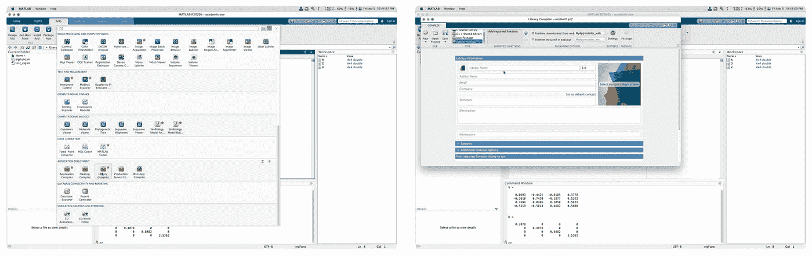
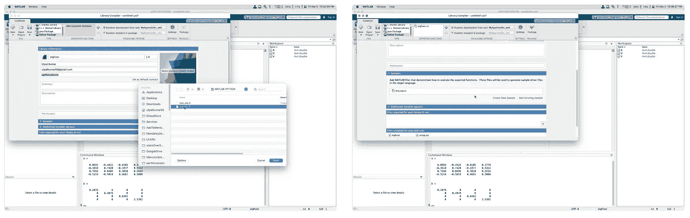
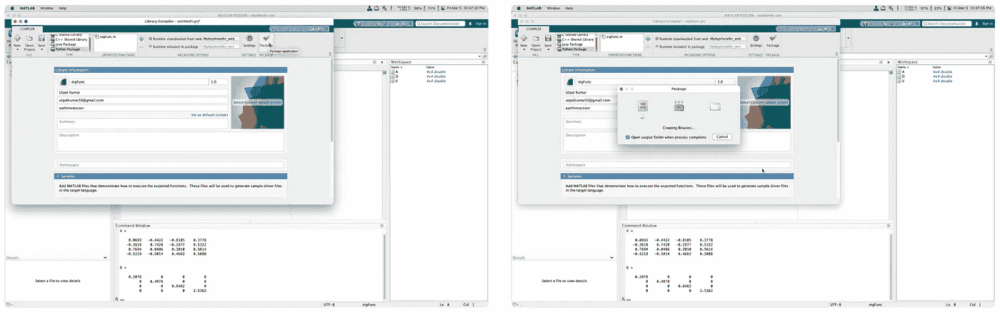
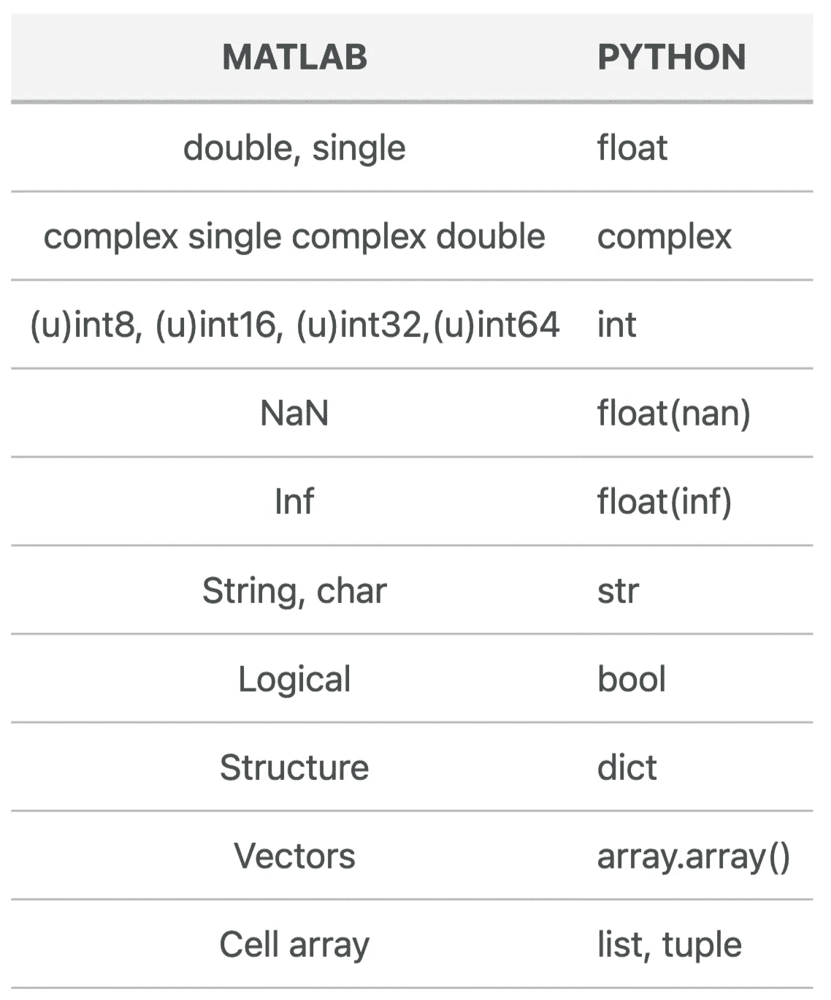

# 用 Python 轻松集成 MATLAB 中的自定义函数

> 原文：<https://towardsdatascience.com/matlab-function-in-python-739c473c8176?source=collection_archive---------24----------------------->

## Python 脚本中的 MATLAB 专业级函数

MATLAB 实现通常非常可靠，因为它是由专业人员开发的。但是使用 Python 的优势是巨大的。在这篇文章中，我将展示如何将自定义的 MATLAB 函数集成到 Python 脚本中。


图片来自 [Pixabay](https://pixabay.com/?utm_source=link-attribution&utm_medium=referral&utm_campaign=image&utm_content=1307227) 的 [Gerd Altmann](https://pixabay.com/users/geralt-9301/?utm_source=link-attribution&utm_medium=referral&utm_campaign=image&utm_content=1307227)

# 在 MATLAB 中定义自定义函数

让我们在 MATLAB 中创建一个可以在 Python 中使用的自定义函数。为了演示，我将使用一个初等函数，但同样的想法适用于任何函数。

## MATLAB 中的特征值和特征向量

```
function [V,D] = eigFunc(A)
%returns diagonal matrix D of eigenvalues and matrix V 
% whose columns are the corresponding right eigenvectors, 
% so that A*V = V*D.
[V, D] = eig(A);
end
```

我把上面的函数保存为`eigFunc`。该函数接受一个方阵作为输入，输出特征值的对角矩阵`D`和矩阵`V`，其列是相应的右特征向量[见 MATLAB 中的 eig 函数](https://www.mathworks.com/help/matlab/ref/eig.html)。

让我们首先在 MATLAB 中使用这个函数进行测试。

```
clear; close all; clc
A = gallery('lehmer',4);

[V,D] = eigFunc(A)
```

这将返回:

```
V =

    0.0693   -0.4422   -0.8105    0.3778
   -0.3618    0.7420   -0.1877    0.5322
    0.7694    0.0486    0.3010    0.5614
   -0.5219   -0.5014    0.4662    0.5088

D =

    0.2078         0         0         0
         0    0.4078         0         0
         0         0    0.8482         0
         0         0         0    2.5362
```

这个函数在 MATLAB 中的表现和预期的一样出色(因为这个函数是 MATLAB 中`eig`函数的精确副本。但是如何在 Python 中使用这个函数呢？

# 用 Python 调用 MATLAB

## 为 Python 使用 MATLAB 引擎 API

在 Python 中使用 matlab 函数最简单的方法是使用`matlab.engine`。可以按照这两种方式安装`matlab`库。

## 从 MATLAB 内部安装:

```
cd (fullfile(matlabroot,'extern','engines','python'))
system('python setup.py install')
```

## 直接从终端安装:

导航到 MATLAB 源代码位置并编译 python

```
python setup.py install
```

请注意，这个 MATLAB 引擎 API 将针对`python`的具体版本进行安装。如果您使用的是 anaconda，那么您可以检查正在为其安装 MATLAB 引擎 API 的 Python 版本。这与安装其他 Python 库的方式基本相同。详情请访问[此处](https://www.mathworks.com/help/matlab/matlab_external/install-the-matlab-engine-for-python.html)。

```
import matlab
import matlab.engine
eng = matlab.engine.start_matlab()
A = [[1.0000,    0.5000,    0.3333,    0.2500],
     [0.5000,    1.0000,    0.6667,    0.5000],
     [0.3333,    0.6667,    1.0000,    0.7500],
     [0.2500,    0.5000,    0.7500,    1.0000]]
A = matlab.double(A)
V, D = eng.eigFunc(A, nargout=2)
print("V: ", V)
print("D: ", D)

eng.quit()
```

以下是输出:

```
V:  [[0.06939950784450351,-0.4421928183150595,-0.8104910184495989,0.37782737957175255],				[-0.3619020163563876,0.7419860358173743,-0.18770341448628555,0.5322133795757004],[0.7693553355549393,0.04873539080548356,0.30097912769034274,0.5613633351323756],[-0.5218266058004974,-0.5015447096377744,0.4661365700065611,0.5087893432606572]]

D:  [[0.20775336892808516,0.0,0.0,0.0],[0.0,0.40783672775946245,0.0,0.0],[0.0,0.0,0.8482416513967358,0.0],[0.0,0.0,0.0,2.536168251915717]]
```

结果和以前一样。`nargout`参数告诉基于 matlab 的函数在这里输出`2`结果。

# 创建 Python 包:使用 MATLAB 编译器和 MATLAB 运行时

如果您的系统中安装了 MATLAB，这一切都很好。但是，如果您想将您的 Python 脚本提供给系统上没有安装 MATLAB 的人，该怎么办呢？在这种情况下，您可以使用 MATLAB 中的`library compiler`应用程序构建一个 Python 库。详情请访问[生成 Python 包并构建 Python 应用](https://www.mathworks.com/help/compiler_sdk/gs/create-a-python-application-with-matlab-code.html)。



(a)在 MATLAB 中选择库编译器应用程序(b)填写关于 Python 库的信息(图片由作者提供)



(a)选择 MATLAB 函数生成 Python 库(b)添加示例 MATLAB 脚本(图片由作者提供)



(a)点击`package`生成独立组件(b)等待任务完成(图片由作者提供)

## MATLAB 运行时安装

请注意，用户需要安装 MATLAB 运行时才能成功使用这个库。MATLAB runtime 有助于在不安装 MATLAB 的情况下运行已编译的 MATLAB 应用程序或组件。运行时可以从[这里](https://www.mathworks.com/products/compiler/matlab-runtime.html)下载，Windows，Mac，Linux OS，免费下载。

## 为 Python 导入基于 MATLAB 的库

```
import eigFunc
eigFuncAnalyzer = eigFunc.initialize() #calls the matlab runtime
A = [[1.0000,    0.5000,    0.3333,    0.2500],
     [0.5000,    1.0000,    0.6667,    0.5000],
     [0.3333,    0.6667,    1.0000,    0.7500],
     [0.2500,    0.5000,    0.7500,    1.0000]]
A = array.array(A) %not tested
V, D = eigFuncAnalyzer.eigFunc(A, nargout=2)
print("V: ", V)
print("D: ", D)
eigFuncAnalyzer.terminate()
```

请注意，您可以设计您的`eigFunc.m`,您可以简单地加载 mat 数据，并且您可以使用`scipy.io.savemat`函数将 python 数据保存为 mat 格式。有关详细信息，请参见 [scipy 文档](https://docs.scipy.org/doc/scipy/reference/generated/scipy.io.savemat.html)。

# 数据类型转换



(图片由作者提供)

# 参考

1.  [如何从 Python 调用 MATLAB](https://www.youtube.com/watch?v=OocdPu1Tcrg)
2.  [从 Python 调用 MATLAB 函数](https://www.mathworks.com/help/matlab/matlab_external/call-matlab-functions-from-python.html)
3.  [生成 Python 包，构建 Python 应用](https://www.mathworks.com/help/compiler_sdk/gs/create-a-python-application-with-matlab-code.html)

*原载于 2021 年 3 月 5 日*[*https://www.earthinversion.com*](https://www.earthinversion.com/utilities/MATLAB-function-in-Python/)T22。