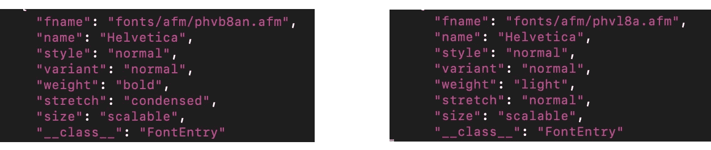
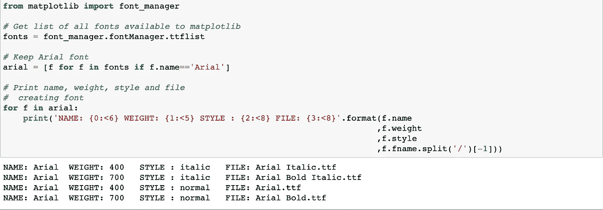
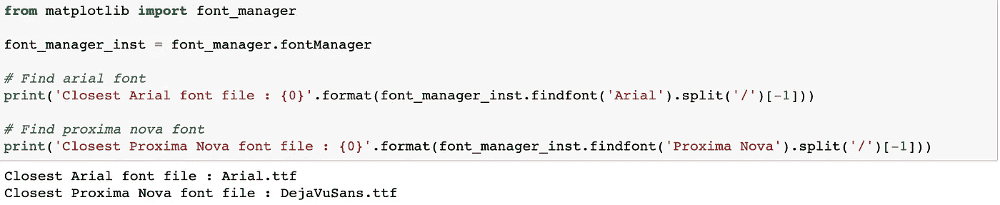
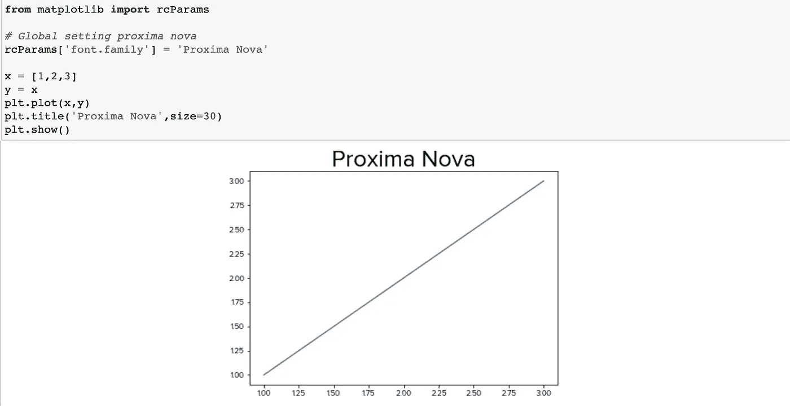
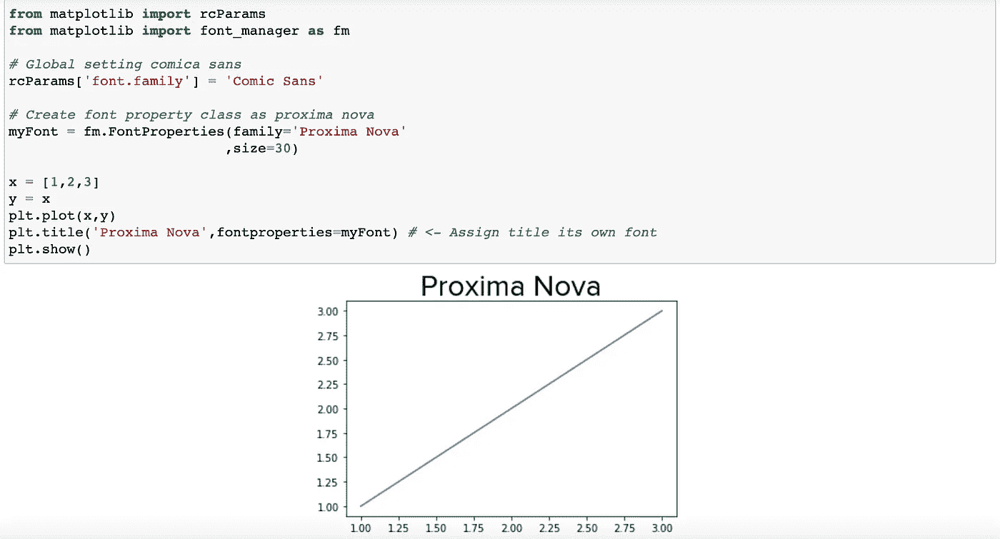

# Matplotlib 和自定义字体

> 原文：<https://towardsdatascience.com/matplotlib-and-custom-fonts-bee4aac7b5cb?source=collection_archive---------37----------------------->

## 更权威的指南

# 为什么要使用自定义字体？

我需要在两种情况下使用自定义字体。首先，我在一个预装字体数量有限的 OS 上(*cough* Microsoft *cough*)。第二，我需要为我工作的特定公司或项目匹配设计美学。

将自定义字体安装到 matplotlib 需要两个步骤:

1.在您的计算机上安装自定义字体
2。清理并重新创建存储字体信息的 matplotlibs 缓存

我将走完这两步。

虽然网上有很多在 matplotlib 中使用自定义字体的资源，但是它们有两个问题。首先，它们有时并不是一个完整的指南，只是向您展示一些零碎的内容(例如如何重新加载 matplotlib 缓存)。其次，它们从 matplotlib 中与字体及其属性的交互中抽象出来。为了理解 matplotlib 中的字体，我会经常使用 **font_manager** 类，它有很多工具来改进你的字体游戏，同时也使编写可重用代码更加简单。

# 步骤 1:安装自定义字体

这个演练的重点是让字体工作，因为我已经提供了如何将字体安装到您的计算机上的链接。

我们将使用“比邻星新星”字体。

在电脑上安装自定义字体非常容易。对于 Mac，可以使用[“字体册”app](https://support.apple.com/guide/font-book/install-and-validate-fonts-fntbk1000/mac) 。对于 Windows，有一个类似的工作流程，你下载一个字体，然后拖放到一个等效的 [Windows 的字体应用](https://www.digitaltrends.com/computing/how-to-install-fonts-in-windows-10/)。

在这个练习中，我在 Mac 上安装了“Proxima Nova”字体。安装字体到底是什么意思？在我们的例子中，这意味着安装一个**。ttf** (真字型)或**。otf** (原始类型字体)文件到电脑上被 Mac 识别为字体目录的目录。具体来说，它安装的一个文件是这样的:

```
**ProximaNova-Regular.otf**
```

这是很重要的一点: ***字体只是你电脑上的文件*** 。

matplotlib 所做的只是将 matplotlib 中的一个名称 **fname** 分配给一个文件 **name** ，它是一个. ttf(或。otf)文件。

# 步骤 2:处理 matplotlib 字体缓存文件

为了将字体名称映射到字体文件，matplotlib 在其缓存目录中有一个字典(或 json 文件)。注意，这个文件并不总是在同一个地方，而是通常位于主目录。如果你在 mac (windows)上，它通常位于你的 **HOME** ( **%HOME%)** 环境变量被设置的地方。

为了让 matplotlib 识别我们的计算机上有一个新的字体文件，我们只需要删除并重新加载这个将字体名称映射到字体文件的字典:

(1)删除 matplotlib 字体缓存文件
(2)使用 matplotlib 重新创建该文件

对于(1)，您可以从命令行删除字体列表文件。这是在 Mac 上:

```
rm ~/.matplotlib/fontlist-v300.json
```

对于(2)，我们正在使用 python 中的 **font_manager** 类重新创建我们刚刚删除的那个 json 文件

```
from matplotlib import font_manager# Rebuild font cache
font_manager.__rebuild()
```

虽然这个过程可能会奏效，但我遇到了一些问题(尤其是在我的另一台 Windows 机器上)。因此，在运行这两个命令之前，让我们先看看几种方法来验证 matplotlib 实际看到的字体，即 matplotlib 中可以使用的字体。

## 绕道:Matplotlib 能看到什么字体？

## 检查缓存文件

一种方法是对上面的缓存文件 **fontlist-v300.json** 进行简单的单词搜索。这个文件是 json 格式的(基本上是一个嵌套字典)，每个条目都有一个字体和与字体相关联的属性，比如文件与字体相关联的 **fname** ，以及字体的相关权重(或粗细) **weight** 。



fontlist-v300.json 截图

一个有趣的事情是，你可以看到字体名称重复出现。有多个条目共享 Helvetica 字体**名称**属性，但是具有不同的字体文件，这些文件显示在 **fname** 属性中。为什么同一个名字会有不同的字体文件？因为这些不是完全一样的字体！不同的字体文件与不同的**权重**属性(或者你的字符有多粗)相关联。**粗体**和**普通**字体粗细有单独的文件。再次说明， ***字体只是文件*** 。

我一开始说您可以检查缓存文件，所以我在这个文件中查找名称“Proxima Nova ”,结果发现它不在 json 缓存文件中。

## 列出所有可用的字体

虽然字体缓存文件很好，但在 matplotlib 中检查它们会更容易一些。幸运的是我们的 **font_manager** 类能够做到这一点。检查字体的一种方法是使用我们的 **font_manager** 类获得 **FontEntry** 对象的列表。这些特殊的物体允许我们检查字体和它们的属性。我们在下面看到我们正在访问 **ttflist** 属性，这是有意义的，因为”。ttf "文件是字体来源的文件类型。



我在上面展示了用 Arial 查找所有字体名称的基本方法。但是，matplotlib 已经领先你一步了。在我们的 **font_manager** 类中，有一个 **find_font** 函数，它使用最近邻搜索方法来尝试并查找具有您给定名称的字体。我们看到的是，如果它不能找到一个比邻星 Nova 字体文件(如预期的)，而是默认为似曾相识。



## 回到重新创建缓存

使用上面的步骤检查完文件后，我返回到步骤 2，删除并重新创建缓存。我们现在可以(从 python 内部)检查“Proxima Nova”是否能被我们的 **font_manager** 类找到。现在看到的是我们的“比邻星 Nova”字体可以找到了！


## 绘制我们的结果

我们可以看到，当我们设置全局 rc 参数时，我们的字体现在是可用的。



实现类似目标的另一种方法是为绘图中的特定对象设置字体。这里我们把全局字体改成漫画 Sans，然后只把剧情标题改成比邻星 Nova。我们使用了 font_manager 类中我最喜欢的子类之一，FontProperties 类。这里我的变量 myFont 是这个类的一个实例，具体来说，它是一个大小为 30 的 Proxima Nova 字体。这样做的好处是，如果您只需为图形中的不同对象创建不同的 FontProperties 实例(如标题或轴标签实例)，就可以更容易地创建模板。



# 结论

让自定义字体在 matplotlib 中工作是一个简单的过程，下载字体文件，然后重新加载 matplotlib 缓存。本练习的主要收获是 ***字体是文件*、**，让自定义字体工作是让 matplotlib 找到这些文件的过程。要更深入地了解 font_manager 类**，**的所有方法和实例，我建议你查看 matplotlib 开发者提供的 [font_manager 类页面](https://matplotlib.org/3.3.3/api/font_manager_api.html)。密谋愉快！