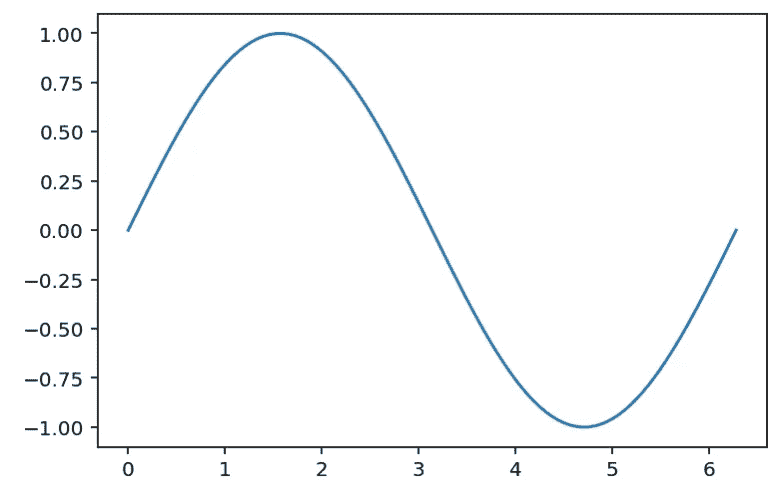
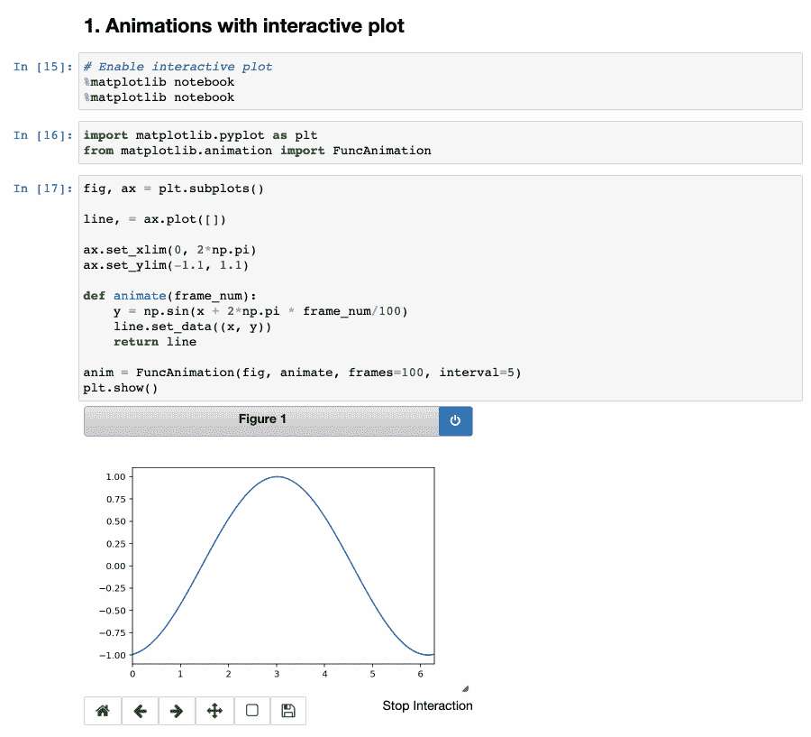
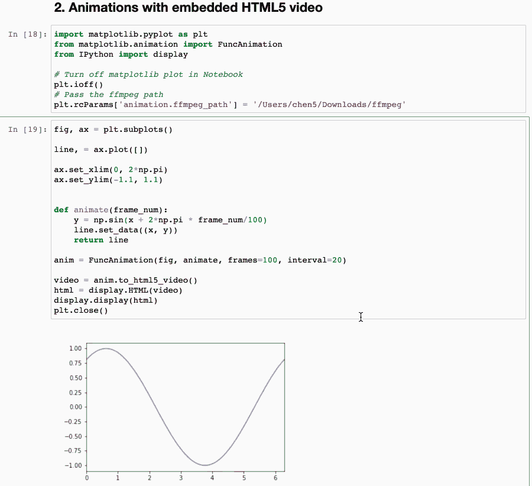

# Jupyter 笔记本中的 Matplotlib 动画

> 原文：<https://towardsdatascience.com/matplotlib-animations-in-jupyter-notebook-4422e4f0e389?source=collection_archive---------2----------------------->

## 用 matplotlib `FuncAnimation`在 Jupyter 笔记本中创建动画图形


照片由 [Isaac Smith](https://unsplash.com/@isaacmsmith?utm_source=unsplash&utm_medium=referral&utm_content=creditCopyText) 在 [Unsplash](https://unsplash.com/s/photos/data-visualization?utm_source=unsplash&utm_medium=referral&utm_content=creditCopyText) 上拍摄

Matplotlib 是用于探索性数据分析的最流行的绘图库之一。它是 Pandas 中默认的绘图后端，其他流行的绘图库也是基于它，例如 seaborn。在大多数情况下，绘制静态图应该很好，但当您运行模拟或进行时间序列数据分析时，基本图可能并不总是足够的。您可能希望展示一个动画来帮助您理解状态如何随时间变化。

在本文中，您将学习如何在 Jupyter Notebook 中使用 matplotlib 创建动画。这篇文章的结构如下:

1.  朱庇特笔记本中的互动情节
2.  Jupyter 笔记本中的嵌入式 HTML5 视频

> 请查看[笔记本](https://github.com/BindiChen/machine-learning/blob/master/data-visualization/0001-matplotlib-animation/matplotlib-animation-notebook.ipynb)获取源代码。

为了演示，我们将创建一个移动的正弦波，下面是一个帧示例:

```
import matplotlib.pyplot as plt
import numpy as npx = np.linspace(0, 2*np.pi, 100)
y = np.sin(x)plt.plot(x, y)
plt.show()
```



作者图片

# 1.朱庇特笔记本中的互动情节

为了在 Jupyter Notebook 中创建交互式绘图，您首先需要启用交互式绘图，如下所示:

```
# Enable interactive plot
**%matplotlib notebook**
```

之后，我们导入所需的库。尤其是可以用来给你制作动画的`FuncAnimation`类。

```
import matplotlib.pyplot as plt
from matplotlib.animation import **FuncAnimation**
```

接下来，我们需要创建动画人物的初始状态。我们调用`subplots()`不带任何参数地创建一个图形`fig`和一个单轴`ax`。我们将 x 范围设置为`(0, 2*Pi)`，将 y 范围设置为`(-1.1,1.1)`，以避免它们不断变化。

```
**fig, ax = plt.subplots()****line**, = ax.plot([])     # A tuple unpacking to unpack the only plotax.**set_xlim**(0, 2*np.pi)
ax.**set_ylim**(-1.1, 1.1)
```

然后我们创建一个函数`animate()`，它将被`FuncAnimation`调用。该函数接受一个参数`frame_num`——当前帧号。这里我们要做的是根据帧号改变我们行的数据。

```
def animate(frame_num):
    y = np.sin(**x + 2*np.pi * frame_num/100**)
    line.set_data((x, y))
    return line
```

最后，我们通过调用带有 4 个参数的`FuncAnimation`来创建动画对象

*   第一个参数`fig`是对我们创建的图形的引用
*   第二个参数`animate`是我们创建的在每一帧调用以更新绘图的函数。
*   第三个参数是`frames=100`，它定义了“一轮动画”的帧数
*   最后，`interval=20`参数设置帧之间的延迟(毫秒)。`20`相当于`50FPS` (1000ms / 20 = 50 FPS)。如果数字太大，你会等很长时间，如果数字太小，你会看不到它的速度。一般来说，我们需要大于 16 的 FPS 来实现流畅的动画(人眼只能接收 10–12 帧[1])。

```
anim = FuncAnimation(fig, animate, frames=100, interval=20)plt.show()
```



作者图片

> 请查看笔记本[获取源代码](https://github.com/BindiChen/machine-learning/blob/master/data-visualization/0001-matplotlib-animation/matplotlib-animation-notebook.ipynb)

# 2.Jupyter 笔记本中的嵌入式 HTML5 视频

在前面的例子中，我们已经创建了一个很好的正弦波动画。然而，只有当代码运行时，绘图才是动态的。当然，我们可以截屏，但当你想在网上分享你的 Jupyter 笔记本时，这不是很有效。

我们能做的就是把动画转换成 HTML5 视频，嵌入 Jupyter 笔记本。我们将使用 FFmpeg 进行转换。如果没有，首先需要按照说明[下载 FFmpeg](https://ffmpeg.org/download.html) 并解压。

之后，我们导入所需的库，并将`**'ffmpeg_path'**` 设置为本地 **ffmpeg** 可执行文件的路径:

```
import matplotlib.pyplot as plt
from matplotlib.animation import FuncAnimation
from IPython import display**plt.rcParams['animation.ffmpeg_path'] = '/path_to_your/ffmpeg'**
```

创建动画与前面的示例相同。

```
fig, ax = plt.subplots()line, = ax.plot([])   # A tuple unpacking to unpack the only plotax.set_xlim(0, 2*np.pi)
ax.set_ylim(-1.1, 1.1)def animate(frame_num):
    y = np.sin(x + 2*np.pi * frame_num/100)
    line.set_data((x, y))
    return lineanim = FuncAnimation(fig, animate, frames=100, interval=20)
```

但是我们没有用`plt.show()`来绘制它，而是调用`anim.to_html5_video()`方法来将动画结果转换成 HTML5 视频。然后，我们需要获取为该视频进行嵌入的 HTML 代码，这是通过调用 IPython `display.HTML(video)`来完成的。最后，我们调用`display.display(html)`将 HTML 代码嵌入 Jupyter Notebook。

```
video = anim.to_html5_video()
html = display.HTML(video)
display.display(html)
plt.close()                   # avoid plotting a spare static plot
```



作者图片

> 请查看笔记本获取源代码

# 结论

在本文中，我们学习了在 Jupyter 笔记本中创建 matplotlib 动画的两种方法。创建动画图可以帮助您运行模拟和进行时序数据分析。

希望这篇文章能帮助你节省学习 matplotlib 的时间。我建议你查看一下[文档](https://matplotlib.org/stable/api/_as_gen/matplotlib.animation.FuncAnimation.html)以获得更多选项&设置，并了解你可以做的其他事情。

感谢阅读。请查看[笔记本](https://github.com/BindiChen/machine-learning/blob/master/data-visualization/0001-matplotlib-animation/matplotlib-animation-notebook.ipynb)获取源代码，如果你对机器学习的实用方面感兴趣，请继续关注。

## 您可能对我的其他一些数据可视化和熊猫文章感兴趣:

*   [Python 与 Altair 的交互数据可视化](/python-interactive-data-visualization-with-altair-b4c4664308f8)
*   [探索冠状病毒传播的交互式数据可视化](/interactive-data-visualization-for-exploring-coronavirus-spreads-f33cabc64043)
*   [在 Pandas 中把数字和字符串转换成日期时间的 10 个技巧](/10-tricks-for-converting-numbers-and-strings-to-datetime-in-pandas-82a4645fc23d)
*   [所有熊猫 json_normalize()你应该知道的扁平化 JSON](/all-pandas-json-normalize-you-should-know-for-flattening-json-13eae1dfb7dd)
*   [使用熊猫方法链接提高代码可读性](https://medium.com/@bindiatwork/using-pandas-method-chaining-to-improve-code-readability-d8517c5626ac)
*   [如何对熊猫数据帧进行自定义排序](/how-to-do-a-custom-sort-on-pandas-dataframe-ac18e7ea5320)
*   [为了数据分析你应该知道的所有熊猫移位()](/all-the-pandas-shift-you-should-know-for-data-analysis-791c1692b5e)

更多教程可以在我的 [Github](https://github.com/BindiChen/machine-learning) 上找到

## 参考

*   [https://stopmotionmagazine . com/why-your-frame-rate-fps-matters-in-animation/](https://stopmotionmagazine.com/why-your-frame-rate-fps-matters-in-animation/)