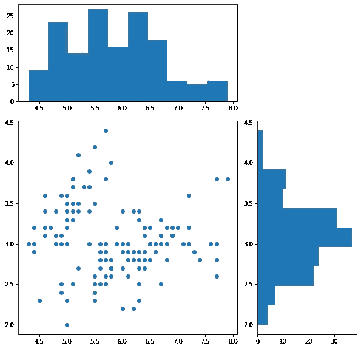
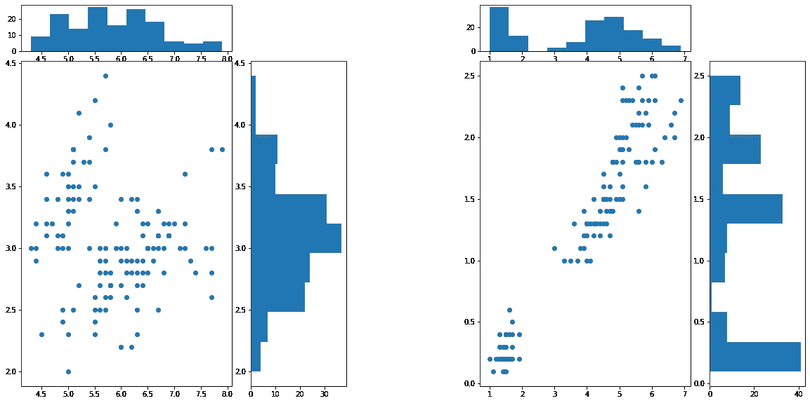

# MatPlotLib 比你想象的更强大

> 原文：<https://towardsdatascience.com/matplotlib-is-more-powerful-than-you-think-58d45d9cc0d6?source=collection_archive---------43----------------------->

## 如何用已经很棒的包和 gridspec 提升您的可视化

<https://learningfrommachines.substack.com/welcome>  

# 介绍

虽然许多数据科学家对基本的`matplotlib`，或者更具体地说是`pyplot`非常熟悉，但是没有多少人知道有许多方法可以提高你的可视化技能。除了美学，理解如何利用某些工具将使你的可视化更加信息密集和紧凑，而不牺牲可解释性。

在这篇文章中，我们将关注`gridspec`，这是一个允许我们将图表捕捉到位并创建更复杂的可视化的工具。

*注:任何未注明出处的图片均为作者所有。*

# Gridspec

如果你熟悉`pyplot`和`matplotlib`的基础，那么学习`gridspec`对你来说会相当直观。

在高层概述中，创建一个`gridspec`实质上是 ***指定了*** *一个* **网格**的某个维度。然后，使用这些尺寸和基本的 2D 索引，你可以指出你想要你的图表在哪里，你想要它如何定向。让我们首先从一个非常基本的`iris`数据集的例子开始。

## 带分布的散点图:

使用`iris`数据集，即可视化和统计分析的 Hello World，我们将首先创建一个基本散点图，将`sepal width`与`sepal length`进行比较。

用`sklearn.datasets`载入数据:

现在来可视化数据:

当调用`fig.gridspec(3,3)`时，我们初始化一个(3x3)网格来放置图形。

首先，我们将`hist_x`初始化为在`gs[0,:2]`中，这意味着它占据了整个第一行和除第三列之外的每一列，这就是为什么在右上角有一个小方块。然后，我们将`scatter`初始化为从第二行开始，一直到末尾，因此`1:`对行进行索引，我们希望从第一列开始，在第三列之前结束，因此对列使用`0:2` in。利用这种直觉，你可以亲眼看到我是如何绘制的。

现在，使用同样的想法，我们可以有效地创建两个这样的图形:

# 最后的想法

有许多方法可以更有效地创造同样的情节。然而，如果你是某些工具的新手，我会强调用糟糕的代码获得真正的技术，以理解基本的机制。然后从那里，你可以开始重构和发展你自己的直觉，如何有效地创造更好的情节。这就是我做这篇文章的目的。

我希望这对你有用，如果你有任何问题，请在下面留言！