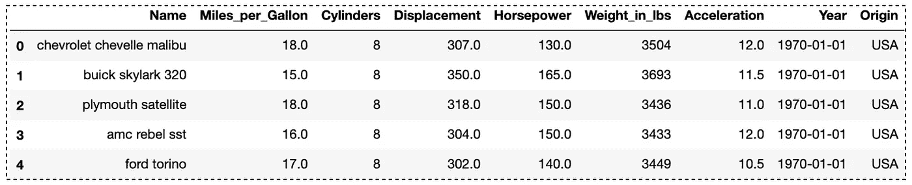
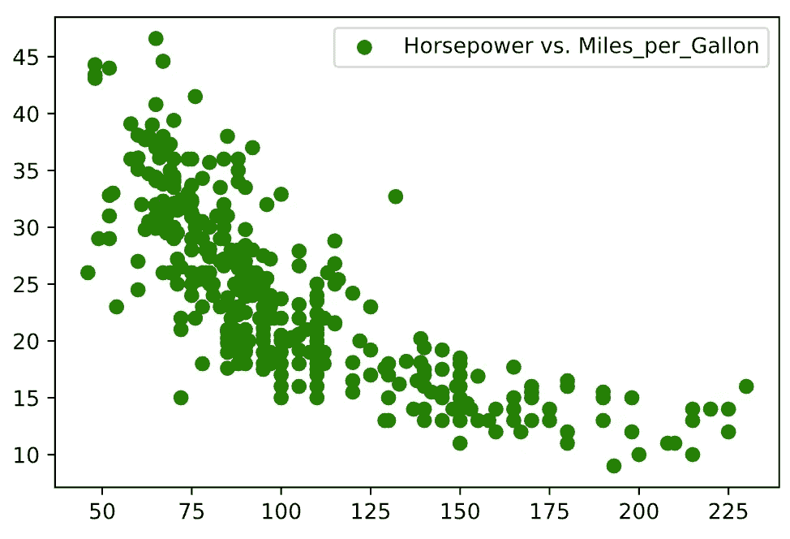
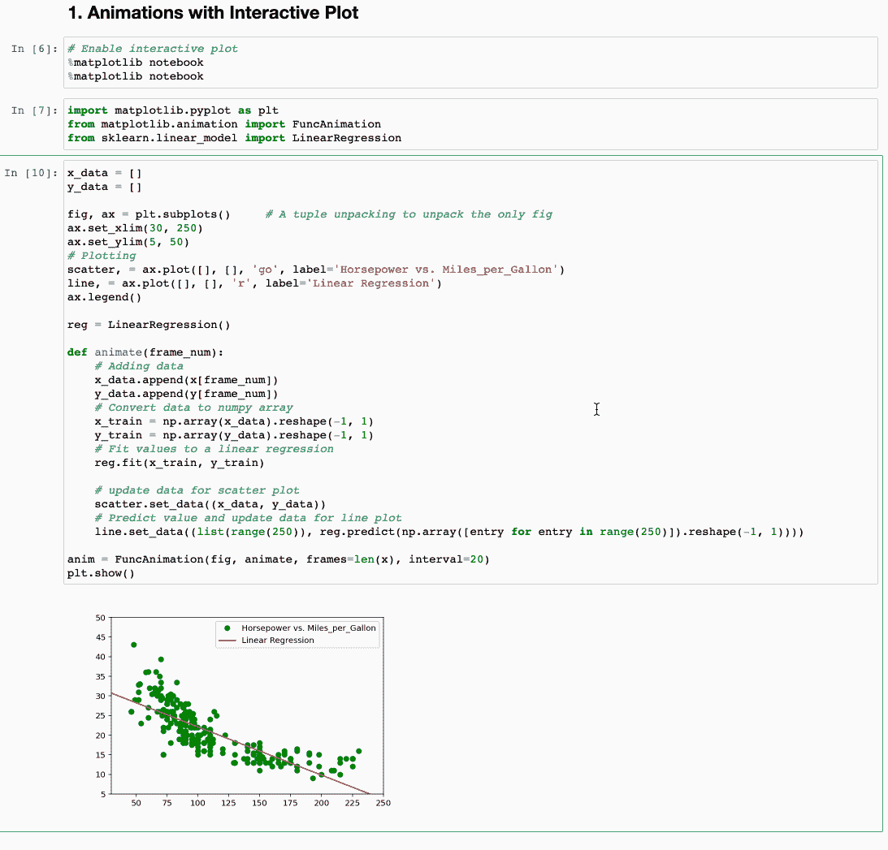
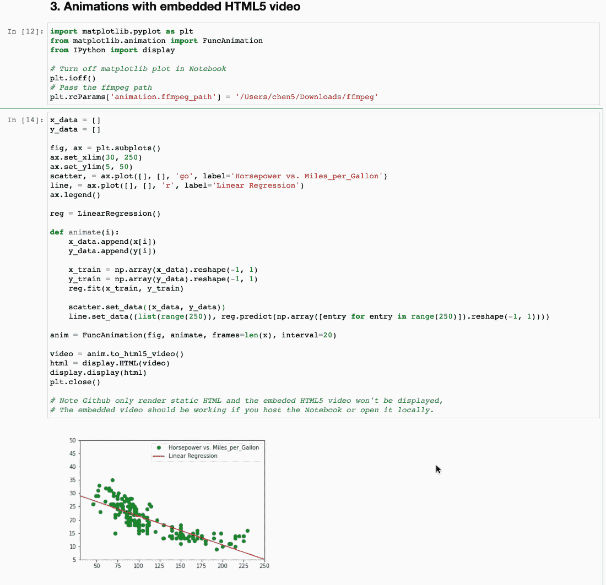

# Jupyter 笔记本中的 Matplotlib 线性回归动画

> 原文：<https://towardsdatascience.com/matplotlib-linear-regression-animation-in-jupyter-notebook-2435b711bea2?source=collection_archive---------14----------------------->

## 用 matplotlib `FuncAnimation`在 Jupyter 笔记本中创建动画图形


Firmbee.com 在 [Unsplash](https://unsplash.com/s/photos/chart?utm_source=unsplash&utm_medium=referral&utm_content=creditCopyText) 上[的照片](https://unsplash.com/@firmbee?utm_source=unsplash&utm_medium=referral&utm_content=creditCopyText)

使用线性回归将值拟合到一条直线时，说明随着更多数据的添加，直线如何拟合数据会非常有帮助。在本文中，您将学习如何创建 Matplotlib 动画，本文从上一篇文章“[在 Jupyter Notebook](/matplotlib-animations-in-jupyter-notebook-4422e4f0e389) 中制作一个简单的正弦波动画”扩展了主题，使用线性回归将值拟合到一条直线上。

Matplotlib 是用于探索性数据分析的最流行的绘图库之一。在大多数情况下，绘制静态图应该很好，但当您运行模拟或进行时间序列数据分析时，基本图可能并不总是足够的。您可能希望展示一个动画来帮助您理解状态如何随时间变化。在本文中，您将学习如何创建一个 Matplotlib 动画，使用线性回归将值拟合到一条直线上。这篇文章的结构如下:

1.  收集和准备数据
2.  朱庇特笔记本中的互动情节
3.  Jupyter 笔记本中的嵌入式 HTML5 视频

> 请查看[笔记本](https://github.com/BindiChen/machine-learning/blob/master/data-visualization/0002-matplotlib-animation-with-regression/matplotlib-linear-regression-animation.ipynb)获取源代码。更多教程可从 [Github Repo](https://github.com/BindiChen/machine-learning) 获得。

# 1.收集和准备数据

为了演示，我们将使用 ***汽车*** 数据集。数据集包括汽车名称、mpg、气缸、排量等。(8 个变量)用于 406 种不同的汽车[1]。我们将从[织女星数据集](https://github.com/vega/vega-datasets)加载数据。让我们导入一些库并加载数据来开始:

```
import matplotlib.pyplot as plt
import numpy as np
from sklearn.linear_model import LinearRegression
from vega_datasets import data%matplotlib inline
%config InlineBackend.figure_format = 'svg'df = data.cars()
df.head()
```



作者图片

对于本教程，我们将绘制 ***马力*** 与 ***英里每加仑*** 。让我们用`NaN`删除行，并将数据转换成适当的格式:

```
# Drop rows with NaN
df.dropna(subset=['Horsepower', 'Miles_per_Gallon'], inplace=True)# Transform data
x = df['Horsepower'].to_numpy().reshape(-1, 1)
y = df['Miles_per_Gallon'].to_numpy().reshape(-1, 1)
```

让我们做一个简单的散点图来显示 ***马力*** 与 ***英里每加仑:***

```
plt.scatter(x, y, c='g', label='Horsepower vs. Miles_per_Gallon')
plt.legend()
plt.show()
```



作者图片

# 2.朱庇特笔记本中的互动情节

为了在 Jupyter Notebook 中创建交互式绘图，您首先需要启用交互式绘图，如下所示:

```
# Enable interactive plot
**%matplotlib notebook**
```

之后，我们导入所需的库。尤其是用于创建动画的`FuncAnimation`类和用于创建线性回归模型的`LinearRegression`。

```
import matplotlib.pyplot as plt
from matplotlib.animation import **FuncAnimation**
from sklearn.linear_model import **LinearRegression**
```

接下来，我们需要创建动画人物的初始状态。`x_data`和`y_data`都被初始化为`[]`。我们不带任何参数地调用`subplots()`来创建一个图形`fig`和一个单轴`ax`。我们将 x 范围设置为`(30, 250)`，将 y 范围设置为`(5, 50)`，以避免它们不断变化。`ax.plot()`被调用两次，创建散点图和折线图。我们也调用`LinearRegression()`来创建线性回归模型`reg`。

```
x_data = []
y_data = []fig, ax = plt.subplots() 
ax.set_xlim(30, 250)
ax.set_ylim(5, 50)scatter, = ax.plot([], [], 'go', label='Horsepower vs. Miles_per_Gallon')
line, = ax.plot([], [], 'r', label='Linear Regression')
ax.legend()reg = LinearRegression()
```

然后我们创建一个函数`animate()`，它将被`FuncAnimation()`调用。该函数采用一个参数`frame_num`——当前帧号。这里我们要做的是根据帧数改变散点图和线性回归图的数据。注意，随着更多数据的添加，调用`reg.fit()`来拟合值。

```
def animate(frame_num):
    # Adding data
    x_data.append(x[frame_num])
    y_data.append(y[frame_num])
    # Convert data to numpy array
    x_train = np.array(x_data).reshape(-1, 1)
    y_train = np.array(y_data).reshape(-1, 1)
    # Fit values to a linear regression
    **reg.fit(x_train, y_train)** # update data for scatter plot
    scatter.set_data((x_data, y_data))
    # Predict value and update data for line plot
    line.set_data(**(list(range(250))**, **reg.predict(np.array([entry for entry in range(250)]).reshape(-1, 1)))**)
```

最后，我们通过调用带有 4 个参数的`FuncAnimation`来创建动画对象

*   第一个参数`fig`是对我们创建的图形的引用
*   第二个参数`animate`是我们创建的在每一帧调用以更新绘图的函数
*   第三个参数`frames=len(x)`，它定义了“一轮动画”的帧数，我们将它设置为训练数据的数量。
*   最后，`interval=20`参数设置帧之间的延迟(毫秒)。`20`相当于`50FPS` (1000ms / 20 = 50 FPS)。如果数字太大，你会等很长时间，如果数字太小，你会看不到它的速度。一般来说，我们需要大于 16 的 FPS 来实现流畅的动画(人眼只能接收 10–12 帧[2])。

```
anim = FuncAnimation(fig, animate, frames=len(x), interval=20)
plt.show()
```



Jupyter 笔记本中的 Matplotlib 线性回归动画(图片由作者提供)

> 请查看[笔记本](https://github.com/BindiChen/machine-learning/blob/master/data-visualization/0002-matplotlib-animation-with-regression/matplotlib-linear-regression-animation.ipynb)获取源代码

# 3.Jupyter 笔记本中的嵌入式 HTML5 视频

在前面的例子中，我们已经用线性回归创建了一个漂亮的动画。然而，只有当代码运行时，绘图才是动态的。当然，我们可以截屏，但当你想在网上分享你的 Jupyter 笔记本时，这不是很有效。

我们能做的就是把动画转换成 HTML5 视频，嵌入 Jupyter 笔记本。我们将使用 FFmpeg 进行转换。如果没有，首先需要按照说明[下载 FFmpeg](https://ffmpeg.org/download.html) 并解压。

之后，我们导入所需的库，并将`**'ffmpeg_path'**` 设置为本地 **ffmpeg** 可执行文件的路径:

```
import matplotlib.pyplot as plt
from matplotlib.animation import FuncAnimation
from IPython import display# Turn off matplotlib plot in Notebook
plt.ioff()
# Pass the ffmpeg path
**plt.rcParams['animation.ffmpeg_path'] = '/path_to_your/ffmpeg'**
```

创建动画与前面的示例相同。

```
x_data = []
y_data = []fig, ax = plt.subplots()
ax.set_xlim(30, 250)
ax.set_ylim(5, 50)
scatter, = ax.plot([], [], 'go', label='Horsepower vs. Miles_per_Gallon')
line, = ax.plot([], [], 'r', label='Linear Regression')
ax.legend()reg = LinearRegression()def animate(frame_num):
    # Adding data
    x_data.append(x[frame_num])
    y_data.append(y[frame_num])
    # Convert data to numpy array
    x_train = np.array(x_data).reshape(-1, 1)
    y_train = np.array(y_data).reshape(-1, 1)
    **reg.fit(x_train, y_train)**

    # update data for scatter plot
    scatter.set_data((x_data, y_data))
    # Predict value and update data for line plot
    line.set_data(**(list(range(250)), reg.predict(np.array([entry for entry in range(250)]).reshape(-1, 1)))**)anim = FuncAnimation(fig, animate, frames=len(x), interval=20)
```

但是我们没有用`plt.show()`来绘制它，而是调用`anim.to_html5_video()`方法来将动画结果转换成 HTML5 视频。然后，我们需要获取为该视频进行嵌入的 HTML 代码，这是通过调用 IPython `display.HTML(video)`来完成的。最后，我们调用`display.display(html)`将 HTML 代码嵌入到 Jupyter 笔记本中。

```
video = anim.to_html5_video()
html = display.HTML(video)
display.display(html)
plt.close()               # avoid plotting a spare static plot
```



Jupyter 笔记本中的 Matplotlib 线性回归动画(图片由作者提供)

> 请查看笔记本[获取源代码](https://github.com/BindiChen/machine-learning/blob/master/data-visualization/0002-matplotlib-animation-with-regression/matplotlib-linear-regression-animation.ipynb)

# 结论

在本文中，我们学习了两种在 Jupyter 笔记本中创建 Matplotlib 线性回归动画的方法。创建动画图可以帮助您运行模拟和进行时序数据分析。

希望这篇文章能帮助你节省学习 Matplotlib 的时间。我建议您查看[文档](https://matplotlib.org/stable/api/_as_gen/matplotlib.animation.FuncAnimation.html)以获得更多选项&设置，并了解您可以做的其他事情。

感谢阅读。请查看[笔记本](https://github.com/BindiChen/machine-learning/blob/master/data-visualization/0002-matplotlib-animation-with-regression/matplotlib-linear-regression-animation.ipynb)获取源代码，如果您对机器学习的实用方面感兴趣，请继续关注。

## 您可能对我的其他一些数据可视化和熊猫文章感兴趣:

*   [Jupyter 笔记本中的 Matplotlib 动画](/matplotlib-animations-in-jupyter-notebook-4422e4f0e389)
*   [Python 与 Altair 的交互数据可视化](/python-interactive-data-visualization-with-altair-b4c4664308f8)
*   [探索冠状病毒传播的交互式数据可视化](/interactive-data-visualization-for-exploring-coronavirus-spreads-f33cabc64043)
*   [在 Pandas 中把数字和字符串转换成日期时间的 10 个技巧](/10-tricks-for-converting-numbers-and-strings-to-datetime-in-pandas-82a4645fc23d)
*   [所有熊猫 json_normalize()你应该知道的扁平化 JSON](/all-pandas-json-normalize-you-should-know-for-flattening-json-13eae1dfb7dd)
*   [使用熊猫方法链接提高代码可读性](https://medium.com/@bindiatwork/using-pandas-method-chaining-to-improve-code-readability-d8517c5626ac)
*   [如何对熊猫数据帧进行自定义排序](/how-to-do-a-custom-sort-on-pandas-dataframe-ac18e7ea5320)
*   [为了数据分析你应该知道的所有熊猫移位()](/all-the-pandas-shift-you-should-know-for-data-analysis-791c1692b5e)

更多教程可以在我的 [Github](https://github.com/BindiChen/machine-learning) 上找到

## 参考

*   [1]数据集—汽车[http://lib.stat.cmu.edu/datasets/](http://lib.stat.cmu.edu/datasets/)
*   [2][https://stopmotionmagazine . com/why-your-frame-rate-fps-matters-in-animation/](https://stopmotionmagazine.com/why-your-frame-rate-fps-matters-in-animation/)