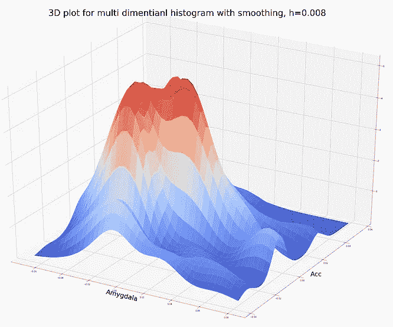

# Matplotlib 与 Ggplot2

> 原文：<https://towardsdatascience.com/matplotlib-vs-ggplot2-c86dd35a9378?source=collection_archive---------4----------------------->

## 我们期待已久的 Python 与 R 可视化的对决

克里斯·阿蒙在 [Unsplash](https://unsplash.com?utm_source=medium&utm_medium=referral) 上的照片

# 背景故事

我主要使用 python，但是我需要在最近的几个项目中使用 R。R 和 Python 之间有很多不同之处，但是图形最让我动心。用 R 语言产生的可视化效果看起来很过时。我在 python 工作的时候一般用 matplotlib，R 中最接近的可比包是 ggplot2。

但是哪种语言，或者在这种情况下哪种包在可视化方面更好呢？我决定解决这个问题的唯一方法是对使用 matplotlib 和 ggplot2 制作的相同图形进行面对面的比较。

# 交战规则

为了比较，我们将有七轮和一轮奖金。在每一轮中，我使用相同的数据，并试图在两个包中制作相同的图形。轮次如下:

1.  散点图
2.  等值线图表
3.  热图
4.  回归多线图
5.  多线连通图
6.  极坐标条形图
7.  多重箱线图
8.  奖金回合

在每一轮中，包装都根据美观和易用性进行评分，满分为 5 分。结果在这个博客的最后。我会尽量减少我的偏见，尽可能客观。

需要记住的几件事:

*   在所有回合中，除了奖金，我试图在两个包中建立相同的图形。我使用相同的数据和相同的配色方案。
*   在某些情况下，由于软件包的限制或我的技能水平，我不能使用相同的数据。我使用模拟数据制作了一个类似的图表。
*   这是一个包可视化摊牌，这意味着如果 matplotlib 或 ggplot2 不能产生相同的图形，但同一语言的另一个包可以说 seaborn 或 plotly，这不算数。
*   尽管这不是一个教程，我已经添加了代码片段，但没有深入细节。
*   在下面的所有图片、图表和代码中，matplotlib(python)是第一个，然后是 ggplot2(R)。
*   最后，所有的评分都在最后的结果部分。

所以不多说了，

# 让游戏开始吧，让最好的套餐获胜！！！

# 第一轮:散点图

对于散点图，我使用了 fat 数据集。该数据集包含个人颈部、胸部、腹部和其他部位的身体测量值。布罗泽克是一个反应变量，是体内脂肪的一种量度。这些图显示了样本数据的高度和重量。色阶和点的大小基于个人的 brozek 值。

这两个软件包能够达到相似的结果，并且相对容易制作。Matplotlib 有更好的颜色渐变方案。我试图在 gglpot2 中获得相同的层次，但中间的颜色看起来单调。此外，matplotlib 中的色阶图例更容易理解。

## Matplotlib (python)散点图

使用 matplotlib 绘制散点图

## Ggplot2 (R)散点图

使用 ggplot2 的散点图

## 散点图代码

两个包中的代码都相当简单。

## Matplotlib (python)代码片段

使用 Matplotlib 的散点图代码，python

## Ggplot2 (R)代码片段

使用 Ggplot2 进行绘图的代码，R

# 第二轮:等高线图

我在这里使用了两个不同的数据集。以 matplotlib 为例，我们有来自心理学实验的数据。变量杏仁核和 acc 表示已知与情绪和决策有关的两个特定大脑区域的体积。对于 ggplot2 示例，我们有火山活动数据，它测量等待时间和喷发。

这两个包取得了非常相似的结果。但是 matplotlib 中的等高线、标签、图例都优于 ggplot2。

## Matplotlib (python)等值线图

使用 matplotlib 绘制等高线图

## Ggplot2 (R)等高线图

使用 ggplot2 绘制等高线图

## 等高线图代码

尽管 matplotlib 的代码很长，但是创建这个地图更容易，默认设置也更好。这可能是因为 python 包的教程比较多。

## Matplotlib (python)代码片段

使用 Matplotlib、python 绘制等高线的代码

## Ggplot2 (R)代码片段

使用 Ggplot 的等高线图代码，R

# 第 3 轮:热图

这里我使用了散点图一节中提到的 fat 数据集。在这里，我为数据集中的所有变量制作了一个关联热图。黄色表示变量之间的相关性高，蓝色表示相关性较低。

这两个软件包创建了几乎相同的热图。我遇到的唯一问题是 matplotlib 的变量对齐方式，这让我很难读懂标题。使用默认设置，ggplot2 做得更好。

## 使用 Matplotlib 的热图(python)

Matplotlib (python)热图

## 使用 ggplot2 (R)的热图

使用 ggplot2 (R)的热图

## 热图代码

在 matplotlib 中，我对相关矩阵使用了 matshow()函数。ggplot2 没有独立于绘图矩阵的功能，我需要在绘图之前融化相关矩阵。

## Matplotlib 代码段

## Ggplot2 代码片段

使用 ggplot2 的热图代码，R

# 第 4 轮:回归多线图

对于多线图，我使用了著名的 Iris 数据集。在这里，我用萼片长度作为预测变量绘制了萼片宽度的回归线。回归线按物种分组。

图表之间的颜色不完全匹配是我的错。我还忘了更改 matplotlib 图形的形状。也就是说，matplotlib 不能为回归线创建阴影区域，这可以使用 ggplot2 轻松完成。您可以使用 python 中的 seaborn 包创建阴影回归线，但这无助于比较。

## 使用 Matplotlib 的回归图(python)

Matplotlib (python)回归图

## 使用 ggplot2 (R)的回归图

## 回归多线图代码

matplotlib 有更多的数据争论，图形必须使用 groupby()函数单独绘制。这个图形在 ggplot2 中要简单得多，所有的分组都可以在 plot 函数中完成。

## Matplotlib (python)代码片段

使用 matplotlib 的回归多线图代码，python

## Ggplot2 (R)代码片段

使用 ggplot 的回归多线图代码

# 第 5 轮:多线连通图

第 4 轮和第 5 轮都显示了变化很小的多线图，但是由于这两个包在这两轮中的表现不同，所以我决定值得包括它。

这里使用的数据来自一个交叉验证项目，该项目比较了线性回归和具有不同 K 值的 K 个最近邻。下图显示了蒙特卡洛交叉验证的测试误差与迭代次数的关系

matplotlib 和 gglpot2 在演示部分同样出色。我遇到了 ggplot2 图例的问题，图例不会显示哪条线对应哪种型号，所以我最终决定放弃它。

## **Matplotlib (python) m** 多线连通图

使用 matplotlib(python)的多线连通图

## Ggplot2 (R)多线连通图

使用 ggplot2(R)的多线连通图

## 多线连通图的代码

matplotlib 的代码更简单、更直接。在 ggplot2 中，必须为每个模型单独添加标记和线条。这两个软件包在数据处理方面都没有任何问题。

## Matplotlib 代码段

使用 matplotlib、python 编写多行图形代码

## Ggplot2 代码片段

使用 ggplot 的多线图形代码

# 第 6 轮:极坐标条形图

首先，我不喜欢极坐标图。它们很难破译，也不能很好地传达信息。数据可视化的目标是使信息可读，这在极坐标图中很难实现。在这个比较中，我没有使用任何条形图或直方图，因为我知道的所有可视化工具都可以轻松地制作它们。

对于 ggplot2，我使用汽车数据来显示不同汽车在城市中行驶的里程数。对于 matplotlib，我使用了一些虚拟数据。

这是 matplotlib 做得不好的案例之一。在 matplotlib 中创建极坐标图是可能的，但是我不能使用我想要的数据框。

## Matplotlib (python)极坐标条形图

## Ggplot2 (R)极坐标条形图

## 极坐标条形图代码

如前所述，matplotlib 案例中的数据争论非常激烈。我认为有一种方法可以使用基于汽车的数据框和分组，但我认为您必须创建一个单独的数据框。我花了相当大的力气对数据进行王乐处理，以适应 matplotlib，但是做不到。

## Matplotlib 代码段

使用 matplotlib 和 python 编写的极坐标条形图代码

Ggplot2 更加直观，只用一行代码就创建了极坐标图。它不需要事先和数据争论。

## Ggplot2 代码片段

使用 ggplot 的极坐标条形图代码

另外，您可以使用 ggplot2 制作一些漂亮的极坐标图。Yan Holts 在他的网站上有一些很棒的例子，你可以点击这里查看。

Yan Holts 使用 ggplot2 的极坐标图示例

# 第 7 轮:多盒图

对于 ggplot2 的箱线图，我使用了之前用于极坐标图的汽车数据。对于 matplotlib，我使用了一个虚拟数据集。

这是 matplotlib 表现不如 ggplot2 的另一个例子。我无法让 matplotlib 使用 pandas 数据框创建多个箱线图。我应该提一下，在 matplotlib 中创建一个单独的 boxplot 不成问题。在 ggplot2 示例中，我将汽车制造商的 milage 分组，以生成多个箱线图。我认为在美学方面，两个包都表现得足够好。

## Matplotlib (python)多盒图

## Ggplot2(R)多盒图

以分类变量作为 x 轴的 Ggplot2 多盒图

## 多箱线图的代码

如前所述，与 matplotlib 一起工作的数据争论是最大的问题。我被迫使用虚拟数据来创建一个多箱线图的例子。

## Matplotlib 代码段

使用 matplotlib 的 boxplot 代码，python

从下面的 R 代码可以看出，从 R 中的一个表创建多盒图很简单。

## Ggplot2 代码片段

使用 ggplot 的箱线图代码，R

## Python 中的多盒图

使用 matplotlib 和 jumpy 中的其他包在 python 中创建 boxplots 实际上是非常容易的。

## 熊猫方块图

Pandas 有一个箱线图函数，可以在一行代码中从数据帧创建多个箱线图。在这里，我使用了脂肪数据，并绘制了所有变量的值的范围。

使用熊猫的多个箱线图

## Seaborn 箱线图

使用 python 中的 seaborn，我可以创建与 r 中的 ggplot2 相同的箱线图。这不需要任何数据争论，因为所有的分组都是由 seaborn 完成的。

使用 seaborn (python)的多个箱线图

使用 seaborn (python)为多个箱线图编码

# 第 8 轮:奖金

在奖励回合中，我试图展示每个包都做得很好但另一个包自己做不到的图表。

## Ggplot2(R) Chloropeth 图

如果你想知道 python 非常擅长 choropleths，但是你需要像 leav 或 plotly 这样的包。Matplotlib 本身无法创建 choropleths。

对于下面的 choropleth，我使用了美国的逮捕信息来绘制每个州的袭击数量。抱歉，跳过阿拉斯加和夏威夷，包括他们缩小了可视化。

使用 ggplot2 (R)的美国 Choropleth

上面使用的配色方案非常类似于 matplotlib 中的“等离子体”主题，在 R 中，这是在 Viridis 函数的选项“C”中。默认的 Viridis 函数将为同伴渐变提供绿色。

使用 ggplot2(R)创建美国 choropleth 的代码

## Matplotlib(python) 3d 表面图

在 python 中创建 3d 绘图的首选包是 plotly。Matplotlib 做了相当不错的工作，尽管创建 3d 网格需要更多的努力。

在这里，我使用了心理实验数据，在等高线图轮使用较早。Matplotlib 有很好的配色方案选择，并且很好地实现了颜色渐变。

使用 matplotlib(python)绘制 KDE 图

同一个图形的几种颜色变化

在下面的代码中，高斯核密度估计器占用了大量空间，它基本上是一个平滑函数。创建图表本身并不复杂。

使用 matplotlib 的 3d 图形代码(python)

# 结果

最后，请击鼓…

## Ggplot2 (R)赢得这场可视化战斗！

这两个软件包都是强大的可视化工具。在一个比我更熟练的从业者手中，他们可以产生更好的结果。Matplotlib 可以创建漂亮的图形，并具有精美的演示风格。ggplot2 胜出的原因在于其数据处理能力。如果我允许自己也使用其他包，python 可能会赢。