# Matplotlib vs. Plotly Express:哪一个是最好的数据可视化库？

> 原文：<https://towardsdatascience.com/matplotlib-vs-plotly-express-which-one-is-the-best-library-for-data-visualization-7a96dbe3ff09?source=collection_archive---------4----------------------->

## 大蟒

## 相互比较时，哪一个库的性能更好？


Joshua Woroniecki 的图片。来源: [Unsplash](https://unsplash.com/photos/lzh3hPtJz9c)

数据可视化是任何项目中最关键的步骤之一。数据可视化能够将复杂的信息转化为易于理解的图表。您在项目中使用图表越多，您就越能更好地向非技术人员展示您的见解。

无论你是初学者还是有多年使用 Python 经验的人，都知道 Matplotlib 是最著名的数据可视化，但它是最好的吗？今天我们来对比一下 Matplotlib 和 Plotly Express。谁会是赢家？

# **人气**

这是显而易见的，但是 Matplotlib 比 Plotly 更受欢迎。如此受欢迎的主要优势是，使用 Matplotlib 的笔记本将很容易被其他人复制，因为不同的人安装它的机会更高。然而，Plotly 一直在增长。它能赶上 Matplotlib 吗？在我看来，如果 Matplotlib 在未来几年内没有显著的改进，我相信会的。

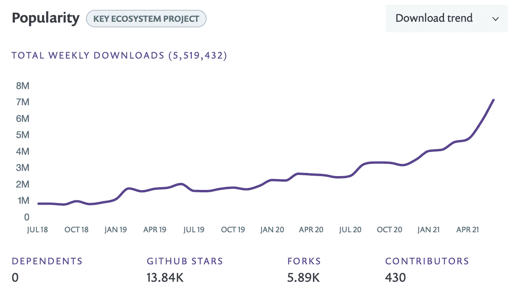

Matplotlib 流行多年。来源: [Snyk](https://snyk.io/advisor/python/matplotlib)

# **文档**

Plotly 的文档比 Matplotlib 领先好几年。很容易找到关于你试图创造的情节的信息。与此同时，Matplotlib 的网站令人困惑。如果你是初学者，你可能需要一段时间才能找到你要找的东西。

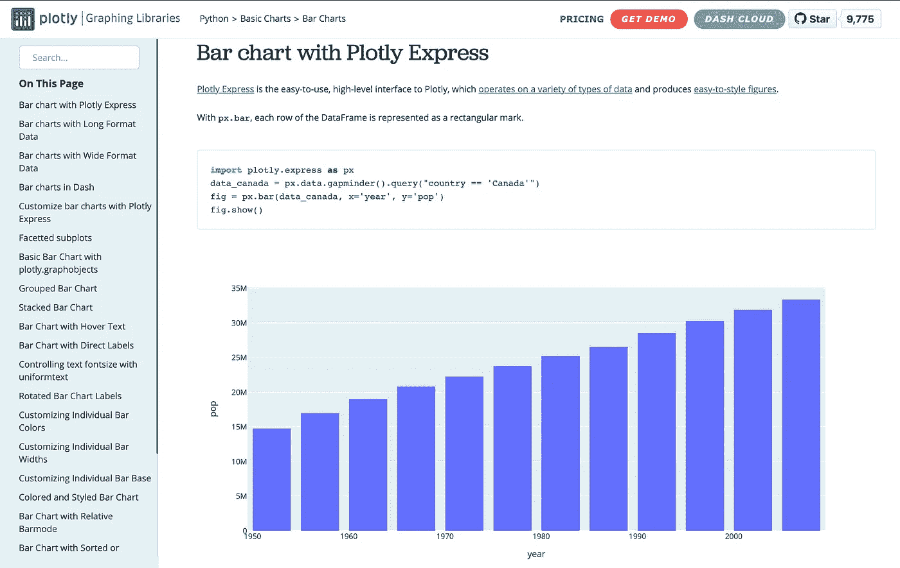

[Plotly 网站](https://plotly.com/python/bar-charts/)

# **安装**

安装这两个库同样容易。您可以使用`pip`或`conda`来安装任何一个。这里不多说了。Python 的优势之一是安装库非常容易。安装它们应该没有任何问题。

# 创建可视化

我知道你们是来看这两个库之间的真实对比的，这就是我们将要做的。为此，我将使用你可以在 Kaggle 上找到的《2021 年世界幸福报告》。你可以在这里找到我用来创建这些可视化效果的笔记本[。](https://github.com/ismael-araujo/testing-libraries/blob/main/Matplotlib%20vs.%20Plotly%20Express/Matplotlib%20vs.%20Plotly.ipynb)

```
**# Importing Libraries**
import opendatasets as od
import pandas as pd
import matplotlib.pyplot as plt
import plotly.express as px
import numpy as np**# Setting the dataset to the variable df**
df = pd.read_csv('world-happiness-report-2021/world-happiness-report-2021.csv')
```

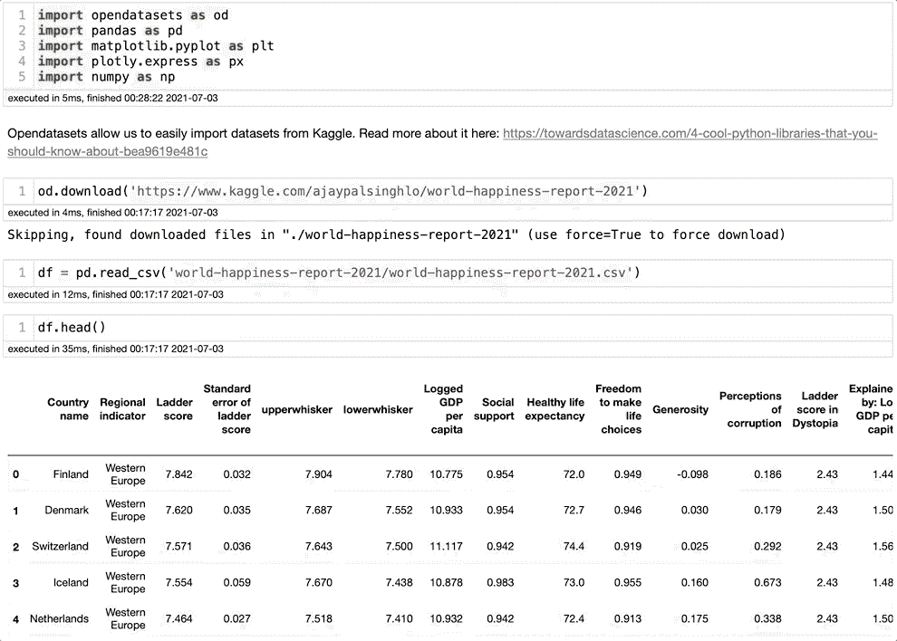

作者图片

# 条形图

让我们从条形图开始，这是最流行的图表之一。条形图快速传达关系信息，因为条形图显示与特定类别相关的数字，这使得比较同一类别中的元素变得容易。对于这个图表，我将按地区比较幸福指数。为此，我将使用特性`Regional indicator`和`Ladder score`。

我创建了一个名为`happiest_regions`的新数据框架来简化事情。

```
happiest_regions = df.groupby(by=[‘Regional indicator’])[‘Ladder score’].mean().sort_values(ascending=False).reset_index()
happiest_regions = pd.DataFrame(happiest_regions)
```

**情节直白**

Plotly Express 表演得很漂亮。它能够用很少的代码提供一个漂亮的交互式图表。查看代码，我们可以看到创建图表所需的全部内容是数据框、x 轴、y 轴，我添加了颜色编码以更好地区分区域。我觉得很棒！

```
px.bar(happiest_regions, x='Regional indicator', y='Ladder score', color='Regional indicator')
```

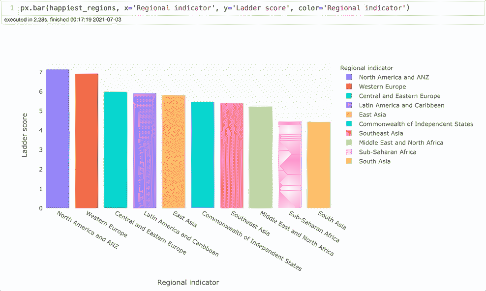

作者图片

**Matplotlib**

Matplotlib 结果是…嗯，悲哀。我使用了与 Plotly 相同长度的代码，结果看起来很糟糕。不可能了解正在发生的事情。也就是说，需要相当多的代码才能让这个图看起来像样。出于这个原因，我将不得不作弊一点，并把 Seaborn 纳入游戏，使这种比较公平。

```
plt.bar(x = happiest_regions['Regional indicator'], height = happiest_regions['Ladder score'])
plt.show()
```

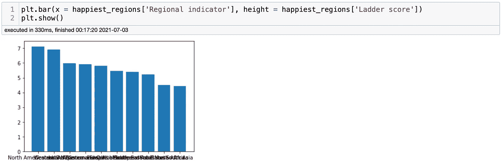

作者图片

开始了。我试图使用尽可能少的代码。我会说结果还可以。它需要更多的代码来使它更加专业，但是它的可读性很好。不过，对我来说还是不行。

```
**# Importing Seaborn**
import seaborn as sns
sns.set_theme(style="darkgrid")plt.figure(figsize=(14,6))
sns.barplot(x='Regional indicator', y='Ladder score', data=df, palette="tab10")
plt.xticks(rotation=45, fontsize=14)
plt.yticks(fontsize=14)
plt.show()
```

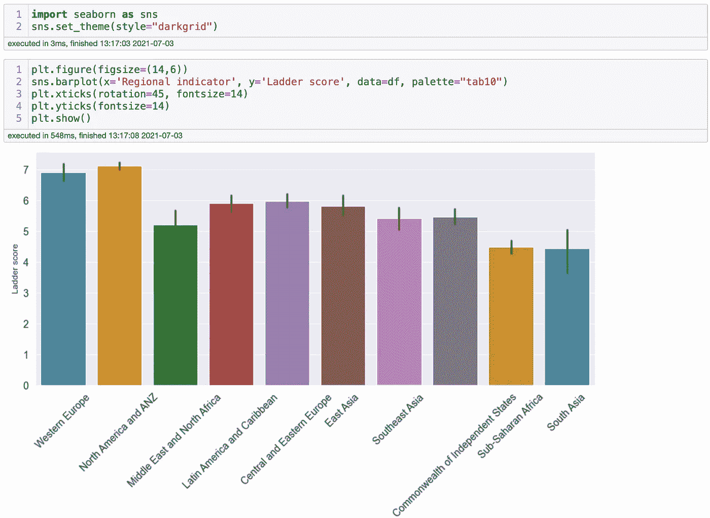

作者图片

# 柱状图

直方图的主要目的是查看数据是如何分布的，以及数据集中在哪里。对于直方图，我想看看幸福指数是怎么分布的。因此，我将使用`Ladder score`特性。

**阴谋地**

同样，普洛特利没有让人失望。它能够用 vert little 代码显示一个漂亮的交互式直方图，我们可以对区域进行颜色编码，这使得获得洞察力变得非常容易。例如，我们可以看到西欧和撒哈拉以南非洲在图表中的集中位置。

```
px.histogram(df, x='Ladder score', color='Regional indicator')
```

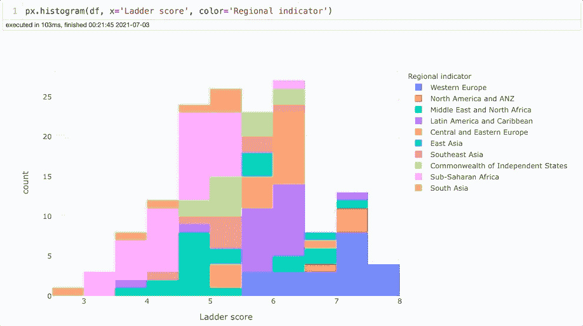

**Matplotlib**

Matplotlib 能够交付一个不错的结果。是的，它需要更多的代码，但我们可以很容易地从其他图表中回收代码。没有太多可谈的。与 Plotly 相比，它似乎太简单了。它不是交互式的，但是它完成了工作。

```
plt.figure(figsize=(14,6))
sns.histplot(data=df, x='Ladder score', hue='Regional indicator')
plt.xticks(fontsize=14)
plt.yticks(fontsize=14)
plt.show()
```

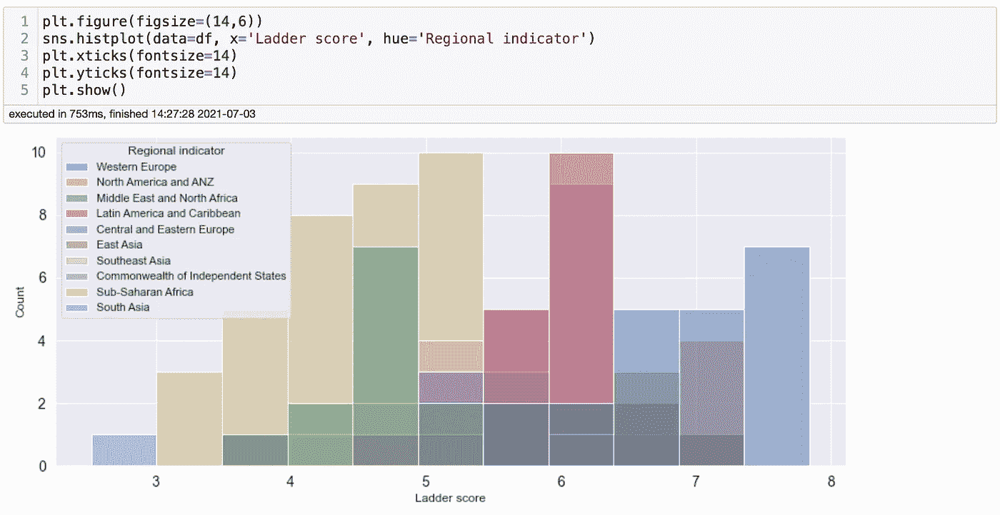

# **散点图**

散点图用于查看两个类别之间是否存在相关性。这是机器学习中必不可少的一步，分析一个特征如何影响另一个特征。

**情节表达**

我们在第三个图表中，我们可以看到 Plotly Express 在不同类型的图表中表现一致。从一种类型转换到另一种类型非常容易，并且我在测试时不需要处理任何错误。很容易理解代码和需要修改的内容。他们的网站很清晰，你可以很容易地找到关于图形的信息。我喜欢这种互动，我们可以选择你能看到的数据。

```
px.scatter(df, x='Ladder score', y='Logged GDP per capita', color='Regional indicator')
```

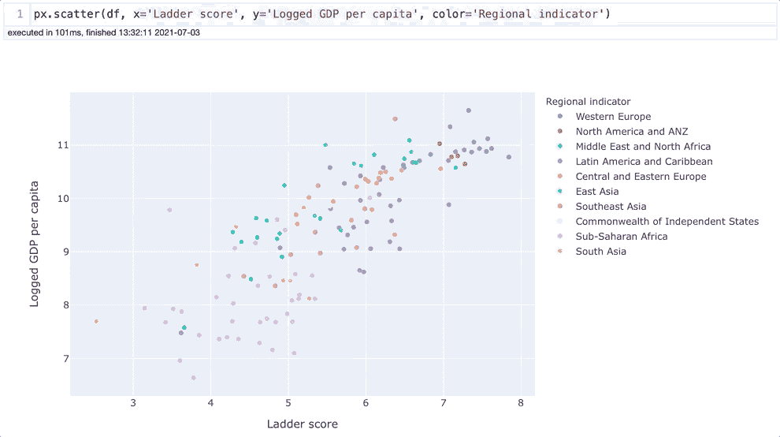

Matplotlib

Matplotlib 也不是超级落后。它完成了工作，一旦你有了代码，你就可以像 Plotly Express 一样容易地在不同类型的图形之间转换。不，它不是交互式的(没有额外的库)。是的，它完成了散点图的预期工作。

```
plt.figure(figsize=(14,6))
sns.scatterplot(data=df, x='Ladder score', y='Logged GDP per capita', hue='Regional indicator')
plt.xticks(fontsize=14)
plt.yticks(fontsize=14)
plt.show()
```

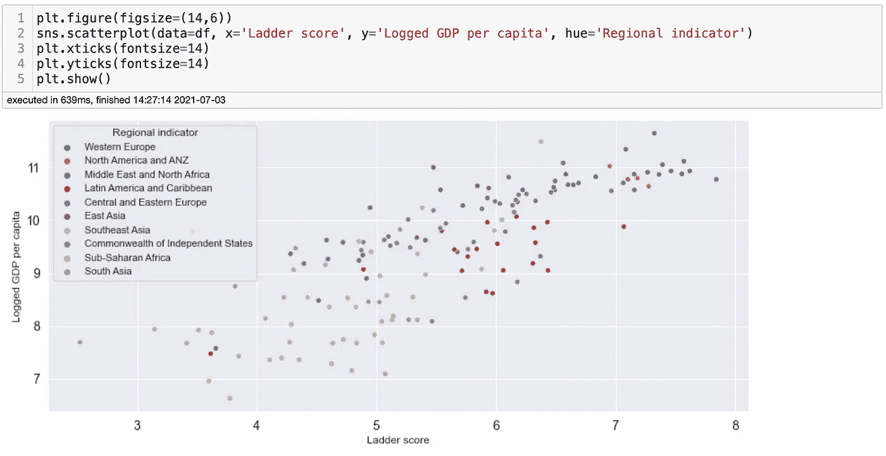

# 折线图

折线图便于查看特定类别的趋势。例如，我们可以看到这些年来`Ladder score`是如何变化的。国家变得更幸福了吗？这是了解你的类别进展情况的基本图表。对于折线图，我将使用历年的世界幸福报告。

**阴谋地表达**

在这一点上，我们可以期待 Plotly Express 的表现会很好，对吗？是的，它提供了一个漂亮的图表，但我想重点介绍两个令人兴奋的功能。第一个是你可以滚动看到所有的国家。它仍然是一个优秀的功能。另一件很酷的事情是，如果你开始取消选中多个国家，在这种情况下，Plotly 足够聪明，可以取消选中所有国家。一个不错的细节。

```
px.line(df2, x='year', y='Life Ladder', color='Country name')
```

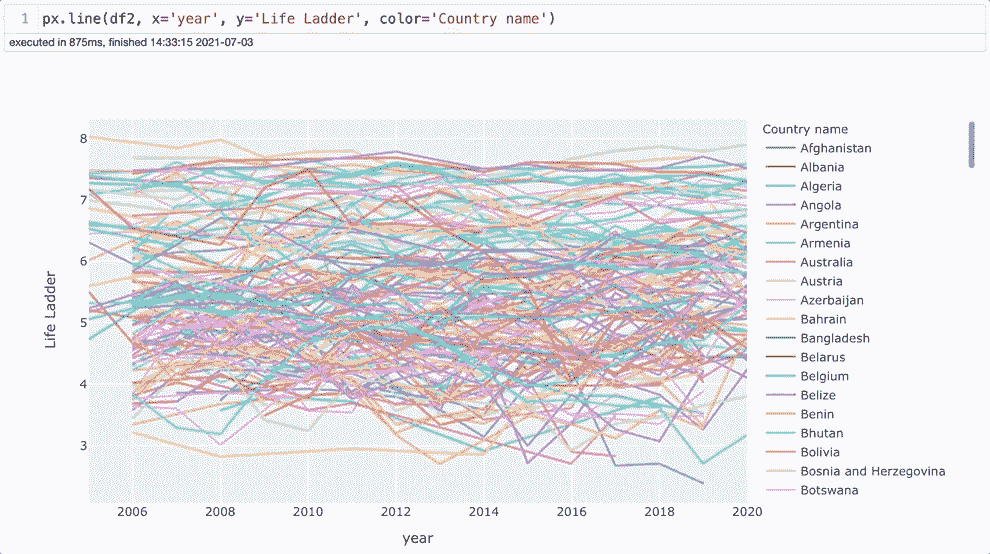

作者图片

**Matplotlib**

Matplotlib 在线图方面做得很好。它有两种看法。第一个不包括颜色代码。Matplotlib 将创造一种趋势，包括所有国家。这可能是平均值吗？这是 Matplotlib 的文档对线图的描述。

> 用几个语义分组的可能性画一个线图。

不清楚我们应该期待什么。不管怎样，图表看起来不错。如果它显示了一个世界范围的趋势，我们可以看到阶梯指数在 2006 年显著下降。那年出现了经济衰退，并在 2008 年加剧。也许这就是我们看到这一趋势的原因。

```
plt.figure(figsize=(14,6))
sns.lineplot(data=df2, x='year', y='Life Ladder')
plt.xticks(fontsize=14)
plt.yticks(fontsize=14)
plt.show()
```

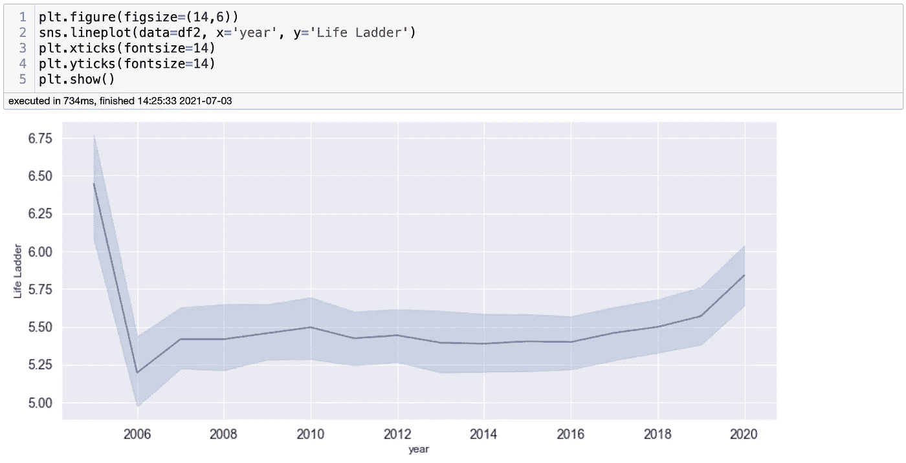

然而，我们可以对这些线进行颜色编码，并查看每个代码的单独的线。它完成了任务。还是那句话，它是交互的，但是它是有效的，而且它看起来…嗯，好的。

```
plt.figure(figsize=(14,6))
sns.lineplot(data=first_10_countries, x='year', y='Life Ladder', hue='Country name')
plt.xticks(fontsize=14)
plt.yticks(fontsize=14)
plt.show()
```

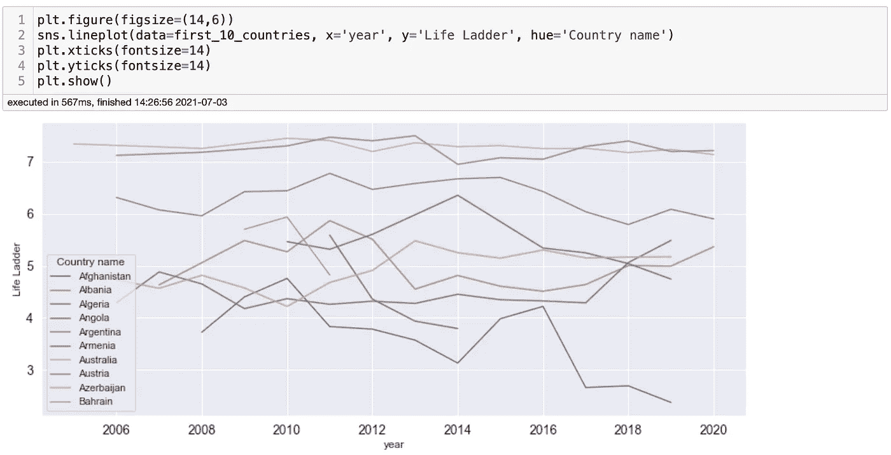

# 样式选项

您可能已经注意到，没有一个图表有标题，它们需要一些工作来看起来更专业。如果我们不做一些调整，Matplotlib 会产生可怕的结果。幸运的是，我们有 Seaborn，这使得最初的结果更好。您可以从数据集中获得您需要的见解，但是它们对于专业环境来说是不可展示的。好消息是，您可以插入将用于 Seaborn 和 Matplotlib 的代码。在我在这篇博客中使用的例子中，我使用 Seaborn 创建了图表，并使用 Matplotlib 进行了一些调整。

我觉得 [Matplotlib 的文档](https://matplotlib.org/stable/contents.html)不好。很混乱，很难找到自己需要的。然而，编辑情节很简单，代码也很容易记住。 [*这个博客*](https://medium.com/analytics-vidhya/editing-data-visualization-in-python-64f42225ba21) 是由Preeya Sawadmanod 写的，他做了一个很棒的工作，解释了如何创建和编辑 Matplotlib 图。

资料来源: [Preeya Sawadmanod](https://gist.github.com/Preeya0225/61978043b77785f73f13742261edde07#file-matplot_edits-csv)

上面，我们可以看到，我们可以通过增加几行代码来改进图表。初学者编辑 Matplotlib 的图形应该没有问题

```
plt.figure(figsize=(14,6))
sns.lineplot(data=first_10_countries, x='year', y='Life Ladder', hue='Country name')
plt.xticks(fontsize=14)
plt.yticks(fontsize=14)
plt.show()
```

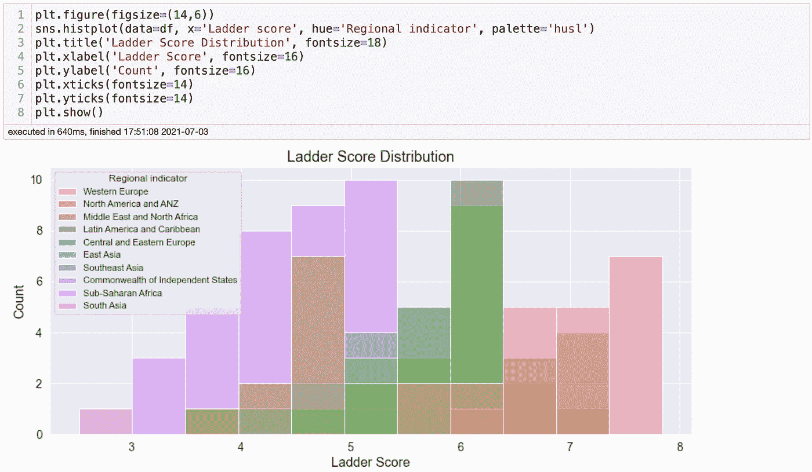

作者提供的图像

另一方面，Plotly 提供了现成的数据可视化。它的图表很漂亮，只需要很少的样式就能看起来很专业。它是交互式的，所以你可以实时编辑类别的选择！还可以编辑您正在使用的字体、颜色和图表动画。它赢了 Matplotlib 和 Seaborn 很多。

```
plt.figure(figsize=(14,6))
sns.histplot(data=df, x='Ladder score', hue='Regional indicator', palette='husl')
plt.title('Ladder Score Distribution', fontsize=18)
plt.xlabel('Ladder Score', fontsize=16)
plt.ylabel('Count', fontsize=16)
plt.xticks(fontsize=14)
plt.yticks(fontsize=14)
plt.show()
```

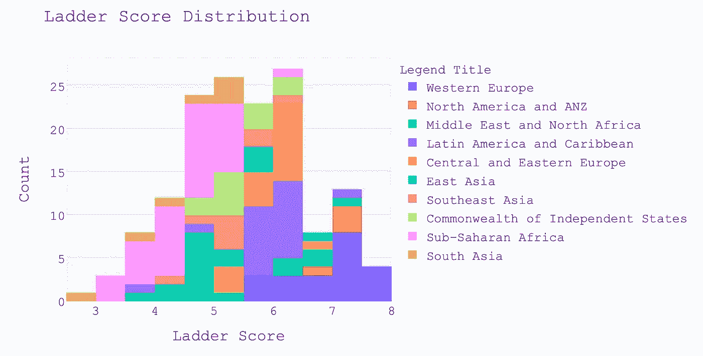

作者图片

# 结论

在分析这两个优秀的库时，需要考虑的东西太多了。然而，这篇博客的目的是决定哪一个是赢家，我不怀疑与 Matplotlib 相比，Plotly Express 无愧于最佳数据可视化库的称号。并不是说 Matplotlib 很可怕，只是需要更多的代码，缺少额外的功能。与此同时，Plotly Express 用很少的代码交付了漂亮的结果。创建图表很容易使用和记住代码。

如果你是初学者，你应该学习 Matplotlib 和 Seaborn，因为它们更受欢迎。然而，当你准备好了，Plotly Express 应该是你清单上的下一个。如果你是一个高级 Python 用户，你应该试试 Plotly Express 和它所有的高级功能。

*感谢阅读。让我知道你对这两个图书馆的看法。*

*如果有任何问题，请在我的 Linkedin 上联系我:*[*【http://bit.ly/linkedin-ismael】*](http://bit.ly/linkedin-ismael)