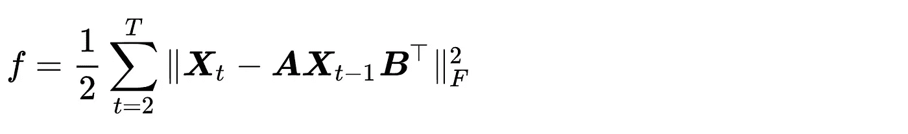

# 多维时间序列预测的矩阵自回归模型

> 原文：<https://towardsdatascience.com/matrix-autoregressive-model-for-multidimensional-time-series-forecasting-6a4d7dce5143?source=collection_archive---------6----------------------->

## 用 Numpy 实现一个简单的 Python

自回归(AR)过程是时间序列分析中具有代表性的经典模型，在自然、科学和经济中有着广泛的应用。AR 可以描述单变量时间序列中具有线性关系的某些时变过程。AR 的另一个重要对应物是向量自回归(VAR)模型，它可以描述多元时间序列的协同进化模式。在这篇博文中，我们将

*   引入矩阵自回归(MAR)模型对多维时间序列数据建模，
*   讨论优化方案，用 Python 中的 Numpy 重现 MAR 模型。

# 风险值简介

对于多元时间序列，如果变量是相依的，那么 VAR 可以探索这些变量的协同进化模式。


为了估计系数矩阵，我们可以利用 L2 范数建立一个最小二乘问题。


编写重现 VAR 模型的 Python 代码并不困难。

```
import numpy as npdef var(X, pred_step):
    N, T = X.shape
    temp1 = np.zeros((N, N))
    temp2 = np.zeros((N, N))
    for t in range(1, T):
        temp1 += np.outer(X[:, t], X[:, t - 1])
        temp2 += np.outer(X[:, t - 1], X[:, t - 1])
    A = temp1 @ np.linalg.inv(temp2)
    mat = np.append(X, np.zeros((N, pred_step)), axis = 1)
    for s in range(pred_step):
        mat[:, T + s] = A @ mat[:, T + s - 1]
    return mat[:, - pred_step :]
```

我们可以通过一个玩具例子来评估 VAR 代码。


在此处编写 Python 代码:

```
import numpy as npX = np.zeros((2, 10))
X[0, :] = np.arange(1, 11)
X[1, :] = np.arange(2, 12)
pred_step = 2
mat_hat = var(X, pred_step)
print(mat_hat)
```

运行代码，预期的输出是

```
[[11\. 12.]
 [12\. 13.]]
```

可以看出，这些预测与地面真实数据完全相同。

# 什么是多维时间序列和 MAR？

在现实世界中，多维时间序列数据非常普遍。例如，在金融中，我们可以将一些国家的季节性经济指数汇总为一个矩阵，就像这样:


在这个矩阵中，如果我们考虑时间信息，那么我们就会得到一个“张量”:


直观上，张量给出如下:


在每个时间 *t* 中，我们有矩阵形式的观察，而不是向量形式的观察。最近，*陈*等(2021)提出了一种新的矩阵自回归( **MAR** )框架来构建这种多维时间序列数据。他们考虑了这样的双线性结构:


其中矩阵 ***A*** 的大小为 m 乘 m，而矩阵 B 的大小为 n 乘 n。

该框架对于构建多维时间序列数据有许多优势:

*   该框架可以保持矩阵形式的原始数据表示。
*   该框架可以减少自回归模型中的参数数量。例如，如果我们使用 VAR 来研究这样的数据，我们将在系数矩阵中有( *mn* )个参数。但是使用 MAR，我们只有 *m* + *n* 。这可以避免 VAR 在处理高维数据时的过度参数化问题。

# 如何获得系数矩阵的闭式解？

如上所述，我们可以使用双线性结构来构建 MAR 模型。一个问题是如何估计系数矩阵。第一个冲动是把优化问题写成一个损失函数:


在这里我们使用弗罗贝纽斯范数。

## 系数矩阵的闭式解

*如果我们在这里将目标定义为一个函数:*

**

*然后，我们有*

**

*通过让导数为 **0** ，不难得到**T5A**的闭合解。 ***和*** 的闭合解由下式给出*

**

## *系数矩阵 B 的封闭解*

*如果我们将目标改写为:*

**

*然后，我们有*

**

*设导数为 **0** 。 ***B*** 的闭合解由下式给出*

**

# *交替最小二乘法与 Python 实现*

*如上所述，我们有两个封闭形式的解决方案。既然解到 ***A*** 涉及 ***B*** ，又解到 ***B*** 涉及 ***A*** 。我们可以用一个经典的算法来解决这个问题，那就是交替最小二乘(ALS)算法。该算法的基本思想是以迭代的方式更新每个变量的最小二乘解。例如，我们的案例变成了*

**

*其中 *l* 表示迭代次数。*

*通过这些等式，我们可以用 ALS 算法在这里定义一个 Python 函数:*

```
*import numpy as npdef mar(X, pred_step, maxiter = 100):
    m, n, T = X.shape
    B = np.random.randn(n, n)
    for it in range(maxiter):
        temp0 = B.T @ B
        temp1 = np.zeros((m, m))
        temp2 = np.zeros((m, m))
        for t in range(1, T):
            temp1 += X[:, :, t] @ B @ X[:, :, t - 1].T
            temp2 += X[:, :, t - 1] @ temp0 @ X[:, :, t - 1].T
        A = temp1 @ np.linalg.inv(temp2)
        temp0 = A.T @ A
        temp1 = np.zeros((n, n))
        temp2 = np.zeros((n, n))
        for t in range(1, T):
            temp1 += X[:, :, t].T @ A @ X[:, :, t - 1]
            temp2 += X[:, :, t - 1].T @ temp0 @ X[:, :, t - 1]
        B = temp1 @ np.linalg.inv(temp2)
    tensor = np.append(X, np.zeros((m, n, pred_step)), axis = 2)
    for s in range(pred_step):
        tensor[:, :, T + s] = A @ tensor[:, :, T + s - 1] @ B.T
    return tensor[:, :, - pred_step :]*
```

*我们建立了一个简单的例子来测试算法。预测任务如下:*

**

*在此处编写 Python 代码:*

```
*import numpy as npX = np.zeros((2, 2, 10))
X[0, 0, :] = np.arange(1, 11)
X[0, 1, :] = np.arange(2, 12)
X[1, 0, :] = np.arange(3, 13)
X[1, 1, :] = np.arange(4, 14)pred_step = 2
tensor_hat = mar(X, pred_step)
print(tensor_hat[:, :, 0])
print()
print(tensor_hat[:, :, 1])*
```

*运行代码，预期的输出是*

```
*[[11\. 12.]
 [13\. 14.]]

[[12\. 13.]
 [14\. 15.]]*
```

*可以看出，这些预测与地面真实数据完全相同。*

# *参考*

*陈蓉，晓寒，丹阳。矩阵值时间序列的自回归模型。计量经济学杂志，2021 年。*

> *这是一个关于火星模型的简单故事。如果你对这篇博文感兴趣，我们强烈推荐你复制这些代码，这并不难理解。*