# 数据科学家的矩阵演算

> 原文：<https://towardsdatascience.com/matrix-calculus-for-data-scientists-6f0990b9c222?source=collection_archive---------5----------------------->

## 吃红色药丸，学习矩阵微积分！

马库斯·斯皮斯克在 [Unsplash](https://unsplash.com?utm_source=medium&utm_medium=referral) 上的照片

# 序言

> 你吃了**蓝色药丸**……故事结束，你在床上醒来，相信你想相信的一切。你服用红色药丸…你待在仙境，我让你看看兔子洞有多深。

这是《黑客帝国》三部曲中墨菲斯对尼奥说的名言。你必须做出同样的选择，你想继续使用 pytorch 和 tensorflow 这样的签名框架而不知道它们是做什么的吗？或者你想更深入地挖掘矩阵运算的世界，理解像[反向传播如何工作](/backpropagation-in-neural-networks-6561e1268da8)这样的事情？

# 线性代数基础

照片由[乌列尔·索伯兰斯](https://unsplash.com/@soberanes?utm_source=medium&utm_medium=referral)在 [Unsplash](https://unsplash.com?utm_source=medium&utm_medium=referral) 上拍摄

## 向量和矩阵

我用一个小而细的字母写标量(单个数字)

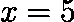

(图片由作者提供)

而向量将由小粗体字母表示。默认情况下，它们是列向量。

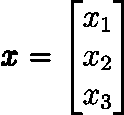

(图片由作者提供)

行向量也用小粗体字母表示，但是它们有一个 T 上标。T 上标代表转置。

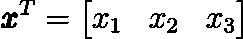

(图片由作者提供)

代表矩阵的符号将是粗体大写字母。

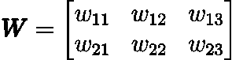

(图片由作者提供)

我们也可以转置一个矩阵。执行此操作时，第一列成为第一行，反之亦然。

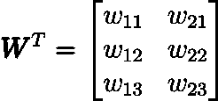

(图片由作者提供)

向量或矩阵的维数是一个元组:

(行数、列数)

让我们考虑以下情况:

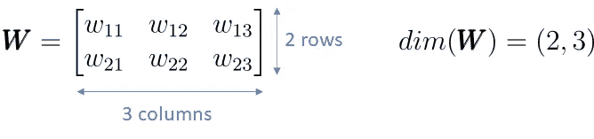

(图片由作者提供)

## 点积

向量和矩阵也定义了点积。但是顺序很重要，并且左向量/矩阵的列数必须与右向量/矩阵的行数相匹配。

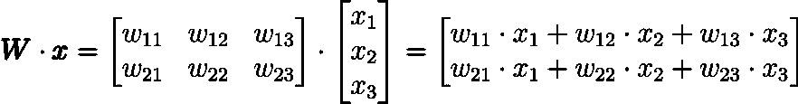

(图片由作者提供)

结果的维数是:(左侧输入的行数，右侧输入的列数)

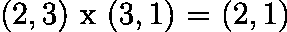

(图片由作者提供)

如果你感兴趣，你可以在这里更详细地看到点积是如何执行的。

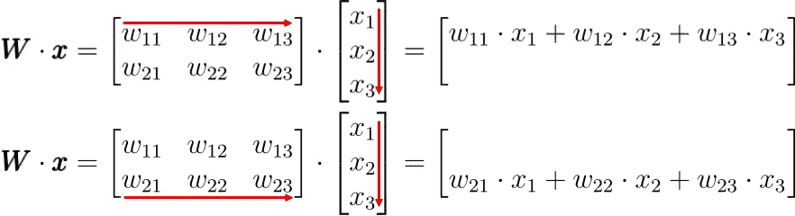

(图片由作者提供)

为了得到输出的一个元素，我们将向量/矩阵的左边的一行和右边的一列相乘并求和。

点积的重要性在于它可以在许多不同的环境中使用。在力学中，它可以用来表示物体的旋转和拉伸。它也可以用来改变坐标系。

# 分析基础

照片由 [SOON SANTOS](https://unsplash.com/@soonsam?utm_source=medium&utm_medium=referral) 在 [Unsplash](https://unsplash.com?utm_source=medium&utm_medium=referral)

## 和的导数

当我们想对一个和求导时，就相当于对每个加数求导。

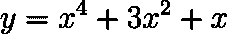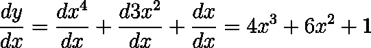

(图片由作者提供)

## 乘积规则

如果我们想对两个函数的乘积求导，这两个函数都取决于我们要求微分的变量，我们可以使用以下规则:

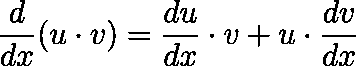

(图片由作者提供)

让我们考虑下面的例子:

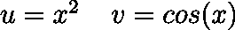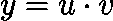

(图片由作者提供)

那么𝑦对𝑥的导数就是:

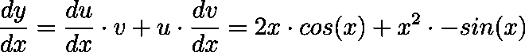

(图片由作者提供)

## 链式法则

我们想对函数𝑦.进行微分这个功能取决于𝑢，𝑢取决于𝑥.然后我们可以应用链式法则。

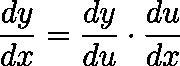

(图片由作者提供)

这里简单举个例子。

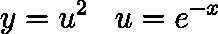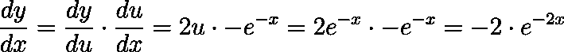

(图片由作者提供)

# 矩阵计算

在把这些东西下载到你的大脑之后，我希望你已经准备好学习矩阵微积分了！

有两种我们可以写矩阵演算的惯例，所谓的“**分子布局**和“**分母布局**”。在这篇博文中，我将使用分子布局。

照片由[查理恩·细川玉子](https://unsplash.com/@charleingracia?utm_source=medium&utm_medium=referral)在 [Unsplash](https://unsplash.com?utm_source=medium&utm_medium=referral) 上拍摄

## 向量导数标量

标量值函数相对于变量向量的导数是一个行向量。这个行向量对于我们想要区分的每个变量都有一列。

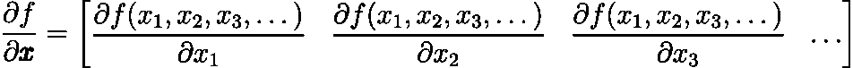

(图片由作者提供)

这些点只是表明，我们不一定要用 3 个变量来区分，而是一个变量。

我们来举个例子:

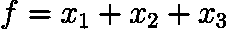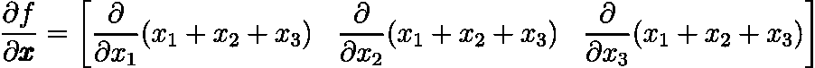

(图片由作者提供)

然后我们可以应用“和的导数”规则:

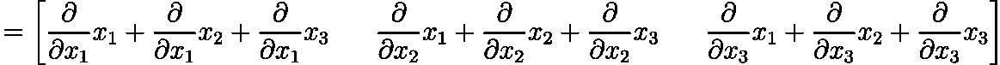

(图片由作者提供)

因为一个变量对另一个变量的导数是 0，我们得到:

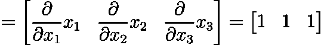

(图片由作者提供)

## 标量导数向量

如果我们有一个𝑓函数，它输出一个向量，想要对一个变量求导，我们得到一个列向量作为结果。

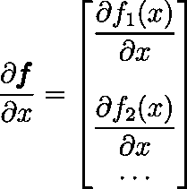

(图片由作者提供)

让我们考虑下面这个我们想要求导的向量值函数。

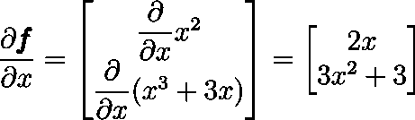

(图片由作者提供)

## 逐矢量导数

当一个向量值函数对一个变量向量求导时，我们得到一个矩阵。我使用一个有 2 个输出值和 3 个输入变量的函数作为例子。但是您可以使用任意数量的输出值和输入变量。

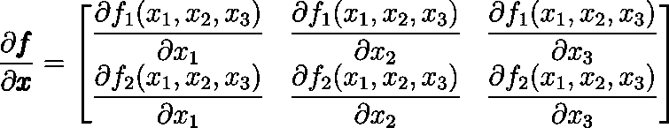

(图片由作者提供)

你可以把它想象成“标量乘向量”和“向量乘标量导数”的组合。我们沿着行改变函数输出的元素，沿着列改变变量的元素。

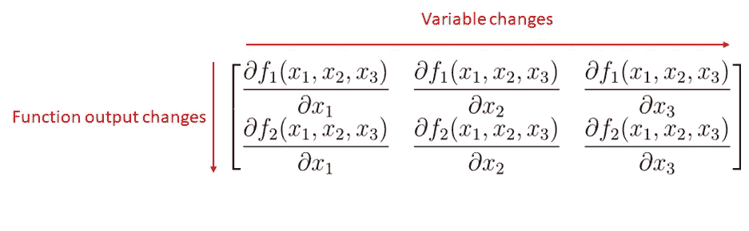

(图片由作者提供)

得到的矩阵具有维度:**(输出大小，输入大小)**

现在我们快速看一个例子。

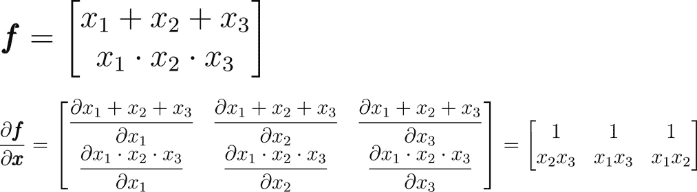

(图片由作者提供)

## 摘要

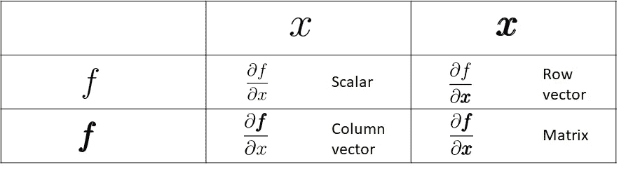

(图片由作者提供)

# 向量链规则

让我们考虑下面的场景。矢量 **𝑓** 是矢量 **𝑔** 的函数。向量 **𝑔** 本身就是向量 **𝑥** 的函数。所以**𝑓**(**𝑔**(**𝑥**))相对于 **𝑥** 的导数计算如下:

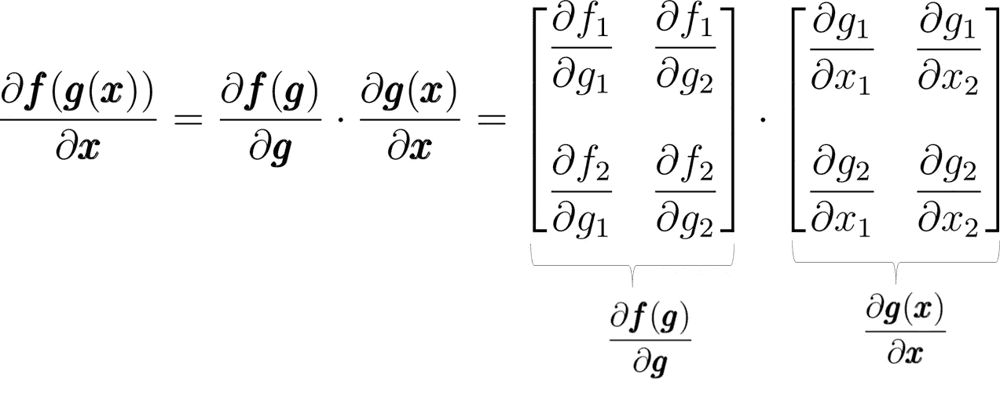

(图片由作者提供)

我们可以看到，矢量链规则看起来和标量链规则几乎一样。点积仍保留在公式中，我们必须构建“逐向量”的导数矩阵。

这里有一个小例子:

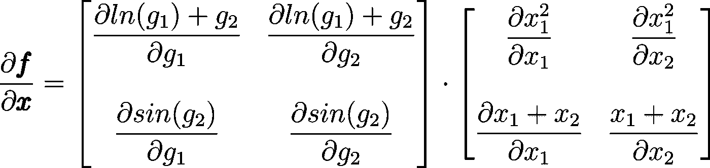

(图片由作者提供)

我们计算偏导数。

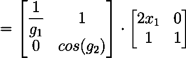

(图片由作者提供)

现在我们扩展点积。

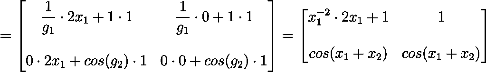

(图片由作者提供)

最后一次简化，我们得到了结果。

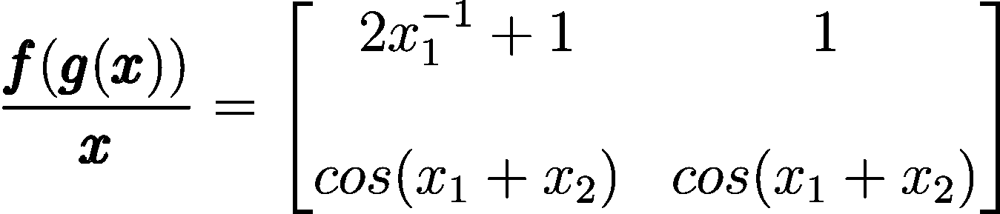

(图片由作者提供)

# 常数的点积

我们可以像对待标量常数一样对待常数矩阵和向量。允许将它们分解出来。但是请记住，顺序对于两个非标量之间的点积很重要。

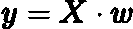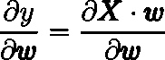

(图片由作者提供)

我们现在可以分解出矩阵 **𝑋，**如果它是常数并且不依赖于 **𝑤** 。

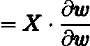

(图片由作者提供)

知道我们通过向量导数矩阵来构造向量。

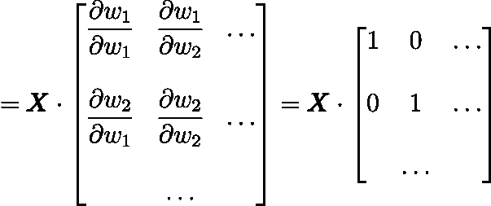

(图片由作者提供)

对角线上为 1，其他地方为 0 的矩阵称为单位矩阵。乘以它的一切都保持不变。因此我们得出最后的结果:

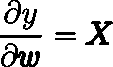

(图片由作者提供)

你可以得到同样的结果，如果你自己做点积，而不是依赖我告诉你单位矩阵。

有趣的是，虽然整个方程包含向量和矩阵，但我们得到了基于标量微积分的相同结果。然而，情况并非总是如此，因为并非标量微积分的所有规则也适用于多元微积分。举一个例子来说，没有矢量积规则。

# 收场白

我很高兴你服用了红色药丸，和我一起踏上了深入矩阵微积分领域的旅程。如果这对你来说是新的，那么你应该多加练习，自己看几个例子。我希望你喜欢这篇博文，并祝你一切顺利。

文森特·米勒

# 作者的相关文章

 [## 神经网络中的反向传播

### 从零开始的神经网络，包括数学和 python 代码

towardsdatascience.com](/backpropagation-in-neural-networks-6561e1268da8)  [## 爱因斯坦指数符号

### 爱因斯坦求和、指数符号和数值

towardsdatascience.com](/einstein-index-notation-d62d48795378) 

# 作者的其他文章

 [## 深度 Q 学习不是火箭科学

### 用 pytorch 解释和编码的深度 Q 和双 Q 学习

towardsdatascience.com](/deep-q-learning-is-no-rocket-science-e34912f1864)  [## 如何使用 GPT J

### GPT J 解释了 3 种简单的方法，你可以如何访问它

towardsdatascience.com](/how-you-can-use-gpt-j-9c4299dd8526) 

## 想联系支持我？

领英
[https://www.linkedin.com/in/vincent-m%C3%BCller-6b3542214/](https://www.linkedin.com/in/vincent-m%C3%BCller-6b3542214/)
脸书
[https://www.facebook.com/profile.php?id=100072095823739](https://www.facebook.com/profile.php?id=100072095823739)
推特
[https://twitter.com/Vincent02770108](https://twitter.com/Vincent02770108)
中等
[https://medium.com/@Vincent.Mueller](https://medium.com/@Vincent.Mueller)
成为中等会员并支持我(你的部分会员费直接归我)
[https://medium.com/@Vincent.Mueller/membership](https://medium.com/@Vincent.Mueller/membership)