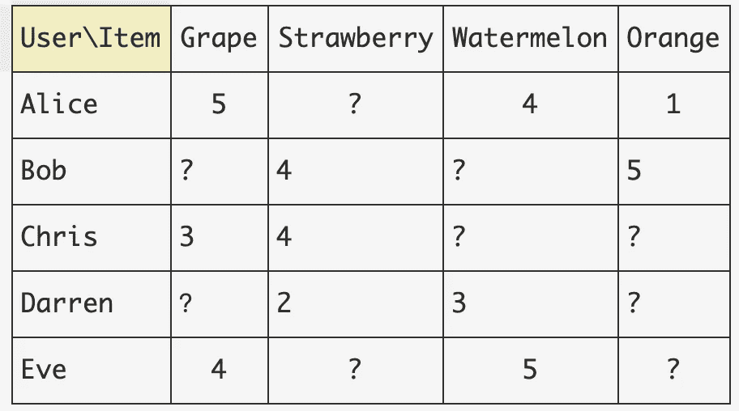
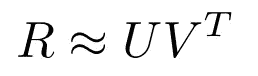
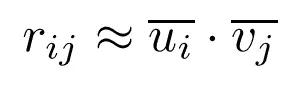
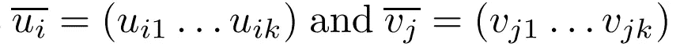
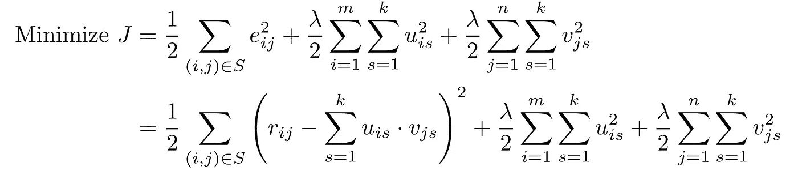
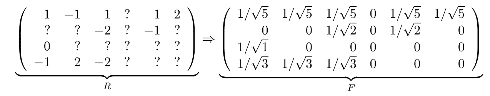
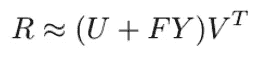
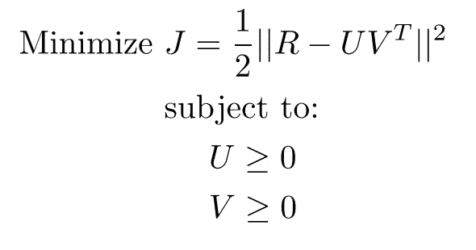

# 推荐系统中的矩阵分解

> 原文：<https://towardsdatascience.com/matrix-factorization-in-recommender-systems-3d3a18009881?source=collection_archive---------30----------------------->

## 推荐系统中矩阵分解技术的温和介绍，包括**FunkSVD、SVD++和非负矩阵分解**

你是说这个矩阵？(图片来源: [Unsplash](https://unsplash.com/photos/iar-afB0QQw) )

# 介绍

RS 就是把物品和用户匹配起来。起点是一个用户项目矩阵，其中填充了表示显式反馈(用户提供的评级)或隐式反馈(点击计数、访问次数、观看时间等)的值。).你也可以把这个问题作为一个矩阵填充问题:**给定用户条目矩阵中的已知条目，在给定各种约束的情况下，如何填充缺失的条目？**

水果评级矩阵示例(图片由作者提供)

协同过滤方法在这个领域取得了巨大的成功。两种最突出的方法是基于模型和基于邻域的方法。对于基于模型的方法，我们主要指**潜在因素模型，其中使用了 MF 技术。**

两种方法都利用了数据矩阵中的**相关性**。例如，在基于用户的邻域方法中，利用用户方式的相关性来形成对等组，从而完成矩阵中缺失的评级，而基于项目的邻域方法利用项目方式的相关性。**潜在因素模型将用户和商品一次性转化到同一个潜在空间。**因此，它们同时利用用户和项目的相关性，因此通常更有效。

# 放克奇异值分解

芬克-奇异值分解被认为是西蒙·芬克在网飞奖竞赛中创造的。**注**:严格来说，名称中的“SVD”并不正确。线性代数中的奇异值分解与这里所做的矩阵分解有很大不同，[看看为什么会混淆](https://www.freecodecamp.org/news/singular-value-decomposition-vs-matrix-factorization-in-recommender-systems-b1e99bc73599/#:~:text=In%20fact%2C%20SVD%2B%2B%2C%20as,an%20extension%20of%20Funk's%20work.&text=Note%20that%2C%20despite%20its%20name,applications%2C%20including%20PCA%20and%20RS.)。

它将用户项矩阵分解为两个较低秩矩阵的乘积，如下所示:

其中 **R** 是由 *m* 行和 *n* 列组成的近似评分矩阵， **U 是一个用户因素矩阵**，它为每个用户有一行(称为**用户因素** uᵢ)， **Vᵀ是一个项目因素矩阵，**它为每个项目有一列(称为**项目因素** vⱼ)

因此，假设潜在维度为 *k* ，R 中的任何一个等级都近似为**点积**:

注意，U 的维数是(m，k)，而 V 的维数是(n，k)。

如何确定 U 和 V？我们可以像许多机器学习问题一样，将其作为优化问题来解决(包括正则化以避免过度拟合，或者 U 和 V 中的极值)。

SGD 可以通过计算 *J* 分别相对于用户因子 uᵢ和项目因子 vⱼ的导数，以标准方式解决这个问题。

# SVD++

SVD++是 Funk-SVD 的扩展，加入了**隐式反馈数据**。

隐式反馈是我们可以用来推断用户对某些项目的偏好的任何辅助信息，例如点击、访问、在电视节目上花了多长时间等等。即使在显式评级矩阵的情况下，评级矩阵的身份也可以被视为隐式反馈。换句话说，**简单来说，用户选择给一个项目评分的行为，无论是高还是低，都带有强烈的预测信号。**

现在，让我们看看如何从显式评级矩阵 R 中导出隐式反馈矩阵 F:

其中，如果存在评级而不考虑其值，则我们简单地指定 1，否则指定 0。然后，我们将这些恒等式归一化，使每一行的 L2 范数为 1。

然而，值得注意的是，隐式反馈矩阵可以是任何种类的一元矩阵(一元是指它只包含 0 和正数)，例如，用户点击亚马逊上某个商品的次数。

现在，重构的 R 矩阵由下式给出:

其包含由隐式矩阵 F 引入的附加分量，以及伴随的**隐式项目因子矩阵 Y，其需要由 SGD 从数据中学习。**

注意，F 与(m，n)的 R 具有相同的维数，而 Y 是(n，k)，与显式项目因子矩阵 V 具有相同的维数。

**直观地，隐式项目因子矩阵 Y 编码了用户对某些类型的偏好，这种偏好是从关心对某个项目 j 进行评级的行为中推断出来的**

学习 U，V 和 Y 的方法与 Funk-SVD 相同，只是现在我们有更多的参数，一个额外的 Y 矩阵要学习。

# 非负矩阵分解

NMF 类似于 Funk-SVD，只是我们现在对 U > 0 和 V > 0 有额外的约束，这要求用户因子和项目因子矩阵中的所有元素总是正的。

正如我们所看到的，它与 Funk-SVD 相同，除了加法约束。因此，它也可以用同样的方式使用优化技术来解决。

这种方法的主要优势是**可解释性。**因为现在，我们可以很容易地将 U 和 V 中的值解释为对某些潜在因素的偏好。在电影的情况下，用户因素可以被理解为对“动作”、“爱情”偏好的组合，而项目因素也可以被视为不同类型的加权组合。

# 结束语

潜在因素模型对于将用户和项目编码到潜在空间非常有效。正如 Yehuda Koren 在他的论文[1]中指出的:

> **邻居模型在检测非常本地化的关系方面最为有效**。他们依赖于一些重要的邻居关系，经常忽略用户的绝大多数评级。因此，这些方法不能捕获所有用户评级中包含的全部微弱信号。**潜在因素模型通常在估计同时与大多数或所有项目相关的整体结构方面有效**。然而，这些模型在检测一小组密切相关的项目之间的强关联方面表现不佳，而这恰恰是邻域模型表现最好的地方。

在许多情况下，通过结合两个世界的优点，最佳点在两者之间。

# 参考

[1] *因式分解遇到邻域:一个多方面的协作过滤模型，Yehuda Koren，2008。*