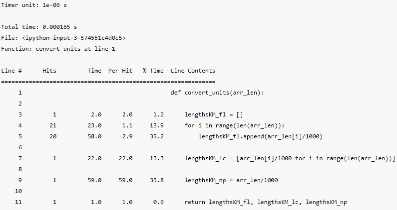
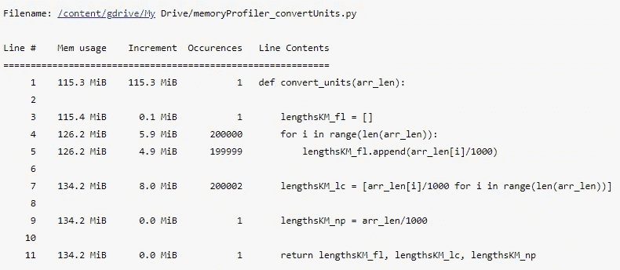

# 如何最大化代码的效率

> 原文：<https://towardsdatascience.com/maximise-your-codes-efficiency-cc7e8a4e93b4?source=collection_archive---------30----------------------->

## 识别代码开销的简单方法


照片由[通讯社跟随](https://unsplash.com/@olloweb?utm_source=medium&utm_medium=referral)于 [Unsplash](https://unsplash.com?utm_source=medium&utm_medium=referral)

高效的代码通常是 Pythonic 代码。换句话说，它遵循了蒂姆·彼得斯在《Python 之禅》中概述的准则，通过在笔记本的一个单元格中运行`import this`即可访问:

> 漂亮总比难看好。
> 显性比隐性好。
> 简单总比复杂好。
> 复杂总比复杂好。
> 扁平比嵌套好。
> 稀不如密。可读性很重要。
> 特例不会特殊到违反规则。
> 虽然实用性胜过纯粹性。错误永远不会无声无息地过去。
> 除非明确消音。
> 面对暧昧，拒绝猜测的诱惑。应该有一种——最好只有一种——显而易见的方法来做这件事。除非你是荷兰人，否则这种方式一开始可能并不明显。现在总比没有好。
> 虽然永远也不会比现在*好。如果实现很难解释，这是个坏主意。
> 如果实现容易解释，可能是个好主意。名称空间是一个非常棒的想法——让我们多做一些吧！

这些理念应该成为所有优秀代码的支柱，但是很容易陷入编写代码的坏习惯，特别是如果它是一个大型项目的一部分。幸运的是，有几种方法可以分析运行代码时消耗的时间和内存，以尽可能减少开销。

# 定时码

## 时间

对于逐行计时(或逐单元计时)，我们可以对行使用神奇命令`%timeit`,对单元使用`%%timeit`。例如，要对 print 语句的执行进行计时，我们可以编写:

```
%timeit print("Hello World!")***Output***
10000 loops, best of 5: 209 µs per loop
```

我们可以向命令添加参数:

*   `-r`指定运行次数
*   `-n`指定循环次数
*   `-o`允许将输出存储到变量中

如果我们想运行 print 语句 2 次，每次 10 个循环，并将输出存储到一个变量中，我们可以写:

```
timedPrint = %timeit -o -r2 -n10 print("Hello World!")***Output***
10 loops, best of 2: 26.3 µs per loop
```

`%timeit`优于`%time`，因为它多次执行代码以避免异常的影响。

我们可以使用以下方法访问函数的返回结果:

*   `.all_runs`:返回游程值的数组
*   `.best`:返回最佳时间
*   `.worst`:返回最差时间
*   `.compile_time`:返回运行代码所花费的时间
*   `.loops`:返回循环次数(如 10000000)
*   `.repeat`:返回重复次数(如 5)

我们可以用这个来比较给出相同输出的不同方法的最佳时间，例如创建一个列表。

```
timeCommand = %timeit -o list1 = list()***Output***
10000000 loops, best of 5: 98.2 ns per loop--------------------------------------------------------------------timeBrackets = %timeit -o list2 = []***Output***
10000000 loops, best of 5: 31 ns per loop--------------------------------------------------------------------diff = (timeBrackets.best - timeCommand.best) * (10**9)
print(f"Using [] is faster than list() by {diff:.2f} ns")***Output***
Using [] is faster than list() by 67.20 ns
```

## 线条轮廓图

发现代码开销的一个更有效的方法是使用`line_profiler`包，我们需要在使用它之前安装它:

```
pip install line_profiler--------------------------------------------------------------------conda install -c conda-forge line_profiler # If using Anaconda
```

然后，我们可以使用神奇的命令`%load_ext`将包加载到笔记本中:

```
%load_ext line_profiler
```

`line_profiler`使用简单，但只能用于功能。为了这个笔记本的目的，我写了一个快速函数，它接受一个以米为单位的数组，并以三种不同的方式将这个数组转换成 km:

```
def convert_units(arr_len): lengthsKM_fl = []
    for i in range(len(arr_len)):
        lengthsKM_fl.append(arr_len[i]/1000) lengthsKM_lc = [arr_len[i]/1000 for i in range(len(arr_len))] lengthsKM_np = arr_len/1000return lengthsKM_fl, lengthsKM_lc, lengthsKM_np
```

我们可以使用`line_profiler`魔法命令`%lprun`来分析每一行执行所花费的时间。它的语法如下:

```
%lprun -f funcName funcName(arguments)
```

为了在`convert_units`函数中使用它，我们首先需要定义长度数组`len_metres = np.arange(1, 21, 1`，然后运行`%lprun -f convert_units convert_units(len_metres)`。它输出一个有用的函数细分，包括一行运行的次数，以及一行运行的总时间的百分比:



这表明，使用列表理解是将 20 个数字的列表除以 1000 的最快方法。对一个包含 200000 个数字的数组再次运行这个程序，结果表明，使用 NumPy 对大型数组来说是最有效的，用 200000 个数字除 20 个数字所用的时间大致相同。

# 内存使用

与计时代码一样，有几种不同的方法来分析 Python 代码的内存使用情况。我们要介绍的第一个来自`sys`模块。

## sys.getsizeof

由于这是一个外部模块，我们首先必须在一个单元中运行`import sys`。我们现在可以使用函数`getsizeof`来确定内存变量的占用量(以字节为单位)，例如:

```
pyList = [*range(1000)]
sys.getsizeof(pyList)***Output***
9120--------------------------------------------------------------------numpyArr = np.array(range(1000))
sys.getsizeof(numpyArr)***Output***
8096
```

虽然这对于列表和 ndarrays 之间的一次性比较很有用，但像这样检查整个代码会非常慢，这正是 memory_profiler 包派上用场的地方。

## 内存分析器

正如我们使用`line_profiler`一样，我们必须下载并加载`memory_profiler`才能使用它:

```
pip install memory_profiler--------------------------------------------------------------------conda install -c conda-forge memory_profiler # If using Anaconda
```

正在加载…

```
%load_ext memory_profiler
```

`memory_profiler`有两个功能，`%memit`和`%mprun`。第一个是`%memit`，用于快速获取函数占用的内存量，例如:

```
len_metres = np.arange(1, 200000, 1)
%memit convert_units(len_metres)***Output***
peak memory: 175.52 MiB, increment: 3.04 MiB
```

其中`peak memory`是执行该功能时使用最多的内存，`increment` = `peak memory` — `starting memory`。

我增加了`len_metres`的大小，以便更有效地显示内存的使用情况，因为它是以兆字节(1024 字节)来度量的。如果我不这样做，下一部分的大部分将显示 0.0 MiB 的内存使用量。

如果我们想要更深入的分解，类似于`%lprun`，我们必须使用`%mprun`来代替。不幸的是，这比使用`%lprun`稍微困难一些，因为`%mprun`只能用于导入笔记本的功能。为了说明这一点，我将之前的`convert_units`函数放入名为`memoryProfiler_convertUnits.py`的文件中，并将其导入到我的笔记本中:

```
from memoryProfiler_convertUnits import convert_units%mprun -f convert_units convert_units(len_metres)
```

这输出



这再次表明 NumPy 是存储变量最有效的方式(因为数组只能包含一种数据类型，所以 Python 不必不断地检查——这是动态类型语言的缺点之一)。

# 结论

有时候，没有比你已经写好的更有效的方法了，但是经常是一小部分代码产生了瓶颈( [Pareto 原则](https://en.wikipedia.org/wiki/Program_optimization#Bottlenecks))，所以当涉及到更复杂的任务时(比如计算一个序列的第 1，000，000 项)，小的改变可以产生巨大的差异。

感谢阅读！

## 来源:

1.  Python 之禅:[https://www.python.org/dev/peps/pep-0008/](https://www.python.org/dev/peps/pep-0008/)