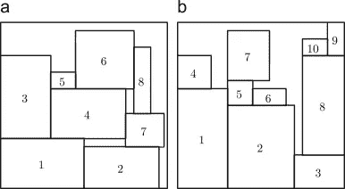

# 用 Python 实现容器装载优化

> 原文：<https://towardsdatascience.com/maximize-the-loading-capacity-of-a-sea-container-to-reduce-your-shipping-costs-with-python-8cc02c9725a7?source=collection_archive---------5----------------------->

## 我们如何使用启发式算法找到正确的策略，在海运集装箱中装载最大数量的托盘？

2D 背包问题在托盘装载中的应用—(图片由作者提供)

由于集装箱短缺，最近航运价格飙升，从上海到北欧的集装箱价格从 11 月份的 2000 美元涨到了 12000 美元的峰值，优化集装箱装载成为当务之急。

**场景**
你是一家国际时尚服装零售商的物流经理，你想将 200 个集装箱从洋山港(中国上海)运往勒阿弗尔港(法国勒阿弗尔)。

*   **零售价(美元):**你的货物零售价是每个集装箱 225，000 美元
*   **利润率(%)** :基于危机前的运输成本，你的利润率为 8.5%
*   **运费—以前(%):**100 x 2000/225000 =**0.88(%)**
*   **运输成本—当前(%):** 100 x 12，000 / 225，000 = **5.33 (%)**

您的财务团队给物流运营带来了巨大的压力，因为运输成本导致 **4.45 %的利润损失**。

由于你对市场价格的影响力有限，你唯一的解决办法就是提高装载量以节省空间。

💌新文章直接免费放入你的收件箱:[时事通讯](https://www.samirsaci.com/#/portal/signup)

如果你喜欢看，看看这篇文章的视频版本

# 一、如何优化集装箱装载？

您已经收到来自中国工厂和供应商的托盘，准备运往法国。

您有两种类型的托盘:

*   **欧式托盘:**尺寸 80 (cm) x 120 (cm)

欧洲托盘的例子-(来源:[洛托姆](https://www.rotomshop.fr/palette-europe-epal-neuve-nimp-15.html))

*   **北美货盘:**尺寸 100(厘米)x 120(厘米)

北美托盘示例—(来源: [Chep](https://www.chep.com/ca/fr-ca/consumer-goods/product/pooled-wood-block-pallet-north-america-48-x-40-inches) )

您可以使用两种类型的容器

*   **干燥容器 20:**内部长度**(**5.9 米)、内部宽度(2.35 米)、内部高度(2.39 米)
*   **干燥容器 40:**内长**(**12.03 米)，内宽(2.35 米)，内高(2.39 米)

**约束**

*   欧式托盘和美式托盘可以混装
*   有 20 英尺或 40 英尺的集装箱可供选择
*   无托盘堆叠(将一个托盘放在另一个托盘上方)
*   装载策略必须在现实生活中执行(使用平衡重卡车)

**目标:**每个集装箱装载最大数量的托盘

<https://samirsaci.com>  

# 二。二维背包问题在托盘装载中的应用

**1。二维背包问题**

给定一组矩形块和一个矩形容器，二维背包问题 **(2D-KP)** 包括在容器内正交包装块的子集，使得包装块的值的总和最大化。

二维断头台背包的精确算法(穆罕默德·多拉塔巴迪亚，安德里亚·罗提，米歇尔·莫纳奇)——([链接](https://www.sciencedirect.com/science/article/abs/pii/S0305054811000190)

**2。让它适应我们的问题**

如果我们考虑这一点

*   托盘不能堆叠
*   托盘必须正交包装，以符合装载限制
*   托盘高度总是低于集装箱的内部高度

我们可以将我们的 3D 问题转化为 2D 背包问题，并直接应用该算法来寻找最优解。

**3。结果**

场景:你需要装入一个 40 英尺的集装箱

*   **20** 欧洲托盘 80 x 120 (cm)
*   **4** 北美货盘 100 x 120 (cm)

**暂定 1:直观解法**

初始解决方案—(图片由作者提供)

备注:您的叉车司机试图安装最多数量的欧洲货盘，并为 4 个北美货盘找到一些空间。

结果: **20/20 欧洲托盘**装载， **2/4 美国托盘**装载。你需要另外一个集装箱来装剩下的两个货盘。

**暂定 2:优化算法结果**

优化解决方案(左)|初始解决方案(右)——(图片由作者提供)

注释:左边是基于算法输出的解决方案。

结果: **20/20 欧洲托盘**装载， **4/4 美国托盘**装载。你不需要另一个容器。

结论

*   优化的解决方案可以适合 100%的托盘。它基于非直观的放置，不尝试许多组合是找不到的。
*   我们的填充率提高了，托盘也更“包装”了。

在下一部分中，我们将看到如何实现一个模型来获得这个解决方案。

> 编辑:你可以在下面的链接中找到这篇文章的 Youtube 版本和动画。

# 三。构建您的模型

为了保持本文简洁，我们不会从头开始构建算法，而是使用 python 库 **rectpack** 。

rectpact 库的结果示例—(来源:[文档](https://github.com/secnot/rectpack))

> 你可以在这个 Github 资源库中找到完整的代码:[链接](https://github.com/samirsaci/container-optimization)。
> *我的投资组合与其他项目:* [*萨奇*](https://samirsaci.com/)

1.  **初始化模型并设置参数**

*   **bx，by:我们在 x 轴和 y 轴上增加了** 5 cm 的缓冲，以确保不会损坏托盘
*   **bins20，bins40:** 按类型划分的集装箱尺寸

**2。构建您的优化模型**

*   **箱:**可用集装箱列表*(例如，箱= [bin20，bin40]表示您有 1 个集装箱 20' et 1 个集装箱 40')*
*   **all_rects:** 所有矩形的列表，这些矩形可以包含在面元中，并且它们的坐标可以被绘制
*   可以装入箱柜中所列集装箱的托盘清单

**3。绘制您的结果**

*   **颜色:黑色为 80x120，红色为 100 x120**

20 个欧洲货盘和 4 个北美货盘的输出示例—(图片由作者提供)

现在，您可以与叉车司机分享您的装载计划了:)

# 三。结论和后续步骤

*关注我的 medium，了解更多与供应链数据科学相关的见解。*

与直观方法相比，我们在两个示例中都提高了托盘装载率。
该解决方案基于无法堆叠的托盘的简单场景。

问题

*   如果我们将其应用于可堆叠托盘，会有什么结果？
*   如果我们把它应用到散装纸箱上会有什么结果？

## 超出

将这种优化应用到您过去的运输中，会对您运输过程中的二氧化碳排放产生什么影响？

<https://www.samirsaci.com/supply-chain-sustainability-reporting-with-python/>  

## 应用

一位读者决定将这个原型带到另一个层次，并使用 3D 界面进行部署。

(图片由[尼恩克·皮特斯](https://www.linkedin.com/in/nienke-pieters/)提供)

Nienke Pieters 使用本文中分享的代码作为基础来构建一个应用程序，提供这个令人印象深刻的 3D 界面。

要了解更多信息，您可以查看 GitHub 资源库: [Nienke Pieters](https://lnkd.in/eSB-h9PS)

# 关于我

让我们在 [Linkedin](https://www.linkedin.com/in/samir-saci/) 和 [Twitter](https://twitter.com/Samir_Saci_) 上连线，我是一名[供应链工程师](https://www.samirsaci.com/about/)，正在使用数据分析来改善物流运作和降低成本。

如果你对数据分析和供应链感兴趣，可以看看我的网站

<https://samirsaci.com>  

# 参考

[1] Python 2D 矩形打包库(rectpack)，Github 文档，[链接](https://github.com/secnot/rectpack)