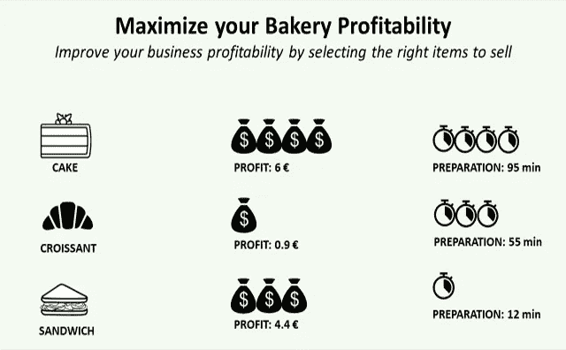
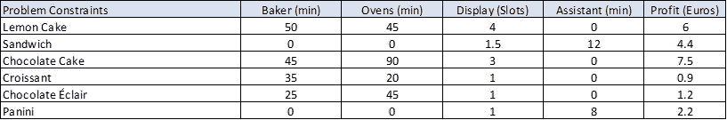

# 使用 Python 最大化您的业务盈利能力

> 原文：<https://towardsdatascience.com/maximize-your-business-profitability-with-python-fbefebbdf802?source=collection_archive---------15----------------------->

## 使用线性规划来帮助您当地的面包店通过选择合适的商品来提高其盈利能力



面包店盈利问题—(图片由作者提供)

如果你读过我以前的文章，你会注意到我的主要关注点始终是使用线性编程、机器学习或统计来降低运营成本。

作为第三方物流的供应链解决方案设计师，我的任务一直是降低成本，为我们的客户保持有竞争力的价格。

然而，这些工具和概念也可以用于通过将生产集中在高利润产品上来最大化供应链的利润。

在本文中，我将向您展示如何通过使用 Python 的线性编程来生产正确的产品，从而帮助您当地的面包店实现利润最大化。

💌新文章直接免费放入您的收件箱:[时事通讯](https://www.samirsaci.com/#/portal/signup)

如果你喜欢，你可以看看视频版本

# 一、如何用 python 优化自己的业务？

## 问题陈述

你想帮助你当地的面包店实现利润最大化。他们出售几种产品，包括蛋糕、糕点和三明治。

可利用的资源

*   **4 名面包师**每天工作 6 小时(总计 24 小时/天)
*   **1 名助理**每天 4 小时做三明治
*   **2 个可全天 24 小时使用的烤箱**(总计 48 小时/天)
*   **100 个插槽**可用于库存和展示

这些项目有不同的资源需求和利润水平



每个 SKU 的资源需求—(图片由作者提供)

## 目标

你需要生产什么来最大化你的每日利润？

*   **结果**

```
Lemon Cake = 0
Sandwich = 20
Chocolate Cake = 32
Croissant = 0
Chocolate Eclair = 0
Panini = 0
Profit reached: 328 euros/day
```

根据这些结果，你当地的面包店老板应该把注意力集中在巧克力蛋糕和三明治上，以达到每天 328 欧元的最高利润。

这个结果可以通过实现更多的约束和参数来改进，以确保您的模型显示您的业务的实际情况。

*   你的资源利用率是多少？

```
Lemon Cake = 0
Sandwich = 20
Chocolate Cake = 32
Croissant = 0
Chocolate Eclair = 0
Panini = 0
1,440/1,440 minutes of bakers used
2,880/2,880 minutes of oven used
240/240 minutes of assistants working time used
126/200 display slots
Profit reached: 328.0 euros
```

好消息！你正在充分利用你的设备和劳动力。

*   如果我们多两个助手来做三明治会怎么样？

```
Lemon Cake = 0
Sandwich = 60
Chocolate Cake = 32
Croissant = 0
Chocolate Eclair = 0
Panini = 0
Profit reached: 504 euros
```

*   如果你多招聘两个助手(4 小时/天),销售更多三明治，利润增加 50%

[](http://samirsaci.com) [## 萨米尔·萨奇

### 数据科学博客，专注于仓储，运输，数据可视化和机器人流程自动化…

samirsaci.com](http://samirsaci.com) 

# 二。构建您的模型

我们将使用 python 的纸浆库。PuLP 是由 COIN-OR Foundation(运筹学计算基础设施)维护的用 Python 编写的线性(LP)和整数规划(IP)问题的建模框架。

> *你可以在这个 GitHub 库中找到完整的代码:* [*链接*](https://github.com/samirsaci/business-profitability) *。
> 我的投资组合与其他项目:* [*小萨奇*](https://samirsaci.com/)

## 1.声明您的变量、参数和模型

*   你的目标是最大化你的利润
*   下限=0:糕点值不能为负值
*   cat = 'Integer ':让我们试着卖掉整个羊角面包:)

这些参数可以从 Excel 文件中加载。

## 2.定义目标并添加约束

## 3.求解模型并分析结果

[](http://samirsaci.com) [## 萨米尔·萨奇

### 数据科学博客，专注于仓储，运输，数据可视化和机器人流程自动化…

samirsaci.com](http://samirsaci.com) 

# 三。后续步骤

*关注我的 medium，了解更多与供应链数据科学相关的见解。*

## 1.改进您的模型

你当地的面包店不能因为无利可图而一天天地停止销售柠檬蛋糕。

因此，在您的模型中，您可以为每种商品添加最小数量的约束，以保证您的柠檬蛋糕粉丝会有他们最喜欢的产品。

可以添加额外的参数和限制，如配料数量、保质期等

## 2.与你当地的面包店老板分享你的模型

既然您已经构建了自己的工具，那么您想与当地的面包店老板分享它。

如果您能实现这个简单的工具，您能想象对她的业务会有什么影响吗？(你能得到多少免费的柠檬蛋糕？)

如果你感兴趣的话，我写了一篇关于如何分享你的 python 脚本的文章，供没有任何 Python 经验的人使用。

[](https://www.samirsaci.com/build-excel-automation-tools-with-python/) [## 用 Python 构建 Excel 自动化工具

### 用于销售分析的 Excel 自动化工具的自动化和报告设计可供您的同事使用，无需…

www.samirsaci.com](https://www.samirsaci.com/build-excel-automation-tools-with-python/) 

## 3.你需要多少助手？

本文展示了一种简单的方法，在假设工作负载波动的情况下，使用线性规划来优化劳动力分配。

[](https://www.samirsaci.com/optimize-workforce-planning-using-linear-programming-with-python/) [## 使用 Python 线性编程优化劳动力规划

### 物流持续改进你需要雇佣多少临时工来消化你每周的…

www.samirsaci.com](https://www.samirsaci.com/optimize-workforce-planning-using-linear-programming-with-python/) 

# 关于我

让我们在 [Linkedin](https://www.linkedin.com/in/samir-saci/) 和 [Twitter](https://twitter.com/Samir_Saci_) 上连线，我是一名供应链工程师，正在使用数据分析来改善物流运营和降低成本。

如果你对数据分析和供应链感兴趣，可以看看我的网站

[](https://samirsaci.com) [## Samir Saci |数据科学与生产力

### 专注于数据科学、个人生产力、自动化、运筹学和可持续发展的技术博客

samirsaci.com](https://samirsaci.com) 

# 参考

[1]运筹学的计算基础设施，优化与纸浆(文档)，[链接](https://coin-or.github.io/pulp/)