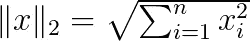
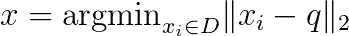
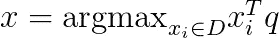
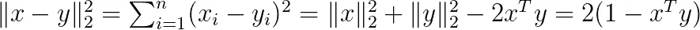
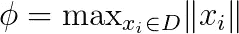
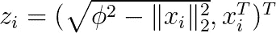
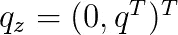
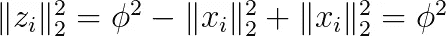
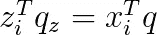
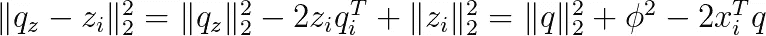

# 使用最近邻搜索算法的最大内积搜索

> 原文：<https://towardsdatascience.com/maximum-inner-product-search-using-nearest-neighbor-search-algorithms-c125d24777ef?source=collection_archive---------9----------------------->


这两个人看起来很像，对吧？约尔根·哈兰在 [Unsplash](https://unsplash.com/s/photos/twins?utm_source=unsplash&utm_medium=referral&utm_content=creditCopyText) 上的照片

## 允许使用库进行最近邻搜索的简单简化，以便有效检测具有大内积的向量

## 动机

最近邻搜索是数据科学中最基本的问题之一。应用范围从用户分割到近似重复检测。毫不奇怪，大多数用于数据科学应用程序的编程语言都提供了具有高度可伸缩的最近邻搜索算法的库。

另一个广泛使用的问题是检测具有大内积的向量。例如，在多标签分类问题中，我们需要检测与需要分类的输入实例的向量具有最大内积的类别向量。在推荐系统中，我们寻找具有大内积的向量。

这两个问题是相关的。正如我们下面所讨论的，如果所有的向量都有相同的范数，这两个问题就变得相同了。但是在大多数应用中，向量有不同的范数，这两个问题变得不同。在高层次上，在最近邻搜索中，我们寻找具有几乎相同值的向量。而在最大内积搜索中，优先选择它们之间具有小角度的向量。

在这篇文章中，我提出了一个简单的技巧，将最大内积搜索问题简化为最近邻搜索。该方法的主要好处是，我们可以将为最近邻搜索设计的高度优化的库应用于最大内积搜索问题。

## 正式设置

通常，最近邻搜索被表述为欧几里得空间中的向量问题。向量 x 的范数定义为



给定数据库 D，查询向量 *q* 的最近邻是 D 中的向量 *x* ，使得



最大内积搜索定义为:



我们假设我们有一个经常被查询的静态海量数据库 D。例如，D 包括由矢量表示的所有网飞电影。

## **单位范数向量**

如果数据库 D 中的所有向量都有单位范数，即||u||=1，那么这两个问题就等价了。注意到



因此，最小化两个向量之间的欧几里德距离对应于最大化它们的内积。因此，在 D 中寻找 q 的最近邻等价于寻找具有与 q 的最大内积的向量。当然，我们可以缩放所有向量和查询向量以具有单位范数，但是这可能导致重要信息的丢失。向量中条目的大小至关重要。

## 一般情况下的简单简化

在[1]中提出了以下简单的简化:



φ是数据库中所有向量的最大范数。我们将φ和向量的范数之差作为第一坐标加到每个向量上。(这将总是非负的，因为φ是最大范数。)我们添加 0 作为查询向量的第一坐标。

对于变换向量的范数，我们有:



此外，由于 q_z 的第一个坐标为 0，因此



因此，新空间中向量之间的欧几里德距离可以重写为



我们看到唯一依赖于查询索引 *i* 的项是内积 *x_i^T*q* 。因此，变换空间中的最近邻向量 z_i 将对应于原始空间中具有最大内积 x_i 的向量。

## 逆变换

在[1]中，作者还展示了如何将最近邻搜索问题简化为最大内积搜索。感兴趣的读者可以参考[1]中的定理 2，但我不会在这里讨论它，因为它不太可能有实际的重要性。

## 履行

给定数据库 D，简单地将上述变换应用于 D 中的所有向量。然后，在查询 q 时，调用最近邻搜索算法。

对转换进行编码非常简单:

```
def transform(vecs):
    maxnorm = max([np.linalg.norm(v) for v in vecs])
    new_vecs = []
    for v in vecs:
        new_vecs.append(
           np.insert(v, 0, np.sqrt(maxnorm**2-np.linalg.norm(v)**2))
        )
    return new_vecs
```

变换之后，我们可以使用最近邻搜索库来解决最大内积问题:

```
from sklearn.neighbors import NearestNeighbors
X = np.array(new_vecs)
nbrs = NearestNeighbors(n_neighbors=1, algorithm='kd_tree').fit(X)
distances, indices = nbrs.kneighbors(np.array([q]))
```

完整的实现可以在[这个 Jupyter 笔记本](https://github.com/konstantinkutzkov/MIPS)中找到。在那里，我还展示了使用 Python 的最近搜索比显式计算查询向量 q 和数据库中所有向量的内积的简单实现更有效。

[1]约兰·巴赫拉赫、耶胡达·芬克尔斯坦、兰·吉拉德·巴赫拉赫、利兰·卡齐尔、诺姆·柯尼希斯泰因、尼尔·尼斯、乌尔里希·帕凯。使用内积空间的欧几里德变换加速 Xbox 推荐系统。RecSys 2014，此处[提供](https://www.microsoft.com/en-us/research/wp-content/uploads/2016/02/XboxInnerProduct.pdf)