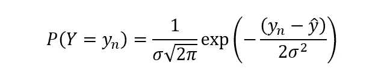

# 最大似然估计和 OLS 回归

> 原文：<https://towardsdatascience.com/maximum-likelihood-estimation-and-ols-regression-36c049c94a48?source=collection_archive---------8----------------------->

## 介绍他们的关系和工作方式

由 [Unsplash](https://unsplash.com?utm_source=medium&utm_medium=referral) 上的 [Edge2Edge 媒体](https://unsplash.com/@edge2edgemedia?utm_source=medium&utm_medium=referral)拍摄

在我的研究中，我多次遇到最大似然估计的概念。然而，没有传统上在我的领域工作的那些人的统计背景，我经常发现很难理解或遵循他们创建和开发的一些模型。其中很大一部分是他们对最大似然估计方法的使用以及他们与回归框架的联系。为此，我想我可以分享我的学习，希望遇到同样问题的其他人不必通过搜索多个不同的文章和文本来达成相同的理解。

首先，从概率的基础开始。如果一个事件的结果是随机的，那么代表该事件的变量就是所谓的随机变量，通常用大写字母 Y 表示。大多数时候，我们感兴趣的是这个随机变量取某个值的概率，比如六面骰子 Y = 5 的概率。然而，在此范围内，有三种主要的概率类型:

1.  **边际概率** —如果 A 是一个事件，那么边际概率就是该事件发生的概率，表示为 P(A) =概率。例如，如果我们对骰子掷出 6 的概率感兴趣，那么这将是 P(Y = 6) = 1/6
2.  **联合概率** —这是两个或更多事件相交的概率。例如，如果 A 和 B 是两个发生的事件，那么 A 和 B 都发生的联合概率由 P(A∩B) = probability 给出。例如，如果我们有两个骰子，两个骰子都显示 3 的概率是多少，这将是 P(3 和 3) = 1/36。
3.  **条件概率** —这是在已知某个事件(B)已经发生的情况下，某个事件(A)发生的概率，用 P(A|B)表示。切换到卡的例子，如果我们知道我们选择的卡是图片卡，我们可以看到它是皇后的概率是多少:P(皇后|图片卡)= 1/3 [1]

然而，为了最大似然估计的目的，我们主要关心联合概率的概念。当事件是独立的(即一个事件的结果不影响另一个事件)，则使用两个单独概率的联合概率，它只是两个单独概率的乘积:

这通常被认为是这样的(事件是独立的)，即使事实并非如此，主要是因为这使得数学变得简单了许多。因此，我们在寻找 A 和 B 发生的概率，记住这一点很重要。

希瑟·吉尔在 [Unsplash](https://unsplash.com?utm_source=medium&utm_medium=referral) 上拍摄的照片

现在换个思路，线性模型往往采用 y = mx + c 的格式，其中 y 和 x 为**变量(** y 常被称为因变量，x 为自变量)，m 和 c 为**参数**。记住这一点很重要，因为在某些情况下，如果没有明确说明，它们可能会相互混淆。然而，出于我们的目的，这些参数告诉我们模型做什么以及它如何表现。

我们可以使用最大似然估计(MLE)来提取这些参数的值。这是发现参数**的地方，这些参数最大化了方程的格式产生我们实际观察到的数据的可能性。因此，这本质上是一种将参数拟合到观察数据的方法。我们用这种方法得到的值就是所谓的最大似然估计。**

其工作方式取决于独立变量(y)的分布假设。例如，如果假设 y 值可以近似为正态分布(这是经常发生的情况)，我们需要计算这些目标变量的均值和偏差的最大似然参数值，均值是我们的主要兴趣。为此，我们将试图估计的模型(我们的回归模型)作为标准正态分布的平均值，实际观察值表示为平均值加上一些误差项。所以如果我们试图估算参数的模型是:

其中ε_o 是误差项，然后通过最大似然估计，我们试图计算平均值，其表示为:

其中 y-hat 变量表示估计的平均值。我们可以用向量符号来简化，X 表示 x_1，x_2，x_3，B 表示β_0，β_1，β_2，β_3。因此，这可以简写为:

其中 N 是总共 N 个观察值中 y 和 x 的单独观察值。这意味着，对于每一组 X 变量，都有一个由函数生成的数，这个函数以 y-hat 作为我们要估计的平均值。这些 y 变量中的每一个的平均值，本质上是模型基于一组给定的参数所预测的。

这里，y-hat 不是一个固定值，而是基础正态分布的函数:

这就说随机变量 Y 等于观测值 y_n 的概率是方差为σ，均值为 y-hat 的底层分布的函数，其中 y-hat 的值来自于我们的函数形式的关系式(y-hat_n = X_ni β_i)。我们从最大似然估计中得到的本质上的近似值是参数值是给定数据观测值所预测的值的可能性。因此，对于一组观察值 y_n，我们希望最大化 y_n 由数据 X_ni β_i 给出的总概率，这将产生代表模型最大似然的参数值。这将表示为:

其中 L(β|y_n)是参数集β给定观察值 y_n 的可能性，右侧是数据和参数给定 y_n 的每个概率的乘积，由下式给出:

本质上，这意味着给定观测值的参数的可能性是给定模型的函数形式的观测值的概率的函数。

然后将这个方程代入上一个方程，但为了简化计算，我们通常取两边的对数。这是因为对数乘以对数可以表示为加法，因此这不是乘法，而是简单的求和，这更容易处理。

我们可以使用这种对数变换，因为对数是单调函数(y 值随着 x 值的增加而增加，没有重复值)。因此，日志的最大值将出现在与非日志值的最大值相同的点上。

由此，我们想要估计参数是模型的最佳表示的可能性的最大值。因此，我们可以简单地区分和解决每个参数，以找到最大值，这将使用最大似然估计。

然而，众所周知，这一过程的结果会得出与普通最小二乘(OLS)回归相同的结论[2]。这是因为 OLS 只是最小化了预测值和实际值之间的差异:

这与最大似然估计的结果相同！当然，这背后的假设是:自变量是正态分布的，自变量和因变量之间的关系是线性的，误差是独立的和正态分布的，并且所有 x 值的方差相等。

因此，在正态分布的自变量的情况下，经常使用 OLS 回归。然而，最大似然估计的格式可以根据基础分布而变化，无论是泊松分布、伯努利分布还是负二项式分布，都可以与其他回归规范相关，这些规范可以从相同的原则中推导出来！

[1] Brooks-Bartlett，J[https://towards data science . com/probability-concepts-explained-introduction-a7c 0316 de 465](/probability-concepts-explained-introduction-a7c0316de465)

[2] Flowerdew，R；洛维特，用泊松回归分析计数数据，专业地理学家，1989，41，2

</a-data-scientists-checklist-6e0a98456f7a>  </introduction-to-random-forest-classifiers-9a3b8d8d3fa7>  </introduction-to-decision-tree-classifiers-from-scikit-learn-32cd5d23f4d> [## scikit-learn 决策树分类器简介

towardsdatascience.com](/introduction-to-decision-tree-classifiers-from-scikit-learn-32cd5d23f4d)