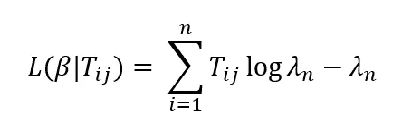

# 最大似然估计和泊松回归

> 原文：<https://towardsdatascience.com/maximum-likelihood-estimation-and-poisson-regression-in-the-gravity-model-5f0de29e3464?source=collection_archive---------22----------------------->

## 通过引力模型介绍它们之间的关系


照片由 [Unsplash](https://unsplash.com?utm_source=medium&utm_medium=referral) 上的[穆扎米尔·苏尔马](https://unsplash.com/@muzammilo?utm_source=medium&utm_medium=referral)拍摄

在我之前的[文章](/maximum-likelihood-estimation-and-ols-regression-36c049c94a48)中，我介绍了概率的基本概念以及它与最大似然估计和普通最小二乘回归的关系。在本文中，我将继续在此基础上进行构建，但在泊松回归的情况下，我将把它应用于重力模型。

与假设因变量正态分布且方差恒定的线性回归相反，泊松回归假设目标变量分布为泊松分布。因此，自变量的方差应该等于其均值。这用于我们处理离散的、基于计数的数据的情况，其中独立值是非负整数，并且事件被假设为彼此独立(尽管实际上可能不是这样)。泊松分布可以用它的概率质量函数(概率密度函数的一种形式，但用于离散变量)来表示，其形式为:


换句话说，这仅仅意味着随机变量 Y 取 y_i 的值的概率是分布λ_i 的均值和事件 y_i 的计数的函数。

这个分布可以用 python 建模，代码如下:

```
#import required libraries
import matplotlib.pyplot as plt
import numpy as np#create the subplot
plt.subplots(figsize = (7,7))#plot the distributions
plt.hist(np.random.poisson(lam=0.5, size=3000))
plt.xlabel("Random Poisson Distribution (0:3000, lambda = 0.5)", fontsize = 15)
plt.ylabel("Count", fontsize = 15)
plt.title("Random Poisson distribution", fontsize =20)
plt.grid(True)
```


作者照片

由此得到的图与我们从正态分布中预期的相比看起来是负偏的，并且在小整数值的情况下尤其突出。

重力模型本身采用以下形式:


本质上说，从 I 到 j 的流量 T_ij 与起点的人口(V_i)和目的地的人口(W_j)成正比，与它们之间的距离(d_ij)成反比。这是引力模型的基本形式，用于预测不同地理区域之间的人口、货物、信息和货币的流动。这是通过类比牛顿的引力定律得出的结论，即两个物体相互吸引的程度与它们的大小成正比，与它们的距离成反比。


作者图片

在这种情况下，k 是一个比例常数，它确保预测流量与实际总流量相加，而α、γ和β都是待估算的**参数**。

该模型用于预测 T_ij 的最可能值，给定方程中的**变量**和**参数**，这意味着该模型变为:


其中，T_ij^hat 是模型的预测/期望值。因此，与之前的正常回归一样，当我们出于回归目的将其转换为线性格式时，我们不转换实际值，而是转换给定数据的期望值。因此，这个模型变成了:


其中，右侧表示我们正在对 I 和 j 之间流量的预期值的自然对数进行建模。这意味着预期值与平均值λ_i 相关，由模型通过连接函数进行预测，在泊松回归的情况下，其形式为:


其中 X 代表所有 I 个**独立变量**的向量，β是所有**参数**的向量，n 是我们拥有的观测值的数量。这样做的结果是我们得到了这样的形式:


正是这个连接函数确保了λ为非负值，即使回归量 X 或回归系数β为负值[1]。

按照与线性关系相同的思路，每个自变量取观察值的概率由下式给出:


其中 y_n 是我们对实例 n 的观察值，在我们的情况下是 T_ij，X_n 可以作为我们对实例 n 的所有因变量的向量，在我们的情况下是 V_i，W_j 和 D_ij [2]。由于我们有多个观测值，我们希望在给定一组参数的情况下，最大化所有观测值发生的可能性。由于我们假设实例彼此独立，因此我们希望使用联合概率关系作为每个实例发生的概率:


这意味着我们得到了使给定的一组观察到的 T_ij 最有可能的参数值。

考虑到所有这些值的乘法会很复杂，为了简化数学，我们可以取等式两边的对数。假设自然对数是单调函数(每个 x 值对应一个 y 值)，则预期值的对数应该在与预期值相同的位置达到最大值。因此，上面复杂的乘法变成了简单的求和:


在我们的重力模型中，最终简化为:



其中λ_n 是我们的预测值，T_ij 是我们的实际值。然后，这可以通过每个参数来区分，并求解为 0，以便找到最大似然估计，从而获得最适合数据的函数形式。

然而，就像正态分布的最大似然估计一样，我们可以使用泊松回归形式的回归来逼近解[2]。这当然可以通过 [statsmodels](https://www.statsmodels.org/stable/generated/statsmodels.formula.api.poisson.html) 库在 python 中实现。因此，当因变量为泊松分布时，最大似然估计过程如何与泊松回归相关。

[1]洛维特，花露，R 1989。使用泊松回归分析计数数据。专业地理，41，2，190–198

[2]福泽林汉，S，威廉，第 1983 页。泊松相互作用模型的进一步讨论，地理分析，15，4，343–347

如果你喜欢我的文章，并想阅读更多，请随时使用以下链接:

<https://philip-wilkinson.medium.com/membership>  </maximum-likelihood-estimation-and-ols-regression-36c049c94a48>  </introduction-to-random-forest-classifiers-9a3b8d8d3fa7>  </introduction-to-decision-tree-classifiers-from-scikit-learn-32cd5d23f4d> [## scikit-learn 决策树分类器简介

towardsdatascience.com](/introduction-to-decision-tree-classifiers-from-scikit-learn-32cd5d23f4d)