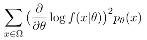

# 最大似然估计(MLE)和 Fisher 信息

> 原文：<https://towardsdatascience.com/maximum-likelihood-estimation-mle-and-the-fisher-information-1dd53faa369?source=collection_archive---------3----------------------->

## 极大似然估计置信区间的构造

媒体上关于 MLE 的文章数量巨大，从理论到实现都使用不同的语言。关于费希尔的资料，也有不少教程。然而，费雪信息和最大似然估计之间的联系很少被提及。因此，我想就这个话题发表一篇文章。


图片来自 [Unsplash](https://unsplash.com/photos/RSsqjpezn6o)

# 最大似然估计

MLE 的主要思想很简单。它回答了这个问题:

> W 什么参数最有可能使模型产生我们现有的样本？

形式上，我们考虑随机变量序列 X₁，…，Xₙ，这样它们是相同的独立分布(iid)随机变量。它们都来自同一个分布 f(x；θ)，其中θ是一个参数向量(我们用这个大θ来表示一个参数向量，这意味着θ∈ℝᵖ，如果模型只有一个参数，我们将在本文中使用θ来表示)和θ∈ω，其中ω是参数的样本空间。这听起来很奇怪，但是在 MLE 中，我们从样本空间中选取参数，并且我们想要最可能的一个。我们如何做到这一点？我们最大化一个似然函数，其定义为


等式 1.1 似然函数

每个事件的概率可以相乘，因为我们知道这些观察是独立的。在等式 1.1 中，每个 Aⱼ是一个事件，它可以是一个区间或包含单个点的集合。当截尾在某一特定值 u 时，观测事件 Aⱼ为区间[u，∞]。在没有删截的情况下，Aⱼ包含一个单点，并且给定参数θ，该观察的可能性为


不考虑删失，似然函数可以写成


也就是我们平时在课本上看到的。


作者图片

我们想对 L 做什么？我们想找出θ，L 的最大值。例如，如果 L 可以解析地最大化，并且它是凹的，我们可以计算关于θ的导数，并让它为零。此时，L 的值将是全局和局部最大值。让我们看一个正态分布的多元数据的例子。


等式 1.2 正态分布

考虑随机变量 X = (X₁，X₂，…，Xₙ)，均值μ = (μ₁，μ₂，…，μₙ)；我们假设标准方差是一个常数σ，这个性质也被称为**同方差**。因此，似然函数是


等式 1.3

这些指数看起来有点混乱，但是考虑到每个观察值被安排在矩阵 x 的列中的事实，等式 1.3 实际上是非常简单的。xᵢⱼ只是第 j 次观察的第 I 个成分。并且等式[ex1]用于估计每个μᵢ.我们知道对数可以把乘积变成求和，而通常，求和更容易处理。所以我们可以试着取等式 1.3 两边的对数。


等式 1.4

(应该很明显 *log* 指的是自然对数)剩下的就好办了；我们需要对方程 1.4 做一些代数运算。由于σ是一个常数，我们可以把它分解出来；然后我们到达


等式 1.5

记住我们想要最大化 L，这相当于最大化等式 1.5，因为 *log* 单调增加。这可以归结为最小化下面的表达式


公式 1.6

如果你熟悉普通的线性模型，这应该会让你想起最小二乘法。我们可以看到，最小二乘法和正态假设下的 MLE 是一样的(误差项具有正态分布)。

对于实际应用中的最大似然估计，我们看下面的例子:一个高中学生获得的奖励数量的数据集(此处[可用](https://www.sheffield.ac.uk/mash/statistics/datasets))。如果我们画出奖励的数量

```
awards <- read.csv2(file='data/Awards_R.csv', header=TRUE, sep=',')
summary(awards)
awards.num <- awards$num_awardsplot(table(awards.num), main='Awards in math', ylab='Frequency', xlab='Number of awards')
```

从图中我们可以看出，它遵循泊松分布


泊松分布的最大似然函数定义为


等式 1.8 泊松分布的最大似然函数

我们可以这样实现

```
L=function(x){
    a=1
    for (i in 1:length(awards.num)){
        # Poisson probability mass function
        a=a*dpois(awards.num[i],x)
    }
    return(a)
}
```

并优化这个函数

```
# find the value for which L is maximized
sol <- optimize(L, c(0,2), maximum=TRUE)
curve(L, from=0, to = 2)
x1 <- sol$maximum
x2 <- sol$objective
points(x1, x2, col="#FF0000", pch=19)
abline(v=x1, col="#FF0000")
```

搜索最大值的间隔是根据 L 图选择的(见图 1.8)。该函数通过`optimize`进行数值最大化，它在给定的区间内(以预定的精度)搜索优化值。这给了我们

```
$maximum
[1] 0.970013$objective
[1] 1.853119e-113
```

这意味着最大值是 1.853119e-113，L(0.970013)= 1.853119 e-113—λ= 0.970013 是优化的参数。如图表所示


图 1.8 似然函数

结果表明，样本均值与优化 L 值非常接近

```
mean(awards.num)
# --> 0.97
# sol$maximum = 0.970013
```

这是有意义的，因为泊松分布中的参数λ与期望值相同。为了正式证明这一点，我们可以对对数似然函数求导


等式 1.9 log(L)的推导，L 在等式 1.8 中定义

将这个导数设为零，我们得到


等式 1.10 估计量

其中λ和 hat 表示估计量。这告诉我们，在这个例子中，最大似然估计量是由样本均值给出的。

# 极大似然估计的置信区间

## 费希尔信息矩阵

假设随机变量 X 来自参数为θ的分布 *f* ，费希尔信息*测量 X* 携带的关于θ的信息量。为什么这种量化很重要？事实证明，在贝叶斯和频率主义方法的统计，费雪信息的应用。贝叶斯主义者用这个来求初始概率，频率主义者在 MLE 中构造置信区间。(要阅读更多关于贝叶斯和频率主义方法的内容，请参见[这里](https://medium.com/science-and-philosophy/subjectivism-in-decision-science-926c29feb7bb))费希尔信息重要性的一个具体例子在【2】中谈到:

这个例子是连续投掷硬币十次，观察结果是一个 10 维的数组，一个可能的结果是 X = (1，1，1，1，1，0，0，0，0)。我们要估计得到人头的概率，θ。x 有 2 个⁰ = 1024 个可能的结果，我们可以让另一个随机变量，t 是 x 中的人头数，t 是 x 的函数，它被称为一个**统计量**。在一些文献中，统计被描述为“一条信息”这是真的，但更准确地说，它是观察值(数据集)的函数，它**总结了**数据。

在这个例子中，T 具有由概率密度函数给出的二项式分布


等式 2.1

在本例中，n = 10。x 有 1024 种可能的结果，然而 T 只能取 11 个不同的值。是否意味着 X 比 T 包含更多的信息？一般来说，是的，既然 X 把抛硬币的顺序考虑进去了，但是 T 没有。但是关于θ，**没有**，因为抛硬币的输出顺序不影响θ。同样，统计量 T 是**充分的**，这意味着给定 T 的值，X 取特定值的概率不取决于θ。这意味着，条件概率分布 P(X | T = t，θ)是均匀的，由下式给出


等式 2.2

这也可以这样解释:给定 T 的值，X 中不再有关于θ的**信息**。为了量化统计量 T 和原始数据 X 中关于参数θ的信息，Fisher 信息开始发挥作用



定义 2.3 (a)费希尔信息(离散)

其中ω表示样本空间。在连续分发的情况下


定义 2.3 (b)费希尔信息(续)

log f(x|θ)的偏导数称为*得分函数*。我们可以看到，费希尔信息就是得分函数的**方差**。如果有多个参数，我们就有了带有元素的矩阵形式的 Fisher 信息


定义 2.4 费希尔信息矩阵

这也可以写成


等式 2.5 费希尔信息矩阵

定义 2.4 和方程 2.5 之间的等价性不是微不足道的。这是费雪信息的一个重要性质，我们现在就来证明一维情况(θ是单参数):先从恒等式开始:


等式 2.6

也就是密度函数 f(x；θ),θ为参数。注意 f(x|θ)和 f(x；θ).第一个表示条件概率——概率分布函数在给定参数的条件下。然而，后者意味着θ是函数的参数，仅此而已。然后我们对两边的θ求导。


等式 2.7

现在我们需要尝试让*日志*出现。诀窍如下


在等式 2.7 中，我们使用乘一技术(“乘一”、“加零”——数学中著名的把戏)，这意味着我们乘以 f(x；θ)然后除以 f(x；θ).等式 2.8 中红色部分的组合给出了 f(x；θ).

等式 2.9 给出了费雪信息的另一个重要性质— *费雪信息的期望等于零*。(是旁注，本帖没有用到这个性质)回到 Def 2.4 和方程 2.5 等价的证明。我们重新对方程 2.9 关于θ求导


再次对等式 2.9 求导

因为在等式 2.10 中，灰色和黑色部分都是正的(f(x；θ)终究是[概率测度](/measure-theory-in-probability-c8aaf1dea87c)，唯一可能的场景就是方程(2.11)。从方程 2.11 开始，我们移动 f(x；θ)从 LHS(左侧)到 RHS(右侧)


等式 2.12

就像等式 2.8 一样，在等式 2.12 中，红色部分的组合再次给我们 f(x；θ).


等式 2.13

证明已经完成了。

## 构建置信区间

首先，我们将介绍最大似然估计的渐近分布定理，它告诉我们估计量的渐近分布:

> L et X₁，…，Xₙ是由 f(x)给定的分布中大小为 n 的一个样本，参数θ未知。设真实参数为θ₀，θ₀的最大似然法为θhat，则


等式 2.5

这表明


等式 2.6 估计量的分布

因为当样本量接近无穷大时，最大似然估计接近真实参数，这也被称为最大似然估计的一致性


性质 2.7 最大似然估计的一致性性质

我们也可以论证方程 2.8 也成立(参考方程 2.5)。


等式 2.8

(关于这个定理的证明，见[此处](https://people.missouristate.edu/songfengzheng/Teaching/MTH541/Lecture%20notes/Fisher_info.pdf)，第 5 页。)然后我们可以从下面的等式建立置信区间


不等式 2.8 置信区间

其中 z 是累积函数的倒数，α是临界值。接下来的事情是找到费希尔信息矩阵。这很容易，因为根据等式 2，5 和 Hessian 的定义，对数似然函数的负 Hessian 就是我们要找的东西。

你可能会问为什么方程 2.5 中的费希尔信息矩阵与海森信息矩阵相同，尽管它是一个期望值？这是因为函数 L 是在最大似然估计下求值的，也就是说 L 是针对特定的θ求值的。而这就是使 l 最大化的θ，因此，加权平均(我们知道期望是加权平均)就不再必要了——观察到的**费希尔信息**只是二阶微分。“观察到的”意味着费希尔信息是观察到的数据的函数。(这个话题在 [MathStackExchange](https://stats.stackexchange.com/questions/68080/basic-question-about-fisher-information-matrix-and-relationship-to-hessian-and-s?rq=1) 上也有讨论)。

我们可以用下面的代码找到置信区间，用同样的数据集。

```
L.log = function(x){
    a=1
    for (i in 1:length(awards.num)){
        # Poisson probability mass function
        a=a+dpois(awards.num[i],x, log=TRUE)
    }
    return(a)
}# numerical approach
opt.log = optim(par=1, L.log, method="Brent", control=list(fnscale=-1), hessian=TRUE, lower=0, upper=2)opt.log
I.log <- opt.log$hessian# since we have only one parameter, there's no inverse of matrix calculated
est.log <- qnorm(1 - alpha/2) / sqrt(n * (-I.log[1,1]))
l.est.log <- x1 - est.log
h.est.log <- x1 + est.log
l.est.log
h.est.log
# --> CI = [0.9603613, 0.9796647]
```

*总结:*

在这篇文章中，我们快速介绍了最大似然估计，然后我们来看看 Fisher 信息及其矩阵形式。记住这两个概念，然后我们探索如何构建置信区间。在这篇文章中，只使用了一个例子:一所高中的获奖人数。该分析完全在 r 中实现。

资源:

[1]p . m . e . Altham(2005 年)。[R 中的广义线性建模介绍](http://www.statslab.cam.ac.uk/~pat/All.pdf)。*统计实验室，朱尼奥*。

[2] Ly，a .，Marsman，m .，Verhagen，j .，Grasman，R. P .，& Wagenmakers，E. J. (2017)。[关于费希尔信息的教程](https://www.sciencedirect.com/science/article/pii/S0022249617301396?casa_token=xnfLaHuZcvQAAAAA:cLkteYOqVl7VBwX-QHyKjEyv9RrHbzmi6DXQZtzbH0JR4sQqo1v8LqhT7PLRO0Em5crfGEbbX1k)。*数学心理学杂志*， *80* ，40–55。

[3]马尔科·塔博加(2017)。“泊松分布——最大似然估计”，概率论与数理统计讲座，第三版。Kindle 直接出版。在线附录。[https://www . stat lect . com/fundamentals-of-statistics/泊松分布-最大似然法。](https://www.statlect.com/fundamentals-of-statistics/Poisson-distribution-maximum-likelihood.)

[4] Klugman，S. A .，Panjer，H. H .，& Willmot，G. E. (2012 年)。*损失模型:从数据到决策*(第 715 卷)。约翰·威利的儿子们。

[5]什么是删失数据？可从以下网址获得:[https://reliability . readthedocs . io/en/latest/What % 20 is % 20 reviewed % 20 data . html](https://reliability.readthedocs.io/en/latest/What%20is%20censored%20data.html)。于 2021 年 10 月 13 日访问

错误日志

1.  增加等式 1.1 中符号的解释