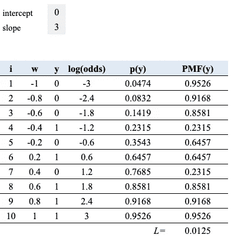

# 最大可能性最简单的方法

> 原文：<https://towardsdatascience.com/maximum-likelihood-the-easy-way-1f14c0e2a5ce?source=collection_archive---------42----------------------->

## 一个复杂的话题简化了

在 [Unsplash](https://unsplash.com?utm_source=medium&utm_medium=referral) 上由 [Pocky Lee](https://unsplash.com/@jizhidexiaohailang?utm_source=medium&utm_medium=referral) 拍摄的照片

# 摘要

本文将首先使用一个简单的例子来演示最大似然估计(MLE)。然后，我们将建立在第一个例子拟合逻辑回归模型使用最大似然法。通过理解这两个例子，你将具备使用任何其他广义线性模型(GLMs)的基础知识。

# 注意

在下面的例子中，我在一个平面上滚动一枚镍币，直到它落到左边或右边。对于第一个例子，我们将使用一个“公平”的未加权硬币。在第二个例子中，我们将增加硬币大小的重量。

# 示例 1 —公平镍

如果我们在平面上滚动一枚公平的镍币 10 次，我们可能会认为它从左到右落下的机会相等(p=0.5)。在我们的例子中:

*   向右下降是正例(y=1，p=0.5)
*   落在左边是否定的情况(y=0，p=0.5)

在 10 次投掷中，我们观察到硬币向右下落了 5 次(y=1)，向左下落了 5 次(y=0)。这是我们所期望的，因为硬币是公平的。下面是 10 卷的表格:

10 卷公平硬币

**使结果的可能性最大化的 p(概率)值是多少？**

我知道我知道——p = 0.5 太简单了，但请耐心听我说——如果你知道如何用一个非常简单的例子来计算最大似然，这个概念很容易扩展到更复杂的问题。

首先，让我们使用伯努利分布，因为它最能代表我们的数据。

带有示例的 Bernoulli

似然函数是每个观测的 PMF 的联合概率分布(乘积)。我们只是将所有的 PMF 相乘

联合概率分布

可以改写为:

似然函数

我们想最大化这个功能。与其用微积分来解决这个问题，不如用不同的 p 值来看看它是如何影响可能性的。你可以用[这个工作簿](https://docs.google.com/spreadsheets/d/1onbU-6mcBBS5gS28dripMmGVLZrxpQda2Yu0eTRxFXE/edit?usp=sharing) (tab: fair_coin)试试看。

正如所料，我们将通过指定概率 p = 0.5 来最大化可能性。

现在我们已经开发了基础，让我们继续看一个稍微复杂一点的例子。

# 示例 2 —加重镍

让我们再做 10 次，除了这一次我们被告知镍在每一次滚动之前被改变重量(w)。负 w 表示重量在硬币的左侧，正 w 表示重量在右侧。

下面是 10 卷的结果表。我填充了“desc”列，以便于阅读表格。例如，第一次观察在左侧有(-1.0)的重量，硬币落在左侧。

10 卷不同重量的

查看数据，我们可以看到硬币重量的大小和侧面与下落方向之间的关系。硬币两边最重的重量会把硬币往那个方向拉。在第一个例子中没有权重，所以我们没有额外的信息来建模行为。在这种情况下，我们希望使用这些附加信息(权重)来分配预测概率。

让我们首先手动为每个结果分配预测概率，看看它们与 PMF 和可能性的关系。我们将使用与第一个例子相同的概念:

我已经创建了一个[谷歌表单](https://docs.google.com/spreadsheets/d/1onbU-6mcBBS5gS28dripMmGVLZrxpQda2Yu0eTRxFXE/edit?usp=sharing) (tab: weighted_coin)，所以你可以探索这些关系。

在左边的表格中，我把所有的预测概率都设为 0.1，在右边，我把它们都设为 0.9。当 y=0(负)且预测概率也很低 p=0.1 时，你注意到 PMF 的大小了吗？

接下来，当 y = 1(正)且预测概率高 p=0.9 时，你会注意到什么？

检查两种情况的相反情况。(y=1，p=0.1)，(y=0，p=0.1)

正如你所看到的，当我们把最高的概率分配给积极的情况，把最低的概率分配给消极的情况时，就达到了最高的 PMF 值。注意两种情况下底部的可能性是一样的——还没有那么大。

**现在，让我们把高概率分配给正面案例，低概率分配给负面案例，看看会发生什么**。看看现在的 PMF 值。看看底部的可能性增加了多少！

这就是逻辑回归的本质。该算法试图通过拟合未知参数(斜率和截距确定 p)来最大化拟合伯努利分布(我们的 PMF 的乘积)的可能性(对于阳性情况分配高预测概率(p ),对于阴性情况分配低预测概率(p))。这就是它如何区分阶级的。

**让我们使用带有新可变权重的逻辑回归来帮助我们预测概率。**

最大似然逻辑回归

与其用微积分求解，不如手动求解。我已经创建了一个[电子表格](https://docs.google.com/spreadsheets/d/1onbU-6mcBBS5gS28dripMmGVLZrxpQda2Yu0eTRxFXE/edit?usp=sharing) (tab: fitting_logistic)，它允许你改变截距和斜率，并计算预测的概率和可能性。看看你能否算出最大可能性的截距和斜率。电子表格是这样的:

逻辑回归求解器

如果你研究一下斜率和截距，你会发现截距= 0 和斜率= 3 时可能性最大。我说“大约”是因为我们没有做所有精确的数学计算。

“最佳”斜率和截距

你实验斜率和截距的方式本质上是软件如何计算出最大似然**，有两个主要的例外:**

1.  似然函数被转换成对数(似然)
2.  软件知道在每次被称为梯度下降(或上升)的迭代中调整斜率和截距的方向

我鼓励您进一步探索这些主题，但这超出了本文的范围。

好，回到我们的例子

**截距= 0 是什么意思？**

截距= 0 意味着当重量= 0 时(我们在硬币的两边都没有任何重量)，阳性情况(硬币向右下落)的对数(几率)为零。想一想这个。**完全说得通**。因为 w = 0，我们知道这是一个公平的硬币，根据前面的例子，我们确定它有 50%的机会落在任何一边。这是一个数学公式，证明了当 log(odds) = 0 时，p = 0.5。

**斜率= 3 是什么意思？**

重量的斜率是 3。这意味着硬币右侧每增加一个重量单位，硬币向右下落的几率就会增加 3。我会让你把它转换回概率。

**总结一下:**

我们已经**通过**拟合未知参数**(斜率和截距确定 p)，最大化了拟合伯努利分布**(我们的 PMF 的乘积)的可能性(对于阳性情况高预测 p，对于阴性情况低预测 p)**。这是最大似然估计。**

# 一般线性模型

我们可以使用与我们刚刚学习的模式相同的模式来拟合其他广义线性模型。关键的区别在于您将使用不同的发行版。

例如，在线性回归中，我们将**通过**拟合未知参数**(斜率和截距决定平均值)来最大化**拟合**正态分布**的可能性。关于线性回归最大似然估计的更多信息，参见本文。