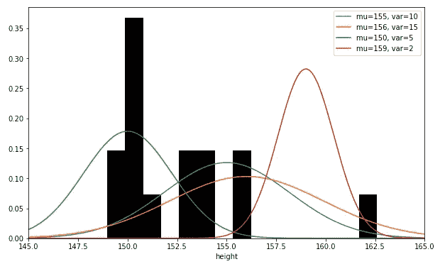
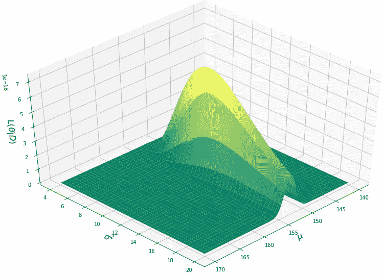
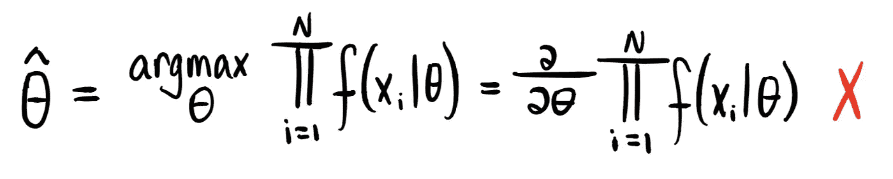
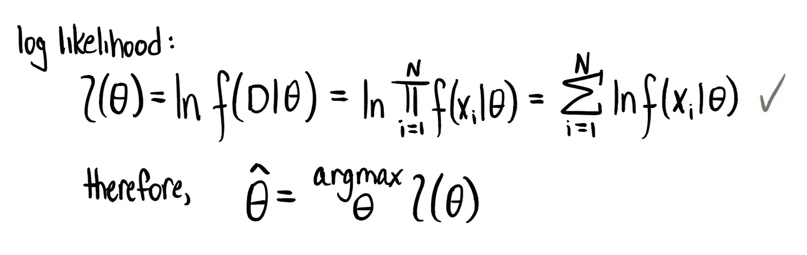
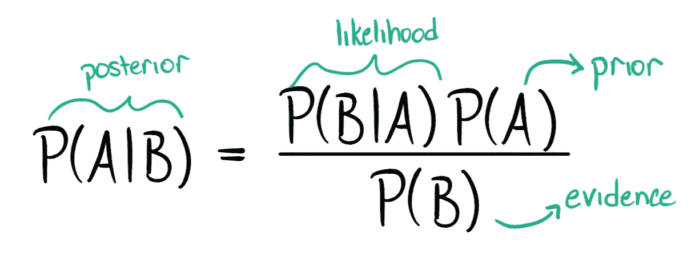
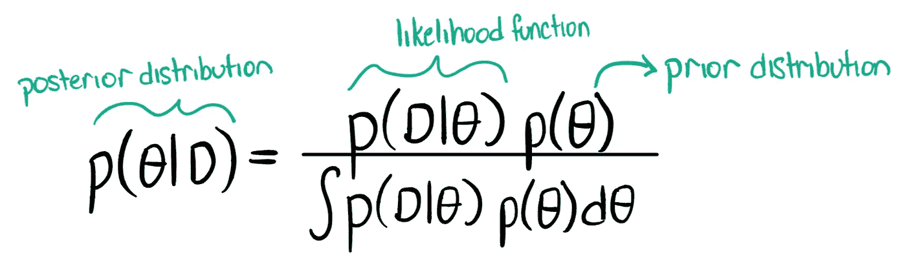
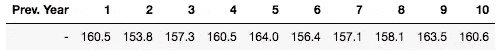
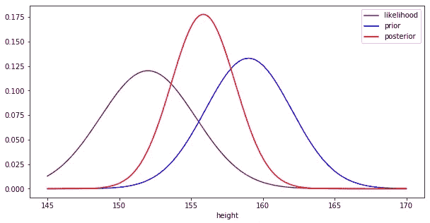
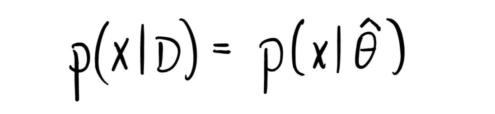
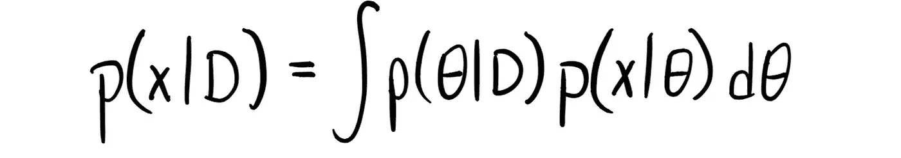

# 最大似然与贝叶斯估计

> 原文：<https://towardsdatascience.com/maximum-likelihood-vs-bayesian-estimation-dd2eb4dfda8a?source=collection_archive---------2----------------------->

## [实践教程](https://towardsdatascience.com/tagged/hands-on-tutorials)

## 参数估计方法的比较

由[和](https://unsplash.com/@kazuend?utm_source=medium&utm_medium=referral)在 [Unsplash](https://unsplash.com?utm_source=medium&utm_medium=referral) 上拍摄的照片

机器学习的核心是模型。我们如何表示数据？我们可以用什么方法将数据分组以进行比较？我们的数据来自什么分布或模型？这些问题(以及更多的问题)驱动着数据处理，但后者是参数估计的基础。

最大似然估计(MLE)和贝叶斯估计(Bayesian estimation)可能是最广泛使用的两种参数估计方法，通过这两种方法，给定一些数据，我们能够估计产生这些数据的模型。为什么这很重要？在现实世界中收集的数据几乎不能代表全部人口(想象一下我们需要收集多少数据！)，因此，通过从观察到的样本总体估计分布参数，我们可以深入了解看不见的数据。

作为本文的先决条件，首先理解微积分和概率论中的概念是很重要的，包括联合概率和条件概率、随机变量和概率密度函数。

参数估计处理近似分布的*参数*，这意味着分布的类型通常是预先假定的，这决定了您将要估计的未知参数是什么(泊松的λ，高斯的μ和σ)。我在本文中使用的例子将是高斯。

> 样本问题:假设您想知道森林中树的高度分布，作为对树木健康的纵向生态研究的一部分，但您今年唯一可用的数据是一名徒步旅行者记录的 15 棵树的样本。您希望回答的问题是:“我们可以用什么分布来模拟整个森林的树高？"

观察数据(15 个样本)的直方图，以及可能产生该直方图的 4 个高斯曲线示例。图片作者。

## 符号的快速注释

*   θ是未知变量，在我们的高斯情况下，θ = (μ，σ)
*   *D* 为所有观测数据，其中 *D = (x_1，x_2，…，x_n)*

# 似然函数

最大似然估计和贝叶斯估计的(几乎唯一的)共同点是它们依赖于所见数据(在我们的例子中，15 个样本)的**可能性**。可能性描述了每个可能的参数值产生我们观察到的数据的可能性，由下式给出:

似然函数。图片作者。

由于奇妙的[独立同分布假设](https://en.wikipedia.org/wiki/Independent_and_identically_distributed_random_variables)，所有的数据样本都被认为是独立的，因此我们能够放弃混乱的条件概率。

让我们回到我们的问题上。这需要知道我们 15 个样本的值，我们未知参数(μ，σ)的每个组合产生这组数据的概率是多少？通过使用[高斯分布函数](https://en.wikipedia.org/wiki/Gaussian_function)，我们的似然函数是:

μ，σ上的似然函数。图片作者。

# 最大似然估计

太棒了。现在你知道了似然函数，计算最大似然解就*真的很容易*。名字里就有。为了得到我们的估计参数(𝜃̂)，我们所要做的就是找到产生最大似然函数的参数。换句话说,(μ，σ)的什么组合给了我们上图中似然函数顶部最亮的黄点？

为了找到这个值，我们需要应用一点微积分和导数:

(有问题的)𝜃̂.计算图片作者。

你可能已经注意到了，我们遇到了一个问题。对产品进行衍生会变得非常复杂，我们希望避免这种情况。幸运的是，我们有办法解决这个问题:使用对数似然函数。回想一下:( 1)乘积的对数是对数的总和，以及(2)取任何函数的对数可能会改变数值，但不会改变该函数最大值出现的*,因此会给出相同的解。*

使用对数似然法正确计算𝜃̂。图片作者。

事实证明，对于一个高斯随机变量，最大似然解就是观测数据的均值和方差。因此，对于我们的问题，模拟树高分布的 MLE 解是μ=152.62 和σ =11.27 的高斯分布。

# 贝叶斯估计

> 好消息！为了帮助您搜索该森林的树高分布，您的同事设法进入数据档案，挖掘出该森林过去 10 年的树高平均值。有了这些信息，您现在可以另外使用贝叶斯估计来解决这个问题。

贝叶斯估计背后的中心思想是，在我们看到任何数据之前，我们已经有一些关于它来自的分布的先验知识。这种先验知识通常来自经验或过去的实验。然而，在进入这种方法的本质之前，掌握贝叶斯定理的概念是至关重要的。

## 贝叶斯定理

希望你知道，或者至少听说过概率环境中的贝叶斯定理，我们希望找到一个事件以另一个事件为条件的概率。在这里，我希望以一种能洞察贝叶斯参数估计和先验重要性的方式来构建它。

贝叶斯定理。图片作者。

为了说明这个等式，考虑事件 *A =“今天早些时候下雨”*和事件 *B =“草地是湿的”*的例子，我们希望计算 *P(A|B)* ，假定草地是湿的，早些时候下雨的概率。为此，我们必须计算 *P(B|A)* 、 *P(B)* 、 *P(A)* 。条件概率 *P(B|A)* 表示假定下雨，草地是湿的概率。换句话说，假设下雨，草地潮湿的可能性是*。*

**P(A)* 的值被称为 ***先验*** :不管草是否潮湿(在知道草的状态之前)下雨的概率。这种先验知识很关键，因为它决定了我们对可能性的加权程度。如果我们在不经常下雨的地方，我们会更倾向于将湿草归因于雨水以外的东西，如露水或洒水器，这是由低的 *P(A)* 值捕获的。然而，如果我们在一个经常下雨的地方，湿草更有可能是雨水的副产品，高的 P(A)会反映这一点。*

*剩下的就是 *P(B)* ，也被称为 ***证据*** :草地潮湿的概率，这一事件充当了下雨事实的证据。这个值的一个重要属性是，它是最终概率的一个归一化常数，正如你将很快在贝叶斯估计中看到的，我们用一个归一化因子代替传统的“证据”*

*用于贝叶斯估计的等式与贝叶斯定理具有相同的形式，主要区别在于我们现在使用模型和概率密度函数(pdf)来代替数字概率。*

**

*贝叶斯估计。图片作者。*

*请注意，首先，似然性等同于 MLE 中使用的似然性，其次，贝叶斯定理中通常使用的证据(在这种情况下将转化为 *P(D)* )被分子的积分所取代。这是因为(1) *P(D)* 实际计算起来极其困难，(2) *P(D)* 不依赖于θ，这才是我们真正关心的，(3)它作为归一化因子的可用性可以替代积分值，保证后验分布的积分为 1。*

*回想一下，为了求解 MLE 中的参数，我们采用对数似然函数的 argmax 来获得(μ，σ)的数值解。在贝叶斯估计中，我们改为计算参数空间上的分布，称为 ***后验 pdf*** ，表示为 *p(θ|D)* 。这种分布表示在考虑了观察到的数据和先验知识之后，我们有多强烈地相信每个参数值是产生我们的数据的参数值。*

*先验 *p(θ)* 也是分布，通常与后验分布同类型。我不会深入细节，但当先验分布与后验分布匹配时，它被称为[共轭先验](https://en.wikipedia.org/wiki/Conjugate_prior)，并带来许多计算上的好处。我们的例子将使用共轭先验。*

*让我们再一次回到树高的问题上来。除了徒步旅行者记录的 15 棵树之外，我们现在有了过去 10 年的树高的方法。*

**

*过去 10 年的树高。图片作者。*

*假设今年的树高应落入所有前一年的分布中，我们的先验分布为高斯分布，μ=159.2，σ =9.3。*

*剩下的就是计算我们的后验 pdf。对于这个计算，我假设固定的σ = σ _MLE = 11.27。在现实中，我们不会以这种方式解决贝叶斯估计，但不同维度的高斯相乘，如我们的似然和先验，是极其复杂的，我相信在这种情况下简化计算足以理解这一过程，并且更容易可视化。如果你想要更多关于如何执行完整计算的资源，请查看[这些](https://stats.stackexchange.com/questions/474064/how-to-multiply-a-likelihood-by-a-prior) [两个](https://people.eecs.berkeley.edu/~jordan/courses/281A-fall02/lectures/lecture9.ps)链接。*

*将单变量似然和先验相乘，然后将结果归一化，我们最终得到μ=155.85 和σ =7.05 的后验高斯分布。*

**

*似然、先验和后验分布。作者图片*

*这就是贝叶斯估计的结果。如您所见，后验分布考虑了先验和可能性，以找到两者之间的中间点。根据新的观测数据，当前的后验概率成为新的先验概率，并且用新数据给出的可能性计算新的后验概率。*

# *预言*

*我们有模型来描述我们的数据，那么我们能用它们做什么呢？这些模型最重要的用途是对看不见的未来数据进行预测，这基本上告诉我们一个观察结果有多大可能来自这个分布。我不会明确地为我们的例子进行计算，但是如果你想自己做的话，公式在下面。*

## *最大似然预测*

**

*MLE 预测。图片作者。*

*最大似然预测利用密度函数中潜在变量的预测来计算概率。例如，在高斯情况下，我们使用(μ，σ)的最大似然解来计算预测。*

## *贝叶斯预测*

**

*贝叶斯预测。图片作者。*

*正如您可能猜到的那样，贝叶斯预测稍微复杂一些，它使用后验分布和随机变量θ的分布来产生新样本的预测。*

# *结束语*

## *什么时候用 MLE？贝叶斯估计？*

*我们已经看到了两种参数估计方法之间的计算差异，现在一个自然的问题是:什么时候我应该使用一种而不是另一种？虽然在选择方法时没有硬性规定，但我希望你可以使用以下问题作为粗略的指导方针，引导你朝着正确的方向前进:*

*   *您正在处理多少数据？*

*最大似然估计只依赖于*观察到的*数据的结果，众所周知，当数据最少时，它很容易出现偏差。考虑一个实验，你掷一枚硬币三次，每次都是正面朝上。虽然你知道一枚公平的硬币有 50%的机会正面朝上，但最大似然估计告诉你 *P(正面)=* 1，而 *P(反面)=* 0。在观测数据稀疏的情况下，贝叶斯估计结合了先验知识，例如知道一个公平的硬币是 50/50，可以帮助获得更准确的模型。*

*   *你对你的问题有可靠的先验知识吗？*

*正如我刚才提到的，在某些情况下，先前的信念可以让你的模型受益。然而，不可靠的先验可能导致高度[偏差模型](/the-truth-about-bayesian-priors-and-overfitting-84e24d3a1153)的滑坡，需要大量的观察数据来补救。确保如果你使用先验知识，它们被很好地定义，并且 ***包含与你试图解决的问题相关的洞察力*** 。如果你不确定你的病史的可靠性，最大似然法可能是一个更好的选择，尤其是如果你有足够多的数据。*

*   *您的计算资源有限吗？*

*本文中一个反复出现的主题是贝叶斯计算比最大似然估计更复杂。凭借现代的计算能力，这种差异可能无关紧要，但是如果您发现自己受到资源的限制，MLE 可能是您的最佳选择。*

## *一些有趣的属性*

*最后，已经讨论了 MLE 和贝叶斯估计之间的许多差异，我只想提供这两种方法之间的一些有趣的联系。*

1.  *如果贝叶斯先验在所有值上是一致的(“非信息先验”)，贝叶斯预测将非常相似，如果[不等于](https://www.researchgate.net/post/Can-anyone-explain-why-in-some-cases-Bayesian-estimation-gives-the-same-result-as-maximum-likelihood-estimation)，则 MLE 预测。*
2.  *如果贝叶斯先验是明确定义的，并且在所有点上都不为零，那么，随着观测数据量接近无穷大，MLE 和贝叶斯预测将[收敛到相同的值](http://www.ccs.neu.edu/home/rjw/csg220/lectures/MLE-vs-Bayes.pdf)。*

*仅此而已！如果你读到这里，感谢你的阅读。感谢任何反馈！*

*   *[链接到代码](https://github.com/luluricketts/misc_medium/blob/main/mle_bayes/MLE-Bayes.ipynb)*