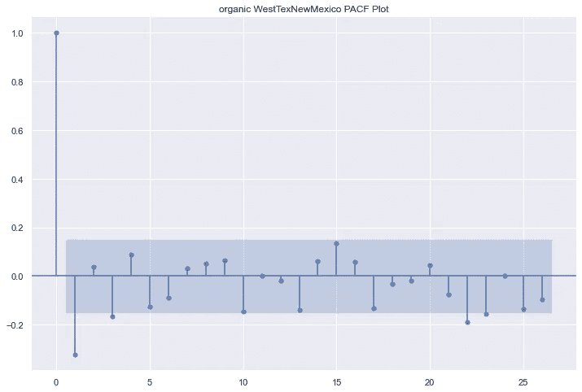
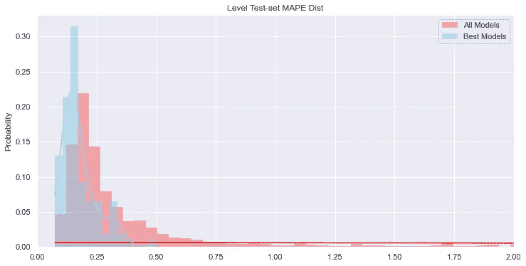
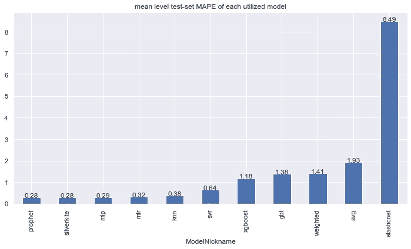
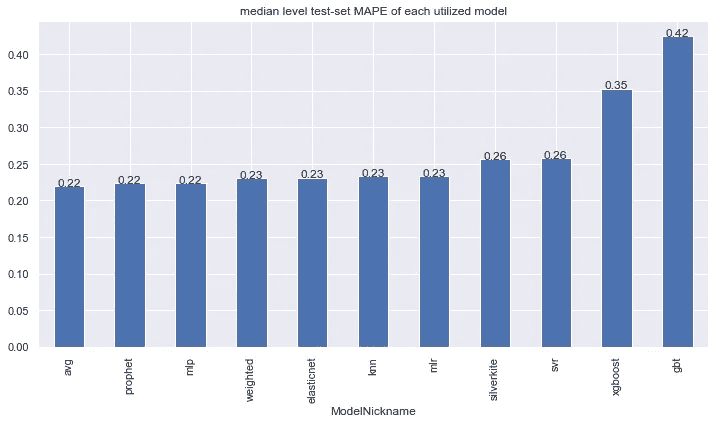
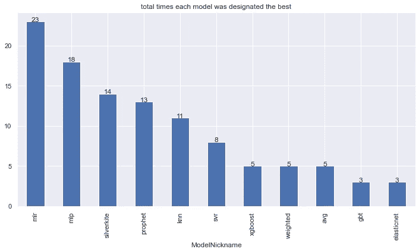

# 愿预测与你同在:Scalecast Pt 简介。2

> 原文：<https://towardsdatascience.com/may-the-forecasts-be-with-you-introducing-scalecast-pt-2-692f3f7f0be5?source=collection_archive---------31----------------------->

## 在这部激动人心的续集中，我们比较了 Prophet、SilverKite 和 Scikit-Learn 的预测准确性


由[托拜厄斯·科奈尔](https://unsplash.com/@tobiasc?utm_source=medium&utm_medium=referral)在 [Unsplash](https://unsplash.com?utm_source=medium&utm_medium=referral) 上拍摄的照片

欢迎来到 Scalecast 概述系列的第 2 部分，scale cast 是可伸缩、最少代码预测的新希望。[第 1 部分](/introducing-scalecast-a-forecasting-library-pt-1-33b556d9b019)概述了一个系列的 10 个模型的预测结果；[第 3 部分](/forecast-on-3-levels-introducing-scalecast-pt-3-eb725e0be6c9)将展示库在有差异和无差异系列之间移动是多么容易。在这一部分中，我们对 108 个时间序列分别应用了 11 个模型。这样，我们可以看到哪些模型最常产生最佳结果。

在这篇文章的结尾，将会揭示以下内容:

*   平均而言，Prophet 模型返回的误差指标最低
*   Scikit-learn 的线性回归模型最常被认为是“最佳”模型
*   通过使用 11 个不同的模型，我们得到了比只使用一个模型更好的预测结果

该分析使用了[鳄梨数据集](https://www.kaggle.com/neuromusic/avocado-prices)。在 GitHub 上查看 scalecast 并给它一颗星:

<https://github.com/mikekeith52/scalecast>  

```
pip install --upgrade scalecast
```

让我们从库导入和将数据集加载到 pandas 数据框架开始:

```
import pandas as pd
import numpy as np
import pickle
from tqdm.notebook import tqdm as log_progress
from ipywidgets import widgets
from IPython.display import display, clear_output
import seaborn as sns
import matplotlib
import matplotlib.pyplot as plt
from scalecastdev.Forecaster import Forecasterdata = pd.read_csv('avocado.csv',parse_dates=['Date'])
data = data.sort_values(['region','type','Date'])
```

我们使用的数据集测量了美国不同地区的不同鳄梨销售量。它也分为传统和有机鳄梨类型。大多数系列包括从 2015 年 1 月到 2018 年 3 月的完整周数据，但也有少数系列缺少日期。因此，我们使用`pandas.date_range()`函数返回每个系列的每个可用日期。我们用 0 填充缺失的日期，假设它们缺失是因为那几周没有销售。这可能不是一个合理的假设，但它影响最小系列，并且对于这个例子来说是有效的。我们将结果数据存储到一个`scalecast.Forecaster()`对象中，并将每个对象放入一个字典中:

这留给我们 108 个系列，每个系列有 168 周的历史数据。我们可以查看最后加载的系列的部分自相关图:

```
f.plot_pacf(diffy=True,lags=26)
plt.title(f'{f.type} {f.region} PACF Plot')
plt.show()
```



作者图片

这显示了在 1 和 3 处的一些显著滞后，然后在 22 和 23 处再次出现。我们可以添加 3 个自回归项，但 22 和 23 似乎是随机的，可能不适用于所有序列。让我们用 26 作为季节性滞后，半年。让我们添加“周”、“月”和“季度”回归变量，像上次一样，选择正弦/余弦转换代替这些回归变量的原始整数。我们还添加了一个“年”变量和时间趋势。

一些系列可以是静止的；有些可能不是。我们不检查每一个，我们将信任关于是否区别一个系列或保持它的水平的扩充的 Dickey Fuller 测试。

对于我们的维持期和预测期，我们使用:

*   为期 26 周的测试
*   13 周的验证期(针对调整模型)
*   52 周的预测长度

实际上，模型预处理如下所示:

现在来预测一下。我们使用下面代码第一行中指定的 9 个模型。我们还使用了两个组合模型:所有模型的加权平均值和根据验证过程表现最好的 5 个模型的简单平均值。不要忘记在你的工作目录中放一个 [Grids.py](https://scalecast.readthedocs.io/en/latest/Forecaster/GridGenerator.html) 文件。

现在我们有了结果，每个模型有四个误差/精度指标可以比较:MAE、RMSE、MAPE 和 R2。所有这些都可以在样本数据、测试集数据以及水平和非水平结果中获得。

MAPE 提供了一个易于解释的指标，有利于跨时间序列的比较。根据我们预测的数据范围，1000 的 RMSE 可能意味着非常不同的事情；MAPE 是实际数据与预测值之间的一个百分点的差异，与规模无关。它的缺点是，当实际数据中有 0 时，它不进行评估，并且在处理非常小的值时，可能会产生误导。出于这个原因，我们选择使用`LevelTestSetMAPE`指标进行比较，该指标在所有鳄梨系列中都得到了公平的评估。然而，观察结果如何随着不同的度量标准而变化是很有趣的，我们鼓励你自己去做。

既然我们已经选择了一个误差度量，让我们将所有模型统计数据写入一个 CSV 文件:

我们发现了以下信息:

*   所有系列的 MAPE 指标中值为 0.24
*   在任何给定系列中被指定为“最佳”的模型中，MAPE 中值为 0.16
*   一些模型在测试集数据上表现很差，导致误差分布严重偏右



作者图片

*   平均而言，先知和银雀模型返回的 MAPE 最低
*   一些模型受到指数趋势建模的影响，这可能导致它们的 MAPEs 非常高
*   [转变](https://scalecast.readthedocs.io/en/latest/Forecaster/SeriesTransformer.html)可以解决这个问题。



作者图片

*   简单平均组合模型得出了最低的中值 MAPE



作者图片

*   mlr 模型最常被指定为给定系列中的最佳(23 次)
*   每一个被利用的模型都被至少三次指定为最佳



作者图片

最初，这篇博文在这一部分有更多的结果报告，但随着 scalecast 的更新，我相信现在有更好的方式来表达这些结果。请参阅新的介绍性笔记本及其关于[比例自动化预测](https://scalecast-examples.readthedocs.io/en/latest/misc/introduction/Introduction2.html#Scaled-Automated-Forecasting)的部分，了解与此处所示类似的示例。

# 结论

我们对 108 个系列应用了 11 个模型，总共进行了 1，188 次预测。我们比较了模型性能，并展示了一种可扩展的预测方法，该方法使用最少的代码，具有灵活性和动态性，并能产生易于检查的结果。谢谢你的关注，请关注[第三部](/forecast-on-3-levels-introducing-scalecast-pt-3-eb725e0be6c9)！