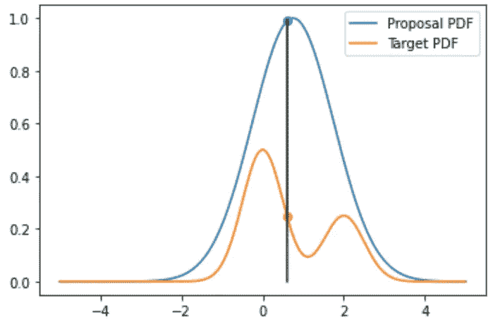
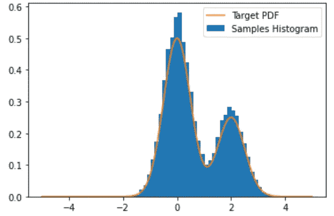
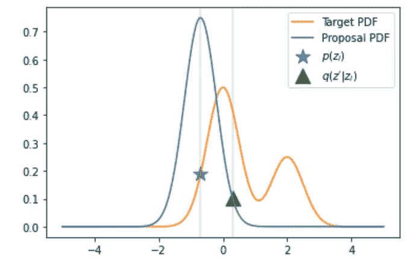
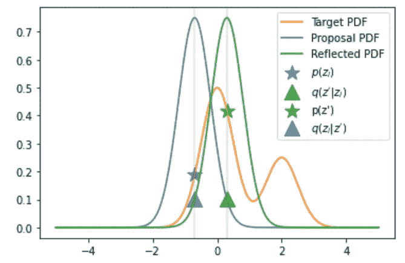
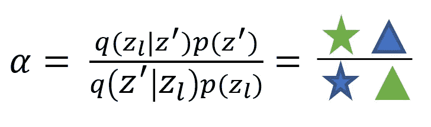
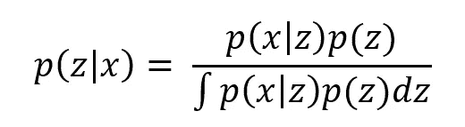
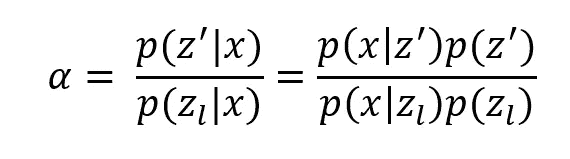

# MCMC:可视化介绍

> 原文：<https://towardsdatascience.com/mcmc-a-visual-introduction-38e1d6131e86?source=collection_archive---------29----------------------->

## 随机抽样方法

## 直观解释两种基本采样算法

图片由[metarworks](https://www.shutterstock.com/g/chombosan)在 [shutterstock](https://www.shutterstock.com/image-photo/ai-artificial-intelligence-concept-deep-learning-1717584028) 上拍摄

# 介绍

在我以前的文章中，我谈到了卡尔曼滤波器。虽然卡尔曼滤波器对于具有高斯噪声的线性系统是最佳的，但是当给定非线性系统时，该算法失败。

## 那么非线性系统呢？

非线性系统的问题在于，在最佳算法的推导中涉及的积分是不可处理的。这些积分阻止了我们评估后验概率、期望值和方差，所有这些都是在构建最优模型时涉及到的。

## **我们能解决这些积分吗？**

虽然在非线性系统中，后验概率通常是难以处理的概率密度函数(PDF)，但它们仍然可以被评估。采样方法的目标是间接采样难处理的 PDF。通过随机抽样，我们可以对样本取有限和来近似上述积分。

**采样方法通过对难以处理的 pdf 进行间接随机采样，然后对其进行有限求和，来近似非线性系统解析解中涉及的积分。**

# 拒绝抽样

拒绝抽样是最简单的抽样技术之一。有了它，我们可以重建难以处理的 pdf。我们来看一下算法。

最初，我们有一个目标 PDF，我们不能从 PDF 中采样，但是，我们可以在任何时候评估它。我们试图从这个棘手的 PDF 中抽取样本。我们采用剔除抽样:

1.  设计一个提案 PDF，初步猜测我们的目标 PDF
2.  缩放提案 PDF，它必须在每一点上都大于目标
3.  提案样本 PDF
4.  评估目标 PDF 的样本
5.  根据接受概率接受或拒绝样本
6.  重复 N 个样本

作者图片

在上图中，橙色部分是我们希望从中取样的目标 PDF。提案 PDF 在每一点上都是大于目标值的正态分布。

在拒绝抽样中，我们首先对提案 PDF(来自上面的蓝色分布)进行抽样，我们可以在两个 PDF 上评估这个样本。然后我们决定是否保留样品。

接受概率等于在目标 PDF 评估的随机样本和在建议 PDF 评估的随机样本之间的比率。在上图中，接受随机样本的概率是绿线的长度除以黑线加上绿线的长度。对于上面显示的随机样本，您得到的接受概率约为 25%。

作者图片

重复多次会产生所示的分布。如您所见，尽管目标 PDF 难以处理且无法采样，但通过拒绝采样，我们有效地从目标 PDF 中进行了采样。

剔除取样的问题是很多样本被剔除。因此，该过程最终相当昂贵。在我的例子中，超过五分之三的数据被拒绝。幸运的是，还有其他更有效的采样方法。

# 大都会-黑斯廷斯算法

在这一节中，我将讨论 Metropolis-Hastings 算法。让我们一步一步地研究这个算法。

我们从一个棘手的目标 PDF 开始，就像以前一样。目标是间接从这个 PDF 中取样。

作者图片

1.  首先，我们随机抽取一个样本，并在该样本上评估目标 PDF，这在上图中显示为蓝色星号。
2.  然后，我们在这个新绘制的样本(蓝色曲线)上构建一个提案 PDF。
3.  我们从这个新的提案 PDF 中抽取样本(获得绿色三角形)。

到目前为止还不错，现在变得更难了…

作者图片

4.我们现在将我们的提案 PDF 镜像到新绘制的样本上(绿色曲线，它是一个镜像的提案 PDF，平均值在绿色三角形上)。

5.然后在反射的 PDF(蓝色三角形)上评估我们的初始样本，在目标 PDF(绿色星号)上评估新绘制的样本。

一旦完成，我们就可以决定是否接受或拒绝新的样品。

接受概率给出了样本被接受的概率。最需要注意的是新样本和当前样本的目标 PDF 之间的比率(上图中开始之间的比率)。如果这个比率很高，这意味着我们正在向一个峰值移动，我们正在向目标 PDF 攀升，因此我们希望这个新样本更有可能被选中。

建议的 pdf 之间的比率(三角形之间的比率)给出了当从一个样本改变到另一个样本时我们在空间中移动的平滑程度的度量。注意，如果建议 PDF 是对称的(就像我们的例子)，那么这个比率等于 1。这是 Metropolis-Hastings 算法的一个特例，称为 Metropolis 算法。

如果样品被接受，我们保留它并重新开始。如果样品被拒绝，我们保留之前的样品。这使得 Metropolis-Hastings 算法比拒绝采样更有效，当拒绝时，它仍然增加样本。

# MCMC 和后验概率

在贝叶斯定理中，当似然和先验为高斯时，后验概率有解析解(见我的文章[这里](/drawing-out-the-posterior-probability-surface-of-a-gaussian-classifier-a1f6044ab5ae))。然而，当这些不是高斯分布时，几乎可以肯定分母中的积分无法求解。

以上是 Metropolis 算法中样本的接受概率，其中建议 PDF 是对称的。你可以看到它和贝叶斯定理中的后验概率的相似性。通过使用 Metropolis 算法进行采样，我们对后验数据进行采样。对于无限个样本，我们可以从这些随机样本中完美地逼近后验概率密度函数。

# 结论

在本文中，我将介绍两种随机抽样方法，并解释它们的重要性。

采样方法可用于对难以处理的 pdf 进行采样。例如，这些可以是后验概率表面，其中似然和后验不是高斯的。

拒绝采样虽然非常简单，但效率极低，因为它最终会拒绝大多数样本。MCMC 不拒绝任何样本，使得算法更加经济。

## 支持我

希望这对你有所帮助，如果你喜欢，你可以 [**关注我！**](https://medium.com/@diegounzuetaruedas)

你也可以成为 [**中级会员**](https://diegounzuetaruedas.medium.com/membership) 使用我的推荐链接，获得我所有的文章和更多:[https://diegounzuetaruedas.medium.com/membership](https://diegounzuetaruedas.medium.com/membership)

## 你可能喜欢的其他文章

[可微发电机网络:简介](/differentiable-generator-networks-an-introduction-5a9650a24823)

[傅立叶变换:直观的可视化](/fourier-transforms-an-intuitive-visualisation-ba186c7380ee)