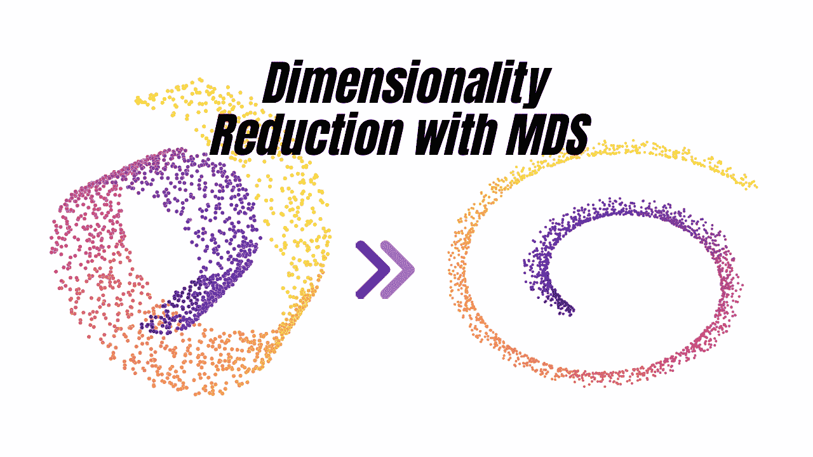
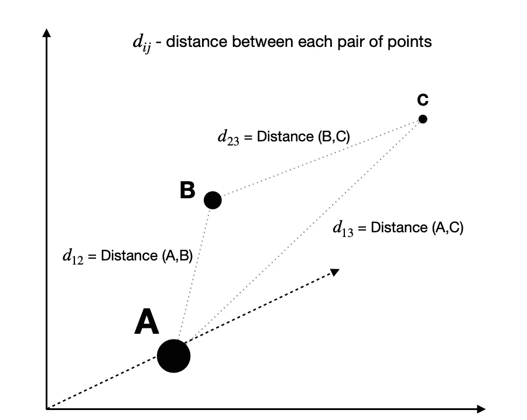
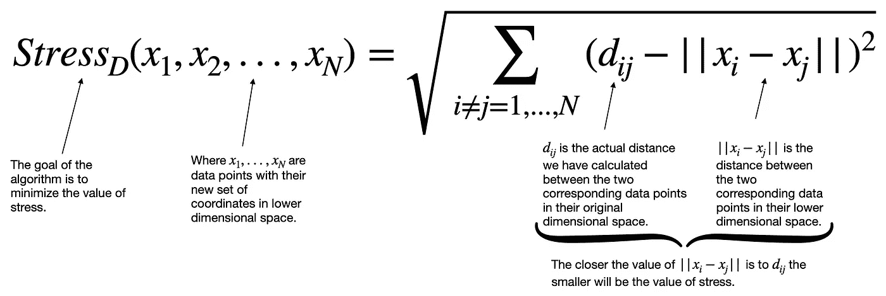
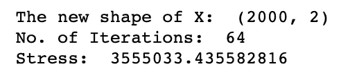
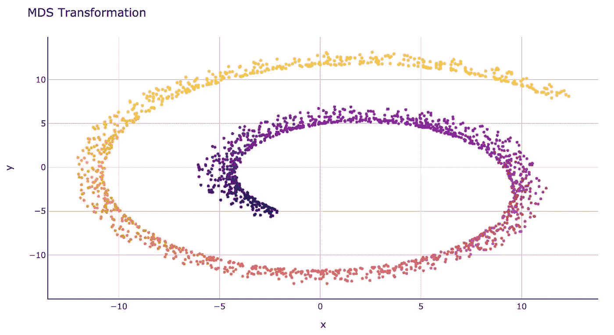
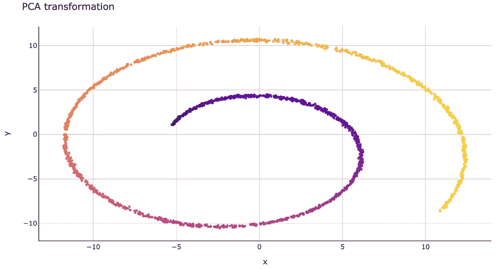

# MDS:多维尺度 Python 中降维的聪明方法

> 原文：<https://towardsdatascience.com/mds-multidimensional-scaling-smart-way-to-reduce-dimensionality-in-python-7c126984e60b?source=collection_archive---------3----------------------->

## 机器学习

## 用一个详细的 Python 例子解释了 MDS 算法

降维。Gif by [作者](https://solclover.com/)。

# 介绍

处理大数据会带来许多挑战，其中之一就是由于维数过高而导致模型的效率和性能下降。

幸运的是，许多降维技术可以帮助我们克服挑战，让我们能够删除“不太重要”的数据。

在本文中，我将深入研究度量多维标度(MDS ),让您了解它是如何工作的，以及如何将其用于您的数据科学项目。为此，我涵盖了以下主题:

*   多维标度的类型(MDS)
*   MDS 在机器学习算法领域的地位。
*   公制 MDS 实际上是如何工作的？
*   在 Python 中如何使用 MDS 来降低数据维数？

# 多维标度的类型(MDS)

有两种主要类型的 MDS，公制(经典)和非公制。虽然两者都旨在找到高维数据的最佳低维表示，但它们的不同之处在于它们处理的数据类型。

*   **公制(经典)MDS** —也称为**主坐标分析(PCoA)。确保不要将其与主成分分析(PCA)混淆，PCA 是一种独立但相似的技术。
    公制 MDS 试图通过使用每对点的**几何坐标**计算它们之间的距离来模拟数据的相似性/不相似性。这里的关键是使用线性标尺测量距离的能力。例如，10 个单位的距离将被认为是 5 个单位的距离的两倍。**
*   **非公制 MDS** —设计用于处理序数数据。例如，您可能要求客户对您的产品进行 1 到 5 分的评级，其中 1 表示糟糕，5 表示令人惊叹。在这里，评分为 2 的产品是 ***而不是*** 一定是评分为 1 的产品的两倍。重要的是顺序(1 < 2 < 3 < 4 < 5)而不是绝对值。在这种情况下，你会使用非公制 MDS。

正如简介中提到的，在本文中，我将重点关注**公制 MDS** 。不过，请注意，Sklearn 用 Python 实现了 MDS 算法，让您可以轻松地在公制和非公制方法之间切换。因此，对于非度量方法，您也可以使用本文末尾提供的 Python 示例。

# 机器学习算法领域中的多维标度(MDS)

事实是，机器学习算法比我们任何人都能列出的要多得多。然而，我试图收集和分类一些最常用的，你可以在下面的**互动**旭日图中看到。确保点击👇在不同的类别上对**进行放大并揭示更多的**。

多维标度属于降维技术组中机器学习算法的**无监督**分支。

机器学习算法分类。由[作者](https://solclover.com/)创建的交互式图表。

***如果你喜欢数据科学和机器学习*** *，请* [*订阅*](https://bit.ly/3sItbfx) *获取我的新文章的邮件。如果你不是中等会员，可以在这里加入***。**

# *公制多维标度(公制 MDS)实际上是如何工作的？*

*通常，度量 MDS 计算原始高维空间中每对点之间的距离，然后将其映射到较低维空间，同时尽可能保留这些点之间的距离。*

> *注意，低维空间的维数可以由你选择。通常，人们会选择 2D 或 3D，因为它允许数据可视化。*

*因此，让我们来看看由公制 MDS 执行的高级步骤。我试图在这个解释中尽量少用数学，但完全避免是不可能的。*

## *度量 MDS 算法使用的步骤*

***步骤 1** —算法计算每对点之间的距离，如下图所示。*

**

*三维空间中的点及其距离。图片由[作者](https://solclover.com/)提供。*

***步骤 2** —已知原始距离，算法试图通过在低维空间中找到一组使应力值最小的坐标来解决优化问题。*

**

*压力成本函数。图片由[作者](https://solclover.com/)提供。*

*可以使用多种方法来优化上述成本函数，例如 Kruskal 的最速下降法或 De Leeuw 的迭代优化法。然而，我这次不会深入研究数学，以保持这篇文章侧重于高层次的解释。*

*需要注意的重要一点是，上述两种方法都是迭代方法，有时会给出不同的结果，因为它们对初始起始位置很敏感。*

*然而，Sklearn 的 MDS 实现允许我们指定想要初始化进程的次数。最后，选择应力最低的配置作为最终结果。*

****

# *在 Python 中如何使用 MDS 来降低数据维数？*

*抛开理论，让我们进入有趣的部分，在 Python 中使用 MDS 进行降维。*

*通常，您会希望将 MDS 用于高维数据，例如，手写文本或数字的图像。然而，我热衷于展示数据在之前和之后的样子。因此，我将使用 MDS 对更简单的数据，可以在三维和 2D 可视化。*

## *设置*

*我们将使用以下数据和库:*

*   *[Scikit-learn library](https://scikit-learn.org/stable/index.html)for
    1)创建数据供我们使用([make _ Swiss _ roll](https://scikit-learn.org/stable/modules/generated/sklearn.datasets.make_swiss_roll.html))；
    2)进行多维缩放([MDS](https://scikit-learn.org/stable/modules/generated/sklearn.manifold.MDS.html))；*
*   *[Plotly](https://plotly.com/python/) 用于数据可视化*
*   *[熊猫](https://pandas.pydata.org/docs/)进行数据操作*

*让我们从导入库开始。*

*接下来，我们使用 Sklearn 的 make_swiss_roll 创建一些数据，并将其显示在 3D 绘图上。*

*交互式 3D 瑞士卷。图由[作者](https://solclover.com/)提供。*

*确保通过旋转从每个角度探索上面的交互图。*

## *表演 MDS*

*我们现在将使用 MDS 来将这个 3D 结构映射到 2d，同时尽可能地保持点之间的距离。请注意，瑞士面包卷的深度小于其高度和宽度。我们期望这一特征在 2D 图中得以保留。*

> *注意，“n_components”告诉 algorihtm 你想要多少个维度。同时，如果您想使用非公制 MDS 而不是公制 MDS，可以将“公制”设置为“假”。此外，您可以指定使用“n_init”超参数初始化的次数。*

*上面的代码给出了这些结果:*

**

*MDS 结果。图片由[作者](https://solclover.com/)提供。*

*我们可以看到新数组的形状是 2000 乘 2，这意味着我们已经成功地将其缩减为 2 维。此外，算法需要 64 次迭代才能达到最低的压力水平。*

*现在让我们绘制新的 2D 数据，看看它与原始的 3D 版本相比如何。*

**

*MDS 转型后的 2D 瑞士卷。图片由[作者](https://solclover.com/)提供。*

*结果非常好，因为我们可以保留全局结构，同时不会丢失在原始深度维度中观察到的点之间的分离。*

*虽然这取决于我们想要解决的确切问题，但在这种情况下，MDS 似乎比 PCA(主成分分析)表现得更好。为了比较，下图显示了应用 PCA 变换后同一 3D 瑞士卷的 2D 表示。*

**

*PCA 改造后的 2D 瑞士卷。图片由[作者](https://solclover.com/)提供。*

*正如你所看到的，PCA 给我们的结果看起来像是瑞士卷一面的图片，没有保留第三维的深度信息。*

# ***结论***

*当您希望保留高维数据的全局和局部结构时，多维缩放是一种很好的技术。这是通过保持较低维度中的点之间的距离尽可能类似于原始高维空间中的距离来实现的。*

*但是，如果您的分析需要您更多地关注全局结构，您可能希望使用 PCA。*

* [## PCA:主成分分析——如何用更少的维度获得优越的结果？

### 降维的最佳技术之一

towardsdatascience.com](/pca-principal-component-analysis-how-to-get-superior-results-with-fewer-dimensions-7a70e8ab798c) 

或者，您可以探索 Isomap(等距映射)，它结合了[【k 最近邻】](/k-nearest-neighbors-knn-how-to-make-quality-predictions-with-supervised-learning-d5d2f326c3c2)和 MDS，以更好地保存局部结构。

 [## Isomap 嵌入——一种令人敬畏的非线性降维方法

### 如何用等距映射“展开瑞士卷”？

towardsdatascience.com](/isomap-embedding-an-awesome-approach-to-non-linear-dimensionality-reduction-fc7efbca47a0) 

如果您有任何问题或建议，请随时联系我们。

干杯👏
**索尔·多比拉斯**

***如果你已经花光了这个月的学习预算，下次请记得我。*** *我的个性化链接加入媒介是:*

 [## 通过我的推荐链接加入 Medium 索尔·多比拉斯

### 作为一个媒体会员，你的会员费的一部分会给你阅读的作家，你可以完全接触到每一个故事…

solclover.com](https://solclover.com/membership)*