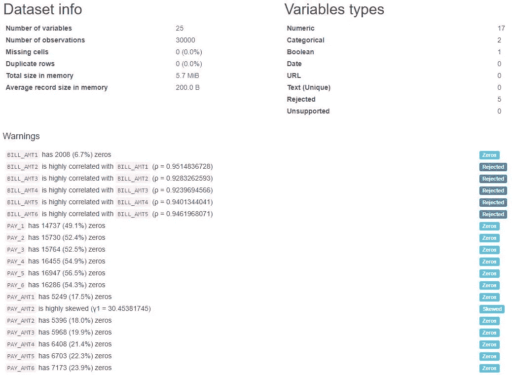
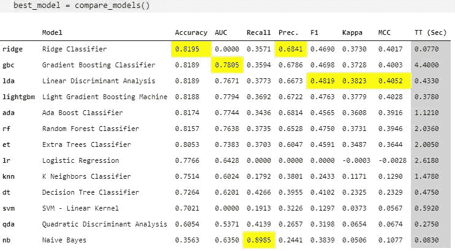
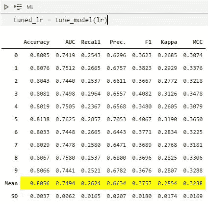
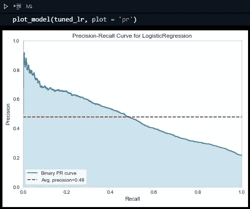
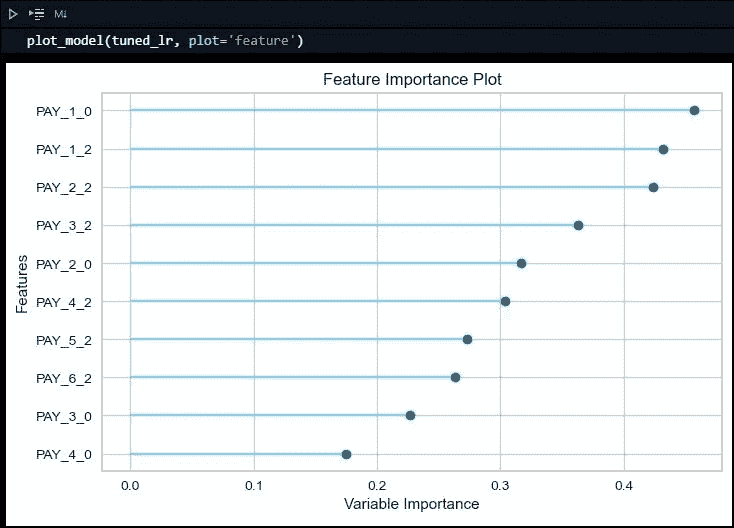
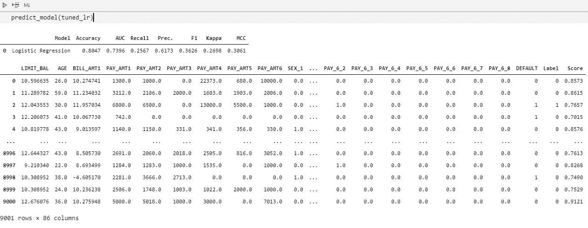
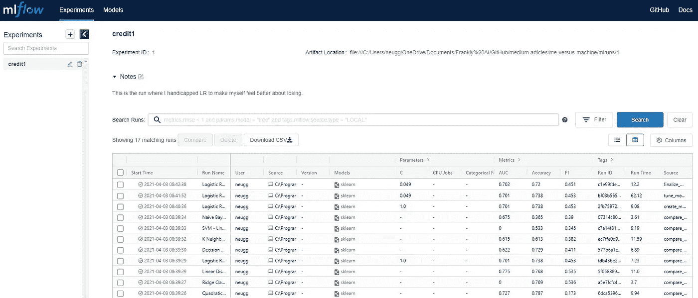

# 我对机器

> 原文：<https://towardsdatascience.com/me-vs-the-machine-2621896f1361?source=collection_archive---------20----------------------->

照片由 [Unsplash](https://unsplash.com?utm_source=medium&utm_medium=referral) 上的[静止不动](https://unsplash.com/@stillnes_in_motion?utm_source=medium&utm_medium=referral)

## 我能打败 PyCaret AutoML 吗？

我天生是一个好胜的人(或者说是后天培养的，你来选)，我不禁想知道我是否能在机器学习方面击败 [PyCaret](https://pycaret.org/) 。只有一种方法可以找到答案——参加比赛！

## 规则

考虑到我有多么想打败机器，我的偏见已经几乎压倒一切，这意味着我需要建立一些基本规则，以便这是一场至少公平的战斗(我想 PyCaret 现在正在咯咯地笑)。以下是基本规则:

*   向两个竞争者提供相同的数据
*   “开箱即用”设置将与 PyCaret 一起使用(至少给我一个机会，稍后会详细介绍)
*   我不会用任何可笑的策略来挤出分数

## 问题是

我稍后参考的书中有一个非常简单的信用卡违约数据集，非常适合这个竞争，因为它是一个小集合(所以我不必等待拟合模型和进行预测)，并且目标是不平衡的，这使它成为一个很好的测试。另外，我已经对这个数据集做了一些基本的建模；理论上，这是一个盲测，但我打赌我会修改我的原始作品。更重要的是，PyCaret 在他们自己的教程中使用了相同的数据集[(我不确定他们的数据来自哪里，但它和我的一样，这才是最重要的)。](https://github.com/pycaret/pycaret/blob/master/tutorials/Binary%20Classification%20Tutorial%20Level%20Beginner%20-%20%20CLF101.ipynb)

## 数据

我要先走了。我在数据上运行了 Pandas Profiling，这对我来说并不罕见，并为我的 EDA 和功能工程提供了有用的见解。

一些基础知识:

作者图片

BILL_AMT 变量(2–6)确实需要删除。但除此之外，最初的观点并没有揭示什么惊天动地的东西。

我不必担心丢失值，虽然我通常会考虑零(由 Pandas Profiling 标记)，但当我最初处理这个数据集时，我没有对它做任何事情，为了忠实于我的原始工作，我将离开它。

AGE、LIMIT_BAL 和 BILL_AMT1 都有偏差。我应用了一个对数函数来归一化这些值。

我还删除了 ID 列，因为它对数据没有任何用处(不需要显示简单的 Python 代码)。

## 建模

我指定我的 X 和 y，使用一个简单的 train_test_split，然后创建一个逻辑回归模型(使用 sklearn.linear_model。线性回归)。

最后，我测试模型并输出一些度量。

战书已经放下了。你准备好迎接挑战了吗(特别是因为我并没有真的很努力)？

# 皮卡雷的回合

作为一个作家，好消息是我现在没什么好解释的。我安装了 PyCaret，然后做了一个默认的分类器设置(注意这里还有`pycaret.regression`)。如果你看看缺省值，PyCaret 也没有很努力(没有对不平衡数据进行修复，也没有进行规范化)。我认为 PyCaret 在玩“绳子是毒品”——我就是毒品。

之后运行模型就简单了。单行代码是:

最佳模型=比较模型()

老实说，从易用性的角度来看，这是非常惊人的。PyCaret 实际上只是在炫耀它对那行代码做了多少工作。看看那些模型和分数。干得好 PyCaret，干得好。

作者图片

但是如果我把注意力放在直接竞争的逻辑回归上，我得到了 **.7962** ，PyCaret 得到了 **.7766** 。

作者图片

当然 PyCaret 生成了**十二个**附加型号**其中七个**碾压矿。所以虽然我赢了，但我绝对是以压倒性优势输了。

## 调整模型

对模型进行调优可能意味着很多事情，但通常涉及数据(重新)处理、特征工程和(特别是)超参数调优的混合。在 PyCaret 中，我可以隔离其中一个模型(例如，逻辑回归)并作为 PyCaret 来调整它。这需要长达两行的代码:

第二行代码为 PyCaret 生成了致胜的一击(请耐心等待，让我体会失败的痛苦):

作者图片

此外，PyCaret 用单行代码产生了一些非常好的视觉效果。

作者图片

作者图片

作者图片

如果所有这些还不够，雪上加霜的是，PyCaret 还评估了自己的结果。这也是用两行代码完成的。

这也有一个非常好的输出格式，显示预测和每个预测的分数。

作者图片

最后，PyCaret 有一个内置的工具来使用 MLflow 跟踪实验运行。是的，它只用了一行代码`!mlflow ui`就运行了。那一行代码在 [http://localhost:5000](http://localhost:5000) 上启动了一个 web 服务器(注意:我展示的是我创建的一个“有缺陷”的 LR 模型实验，它的准确度分数较低，只是为了让自己感觉更好。)

作者图片

这变得越来越丑陋了…但这是 PyCaret 的荣誉。

## 我应该在“真实世界”中使用这个吗？

使用 PyCaret 可以轻松完成很多事情(比如实验跟踪和多模型比较)。我相信使用它比使用底层算法更相似，而不是不同——您必须理解和调整 PyCaret 的参数，这为您提供了几乎与它所理解的每个算法一样多的灵活性。但是，即使你不想这样做，使用基线，然后微调最好的算法是一个很好的方式来启动或验证你的工作。

换句话说，对我来说，我承认输给了 PyCaret，这确实是一个胜利，因为我因此成为了一名更好的数据科学家。

## 参考资料:

*Python 预测分析实践:掌握从问题定义到模型部署的完整预测分析流程*

[1] PyCaret，[二进制分类教程(CLF101) —初级初学者](https://github.com/pycaret/pycaret/blob/master/tutorials/Binary%20Classification%20Tutorial%20Level%20Beginner%20-%20%20CLF101.ipynb) (2020)，PyCaret on GitHub

[2] PyCaret，[二进制分类教程(CLF102) —一级中级](https://github.com/pycaret/pycaret/blob/master/tutorials/Binary%20Classification%20Tutorial%20Level%20Intermediate%20-%20CLF102.ipynb) (2020)。GitHub 上的 PyCaret

[3] Fuentes，a,《预测分析过程》。在*Python 预测分析实践中:掌握完整的预测分析流程，从问题定义到模型部署* (2018)，Packt 发布