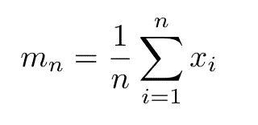
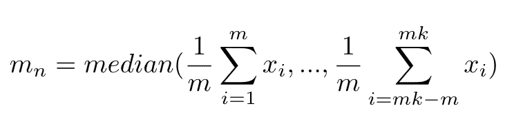
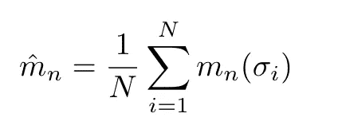
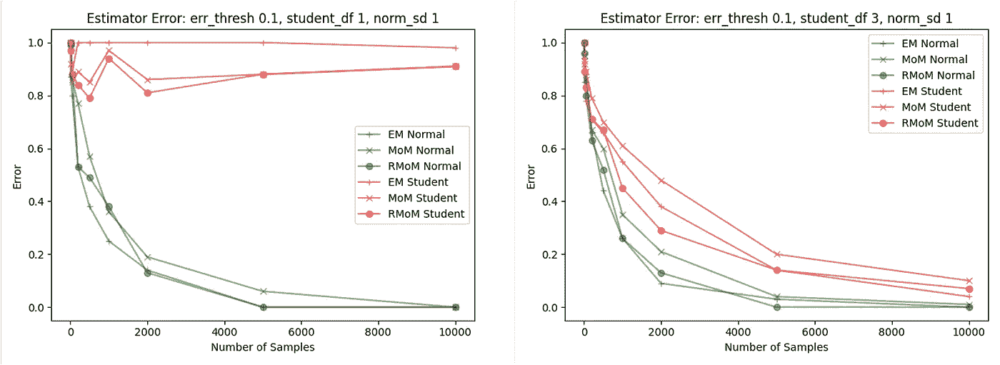

# 均值估计:均值的中位数

> 原文：<https://towardsdatascience.com/mean-estimation-median-of-means-6be322ef8d85?source=collection_archive---------24----------------------->

## 算术平均很无聊…而且经常错！这是你的选择。


弗兰基·查马基在 [Unsplash](https://unsplash.com?utm_source=medium&utm_medium=referral) 上拍摄的照片

如果我们把它分解，机器学习又回到了进行统计推断。推断是指根据一个未知分布生成的样本，对该未知分布做出陈述。因此，均值估计是统计推断和机器学习的基本问题之一。我们研究从一些未知分布中抽取的样本，旨在了解原始人口集中在哪里。一旦发现这一点，我们就可以继续学习更多关于数据生成过程的知识。

应用于样本的经验均值是总体均值最常见和最直接的估计量。它的易用性令人信服。



简单算术平均数

对于大多数学生来说，算术平均数肯定是他们在教育生涯中看到的第一个方程。那么这个估计量怎么可能是错的呢？嗯，看情况。

让我们看一个简单的例子。我们生成一个由标准高斯分布生成的总体。然后，我们从同一分布中随机抽取 100 个数据点，计算算术平均值作为总体平均值的估计值。不出所料，我们的估计接近完美。我们用 0.0004 的平方误差表示。

```
import numpy as np
import randomnp.random.seed(1813)population = np.random.normal(loc=0, size=1000, scale=1)
sample = random.choices(population, k=100)print(np.mean(population))
print(np.mean(sample))
print((np.mean(population)-np.mean(sample))**2)
```

所以让我们继续，总是使用算术平均值，对吗？我们测试并验证了它的性能。这是有道理的，因为每个人都在使用它，对不对？…当然不是！这种良好的性能是由于生成数据的分布非常干净。但现实远非高斯。让我们看一个稍微复杂一点的例子。

```
population = np.random.standard_t(df=1, size=1000)
sample = random.choices(population, k=100)

print(np.mean(population))
print(np.mean(sample))
print((np.mean(population)-np.mean(sample))**2
```

现在情况看起来很不一样。对于 Student-t 分布，我们表示误差平方为 5.806。样本 Student-t 分布的厚尾可能导致样本中出现大量极值。这损害了估计性能。那么我们如何解决这个问题呢？

## 均值估计量的中位数

均值中值(MoM)估计器是解决上述问题的一种方法。给定一个数据样本，MoM 估计器打乱数据点，然后将它们分成 k 组 m 个数据点。然后计算每组的算术平均值。最后，我们计算得到的 k 个算术平均值的中值。



平均值

这种技术通过分割数据并仅考虑结果子估计的中值来减少异常值对最终估计的影响。让我们看看这个改进的估计器在前面的例子中表现如何。

我们可以将同一示例的平方误差降至 0.730。这是对算术平均值 5.806 的重大改进。

然而，每种技术都有其弱点。MoM 取决于我们最初分割数据的方式。想象一下这样一种情况，数据中的所有极端值都被随机分类到一个单独的子组中。虽然不太可能，但作为数据科学家，我们绝不希望如此高度地依赖纯粹的机会。

[*你可以在我的回购里找到从头实现。*](https://github.com/jakobap/Median-of-Means-Estimator/blob/443c41d2d83c6fc199de226fea01fe4b867da820/MoM.py#L26-L45)

## 均值估计的排列不变中位数

众所周知，期望值是每个统计学家的朋友。因此，让我们将矩量法视为依赖于数据样本特定排列的随机变量。这种方法还有一个问题。为了精确计算这个估计量，我们需要计算每个可能的样本排列的矩量法。那就是 n 了！妈妈去计算。还不够性感！

简单来说，我们可以通过接近它的东西来估计实际的置换不变矩量法。为此，我们可以固定一个数字 N，作为我们要随机抽样的排列数。



近似的置换不变矩量法

根据我们的运行示例测试这个估计器，得到的误差平方为 0.332。成功！我们能够进一步提高我们的估计。是时候走出幼儿园，在实验方面变得更大胆一点了。

```
def _rob_median_of_means(seq, n):
    res = [_median_of_means(seq, 10) for _ in range(n)]
    return np.mean(res)

print(_rob_median_of_means(population, 10))
print(np.mean(population))
print((np.mean(population)-_rob_median_of_means(population, 10))**2)
```

[*你可以在我的回购里找到从无到有的实现。*](https://github.com/jakobap/Median-of-Means-Estimator/blob/443c41d2d83c6fc199de226fea01fe4b867da820/MoM.py#L47-L49)

## 更大规模的评估基准

虽然我们有了基本的了解，但我们需要更好地理解这些估计量的行为。因此，让我们观察他们的性能依赖于不同的样本大小和数据生成过程。这些图显示了引入的估计量的测试性能。给定各种各样的样本大小和分布形状来测量性能。算术平均值称为 EM。MoM 和置换不变 MoM 被称为 MoM 和 RMoM。此外，绿色曲线显示了标准高斯函数的估计性能，红色曲线表示了 Student-t 数据生成过程的性能。



均值估计基准

[*在我的 repo 中找到这个实验的从头实现。*](https://github.com/jakobap/Median-of-Means-Estimator)

结果产生了一些令人满意的见解。正如所料,( R)矩优于厚尾分布的算术平均值。毫不奇怪，算术平均值很难接近高斯分布。然而，我们可以自信地声明,( R)MoM 可以保持算术平均估计性能。

总之，均值估计是一个挑战，我们可以在实验室环境中很好地解决。然而，一旦分布不再正常，挑战可能会变得越来越困难。尤其是异常值可能会严重影响最常见的均值估计的性能。平均值代表了这个问题的许多选择之一。虽然矩量法有其自身的缺陷，但它确实在大多数不正常的情况下提高了估计性能。此外，计算复杂性是可控的数据排列的数量，我们希望包括在内。因此，你为什么不在你的下一个模型中尝试一下呢？