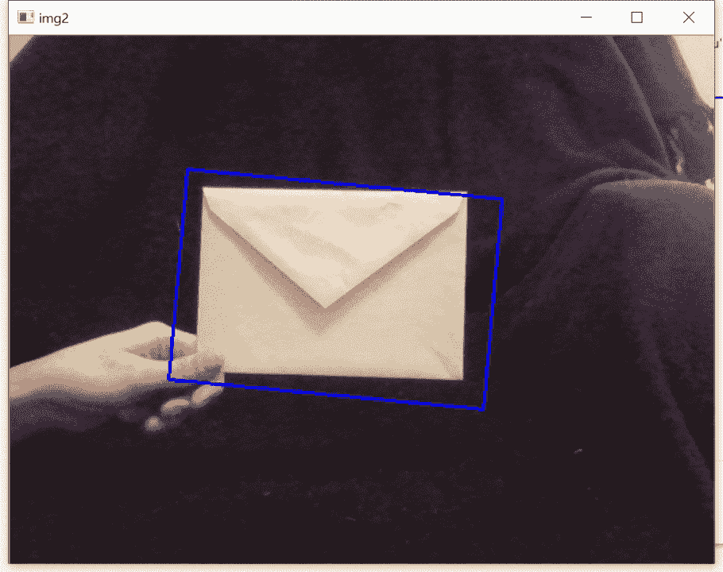

# 均值漂移和凸轮漂移目标跟踪

> 原文：<https://towardsdatascience.com/mean-shift-and-cam-shift-object-tracking-f1c2c515b6bc?source=collection_archive---------14----------------------->

## 使用 OpenCV 和 Python 按颜色跟踪对象


凯文·穆勒在 [Unsplash](https://unsplash.com?utm_source=medium&utm_medium=referral) 上的照片

目标跟踪是计算机视觉最需要的功能之一。不幸的是，这也是计算机视觉最难实现的方面之一。

不仅需要识别对象，还需要足够快地识别它，以便在它移动时实时渲染。物体可能会改变方向或改变它与摄像机的距离，这使事情变得更加复杂。

虽然在计算机视觉中仍然是一个严峻的挑战，但均值漂移和凸轮漂移算法提供了一个简化的解决方案。这些方法主要使用颜色数据而不是结构数据，可以在正确的条件下有效地跟踪对象。

# 均值漂移背后的理论

均值漂移算法实际上是一个与[聚类](https://en.wikipedia.org/wiki/Mean_shift)相关的更广泛的统计概念。与大多数其他聚类算法一样，均值漂移算法试图在数据集中寻找数据点或聚类高度集中的位置。

该算法在每个数据点放置一个[核](https://en.wikipedia.org/wiki/Kernel_(statistics))，并将它们加在一起，得到一个[核密度估计(KDE)](https://en.wikipedia.org/wiki/Kernel_density_estimation) 。KDE 将有波峰和波谷，分别对应于数据点密度高和低的位置。

该算法获取数据点的副本，并在单次迭代中将这些点少量移动到它们最近的 KDE 峰。该算法将继续迭代移动这些点，直到这些点不再移动太多。这有助于简化数据并使聚类更加明显。

那么这和计算机视觉有什么关系呢？想象一道彩虹，如下图所示:


照片由 [Isaac Quesada](https://unsplash.com/@isaacquesada?utm_source=medium&utm_medium=referral) 在 [Unsplash](https://unsplash.com?utm_source=medium&utm_medium=referral) 上拍摄

图像可能被分解成 [HSV 颜色空间](https://en.wikipedia.org/wiki/HSL_and_HSV)，本质上把它变成一个大数据集。制作 KDE 时，天空中彩虹和蓝色的每一种颜色都会形成一个山峰。迭代移动点时，通过消除颜色之间的细微褪色，彩虹的每种颜色都会变得更加明显。因此，每个条纹变得更容易被计算机识别。

这个过程是[图像分割](https://en.wikipedia.org/wiki/Image_segmentation)的一种形式。

为了进一步理解这个概念，如果需要识别彩虹中的特定颜色，均值漂移算法可以使它更容易被看到。如果需要跟踪这种颜色，彩虹视频的每一帧都将实时接受该算法。

对于一个更现实的例子，想象一场网球比赛的俯视图。球场、球员和亮黄色的球都有一个 KDE 峰。如果球需要被跟踪，均值偏移算法将使亮黄色像素的质量更加明确，并在球在球员之间移动时在每一帧跟踪它。

# 凸轮换挡背后的直觉

在实现均值漂移算法之前，需要建立一个初始跟踪框。随着均值移动算法迭代地移动点，跟踪框将移动，直到包围感兴趣的对象。

不幸的是，如果对象改变大小或方向，跟踪框不会适应这种变化。cam shift(连续自适应均值漂移)算法解决了这个问题。

凸轮移动算法的工作方式与均值移动非常相似，它只是简单地调整跟踪框，以便跟踪框可以改变大小甚至旋转，从而更好地与被跟踪对象的运动相关联。

# 均值漂移和凸轮漂移的优缺点

与深度神经网络或其他识别方法不同，均值漂移和凸轮漂移不需要任何训练。如果需要跟踪一个网球，就不需要向算法提供成百上千个网球的标记图像。相反，该算法分析网球的初始颜色输入，并在其剩余的生命周期中立即跟踪它。

遗憾的是，均值偏移和凸轮偏移仅适用于颜色分析。如果被跟踪的对象在颜色或纹理上变化很大，则跟踪会更困难。同样，如果图像或视频的背景“繁忙”或“嘈杂”,颜色变化很大，它可能会与被跟踪的对象发生冲突。

最终，均值漂移和凸轮漂移在受控环境下效果最佳。例如，通过仓库或装配线跟踪统一颜色包装的产品可能非常适合这些算法。

# 凸轮换档的实现

由于 cam shift 是两种算法中更健壮的一种，因此将更详细地解释它在 python 和 OpenCV 中的实现。然而，在这里可以找到关于实现均值漂移的简要介绍[。](https://opencv-python-tutroals.readthedocs.io/en/latest/py_tutorials/py_video/py_meanshift/py_meanshift.html)

```
import numpy as np
import cv2
```

唯一需要的两个库是 NumPy 和 OpenCV。前者有助于有效的计算，后者提供了许多用于计算机视觉的工具。

```
# initialize video from the webcam
video = cv2.VideoCapture(0)# Read the video
cap, frame = video.read()
```

第一行只是激活网络摄像头(如果有摄像头的话)。read 方法实际上捕获了两条重要的信息:

1.  cap 变量，它指示摄像机是否成功捕获了一帧
2.  帧变量，它是来自摄像机源的实际静止图像或帧

```
# set up initial coordinates for the tracking window
x, y = 0, 0
# Set up initial size of the tracking window
height, width = 25, 25
track_window = (x,y,width,height)# set up region of interest (roi)
roi = frame[y:y + height, x:x + width]
```

下一部分建立初始感兴趣区域(ROI ),它只是屏幕上显示被跟踪对象的区域。

x 和 y 变量是框架内的坐标。在这个例子中，使用坐标(0，0 ),因为一旦摄像机开始流动，很容易找到坐标。

高度和宽度表示 ROI 的大小。ROI 的大小至少与被跟踪对象的大小大致对应，这一点非常重要。

track_window 变量存储 roi 的位置和大小，ROI 变量实际上使用拼接器来截取与 ROI 相对应的帧的一小部分。

无论摄像机在这个 ROI 中“看到”什么，都将决定它跟踪的颜色范围。例如，如果一个红色的球在这个初始 ROI 中，算法将知道在其余的馈送中跟踪一个红色的对象。

然而，如果球的一部分在 ROI 之外，并且捕获了更多的白色背景，则该算法将更有可能跟踪白色物体。在这个初始 ROI 中捕获正确的对象对于确保其正常工作至关重要。

提示:当我在学习如何做这个的时候，我“作弊”了，把感兴趣的物体举得离相机很近，这样整个屏幕都被填满了。这迫使算法读取正确的颜色信息，不管我使用的初始参数是什么。然而，这对于大多数应用来说是不实际的。

```
# apply mask
hsv_frame =  cv2.cvtColor(frame, cv2.COLOR_BGR2HSV)
mask = cv2.inRange(hsv_frame, np.array((0, 20, 20)), np.array((180, 250, 250)))
hist_frame = cv2.calcHist([hsv_frame], [0], mask, [180], [0,180])
cv2.normalize(hist_frame, hist_frame, 0, 255, cv2.NORM_MINMAX)
```

接下来的几行代码将帧转换到 HSV 颜色空间，并应用“蒙版”,它只是寻找符合特定范围的像素值。

在应用蒙版和归一化值之后，为该帧计算直方图。这用于计算算法将向前跟踪的颜色。

```
# Setup the termination criteria: 10 iteration 1 pxl movement
term_crit = (cv2.TERM_CRITERIA_EPS | cv2.TERM_CRITERIA_COUNT, 10, 1 )
```

获取初始值后，需要建立终止标准。回想一下，均值偏移和凸轮偏移都是连续移动点的迭代函数，必须建立某种标准来停止其迭代并返回一组最终值。

如果发生以下两种情况中的任何一种，上面的行将停止迭代:

1.  ROI 的质心没有移动，或者
2.  迭代次数超过 10 次

第一个标准很直观。如果一个物体正在被跟踪，它没有移动，没有必要运行算法。ROI 没有变化，所以不需要重新计算。这样做只会浪费计算能力。

第二个标准更关注性能。理论上，更多的迭代会渲染出更精确的 ROI 然而，更多的迭代需要更多的时间来运行。设置高于 10 的限制可能会构建更好的边界框，但结果会滞后。

```
while True:

    cap, frame = video.read() if cap == True:
        hsv = cv2.cvtColor(frame, cv2.COLOR_BGR2HSV)
        dst = cv2.calcBackProject([hsv],[0],hist_frame,[0,180],1)
```

第一行开始一个无限循环，因为摄像机将无限地流动，直到触发退出命令。

下一行和前面一样，从摄像机中读取数据。以下 if 语句检查以确定摄像机是否成功捕获了一帧。

最后两行将帧转换到 HSV 颜色空间，并使用[直方图反投影](https://opencv-python-tutroals.readthedocs.io/en/latest/py_tutorials/py_imgproc/py_histograms/py_histogram_backprojection/py_histogram_backprojection.html)来查找哪些像素最符合在初始 ROI 中捕获的对象的颜色。

```
 # apply camshift to get the new location
        ret, track_window = cv2.CamShift(dst, track_window, term_crit)
```

OpenCV 有一个内置模块来应用它，而不是从头开始实现 cam shift 算法。这将返回新 ROI 的大小和坐标。

```
 # Draw a box around the ROI
        pts = cv2.boxPoints(ret)
        pts = np.int0(pts)
        img2 = cv2.polylines(frame,[pts],True, 255,2)
```

最后，在 ROI 周围画一个方框，直观地表示出来。

```
 cv2.imshow('img2',img2) # Use the q button to quit the operation
        if cv2.waitKey(60) & 0xff == ord('q'):
            break else:
        breakcv2.destroyAllWindows()
video.release()
```

图像实时显示在第一行。下一行只是创建一个退出条件。如果键盘上的字母“q”被按下，它会中断循环并退出视频。

同样，如果摄像机突然无法成功捕获视频，它也会中断循环。

最后，在最后两行中，所有相关的窗口都被关闭，摄像机停止流动。

如果一切顺利，最终结果应该是这样的:



凸轮移位算法在行动，跟踪一个信封。作者制作的视频。

请注意，当封套离相机越来越远时，边界框的大小是如何增大和减小的。它还会随着信封一起旋转，甚至会在翻转时压缩。

# 结论

均值移动和凸轮移动算法都是非常有用和强大的工具，用于对象跟踪。特别是后者，可以随着对象旋转或改变与相机的距离而移动其 ROI。结果是一种稳健的跟踪方法。

使用颜色作为主要的识别方法，这两种算法都不能识别具有特定形状的东西，这使得它不如其他方法强大。同样，复杂或嘈杂的背景会使识别更加困难。然而，作为一种折衷，使用颜色允许立即实现，而不需要训练模型。

要么在受控、光线充足的环境中工作良好，并提供有效的对象跟踪方法。