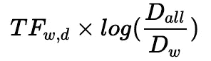
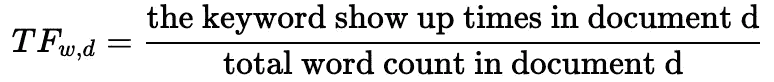
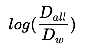
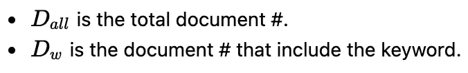
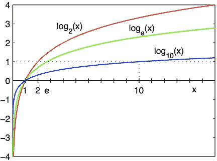
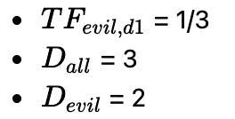
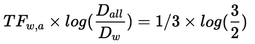
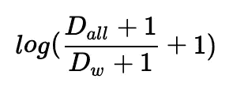
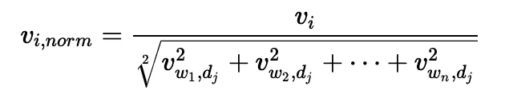
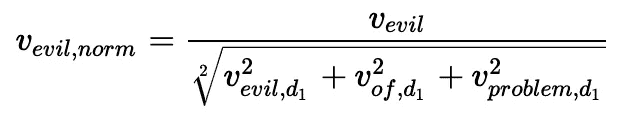

# 使用 Python 和 scikit-learn 中的 TF-IDF 测量文本重量

> 原文：<https://towardsdatascience.com/measure-text-weight-using-tf-idf-in-python-plain-code-and-scikit-learn-50cb1e4375ad?source=collection_archive---------8----------------------->

## 我们如何使用 TF-IDF 为文本数据赋予权重，并找出为什么 scikit-learn 的结果与教科书中的公式不同


我的儿子安德鲁·朱，查尔斯的乐高积木

在处理文本数据时，我们希望衡量一个单词对全文集合中的一个文档的重要性。一个最直观的解决方法就是计算单词的出现次数，越高越好。但是简单地计算字数会导致有利于长文档/文章的结果。毕竟，较长的文档包含更多的单词。

我们需要另一种解决方案，能够恰当地衡量一个单词在整个上下文中的重要性。 **TF-IDF** 是有效的解决方案之一。也是像谷歌这样的现代搜索引擎的支柱。

**TF-IDF** 的核心思想是，解决方案不仅衡量词频，还衡量单词在整个上下文中的重要性。

例如，像“是”、“the”、“and”这样的词几乎出现在每个文档中， **TF-IDF** 会降低那些常见词的权重，增加那些真正重要的词的权重。

## TF-IDF 公式

假设我们有一个巨大的 Python 文本数据库，其中包含三个文档:

```
text_db = ['problem of evil',
           'evil queen',
           'horizon problem']
```

我们可以使用这个公式来计算某个文档中某个单词的 TF-IDF 值。



**TF_w，d** 代表某个 **d** 文件中 **w** ord 的 **T** erm **F** 频率:



而日志部分:



代表**I**v**D**文件 **F** 频率。这里的**反转**表示该部分将反转词频值，从而给那些频繁使用的词一些低值。



例如，您总共有 100 个文档，其中 10 个包含关键字。那么 IDF 部分就会是 log(D _ all/D _ w)= log(100/10)= log(10)= 2.3(e 基数)。如对数曲线所示，关键词在整体上下文中显示的位置越低，产生的 IDF 值就越高。



[https://en.wikipedia.org/wiki/Logarithm](https://en.wikipedia.org/wiki/Logarithm)

## 手动计算关键字“evil”的 TF-IDF 值

比方说，我们想获得文档 1 中关键字 **evil** 的 TF-IDF 值(“邪恶的问题”)。

应该很容易看到**恶**出现 1 次，一共 3 个字；数据库中的 3 个文档，其中 2 个包含 **evil** 关键字。所以，



我们一起得到了结果:



在 Python 中

```
import math
tf_1_evil       = 1/3
D_all           = 3
D_evil          = 2
tf_idf_evil     = tf_1_evil * math.log(D_all/D_evil)
print(tf_idf_evil)
```

打印结果:

```
0.135
```

## 通过 scikit-learn 计算 TF-IDF

Scikit-learn 提供了一种快速计算 TF-IDF 矩阵便捷方法。

```
import pandas as pd 
from sklearn.feature_extraction.text import TfidfVectorizer
vec = TfidfVectorizer()
text_db = ['problem of evil',
          'evil queen',
          'horizon problem']
tf_idf =  vec.fit_transform(text_db)
print(pd.DataFrame(tf_idf.toarray(), columns=vec.get_feature_names()))
```

结果。

```
 evil   horizon        of   problem     queen
0  **0.517856**  0.000000  0.680919  0.517856  0.000000
1  0.605349  0.000000  0.000000  0.000000  0.795961
2  0.000000  0.795961  0.000000  0.605349  0.000000
```

等等，你可能会问，安德鲁，你在跟我开玩笑吗？文件 1 的**恶** TF-IDF 值(索引显示为 0)为`0.517856`。这里出了什么问题？

## 与 scikit-learn `TfidfVectorizer`实施的区别

scikit-learn 的`TfidfVectorizer`的实现有两个不同之处，使得结果不同于大多数教科书中存在的上述公式，你的教授告诉过你。

首先，sklearn 使用不同版本的 **IDF** 公式，将 **1s** 添加到分子和分母，以避免被零除的情况。 **TF** 不变。



其次，sklearn 在文档级用欧氏范数平滑 TF-IDF 结果。



在计算第一个文档中的**恶**值的情况下(“恶的问题”)，公式为:



现在，让我们重塑 Python 代码，以反映上述两个变化:

```
import math
tf_1_problem    = 1/3
tf_1_of         = 1/3
tf_1_evil       = 1/3
D_all           = 3
d_problem       = 2
d_of            = 1
d_evil          = 2
tf_idf_problem= tf_1_problem * (math.log((D_all+1)/(d_problem+1))+1)
tf_idf_of       = tf_1_of * (math.log((D_all+1)/(d_of+1))+1)
tf_idf_evil     = tf_1_evil * (math.log((D_all+1)/(d_evil+1))+1)
denominator     = math.sqrt(tf_idf_problem**2 
                            + tf_idf_of**2 + tf_idf_evil**2)
result = tf_idf_evil/denominator
print("evil result:",result)
```

邪恶的 TF-IDF 值**与 scikit-learn 产生的值**完全相同。

```
evil result: 0.517856
```

## 链接和书籍

*   术语特异性的统计解释及其在检索中的应用，

琼斯在 1972 年首次提出了 TF-IDF 的概念。

*   [Python 数据科学手册——特征工程](https://jakevdp.github.io/PythonDataScienceHandbook/05.04-feature-engineering.html)作者杰克·范德普拉斯
    [https://jakevdp . github . io/Python datascience Handbook/05.04——特征工程. html](https://jakevdp.github.io/PythonDataScienceHandbook/05.04-feature-engineering.html)

Jake 在“特征工程”一章中简要介绍了 TF-IDF，他没有深入研究 TF-IDF 的用法，但他提供了使用 scikit-learn 计算 TF-IDF 值的最佳 Python 代码。本文中使用的包含 3 个文档的示例文本数据库来自这本书。

*   [数学之美](https://book.douban.com/subject/10750155/) by Wu Jun [https://book.douban.com/subject/10750155/](https://book.douban.com/subject/10750155/)

本书由前谷歌研究员、前腾讯副总裁吴军博士用中文撰写。这本书对 TF-IDF 算法做了很好的介绍。

*   ["Sklearn 的 TF-IDF" vs "Standard TF-IDF"](/how-sklearns-tf-idf-is-different-from-the-standard-tf-idf-275fa582e73d) 作者 siva kar Sivarajah
    [https://towardsdatascience . com/how-sk learns-TF-IDF-is-different-from-the-the-Standard-TF-IDF-275 fa 582 e73d](/how-sklearns-tf-idf-is-different-from-the-standard-tf-idf-275fa582e73d)

多亏了 Sivakar，这篇文章展示了在 scikit-learn from 传统教科书中 TF-IDF 实现的不同之处。

Medium 不支持 LaTex 或数学公式输入。把那些数学公式放在一篇文章里是很痛苦的，即使使用复制的图片看起来也很糟糕。在这里，我以纯 HTML 格式将内容放在一起。

[http://zhusd.com/understand_tfidf_in_python](http://zhusd.com/understand_tfidf_in_python)

如果你看到什么，欢迎评论并纠正我。谢谢你阅读它。