# 概率论中的测度论

> 原文：<https://towardsdatascience.com/measure-theory-in-probability-c8aaf1dea87c?source=collection_archive---------7----------------------->

## 走向严格概率

> 关于概率有一件非常有趣的事情:一切似乎都是那么显而易见，但当我们更深入地研究它时，突然发现我们实际上并不理解它。

图片来自 [Unsplash](https://unsplash.com/photos/7PYMaEQKHuc)

这篇文章是[上一篇关于测度理论的文章](/lebesgue-measure-and-integration-64f5c45d7888?sk=67a729e974f54cc6a5227bf694f67e9b)的延续，但是我认为直接阅读这篇文章没有问题，除了有时候需要参考另一篇文章。

在我们学习概率的早期阶段通常遇到的概率分布是均匀分布。*一致*意味着所有事件发生的概率相同。当我们掷出一个六面骰子时，每个数字出现的概率是 1/6，它们加起来是 1，和预期的一样。

然而，在均匀分布中有几种反直觉的情况。*第一件诡异的事*:当我们考虑在长度为 6 的实线上扔一个微小的球的情况时，球击中任意特定点的概率是多少，是 1/6 吗？答案是否定的，因为事实上，它是零。这意味着球不可能击中任何特定的点。*第二件怪事*:如果球击中任何特定点的概率为零，那么所有这些概率的总和就不是一。*第三件怪事*:考虑长度为 1/6 的直线，每个点的概率密度为 1 / (1/6) = 6(由均匀分布的概率密度函数定义)大于 1——

> 概率密度不是概率。

这表明了引入数学困难的必要性，因为像上面讨论的反直觉现象不能仅仅通过直觉来研究。在这篇文章中，我们将着眼于“数学困难”——测量理论。

# 测量直觉

度量是我们从小学就非常熟悉的概念的延伸，即欧几里得空间中的长度、面积和体积。这些想法简单而直观，它们量化了形状的大小。

然而，它们展示了测度理论中一个非常基本的性质，即*可加性*。这是指，例如在图 1.1 中，整个截面的长度等于两个分段(a + b)之和，整个矩形的面积等于两个子矩形(S₁ + S₂).)之和

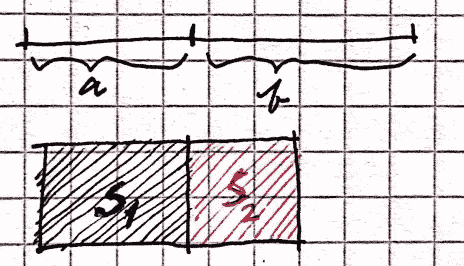

图 1.1 测量的直觉

为什么会这样呢？因为子部分或子区域是**不相交的**，如果它们重叠，显然前述结论将不成立。当这种可加性扩展到无限多个这样的几何对象时，我们称之为**【西格玛可加性】**。在正式定义度量之前，有一件重要的事情需要注意

> Measure 是一个函数，但我们有时也用它来指代这个函数的输出。

当输入是截面时，它输出长度，当输入是形状时，它输出面积，等等。

# 概率公理

测度理论扩展并形式化了我们对区域面积的直观认识。将测度论集成到概率论中，使不确定性程度的直观想法公理化——它使用测度论的力量来度量不确定性。

在介绍 Kolmogorov 概率公理之前，需要澄清一些概念。第一个也是最基本的是σ-场(或σ-代数)。它是一种代数结构，粗略地说，是一个非空集，上面定义了运算和公理。设𝔉是另一个集合ω的子集的集合，即𝔉是𝓟(ω的子集)(ω的幂集)。我们称𝔉 **代数**如果它在*有限并*和*互补*下是闭的(根据德摩根定律，𝔉在有限交下也是闭的)。如果我们用*可数并*代替有限并(这个更严格。因此所有σ-代数都是代数，但反之亦然)，𝔉是一个**σ-代数**。

包含𝓐的最小σ-代数由**σ(**𝓐**)**(𝓐生成的σ-代数)表示，其中𝓐是ω的子集的集合。我们通过应用有限并、互补、有限并的互补、互补的有限并等等，将𝓐扩展到σ(𝓐。

平凡σ-代数是仅包含空集和整个样本空间{∅ω}的集合。σ代数的另一个例子是{∅，{a，b}，{c，d}，{a，b，c，d}}。𝓟(ω)也是σ-代数。作为一个真实世界的例子，我们把σ-代数放在掷硬币的上下文中，可能的结果是正面(H)和反面(T)，因此样本空间是ω= { H，T}。让𝓐 = {{T}}。σ(𝓐) = {∅，{T}ᶜ，{T}，ω} ={∅，{H}，{T}，{H，T}}，其中这个集合中的每个元素都是一个*事件*。如果我们有两个硬币，ωis 由所有可能的结果组成，等于{HH，HT，TH，TT}。

现在我们有了样本空间ω，它在概率的上下文中作为样本空间，还有一个σ代数𝔉.现在唯一缺少度量空间定义的构件是**度量**。如前所述，测度μ是一个函数。它是定义在𝔉上的非负的、扩展的实值函数，使得

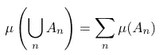

等式 2.1 测度的可加性

三元组(ω，𝔉，μ)被称为*度量空间*(注意“度量空间”是一个完全不同的概念，虽然名字看起来很像。度量空间是其上有度量的集合)。如果μ是可数可加的并且对于𝔉.中的所有元素都是非负的，那么μ是𝔉上的一个*测度*如果μ是一个**概率测度**，也就是说μ(ω)= 1，(ω，𝔉，μ)称为一个**概率空间**。我们知道概率空间实际上是[0，1]上的勒贝格可测空间(参考[勒贝格测度](/lebesgue-measure-and-integration-64f5c45d7888?sk=67a729e974f54cc6a5227bf694f67e9b))。快速检查知识:勒贝格测度是概率测度吗？不是，因为整个空间都是ℝ，ℝ上的勒贝格测度是∞而不是 1。

有了这些知识，Kolmogorov 概率公理变得非常简单。公理被定义在概率空间上，概率测度是概率函数。我们稍微修改概率空间的符号，它变成(ω，𝔉，p)

1.  事件发生的概率 E，P(E)永远不会是负的。这对应于措施的非否定性。
2.  整个概率空间 P(ω)= 1 的概率。这是专门为概率测量定义的。
3.  不相交事件的可加性。这在等式 2.1 中描述。

让我们回到掷硬币的例子。事件是什么，它们的概率是多少？在我们的例子中，{H}和{T}分别代表看到头或尾的事件。我们给它们分配概率 P({H}) = P({T}) = 1/2，在非偏硬币的情况下。∅代表“什么都没发生”的事件。根据概率的公理(测度的性质)，P({H，T}) = P({H}) + P({T}) = 1，这是一个直观的结果——{ H，T}代表要么看到头要么看到尾的事件，当然，其中一个会发生。

# 概率分布

概念分布与**随机变量**密切相关。随机变量的宽松定义是事件的*数字结果*。更正式地说，随机变量是从样本空间(我们知道这是一组事件)到实数集的*可测函数*。考虑抛硬币的例子，可能的结果要么是正面，要么是反面，这就形成了样本空间ω= { H，T}。随机变量可以定义如下:X(H) = 1，X(T) = 0，这意味着看到头的数值结果是 1，看到尾的数值结果是 0。在这种情况下，随机变量也作为*指示器功能*工作。

我们为什么要学这个？答案是，如果我们不将结果转换成数值，我们就无法对其进行任何运算，例如计算期望值和方差。我们还需要这个映射来研究分布，因为谈论没有随机变量的分布有点奇怪。

概率论中的随机变量对应于勒贝格积分中的可测函数。在测度论方面，我们将分布定义为( **R** ，ℛ)上的概率测度，其中 **R** 表示实直线，ℛ是由实直线生成的σ-代数(参考我们之前讨论过的测度空间的定义)。

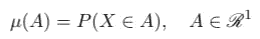

等式 3.1 根据测度论对分布的定义

并且分布函数被定义为

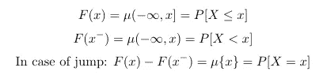

等式 3.2 分布函数

其中 F(x-)给出了左手极限(因为函数 F 是非递减的，例如不振荡，所以左手极限总是存在)。实际上， *F 是一个右连续函数，具有左极限*。下面给出了这样一个函数的例子，当你从右边接近任何一个数时，这个数的极限等于函数值。

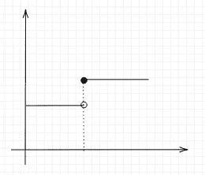

图 3.3 一个右连续函数

这就给了我们累积分布函数，通常是在基础概率里学的。快速捕获:(1)概率分布是一个函数，根据测度理论，它是测度(2) F 是分布，它是用测度定义的。

为了更好地理解这个定义，我们需要将它与一些具体的分布联系起来，这里将以**伯努利**和**二项式**分布为例。我们再来看抛硬币的例子，随机变量 X 定义为 X(H) = 1，X(T) = 0，如果重复实验 n 次，结果形成二项分布。每个试验都服从伯努利分布，这是二项式分布的一个特例(n=1)。

伯努利分布非常简单，它是一个只有两个点的离散分布。随机变量只有两个值，即 1 和 0。他们每个人的概率是μ({1}) = 0.5，μ({0}) = 0.5。“μ”和“P”有时会互换使用，因为它们最终是同一个东西。

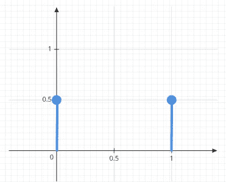

图 3.4 伯努利分布。作者图片

二项分布怎么样？什么是随机变量，图形是什么样的？随机变量 X 定义为一系列 n 次试验中的成功次数(k ),成功率为 p。这意味着 k 是 X 取的具体值，n 和 p 是 X 的分布参数。每个点的概率测度由下式给出

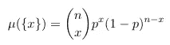

等式 3.5 二项式分布的概率度量。作者图片

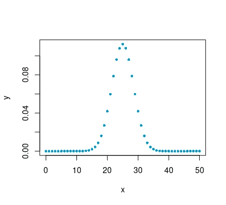

图 3.6 二项式分布。作者图片

现在我们准备解释连续分布有什么问题。为什么每个单点的概率测度为零？这是相当复杂的，但简而言之，在所有实数子集的σ-代数上无法定义任何概率。这是通过划分实数区间(这是一组实数)并构造一个维塔利集来证明的，好的解释见[这里](https://math.stackexchange.com/questions/137949/the-construction-of-a-vitali-set)。结论是，只有当样本空间是区间，即均匀分布时，测量子区间的长度才有意义。因此，在这种情况下，

> σ-代数是 Borelσ-代数——由所有开区间(或者等价地由闭集)组成的σ-代数。

这个在[这个帖子](/lebesgue-measure-and-integration-64f5c45d7888)里也有提到。将此与我们对测度的直观认识联系起来，我们可以看到，真实直线上的概率测度确实给了我们一个长度，而这些点没有**长度**。我们做到了

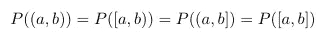

等式 3.7

同样，我们可以看到为什么**可数**可加性很重要:如果第三个公理可以由非可加性满足，那么如果我们把区间上所有点的概率测度加起来，我们会得到零，因为对于区间上所有的 x，μ({x}) = 0。但是，由于所有点构成了整个区间，也就是整个样本空间ω。根据第二个公理，μ(ω)= 0。这就导致了一个矛盾。

# 概率质量、密度和累积函数

以现在所装备的知识，一些容易混淆的概念是可以很容易澄清的。

**概率质量**:这是由概率质量函数给出的，概率质量函数是样本空间**离散的概率空间上的概率度量。**

*(把这个概念想深一点，“离散”究竟是关于什么的？通常与自然数的集合相联系，离散型随机变量总是用自然数而不是有理数来索引。更准确地说，我们感兴趣的值可以从一个有限集或可数无穷集中选取。为什么会这样呢？这个可以用集合论的一些基础知识来回答。自然数和有理数的集合都是可数无穷的，这意味着它们具有相同的维数，或者等价地，这两个集合之间存在一个双射。)*

这意味着概率质量函数给出了随机变量取某个值的概率。

**概率密度**:一个看似令人惊讶的事实——概率密度不是概率(测度)。这是相对的，它相对地告诉我们，随机变量有多大可能等于某个值。在均匀分布的情况下，概率密度在任何地方都是相同的，这意味着，每个值被随机变量采用的可能性是相等的。相对函数是一个概率函数，注意它输出的是连续随机变量的密度而不是概率。

与我们之前讨论的相关，连续分布中每个点的概率应该等于零。然而概率密度却不是这样。所以，显然，概率密度不是一个概率。

**累积函数**:累积函数已经在方程 3.2 中定义。顾名思义，它“累积”了一个随机变量取小于某个值的所有值的概率。为什么我们需要这个概念？这是因为我们有时会遇到既不是绝对离散也不是绝对连续的概率分布——它们可能是两者的组合。在这种情况下，我们不能只用概率密度函数或者概率密度函数来描述。然而，一个累积函数足以处理这种情况。考虑下图所示的累积函数，它既不是离散的也不是连续的。

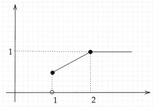

图 4.1 分布的混合示例

累积函数和分布有什么关系？分布函数是累积函数的导数，其中累积函数是可微的。让我们再看一下图 4.1 中的曲线图，累积函数定义为

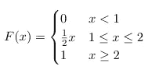

等式 4.2 累积函数

这是直接从图中读取的。概率密度函数怎么样？除了点 1 和点 2，累积函数是可微的。因此，概率密度函数定义为 f(x) = 1/2，对于(1，2)中的 x，其他任何地方为 0。

概率测量很有趣。只有 x=1 的离散部分是非零的，因此我们得到 P({1}) = 1/2(在跳跃的情况下，参考等式 3.2)。

图 4.3

概率分布如图 4.3 所示。我们来检查一下可加性:P({1}) + P((1，2)) = P({1}) + P((1，2))= 1/2+1/2 = 1。(第二个 1/2 是线下区间(1，2)上的面积)。在其他地方，分布是连续的，因此，概率质量为零。

# 期望值

在测度论的语言中，变量 x 在测度空间(ω，𝔉，p)上的期望值被定义为 x 关于测度 p 的积分

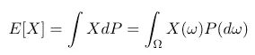

等式 5.1 期望值的一般定义

期望值只不过是随机变量输出的加权平均值。等式 5.1 中的定义乍一看似乎很奇怪。回想一下，我们更熟悉的期望的定义如下

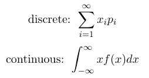

方程 5.2，方程 5.3 期望值的熟悉定义

> 不难看出，等式 5.1 中的定义将两个独立的定义合并在一起。

在不使用测度的情况下，需要单独定义期望值，因为离散分布的样本空间是可数的，而连续分布的样本空间是不可数的。

因此，这两种分布的概率测度定义不同——在*离散分布*的情况下，每个单点的概率由概率**质量**给出，使用*求和*；然而在*连续分布*的情况下，每个点的概率为零，我们使用概率**密度**来计算一个区间上的概率，这意味着我们需要积分。

为什么我们需要这次合并？这个问题相当于“泛化有什么好？”答案很简单。方程 5.1 中的定义相对于单独定义的优势在于，它将简单随机变量(随机变量的值域是有限的，参考[简单函数](/lebesgue-measure-and-integration-64f5c45d7888#:~:text=A%20simple%20function%20is%20a%20function%20that%20can%20be%20imagined%20as%20a%20step%20function%20like%20the%20one%20in%20the%20following%20graph)和[值域](/lebesgue-measure-and-integration-64f5c45d7888#:~:text=namely%20domain%2C%20codomain%2C%20range%2C%20preimage%2C%20and%20image.%20)的概念)和连续随机变量的黎曼积分结合在一起，这允许我们应用一般积分理论来研究它。其他一些重要的概念，如方差、矩等。是使用 expexted 值定义的。如果我们对概率空间和分布有深刻的理解，其他的值也就容易把握了。

*总结:*

在这篇文章中，我们首先快速浏览一下测度的概念，然后用一些基本的例子来介绍概率公理。然后我们试着区分一些常见的概率上的混淆。最后，我们给出了期望值的一般定义。更多关于概率的内容将会陆续推出。

资源:

[1] Dekking，F. M .，Kraaikamp，c .，Lopuhaä，H. P .，和 Meester，L. E. (2005 年)。概率和统计的现代介绍:理解为什么和如何。斯普林格科学&商业媒体。

[2]比林斯利，P. (2008 年)。 [*概率和测度*](https://books.google.cz/books/about/Probability_and_Measure.html?id=z39jQgAACAAJ&redir_esc=y) 。约翰·威利的儿子们。

[【西格玛代数】](https://en.wikipedia.org/wiki/%CE%A3-algebra?oldformat=true)。(2021 年 9 月 4 日)。在*维基百科*。

[4] Ash，R. B .，Robert，b .，Doleans-Dade，C. A .，和 Catherine，A. (2000 年)。 [*概率与测度论*](https://books.google.cz/books?hl=cs&lr=&id=GkqQoRpCO2QC&oi=fnd&pg=PP9&dq=probability+and+measure+theory&ots=EqTBIGELND&sig=_FAF4AfLIc4nwTHGtwt4lj8AvHw&redir_esc=y#v=onepage&q=probability%20and%20measure%20theory&f=false) 。学术出版社。

[一段我写作时总喜欢听的音乐【T13:)](https://www.youtube.com/watch?v=pNJTJrnpbjE&ab_channel=Kassia)