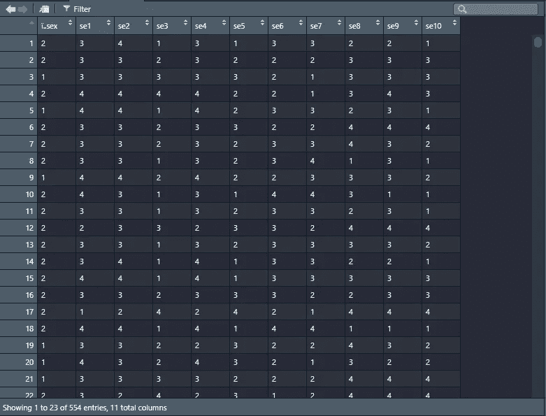
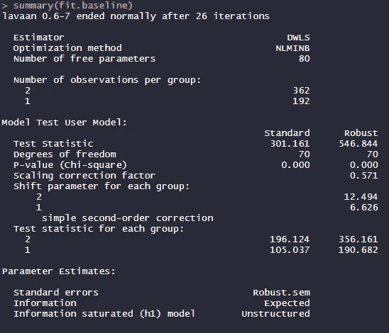
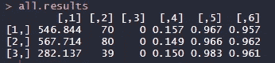

# 测量不变性:R 中的定义和例子

> 原文：<https://towardsdatascience.com/measurement-invariance-definition-and-example-in-r-15b4efcab351?source=collection_archive---------28----------------------->

## 测量不变性如何改进你关于人类受试者的统计推断


查尔斯·德鲁维奥在 [Unsplash](https://unsplash.com?utm_source=medium&utm_medium=referral) 上拍摄的照片

如果你熟悉以人为研究对象的研究，你可能见过一些群体比较的例子。例如，如果我们想要测试一种抗抑郁药的功效，我们可能想要比较性别差异([因为抑郁可能基于性别](https://pubmed.ncbi.nlm.nih.gov/30819248/))。然而，你确定你正在使用的工具(例如[贝克抑郁量表](https://psycnet.apa.org/record/1998-02891-001))对男性或女性具有相同的结构吗？

另一个例子是跨文化研究。我们可以测量国家之间主观幸福感的差异，看看一些国家是否比其他国家更幸福(例如 [Jebb 等人，2020](https://europepmc.org/article/med/32045327) )。但是，如果你不知道你是否能比较潜在变量的量表分数，你怎么能推断你的结果是准确的呢？

> 比较量表得分的一个标准是，所有群体/国家对潜在变量的理解和衡量是相同的。这种特性被称为测量不变性或无偏差。(斯维蒂娜等人，2019)。

建立测量不变性证据的常用统计方法是通过多组验证性因素分析(MG-CFA)。在 MG-CFA 中，我们使用一组分层测试对组间感兴趣的参数施加约束。基本上，测试了三个级别的不变性。

1.  结构不变性:检验组间因素结构是否相同。如果没有发现结构不变性，这意味着项目对不同的组加载不同的因素。
2.  度量不变性:测试项目的因素负载在组之间是否相同。如果没有发现度量不变性，这意味着一个或多个群体对工具的一个或多个项目的回答有偏差。因此，对组间差异的推断可能是有偏差的。虽然这是项目中反应偏差的一个指标，但下一步需要预先假定组间相等的比较。
3.  标量不变性:测试组之间的截距是否相同。如果没有发现标量不变性，组间发现的任何差异都与潜在特征无关，而是与仪器参数的测量不等价有关。

如果你在第一步没有找到不变性。，您不能继续执行步骤 2。，等等。还有其他关于测量不变性的步骤，然而，这三个是心理测量学中使用最多的步骤。

# 辅导的

## 读取数据

无需将数据下载到您的计算机，我们将使用 R 函数读取数据集:`read.delim`

```
Self_Esteem <- read.delim(“[https://raw.githubusercontent.com/rafavsbastos/data/main/measurement%20invariance.dat](https://raw.githubusercontent.com/rafavsbastos/data/main/measurement%20invariance.dat)")
```

我们为我们的数据集选择的名字是自尊*。*使用`View(Self_Esteem)`，RStudio 打开一个选项卡，显示我们的数据:



我们还将把“性别”变量转换成一个字符。

```
Self_Esteem <- transform(Self_Esteem, sex = as.character(ï..sex))
```

## 阅读包装

为了开始操作我们的数据，我们需要下载一些包。我们将下载两个包: *lavaan* 和 *semTools* 。要安装，只需运行以下代码:

```
install.packages(“lavaan”)
install.packages("semTools")
```

现在，要开始使用这两个包，我们必须使用

```
library(lavaan)
library(semTools)
```

# 编码测量不变性

我们将把模型的结果存储在一个名为 *all.results* 的空矩阵中，从中提取卡方、自由度、RMSEA、CFI 和 TLI。

```
all.results<-matrix(NA, nrow = 3, ncol = 6)
```

在我们的例子中，我们使用自尊模型，其中我们将拟合一个具有 10 个观察变量的单因素模型。我们现在将编写指定模型的代码，我们将在测量不变性的其他分析中使用该模型。

```
model1 <- 'F1 =~ se1 + se2 + se3 + se4 + se5 + se6 + se7 + se8 + se9 + se10'
```

## 基线模型

现在，我们将使用来自 *semTools* 的 measEq.syntax 函数建立基线模型(没有跨组的约束)。

```
baseline <- measEq.syntax(configural.model = model1,
                          data = Self_Esteem,
                          ordered = c("se1",
                                      "se2",
                                      "se3",
                                      "se4",
                                      "se5",
                                      "se6",
                                      "se7",
                                      "se8",
                                      "se9",
                                      "se10"),
                          parameterization = "delta",
                          ID.fac = "std.lv",
                          ID.cat = "Wu.Estabrook.2016",
                          group = "sex",
                          group.equal = "configural")
```

如果你希望看到这个模型的结果，首先你必须指定*为. character* 以提交给 lavaan

```
model.baseline <- as.character(baseline)
```

现在，我们将通过 *cfa* 函数在 lavaan 中拟合基线模型

```
fit.baseline <- cfa(model.baseline,
                    data = Self_Esteem,
                    group = "sex",
                    ordered = c("se1",
                                "se2",
                                "se3",
                                "se4",
                                "se5",
                                "se6",
                                "se7",
                                "se8",
                                "se9",
                                "se10"))
```

好了，结果出来了。现在，我们将看到以下结果:

```
summary(fit.baseline)
```

它将打印一个结果，如



当然，打印出来的下面有很多结果，但是我们会把模型的俯视留做作业。

现在我们将提取结果，并将它们放入我们的 *all.results* 矩阵的第一行。

```
all.results[1,]<-round(data.matrix(fitmeasures(fit.baseline, fit.measures = c("chisq.scaled", "df.scaled","pvalue.scaled","rmsea.scaled","cfi.scaled","tli.scaled"))), digits=3)
```

## 阈值不变模型

我们将编写与之前几乎相同的代码。

```
prop4 <- measEq.syntax(configural.model = model1,
                       data = Self_Esteem,
                       ordered = c("se1",
                                   "se2",
                                   "se3",
                                   "se4",
                                   "se5",
                                   "se6",
                                   "se7",
                                   "se8",
                                   "se9",
                                   "se10")
                       ,parameterization = "delta",
                       ID.fac = "std.lv",
                       ID.cat = "Wu.Estabrook.2016",
                       group = "sex",
                       group.equal = c("thresholds"))model.prop4 <- as.character(prop4)#Fitting thresholds invariance model in lavaan via cfa functionfit.prop4 <- cfa(model.prop4,
                 data = Self_Esteem,
                 group = "sex",
                 ordered = c("se1",
                             "se2",
                             "se3",
                             "se4",
                             "se5",
                             "se6",
                             "se7",
                             "se8",
                             "se9",
                             "se10"),
)# Obtaining results from thresholds invariance model
summary(fit.prop4)#Extracting fit indices into the second row of all.results matrixall.results[2,]<- round(data.matrix(fitmeasures(fit.prop4,fit.measures = c("chisq.scaled","df.scaled","pvalue.scaled","rmsea.scaled","cfi.scaled","tli.scaled"))),digits=3)
```

这同样适用于下一个模型。

## 具有阈值和负载不变性的模型

```
prop7 <- measEq.syntax(configural.model = model1,
                       data = Self_Esteem,
                       ordered = c("item1",
                                   "item2",
                                   "item3",
                                   "item4"),
                       parameterization = "delta",
                       ID.fac = "std.lv",
                       ID.cat = "Wu.Estabrook.2016",
                       group = "sex",
                       group.equal = c("thresholds", "loadings"))model.prop7 <- as.character(prop7)fit.prop7 <- cfa(model.prop7,
                 data = Self_Esteem,
                 group = "sex",
                 ordered = c("se1",
                             "se2",
                             "se3",
                             "se4",
                             "se5",
                             "se6",
                             "se7",
                             "se8",
                             "se9",
                             "se10"),
)summary(fit.prop7)all.results[3,] <- round(data.matrix(fitmeasures(fit.prop7, fit.measures = c("chisq.scaled", "df.scaled", "pvalue.scaled", "rmsea.scaled", "cfi.scaled", "tli.scaled"))), digits = 3)
```

## 决赛成绩

我们现在将检查存储在 *all.results* 中的拟合指数。

```
all.results
```



使用分类数据的测量不变性，我们可以看到模型变得越来越好，因为模型通过施加相等的阈值和阈值和负载来约束。 [Sventina 等人(2019)](https://www.researchgate.net/publication/332758449_Multiple-Group_Invariance_with_Categorical_Outcomes_Using_Updated_Guidelines_An_Illustration_Using_M_plus_and_the_lavaansemTools_Packages) 制作了一个表格，总结了基于方法、小组数量、每组人数、因素数量和数据分布的结果解释。

如果你查阅了 Sventina 等人的论文，你会发现在保证测量不变性的指导方针方面还有很多工作要做。然而，有很多模拟研究(见 [Sventina 等人，2019](https://www.researchgate.net/publication/332758449_Multiple-Group_Invariance_with_Categorical_Outcomes_Using_Updated_Guidelines_An_Illustration_Using_M_plus_and_the_lavaansemTools_Packages) )并且你的研究可能符合现有的指南。正如在开始时指出的，测量不变性是关于组差异的推论的关键部分，在我们运行下面的分析之前，我们的测量需要考虑它。

# 接触

> *Gmail:rafavsbastos@gmail.com
> 咨询和合作网站:*[*rafavsbastos.wixsite.com/website*](https://rafavsbastos.wixsite.com/website)[*LinkedIn*](http://linkedin.com/in/rafael-valdece-sousa-bastos/)

# 参考

本文基于 [Svetina 等人(2019)](https://www.researchgate.net/publication/332758449_Multiple-Group_Invariance_with_Categorical_Outcomes_Using_Updated_Guidelines_An_Illustration_Using_M_plus_and_the_lavaansemTools_Packages) 的惊人论文。所有鸣谢都来自这些作者，他们应该在使用此代码的后续工作中引用。

D.Svetiva，L. Rutkowski 和 D. Rutkowski，[使用更新指南的分类结果的多组不变性:使用 M plus 和 lavaan/semTools 软件包的说明](https://www.researchgate.net/publication/332758449_Multiple-Group_Invariance_with_Categorical_Outcomes_Using_Updated_Guidelines_An_Illustration_Using_M_plus_and_the_lavaansemTools_Packages) (2019)，结构方程建模:多学科杂志。