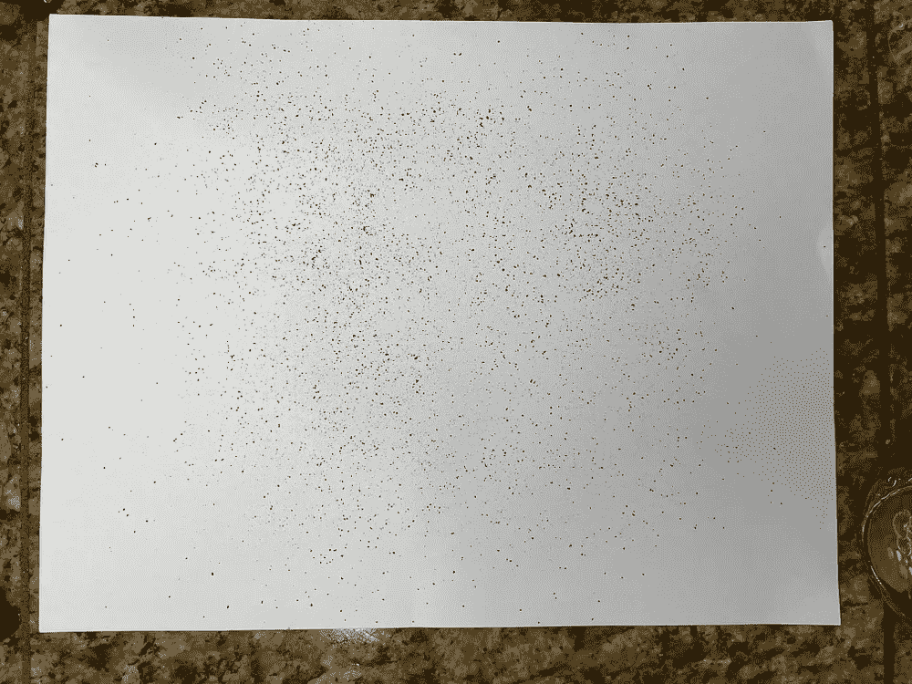

# 使用图像处理测量咖啡研磨颗粒分布

> 原文：<https://towardsdatascience.com/measuring-coffee-grind-particle-distribution-using-image-processing-84882e6dd4fd?source=collection_archive---------15----------------------->

## 咖啡数据科学

## 使用图像处理了解磨床性能第 1 部分

两年来，我一直在研究用图像处理测量咖啡颗粒的分布。它不是直截了当的，因为咖啡颗粒变得相当小。我以前的主要限制是测量直径小于 100 微米的颗粒，但我很快发现我最大的问题不是图像处理，而是照片设置。

作者的所有图片

# 当前技术

有两种专业方法来测量咖啡研磨分布:

1.  [多重筛选](https://www.coleparmer.com/i/cole-parmer-sieve-shaker-accepts-up-to-7-full-height-3-sieves-115v/5998601?PubID=UX&persist=true&ip=no&gclid=Cj0KCQiAyJOBBhDCARIsAJG2h5d75jPGx2epWHiKLOKv_Kb_IMbEWJq8kzscKERLS14Mg-hFvIKTVgYaAmucEALw_wcB)(筛选)
2.  [激光测量](https://www.googleadservices.com/pagead/aclk?sa=L&ai=ChXycHiAmYL25A4SknAefsJrYDYWDjadh6oeSsp0Ny4SspPEICAAQASC5VCgEYMne1IbIo6AZoAHqytiUA8gBAcgD2CCqBENP0MYsaHAWajWJH6zU6XHiX7EASHIUIcJpr_yIGDbNVFpnroySZkV2SdiVQUAcLKpuyhEFoqk22X2NJdQRzd2g53ArwATWr5vNsAOABZBOoAZmgAf-tKdriAcBkAcBqAemvhuoB7masQKoB_DZG6gH8tkbqAfz0RuoB-7SG6gHytwbsAgB0ggFEAIghAGaCVJodHRwczovL2NvdmFsZW50bWV0cm9sb2d5LmNvbS90ZWNobmlxdWVzL2xhc2VyLWRpZmZyYWN0aW9uLXBhcnRpY2xlLXNpemUtYW5hbHlzaXMvsQnhWc_lHG-jqrkJ4VnP5Rxvo6r4CQGYCwGqDAIIAbgMAcgUqLes8Jf6_MBS0BUBgBcB&ae=2&ved=2ahUKEwiS88P82-PuAhUNqJ4KHctYAIwQ0Qx6BAgIEAE&dct=1&dblrd=1&sival=AF15MEAIzxYr9BEZL9GlkS7V69ue2Mmtf_xz_A0aK_2pBLpVeXeqPz0Ekz1rTfF3D-X40W78pte91iMQKQ67WxX_P84Nur0bKjv6lxUItvlz0F99U0EOLPQoBNjnmkOH7cYBjWA4KG-l4Vd_DDv4pAe6YdXIQGPW9w&sig=AOD64_3LhnJBFUOgnV4uweuav3Mw364ihg&adurl=https://covalentmetrology.com/techniques/laser-diffraction-particle-size-analysis/)

多个筛子通常堆叠在振动台上，一旦所有的咖啡都被筛过，人们就要称每个筛子的内容物。这可能需要时间，因为这是一个手动过程。

激光测量使用激光通过衍射技术测量颗粒。这样可以更快，但是设备要贵很多。

# 成像技术

以前也有成像技术(即乔纳森·加涅的[工具](https://coffeeadastra.com/2019/04/07/an-app-to-measure-your-coffee-grind-size-distribution-2/))，但这些技术与筛选或激光测量之间没有可比性。两年前，我开发了一个分析[浓缩咖啡篮孔](/espresso-filters-an-analysis-7672899ce4c0)的工具，我发现我可以用同样的工具进行颗粒分析。然而，事实证明，Matlab 有一个非常好的函数( [regionprops](https://www.mathworks.com/help/images/ref/regionprops.html) )，它对二值图像(白色或黑色，没有灰色)进行处理，以识别独立的对象及其属性。

我决定在买了一个[壁龛](https://www.nichecoffee.co.uk)研磨机后再看一看，因为改变研磨设置相对容易。我已经有一些筛选的数据(只有 2 个屏幕，所以 3 个独立的颗粒大小组)，但它将有助于检查成像技术对地面的真相。

# 分离咖啡颗粒

我用一张白纸，用环形灯照亮它。我用了一个 800 微米的筛子来帮助从高处打碎大块并撒上粉末。这是拍摄场地最具挑战性的方面:分离。

我觉得这还不够好，所以我掸了掸。我用刷子轻敲它们，把结块打碎。我也拍了前后的照片。刷子没有积聚咖啡。

下面是一个对比:

左图:除尘前。右图:除尘后

然后我用 iPhone 拍了一张照片，可以看到整张纸。我用纸来确定毫米/像素，然后用长焦镜头放大一点。

左:正常广角拍摄。右图:长焦镜头拍摄

# 数据分析

我看了三个研磨设置(0，15，30)，我用一个小生研磨机来近似断奏。

左:设置 0，中:设置 15，左:设置 30

从总颗粒数来看，尘粒数要高得多。

我们可以看到尘封和正常之间分布的差异。正常的(未调整的)有更多更大的粒子，特别是设置为 0 时，我知道这不是真的。

让我们来看看设置为 0 时，正常分布和灰尘分布之间的差异。

观察灰尘的分布，设置 15 和 30 的分布太接近，这表明测量误差。

我们也可以看看实际体积，它的目的更多的是对实际重量的估计。所以我把颗粒大小的百分比转换成体积，假设所有的颗粒都是球形的(不正确，但是一个不错的假设)，并且假设密度不变。知道了直径，你就可以用这个方程来计算球体的体积。

在观看音量方面，设置 15 和 30 肯定有问题。对于设置 0，峰值体积直径低于 400um，这与断奏镜头的精细层(<400um). However, there is still a large percentage above 500 um. This observation does not align with my experience with that grind setting.

This study look at trying to analyze images of coffee grounds to determine particle size distributions. The biggest problem was getting coffee grounds to separate from each other, and the current technique isn’t as effective as I would like considering there is not much discrepancy between setting 15 and 30.

In [第 2 部分](/improving-coffee-grind-measurement-using-a-sifter-7b358f9c8331))一致，我将探索使用 Kruve 筛子(只有两个屏幕)来提供更多的地面真实信息进行比较，希望筛选和图像处理的一些混合将提供更好的可信度。

如果你愿意，可以在 [Twitter](https://mobile.twitter.com/espressofun?source=post_page---------------------------) 和 [YouTube](https://m.youtube.com/channel/UClgcmAtBMTmVVGANjtntXTw?source=post_page---------------------------) 上关注我，我会在那里发布不同机器上的浓缩咖啡照片和浓缩咖啡相关的视频。你也可以在 [LinkedIn](https://www.linkedin.com/in/robert-mckeon-aloe-01581595?source=post_page---------------------------) 上找到我。也可以在[中](https://towardsdatascience.com/@rmckeon/follow)关注我。

# [我的进一步阅读](https://rmckeon.medium.com/story-collection-splash-page-e15025710347):

[浓缩咖啡系列文章](https://rmckeon.medium.com/a-collection-of-espresso-articles-de8a3abf9917?postPublishedType=repub)

[工作和学校故事集](https://rmckeon.medium.com/a-collection-of-work-and-school-stories-6b7ca5a58318?source=your_stories_page-------------------------------------)

[个人故事和关注点](https://rmckeon.medium.com/personal-stories-and-concerns-51bd8b3e63e6?source=your_stories_page-------------------------------------)

[乐高故事启动页面](https://rmckeon.medium.com/lego-story-splash-page-b91ba4f56bc7?source=your_stories_page-------------------------------------)

[摄影飞溅页面](https://rmckeon.medium.com/photography-splash-page-fe93297abc06?source=your_stories_page-------------------------------------)

[浓缩咖啡过滤器:分析](/espresso-filters-an-analysis-7672899ce4c0?source=your_stories_page-------------------------------------)

[浓缩咖啡过滤篮:可视化](https://medium.com/@rmckeon/espresso-filter-baskets-visualized-189043a8929d?source=your_stories_page-------------------------------------)

[建模咖啡研磨机](/modeling-coffee-gringers-afb7c4949d6b?source=your_stories_page-------------------------------------)

[浓缩咖啡过滤器对比:佩萨多 vs VST](/espresso-filter-comparison-pesado-vs-vst-18a1321e62d?source=your_stories_page-------------------------------------)

[浓缩咖啡篮(VST):有脊与无脊](https://medium.com/swlh/espresso-baskets-vst-ridged-vs-ridgeless-89ac52767f13?source=your_stories_page-------------------------------------)

[IMS superficial vs VST:小样浓缩咖啡过滤器对比](/ims-superfine-vs-vst-a-small-sample-espresso-filter-comparison-4c9233e194?source=your_stories_page-------------------------------------)

[浓缩咖啡模拟:计算机模型的第一步](https://medium.com/@rmckeon/espresso-simulation-first-steps-in-computer-models-56e06fc9a13c?source=your_stories_page-------------------------------------)

[克鲁夫:对技术状态的进一步分析](https://medium.com/overthinking-life/kruve-further-analysis-on-the-state-of-the-art-18cf2f3b142c?source=your_stories_page-------------------------------------)

克鲁夫咖啡筛:一项分析

[咖啡篮隆隆声:机器人 vs 铂尔曼 vs 体面](/espresso-basket-rumble-robot-vs-pullman-vs-decent-9a63e9963a74?source=your_stories_page-------------------------------------)