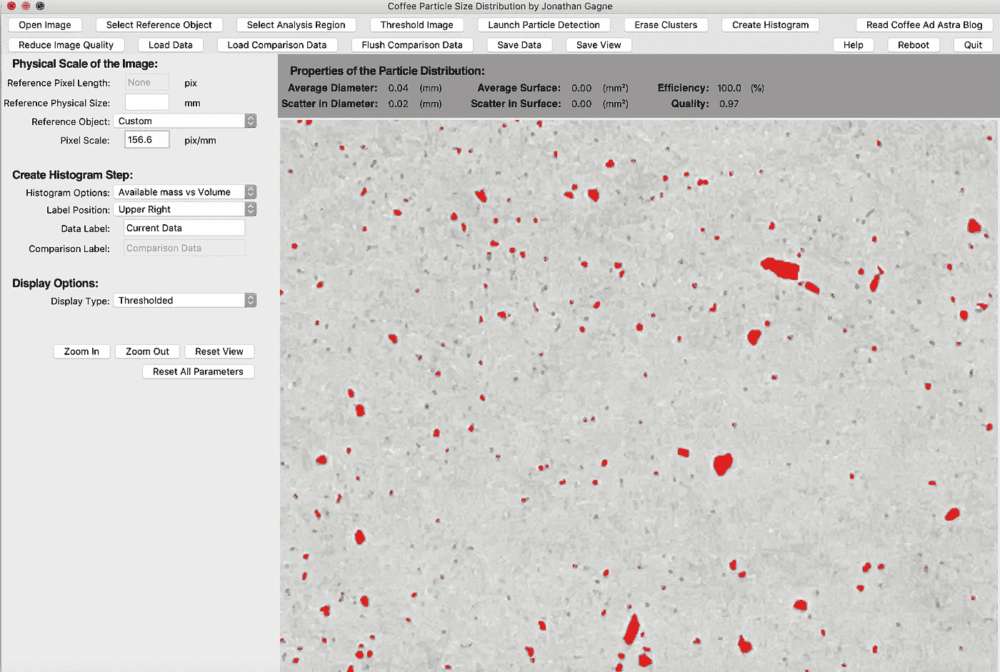
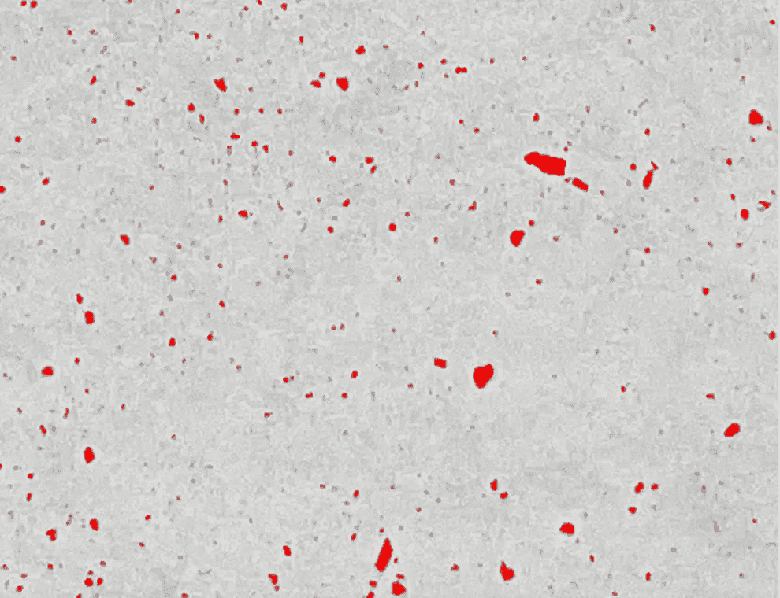

# 测量咖啡渣与乔纳森·加涅的技术

> 原文：<https://towardsdatascience.com/measuring-coffee-grounds-vs-jonathan-gagn%C3%A9s-technique-979d91820c60?source=collection_archive---------35----------------------->

## 咖啡数据科学

## 一次奇特的冒险

咖啡地面分布可以为咖啡研磨机和拨号咖啡拍摄提供信息。典型的方法是昂贵的，即筛分和激光衍射。Jonathan Gagné制作了一个基于图像的方法，有一段时间，人们不得不编译代码并准备好 Python 环境。我通常不这么做，所以我建造了我自己的[T3。](https://medium.com/nerd-for-tech/measuring-coffee-grind-distribution-d37a39ffc215)

最近，有人制作了一个 [exe 文件](https://github.com/csatt/coffeegrindsize/releases/tag/v1.0.0)，允许人们在他们的计算机上运行乔纳森的方法，而无需设置他们的环境，所以我这样做是为了比较他的方法和我的方法。

我们使用不同的阈值。Jonathan 使用一个简单的阈值，而我使用一个自适应阈值来捕捉更多和更细的粒子。

左图:约拿单有门槛的像，右图:我有门槛的像。

结果是我的方法有更高的原始计数，而他的方法使用最小面积阈值(5)作为缺省值。

然而，如果你取出少于 5 个像素的粒子，并对体积大小进行归一化，我们会得到类似的分布。

您可以在高级设置中调整他的方法的阈值。有一个平衡，因为你开始失去粒子以及粒子的精确尺寸。

40%、60%、80%和 90%的阈值

因此，如果你想要更小的粒子，你必须提高阈值，但你可能会得到大的噪声位，这取决于图像是如何捕捉的。

80%和 90%的阈值

使用 Jonathan 的工具让我非常兴奋，它拥有成功理解粒子分布的主要组件。虽然我认为使用自适应过滤是有益的，但这个应用程序允许用户了解他们的粒子分布。

这款应用存在一些问题，如果这些问题得到解决，我相信它会得到更广泛的应用，尤其是帮助咖啡师拨入咖啡:

1.  把它变成一个移动应用或基于网络的应用
2.  向用户提供关于图像质量的反馈
3.  添加一个视频展示[如何获得最佳分配](https://medium.com/nerd-for-tech/photographing-coffee-grounds-for-grind-distribution-analysis-d3494e980c28)。
4.  改变阈值算法，使用[自适应滤波器](/improving-coffee-grind-distribution-using-adaptive-thresholds-194e001f301?source=your_stories_page-------------------------------------)。
5.  添加一个功能，建议增加或减少研磨设置，以匹配给定的研磨设置。

这款应用的最大误差是基于用户行为，但如果用户在拍摄这些照片时格外小心，他们可以充分利用这款应用。

如果你愿意，可以在 Twitter 和 YouTube 上关注我，我会在那里发布不同机器上的浓缩咖啡视频和浓缩咖啡相关的东西。你也可以在 [LinkedIn](https://www.linkedin.com/in/robert-mckeon-aloe-01581595?source=post_page---------------------------) 上找到我。也可以在[中](https://towardsdatascience.com/@rmckeon/follow)和 [Patreon](https://www.patreon.com/EspressoFun) 上关注我。

# [我的进一步阅读](https://rmckeon.medium.com/story-collection-splash-page-e15025710347):

[浓缩咖啡系列文章](https://rmckeon.medium.com/a-collection-of-espresso-articles-de8a3abf9917?postPublishedType=repub)

[工作和学校故事集](https://rmckeon.medium.com/a-collection-of-work-and-school-stories-6b7ca5a58318?source=your_stories_page-------------------------------------)

[个人故事和关注点](https://rmckeon.medium.com/personal-stories-and-concerns-51bd8b3e63e6?source=your_stories_page-------------------------------------)

[乐高故事启动页面](https://rmckeon.medium.com/lego-story-splash-page-b91ba4f56bc7?source=your_stories_page-------------------------------------)

[摄影飞溅页](https://rmckeon.medium.com/photography-splash-page-fe93297abc06?source=your_stories_page-------------------------------------)

[使用图像处理测量咖啡研磨颗粒分布](https://link.medium.com/9Az9gAfWXdb)

[改善浓缩咖啡](https://rmckeon.medium.com/improving-espresso-splash-page-576c70e64d0d?source=your_stories_page-------------------------------------)

[断奏生活方式概述](https://rmckeon.medium.com/a-summary-of-the-staccato-lifestyle-dd1dc6d4b861?source=your_stories_page-------------------------------------)

[测量咖啡磨粒分布](https://rmckeon.medium.com/measuring-coffee-grind-distribution-d37a39ffc215?source=your_stories_page-------------------------------------)

[咖啡萃取](https://rmckeon.medium.com/coffee-extraction-splash-page-3e568df003ac?source=your_stories_page-------------------------------------)

[咖啡烘焙](https://rmckeon.medium.com/coffee-roasting-splash-page-780b0c3242ea?source=your_stories_page-------------------------------------)

[咖啡豆](https://rmckeon.medium.com/coffee-beans-splash-page-e52e1993274f?source=your_stories_page-------------------------------------)

[浓缩咖啡用纸质过滤器](https://rmckeon.medium.com/paper-filters-for-espresso-splash-page-f55fc553e98?source=your_stories_page-------------------------------------)

[浓缩咖啡篮及相关主题](https://rmckeon.medium.com/espresso-baskets-and-related-topics-splash-page-ff10f690a738?source=your_stories_page-------------------------------------)

[意式咖啡观点](https://rmckeon.medium.com/espresso-opinions-splash-page-5a89856d74da?source=your_stories_page-------------------------------------)

[透明 Portafilter 实验](https://rmckeon.medium.com/transparent-portafilter-experiments-splash-page-8fd3ae3a286d?source=your_stories_page-------------------------------------)

[杠杆机维护](https://rmckeon.medium.com/lever-machine-maintenance-splash-page-72c1e3102ff?source=your_stories_page-------------------------------------)

[咖啡评论与思考](https://rmckeon.medium.com/coffee-reviews-and-thoughts-splash-page-ca6840eb04f7?source=your_stories_page-------------------------------------)

[咖啡实验](https://rmckeon.medium.com/coffee-experiments-splash-page-671a77ba4d42?source=your_stories_page-------------------------------------)