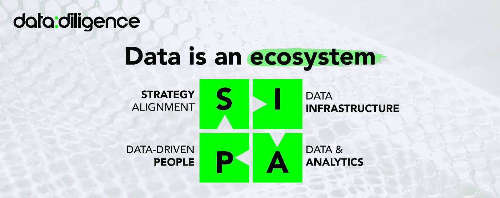

# 衡量数据生态系统成熟度

> 原文：<https://towardsdatascience.com/measuring-data-ecosystem-maturity-62f0bf7c7143?source=collection_archive---------20----------------------->

## 介绍一种反映数据经济价值的尺度。

Jukan Tateisi 在 [Unsplash](https://unsplash.com?utm_source=medium&utm_medium=referral) 上拍摄的照片

我们咨询师痴迷于基准和尺度！为什么？嗯，首先，标杆管理符合典型高管的竞争本质，他们不想落后于竞争对手，不想错过竞争对手，当他们的业务以竞争对手为基准时，他们会进入“战斗模式”。

但在现实中，标杆管理不仅仅是参与行为科学。相反，高管们要求他们帮助确定目标和优先事项，并制定行动方针，将他们从 a 点提升到 b 点，或从较低的四分位数提升到较高的四分位数。

这种“速赢/跟随者”的方法导致许多企业追求“必备”项目(想想银行业的[聊天机器人](https://www.forbes.com/sites/ronshevlin/2021/03/15/every-bank-needs-a-chatbot-or-two-for-its-digital-transformation/))。但是，如果没有整体业务战略的强大支撑，许多数据计划都会失败。

我认为这种快速取胜的方法通常会导致过快地找到解决方案。毕竟，看到一个情节显示，例如，“领导者*比落后者*多 5.4 倍的利润，并且其中 78%的人已经实现了聊天机器人”，不应该自动导致建立聊天机器人的决定！**

[数据不仅仅是数据。它不会自动传递价值。](https://ericdataproduct.substack.com/p/data-doesnt-automatically-deliver)

## 什么标志着数据生态系统的成熟？

让我首先陈述两个关于数据的基本原则。

1.  数据必须创造经济价值。
2.  数据是一个生态系统。

第一个原则意味着数据计划必须与业务战略保持一致，并且应该努力对业务成果产生积极的影响——增加利润、降低成本、增加公司价值、降低风险等等。

第二点说明了这样一个事实，即数据计划要想成功，很少仅仅与数据有关。相反，这是一个影响成功率的整个生态系统，从数据和业务之间的战略一致性，到分析和数据本身，到数据基础架构，再到人员。简而言之，我们称之为我们的“SAPI”框架:

来源:[https://www.datadiligence.com/pointsofview?lightbox=dataItem-khq863jq1](https://www.datadiligence.com/pointsofview?lightbox=dataItem-khq863jq1) (经许可使用)

这两个原则对于我们如何衡量数据生态系统成熟度也至关重要。成熟度等级必须与经济价值相关，而不是数据的“无关紧要性”。它还必须适用于整个生态系统(SAPI)并涵盖其所有层面。

此外，成熟度等级的步骤应该是直观的。易于评估甚至自我评估。他们还应该本能地指导公司如何向更高层发展。

## 那么，我们应该如何衡量数据生态系统的成熟度呢？

现在，事不宜迟，让我们来看看规模。

*   无:不明显
*   **分散:**零星的口袋，缺乏广泛的凝聚力和结构
*   **基础:**建立在整个组织的基础上
*   **有效:**有效利用，结构良好，广泛使用
*   **增强:**根深蒂固，并向变革和机遇发展
*   **变革:**尖端方法和交付(可能是专有的)

秤是如何工作的？

假设我们正在评估一个战略因素，比如**数据战略**。使用我们的量表，对数据战略成熟度的“信封背面”评估可能如下所示:

*   无数据愿景= *无。*
*   任意数据项目的集合= *分散。*
*   确保公司控制数据并可用于基本决策的策略= *基础。*
*   涵盖数据如何帮助瞄准所有关键业务问题和机会= *有效。*
*   快速应对新挑战，围绕业务需求平稳发展= *增强。*
*   影响关键业务决策甚至整个业务战略= *变革性。*

应用于**数据代表性** —数据在多大程度上反映了企业的业务环境—该等级将表示:无数据= *无。*有些因素涵盖了，有些没有= *分散了。*数据中充分体现的关键因素= *基础因素。*代表的主要因素= *有效。*重要细节可用= *增强。大部分细节都涉及到了。*

或许我们应该评估一下**数据科学工具包**。没有到位= *没有。*数据科学家使用的基本工具基于个人偏好和本地= *分散。*数据科学团队可用于查询和分析数据的基本工具= *基础。*由数据科学家和分析师开发的解决方案(产品或分析)可以轻松部署并与其他人分享。数据科学平台，支持数据产品的开发、部署、监控和运营= *增强。*数据科学平台自动建议和纠正解决方案= *变革性。*

或者，让我们来试试更巧妙的方法——**数据流畅度**？不知道数据与工作有什么关系的人= *没有。*有些人利用一些数据做出一些决策= *分散。*大多数人在做决策时会考虑关键数据= *基础数据。*人们轻松地做出数据驱动的决策= *有效。*人们对数据的偏见和局限性的理解= *增强了。人们积极寻找利用数据改善运营的新机会。*

例子还可以继续，但是你明白了。

## 但是为什么不用其他的数据成熟度量表呢？

数据成熟度有多种衡量标准。 [Gartner 有一个](https://www.oreilly.com/library/view/streaming-change-data/9781492032526/app01.html)。 [IBM 也是](https://www.hitechnectar.com/blogs/data-governance-maturity-models-explained/)。[卡介苗](https://www.bcg.com/publications/2019/rough-road-to-data-maturity)也是。以及其他咨询机构——大型[和小型](https://www.safegraph.com/blog/the-four-stages-of-data-maturity)。甚至像比尔·施马尔佐这样的个人思想领袖。

然而，我/我们认为它们有一些实际的限制。

*   有些本质上是相对的，在你没有标杆的情况下，很难自我评价。
*   一些人考虑数据的一个非常具体的方面，很难将同样的尺度应用于数据生态系统(或框架)的其他重要因素。
*   有些水平太高，不能提供足够的可塑性来进行正确的诊断。
*   一些人关注的是产出，而不是对结果的影响。

因此，我们创建了一个符合我们标准的尺度:易于理解和直观，可应用于数据生态系统的所有因素(包括个人和集体)。此外，它与结果和经济价值紧密相连，并提供了个人成熟阶段的顺序指南。

无论哪种方式，我们都需要记住，数据的[价值应该通过业务影响](https://www.datadiligence.com/manifesto)来衡量。完全不是。更确切地说，量表应该提供你所处位置的洞察力。

***感谢阅读！***

***欢迎在评论中分享你的想法或观点。***

***跟我上*** [***中***](https://adamvotava.medium.com/)*[***LinkedIn***](https://www.linkedin.com/in/adamvotava/)*[***推特***](https://twitter.com/_adam_votava) ***。*****