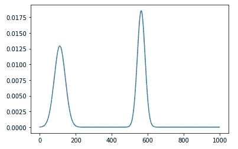
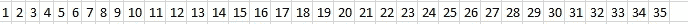

# 利用卷积神经网络测量距离

> 原文：<https://towardsdatascience.com/measuring-distance-using-convolutional-neural-network-190b7afadd8a?source=collection_archive---------19----------------------->

## 深度信号处理教程


[M. B. M.](https://unsplash.com/@m_b_m?utm_source=medium&utm_medium=referral) 在 [Unsplash](https://unsplash.com?utm_source=medium&utm_medium=referral) 拍摄的照片

在信号处理中，有时需要测量信号某些特征(例如峰值)之间的水平距离。解释心电图(ECG)就是一个很好的例子，心电图的大部分解释都依赖于测量距离。在下图中，我们将考虑一个只有两个峰值的平滑信号的玩具示例。



作者创造的形象

这个问题很简单，可以通过找到峰值，然后通过减去它们的 X 坐标来测量它们之间的水平距离来解决。这可以使用可用的工具和库来有效地完成。然而，我们的目标是训练一个神经网络来预测峰值之间的距离。一旦我们证明神经网络可以处理这项任务，我们就可以在更复杂的端到端学习任务中重用相同的架构，而测量距离只是学习更复杂关系的一种手段。这源于深度学习的想法，即我们应该尝试让神经网络学习特征，而不是让工程师手动编码这些特征，希望这些是最相关的特征。如果我们可以证明神经网络可以学习距离特征，我们可以在更复杂的网络中使用它，其中最终结果将取决于除距离之外的许多其他因素。这些任务的好例子是解释心电图或天文数据。

# 生成数据

在我们的实验中，我们将使用生成训练和测试数据的生成器函数生成如上图所示的信号。

1.  这是一个 python 生成器函数，意味着它使用了`yield`关键字而不是`return`。每次调用生成器上的`next()`函数，它都会产生下一个结果。
2.  该函数产生的信号正好有两个峰值。
3.  所有信号的长度完全相同。
4.  第一个峰值的位置均匀地分布在信号的第一象限中，但是第二个峰值的位置是正态分布的，但是我们也确保它不超出界限。
5.  峰的宽度也是正态分布的。
6.  我们分批返回峰值，这将有助于神经网络训练和评估。

请注意，这个生成器实际上会生成无限量的数据！凭借这一点，我们可以尝试为我们的玩具例子达到尽可能高的精度。

# 寻找峰值

现在我们有了发生器函数，我们可以使用标准的信号处理库来寻找峰值之间的距离。我们将使用`scipy`库和函数`find_peaks()`来寻找峰值。我们使用 R2 评分对模型进行评估。正如我们在下面看到的，我们得到了几乎完美的分数，预测误差主要是由于数字舍入误差。

```
Baseline performance:  0.9999812121197582
```

# 使用 CNN 测量距离

在设计神经网络时，想象人类操作员会做什么通常是有用的。在我们的例子中，操作是测量，测量的工具是一把尺子。在我们的例子中，我们使用 1D 卷积层模拟一个统治者，其内核大小设置为最大值，即信号的长度。这背后的原因是，如果层的值为 0，1，2，3，4，…乘以信号，它将准确地给出峰值的位置。我们使用两个过滤器，据说是为了测量两个峰值的位置，然后添加两个完全连接的层，让神经网络学习如何获取这两个测量值之间的差异。



作者创造的形象

我们的神经网络实现使用 Tensorflow 和 Keras。请注意，由于`Conv1D`需要一个三维张量，我们添加了一个整形层，增加了大小为 1 的第三维。批处理维度是隐式假定的。对于卷积层，我们不使用任何激活函数，因为我们希望该层的行为像一把尺子。请注意，我们不使用任何缩减采样机制(最大池或平均池)。我认为这些是不必要的，事实上可能会降低精度，因为它们使测量不太精确。在将数据发送到`Dense`层之前，我们添加了一个`Flatten`层来将维度(除了批处理维度)折叠成一个维度，因为这是`Dense`层所期望的。

```
Model: "sequential_26"
_________________________________________________________________
Layer (type)                 Output Shape              Param #   
=================================================================
reshape_26 (Reshape)         (None, 1000, 1)           0         
_________________________________________________________________
conv1d_33 (Conv1D)           (None, 1, 2)              2002      
_________________________________________________________________
flatten_25 (Flatten)         (None, 2)                 0         
_________________________________________________________________
dense_63 (Dense)             (None, 16)                48        
_________________________________________________________________
dense_64 (Dense)             (None, 16)                272       
_________________________________________________________________
dense_65 (Dense)             (None, 1)                 17        
=================================================================
Total params: 2,339
Trainable params: 2,339
Non-trainable params: 0
_________________________________________________________________
```

正如我们看到的，这个模型只有 2339 个参数，所以它是一个非常简单的模型。我们在 50 个时期内训练模型，但是我们还添加了`EarlyStopping`回调，以便在模型停止改进时停止模型的执行。我们添加了另一个回调`TerminateOnNaN`，如果梯度或损失变成了`NaN`，它将停止训练过程。我们将一个生成器函数传递给`fit()`方法。这是现在推荐的向模型传递数据的方法，尤其是当数据量很大时。在我们的例子中，生成器不断地生成随机的例子，实际上是无限数量的例子！由于我们的生成器函数没有一个历元的概念，我们需要定义一个参数`steps_per_epoch`，否则模型会认为所有批次都属于第一个历元，训练永远不会结束。

```
Epoch 1/50
100/100 [==============================] - 16s 157ms/step - loss: 55010.6915
Epoch 2/50
100/100 [==============================] - 16s 161ms/step - loss: 186.3050
Epoch 3/50
100/100 [==============================] - 16s 160ms/step - loss: 89.9977
Epoch 4/50
100/100 [==============================] - 16s 159ms/step - loss: 229.8199
```

```
R^2 score:  0.996036173273703
```

在训练了一个模型之后，我们看到测试集的分数确实令人印象深刻。虽然我们承认进一步改进算法是可能的，但我们得到的结果证明我们的简单方法确实有效。

# 结论

在设计神经网络时，想象人类的感知和认知是如何工作的通常是有用的。我们如何生成高级特征和概念通常会指导我们在神经架构中的选择。这种方法的一个例子是注意力机制，当我们根据阅读的文本形成概念时，这种机制是从人类的注意力中模拟出来的。在这个玩具问题中，我们代表了人类活动指导神经网络构建的另一个例子。虽然(与注意力机制一样)使用 CNN 测量距离本身没有用，但只要我们认为水平距离起作用，这种结构就可以被整合到更大的神经网络中，以解决更复杂的任务。

这款笔记本的代码可以在 [my github repository](https://github.com/mlarionov/deep-signal-example/blob/main/two-peaks.ipynb) 获得。