# 测量和增强图像质量属性

> 原文：<https://towardsdatascience.com/measuring-enhancing-image-quality-attributes-234b0f250e10?source=collection_archive---------20----------------------->

## 发现用于测量和增强感知图像质量的主要属性

在开始讨论测量或增强图像质量属性之前，我们必须首先正确地介绍它们。为此，我从《相机图像质量基准测试》一书中获得了灵感，该书非常详细地描述了我将在这里谈到的属性。需要注意的是，虽然书中描述的属性是相机属性，但我们的讨论是围绕图像属性展开的。幸运的是，一些相机属性也可以用作图像属性。

# 测量属性

## 1.暴露

通常指曝光时间，这是影响图像中光量的相机属性。对应的图像属性其实是**亮度**。有多种方法可以计算亮度或等效测量值:

*   我发现从 RGB 映射到 HSB(色调、饱和度、亮度)或 HSL(色调、饱和度、亮度),并且只查看最后一个分量(L 或 B)是可能的。
*   Darel [Rex Finley](http://alienryderflex.com/hsp.html) 提出了一个非常好的感知亮度的测量方法，其中:

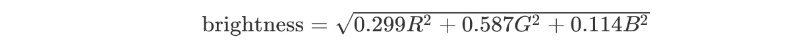

作者图片

如果我们对所有像素进行平均，我们可以获得感知亮度的度量。此外，通过将结果值分成五份(因为最小值为 0，最大值为 255)，我们可以定义一个等级:(非常暗、暗、正常、亮、非常亮)。

```
import cv
import mathimg = cv2.read(‘image.jpg’)def pixel_brightness(pixel):
    assert 3 == len(pixel)
    r, g, b = pixel
    return math.sqrt(0.299 * r ** 2 + 0.587 * g ** 2 + 0.114 * b ** 2)def image_brightness(img):
    nr_of_pixels = len(img) * len(img[0])
    return sum(pixel_brightness(pixel) for pixel in row for row in img) / nr_of_pixels
```

## 2.色调映射

高动态范围成像(HDRI 或 HDR)是一种在成像和摄影中使用的技术，与标准数码成像或摄影技术相比，它可以再现更大动态范围的亮度。虽然人眼可以适应各种光线条件，但大多数成像设备每通道使用 8 位，因此我们仅限于 256 级。HDR 成像处理每通道使用 8 位以上(通常为 32 位浮点值)的图像，允许更宽的动态范围。

**什么是色调映射？**

有不同的方法获得 HDR 图像，但最常见的是使用不同曝光值拍摄的场景照片。为了组合这些曝光，知道你的相机的响应函数是有用的，并且有算法来估计它。合并 HDR 图像后，必须将其转换回 8 位，以便在普通显示器上观看。这个过程叫做**色调映射**。

**测量图像是否经过良好的色调映射**

从上面的定义，我**提出**(所以有可能是完全错误的)下面的步骤来测量色调映射。这背后的直觉来自当图像没有被正确地色调映射时直方图看起来的方式。大多数时候它们看起来是这样的:

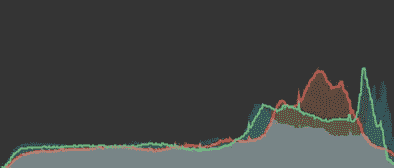

最右边(突出显示剪辑)。这是照片 Mac 应用程序中的 RGB 直方图。图片作者。

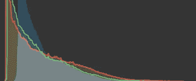

最左边(阴影剪裁)。图片作者。

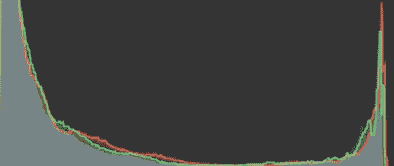

直方图的两端接触最末端，剪切高光和阴影。图片作者。

它们要么太暗(阴影剪裁)，要么太亮(高光剪裁)，要么两者兼而有之(例如，一间黑暗的浴室，镜子里可以看到闪电，或者一张半夜的灯杆照片)。

相比之下，色调映射良好的图像如下所示:

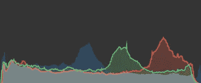

图片作者。

基于此，我**提出**(所以要半信半疑)一种尝试兼顾上述事情的评分方法。分数将在[0，1]之间，0 表示图像色调映射不正确，1 表示色调映射正确。除了饱和度效应之外，色调映射不佳的图像也可能是大部分亮度值位于紧密间隔内的图像(小方差= >可用色调较少)。

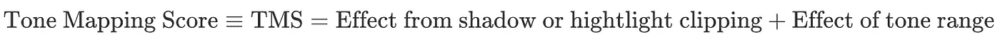

作者图片

1.  为了简单起见，为了不使用不同的颜色通道，我们可以使用上面的亮度(`pixel_brightness`)。
2.  我们构建一个亮度直方图(x 来自[0，255])
3.  我们从直方图构建概率分布，在[0，1]范围内:

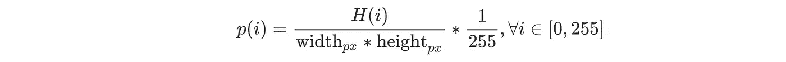

作者图片

4.我们定义了一个抛物线惩罚概率分布，即 0/0 和 1，最大值为 1/2(只要我们惩罚极端情况，这应该很好——因此低分数<=>大部分亮度集中在分布的头部和尾部)。

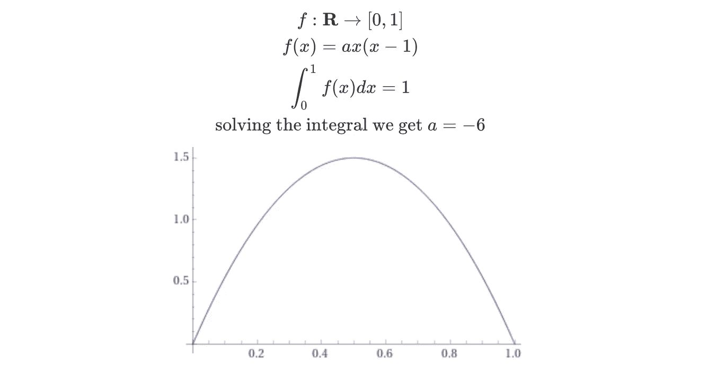

作者图片

(注意:这实际上是伯努利分布的一个简单例子，用作先验概率分布是一件好事)。

5.接下来，我们可以将“惩罚”亮度概率分布定义为。唯一剩下的就是适当的限制这个乘积…在 0 和 1 之间。第一部分已经解决了…这个乘积的最小值，对于所有的值都是 0。这是因为我们可以定义一幅黑白图像，其概率分布如下:

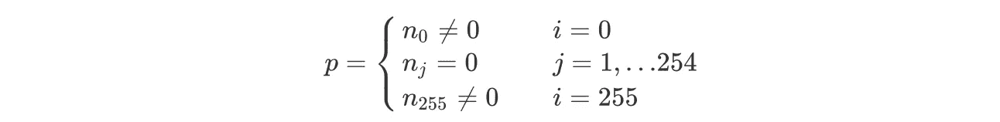

作者图片

我们可以看到，因为 f 是**而不是** 0，只有在 0 和 255 处，示例图像中所有像素的总和才会是 0。任何其他配置都会导致总和大于 0。

为了使总和最多为 1，我们可以使用高中的技巧，通过 CBS 不等式。总的来说:

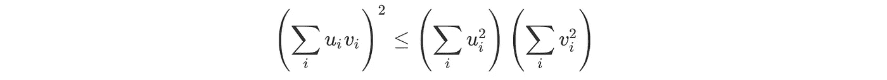

作者图片

在我们的情况下，这将是:

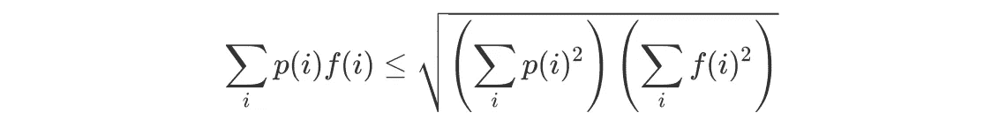

作者图片

如果我们把左半部分除以右半部分，最后得到一个介于 0 和 1 之间的分数。因此，第一项的最终形式是:

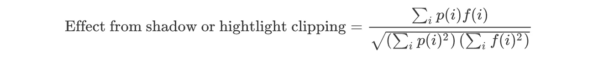

作者图片

我不知道为什么，但它与皮尔森的相关系数非常相似…🤔

下一个术语我会简单地定义为:

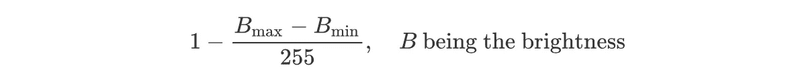

作者图片

最后，我们得到以下色调映射分数:

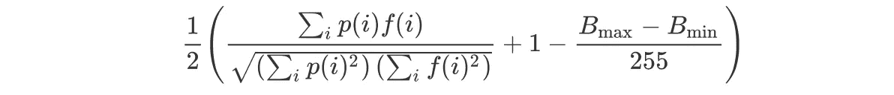

作者图片

现在，让我们看看一些代码:

```
import math
import numpy as np
from scipy.stats import betaRED_SENSITIVITY = 0.299
GREEN_SENSITIVITY = 0.587
BLUE_SENSITIVITY = 0.114*def* convert_to_brightness_image(image: np.ndarray) -> np.ndarray:
    *if* image.dtype == np.uint8:
        *raise* ValueError("uint8 is not a good dtype for the image")

    *return* np.sqrt(
        image[..., 0] ** 2 * RED_SENSITIVITY
        + image[..., 1] ** 2 * GREEN_SENSITIVITY
        + image[..., 2] ** 2 * BLUE_SENSITIVITY
    ) *def get_resolution*(image: np.ndarray):
    height, width = image.shape[:2]
    *return* height * width *def* brightness_histogram(image: np.ndarray) -> np.ndarray:
    nr_of_pixels = get_resolution(image)
    brightness_image = convert_to_brightness_image(image)
    hist, _ = np.histogram(brightness_image, bins=256, range=(0, 255))
    *return* hist / nr_of_pixels *def* distribution_pmf(dist: Any, start: float, stop: float, nr_of_steps: int):
    xs = np.linspace(start, stop, nr_of_steps)
    ys = dist.pdf(xs)
    *# divide by the sum to make a probability mass function
    return* ys / np.sum(ys) *def* correlation_distance(
    distribution_a: np.ndarray, distribution_b: np.ndarray
) -> float:dot_product = np.dot(distribution_a, distribution_b)
    squared_dist_a = np.sum(distribution_a ** 2)
    squared_dist_b = np.sum(distribution_b ** 2)
    *return* dot_product / math.sqrt(squared_dist_a * squared_dist_b) *def* compute_hdr(cv_image: np.ndarray):
    img_brightness_pmf = brightness_histogram(np.float32(cv_image))
    ref_pmf = distribution_pmf(beta(2, 2), 0, 1, 256)
    return correlation_distance(ref_pmf, img_brightness_pmf)
```

## 3.纹理模糊

因为，模糊图像的边缘被平滑，所以`variance`小。这是 OpenCV 中的一行程序，简单的代码🎨:([https://stack overflow . com/questions/48319918/whats-the-theory-behind-the-computing-variance-of-a-image](https://stackoverflow.com/questions/48319918/whats-the-theory-behind-computing-variance-of-an-image))。

```
import cv2def blurry(image, threshold=100): 
    return cv2.Laplacian(image, cv2.CV_64F).var() < threshold
```

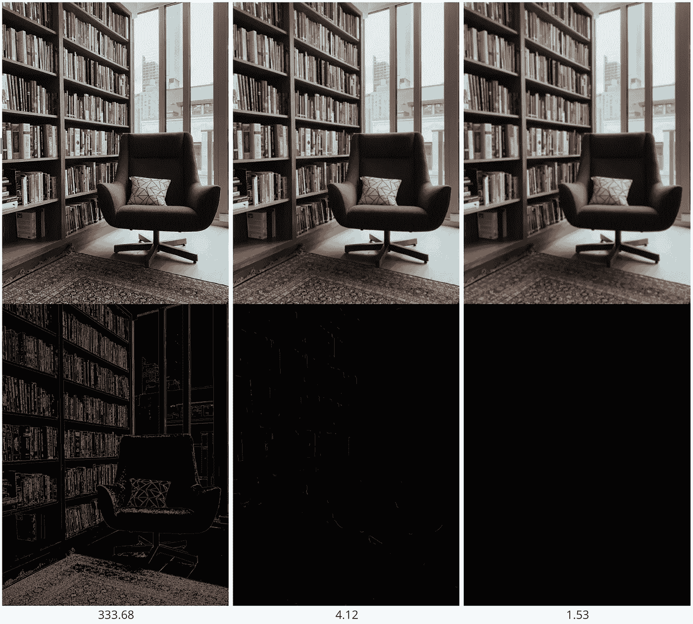

左侧为原始图像，其余图像具有不同程度的高斯模糊。拉普拉斯算子随着高斯模糊程度的增加而减少。图片作者。

# 增强属性

1.  **HDR 与多张照片**

OpenCV 文档对此有很好的指导，[高动态范围(HDR)](https://docs.opencv.org/master/d2/df0/tutorial_py_hdr.html) 。

为了简洁起见，我这里只放用 Debevec 的算法得到的结果([http://www . pauldebevec . com/Research/HDR/Debevec-siggraph 97 . pdf](http://www.pauldebevec.com/Research/HDR/debevec-siggraph97.pdf))。

1.  首先，用不同的曝光时间拍摄多张照片(曝光时间已知，相机不动)。

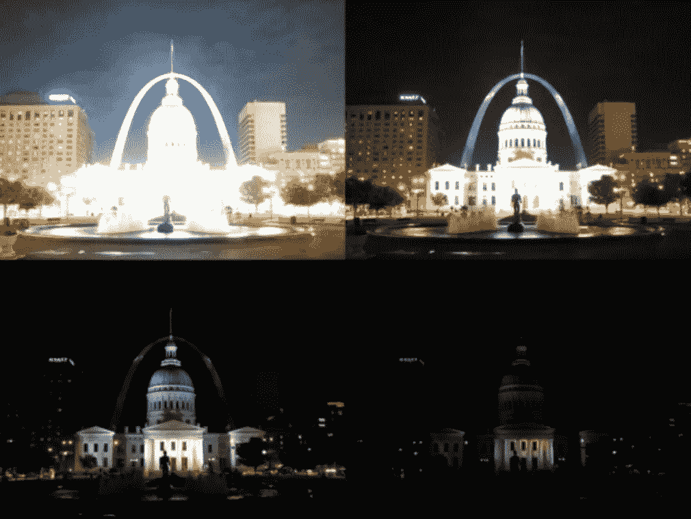

[https://docs.opencv.org/3.4/d2/df0/tutorial_py_hdr.html](https://docs.opencv.org/3.4/d2/df0/tutorial_py_hdr.html)

```
import cv2 as cv
import numpy as np# Loading exposure images into a list
img_fn = [“img0.jpg”, “img1.jpg”, “img2.jpg”, “img3.jpg”]
img_list = [cv.imread(fn) for fn in img_fn]
exposure_times = np.array([15.0, 2.5, 0.25, 0.0333], dtype=np.float32)# Merge exposures to HDR image
merge_debevec = cv.createMergeDebevec()
hdr_debevec = merge_debevec.process(img_list, times=exposure_times.copy())# Tonemap HDR image (i.e. map the 32-bit float HDR data into the range [0..1])
tonemap1 = cv.createTonemap(gamma=2.2)
res_debevec = tonemap1.process(hdr_debevec.copy())# Convert datatype to 8-bit and save (! 8-bit per channel)
res_debevec_8bit = np.clip(res_debevec*255, 0, 255).astype(‘uint8’)
cv.imwrite(“ldr_debevec.jpg”, res_debevec_8bit)
```

最终结果是:

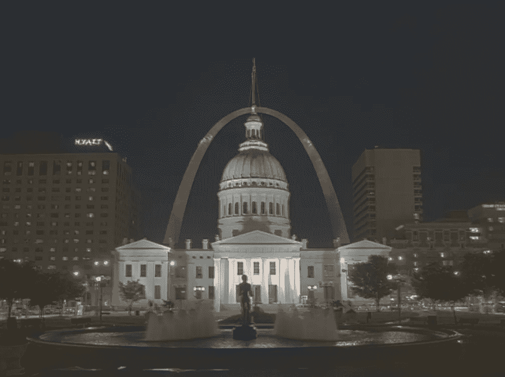

[https://docs.opencv.org/3.4/d2/df0/tutorial_py_hdr.html](https://docs.opencv.org/3.4/d2/df0/tutorial_py_hdr.html)

## 2.闪光

寻找耀斑简化为在图像中寻找非常亮的区域的问题。我还没有找到**发现**图像是否有眩光的具体方法，只是为了纠正一个:该方法被称为 **CLAHE** (对比度受限的自适应直方图均衡化)。

```
import numpy as np
import cv2
​
img = cv2.imread('statue.jpg',0)
res = cv2.equalizeHist(img)
cv2.imwrite('global_hist_eq_statue.jpg',res)
```

在谈论 CLAHE 之前，最好知道为什么直方图均衡化**不起作用:**

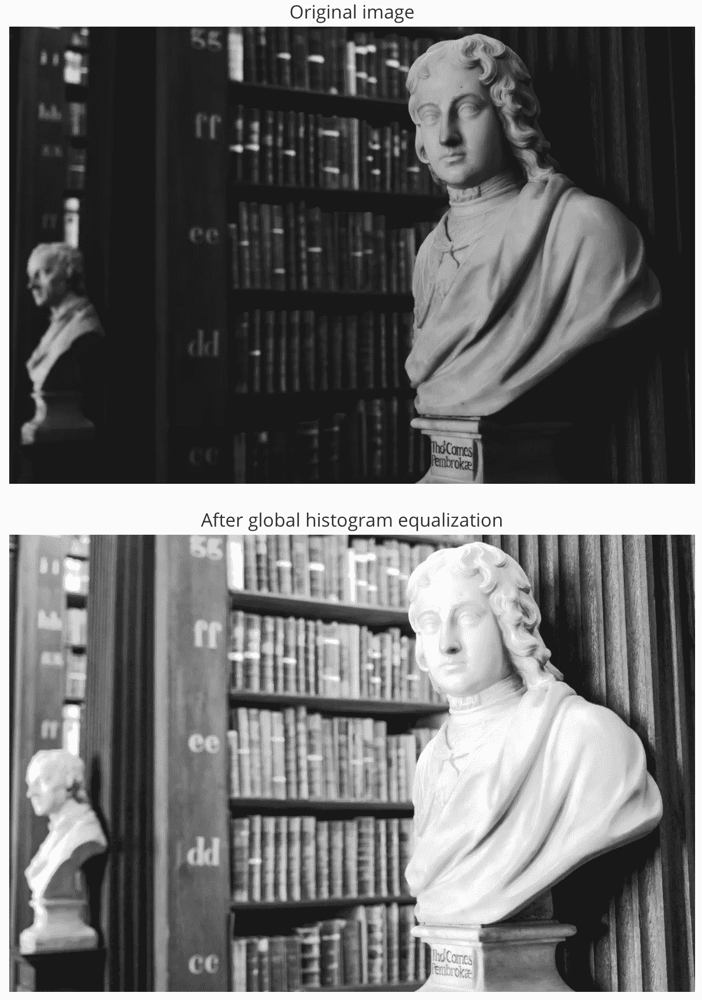

作者图片

虽然直方图均衡化后背景对比度有所改善，但雕像的面部变得过于明亮。因此，本地版本是优选的，因此，使用**自适应直方图均衡**。在这种情况下，图像被分成称为“平铺”的小块(在 OpenCV 中平铺的大小默认为 8×8)。然后像往常一样对这些块中的每一个进行直方图均衡。因此，在一个小区域内，直方图会限制在一个小区域内(除非有噪声)。如果噪音在那里，它会被放大。为了避免这种情况，应用了**对比度限制**。

```
import numpy as np
import cv2
​
img = cv2.imread('statue.jpg',0)# create a CLAHE object (Arguments are optional).
clahe = cv2.createCLAHE(clipLimit=2.0, tileGridSize=(8,8))
cl1 = clahe.apply(img)
​
cv2.imwrite('clahe_statue.jpg',cl1)
```

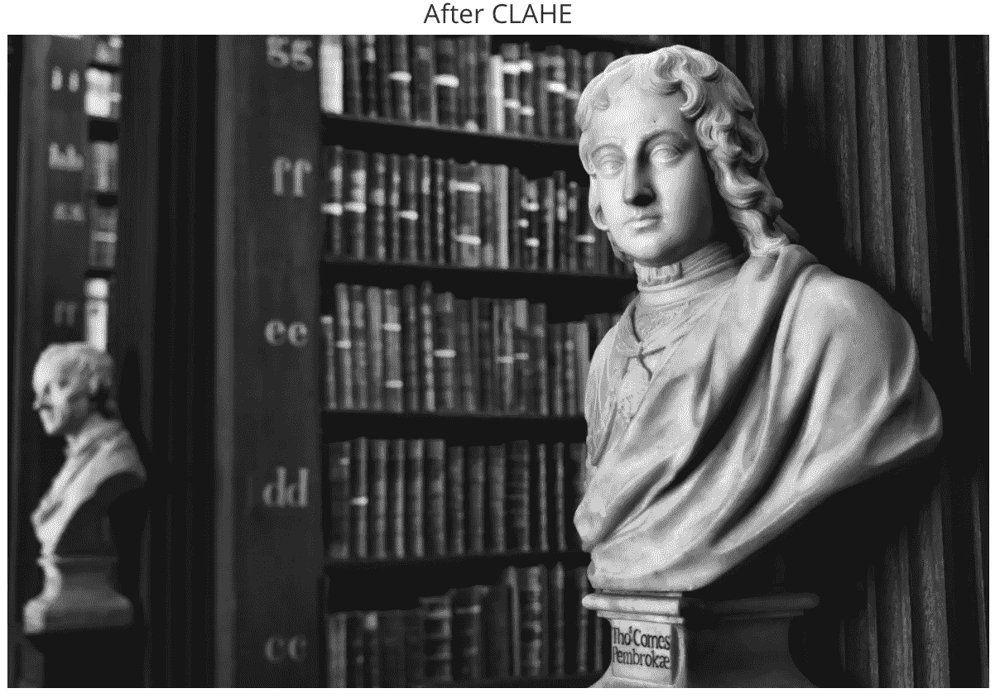

作者图片

关于直方图均衡的更多信息，请访问 OpenCV 文档([https://docs . OpenCV . org/3 . 1 . 0/D5/daf/tutorial _ py _ histogram _ equalization . html](https://docs.opencv.org/3.1.0/d5/daf/tutorial_py_histogram_equalization.html))。