# 测量咖啡研磨设备的萃取和 TDS

> 原文：<https://towardsdatascience.com/measuring-extraction-and-tds-across-coffee-grind-settings-49dfd66d8203?source=collection_archive---------21----------------------->

## 咖啡数据科学

## 控制流量

咖啡萃取似乎仍然是一个谜，特别是当每一杯咖啡，人们必须拨入研磨咖啡。我只剩下几个问题，所以我开始了解提取是如何与研磨设置相联系的。

> 每个研磨设置是否有基本提取限制？

现在有些人可能会说，我们已经知道，一般来说，更细的研磨可以获得更高的提取率，但随着研磨变得更细，沟道效应的可能性增加，因此整体提取率可能会下降。为了获得最高的提取，你需要最细的研磨和最少的沟道效应。

所有图片由作者提供

因此，即使要测量研磨粒度的萃取率，也不能简单地下调研磨粒度，因为流量/通道变量与研磨粒度成反比，导致萃取率下降。

# 实验设计

我决定我要控制流动的变量。为了做到这一点，我会使用[用过的咖啡渣](https://link.medium.com/HKdcDreG1fb)来大大减少沟道效应的变量。如果所用的大部分咖啡来自用过的咖啡，那么大部分萃取物应该被分离到新鲜咖啡中，并且新鲜咖啡可以被混合，从而减少沟道效应。

我的目标是在同一天，用同样的咖啡，同样的一套用过的咖啡渣，以及相似的拍摄时间。我的目标是 5 个设置，外加一个刚刚用过的场地的控制镜头，其中 5 个研磨设置跨越了利基的浓缩咖啡设置。投入的总量将是 20g，其中 4g 是新烘烤的。

我花了很多时间来获得用过的咖啡渣，以提供所需的流动阻力。整个过程有助于改进如何进行实验。

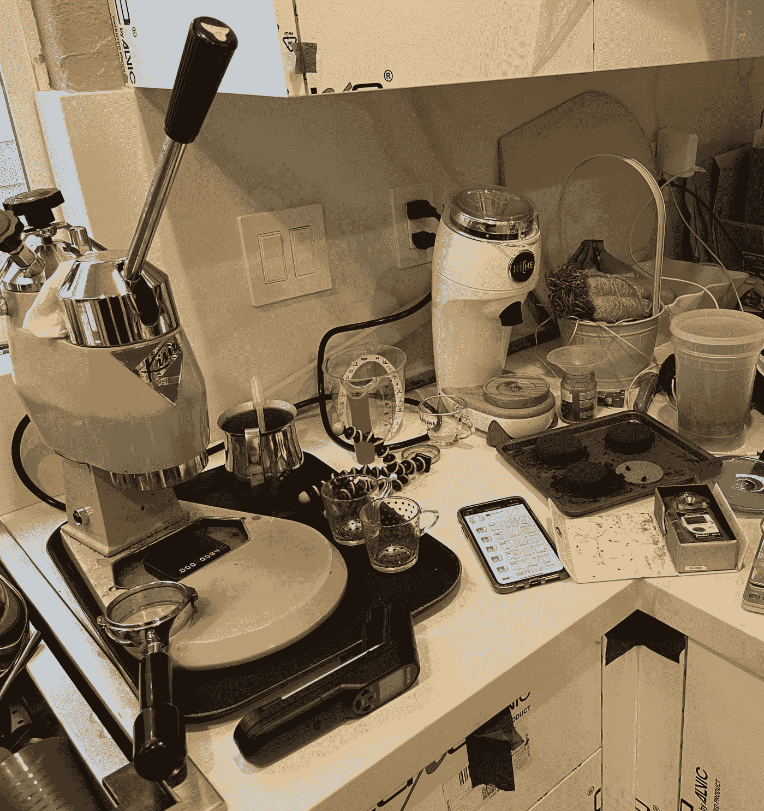

硬件方面，我用了一个 Kim Express(弹簧手动杆)和一个小生磨。豆子在 2 周大的时候在家烘焙。

关于 Kim Express 的一点说明:我已经用这台机器拍摄了 2000 多张照片，虽然我使用温度枪来帮助准备在正确的时间拍摄，但我通常使用声音来知道机器何时达到了最佳设置。这是当蒸汽排气阀弹出，然后我开始拉一枪。大约 30 秒后，我会关掉机器，这样它就不会爆炸了(目前为止只有两次…)。

注射参数为预输注 10 秒，随后是从高到低的均匀流动压力分布。我没有压力计，但我用 Acaia 量表测量了流量。

我还将每个镜头分成 1:1 的输出到输入，2:1 和 3:1。所以第一针大约是 20 克，然后我分别收集另一个 20 克，最后一点 20 克左右。这张意大利腊肠照片在取样方面可以做得更好，但我不想让一个已经很复杂的实验变得过于复杂。

# 研磨分布

为了帮助这个实验，我使用我的[图像技术](https://link.medium.com/ajDBqSrG1fb)来计算所有研磨尺寸的颗粒尺寸分布。

我这样做是作为题外话，因为我试图收集尽可能多的数据。好像设置 10 (S10)有问题，但我没搞清楚原因。我怀疑我没有准备好场地。

# 数据收集

我能够在一个小时内快速连续地捕捉所有这些数据。TCF 是时候盖上过滤器了。

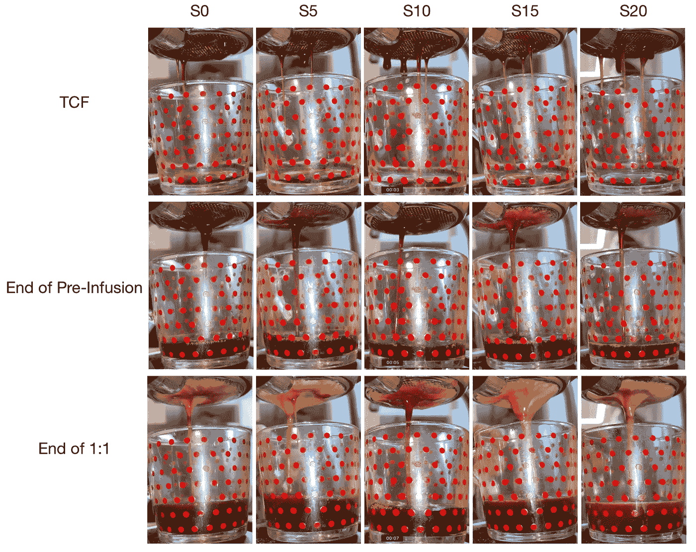

甚至最后的冰球也不同于正常的镜头，因为它们更好地保持了它们的形状。

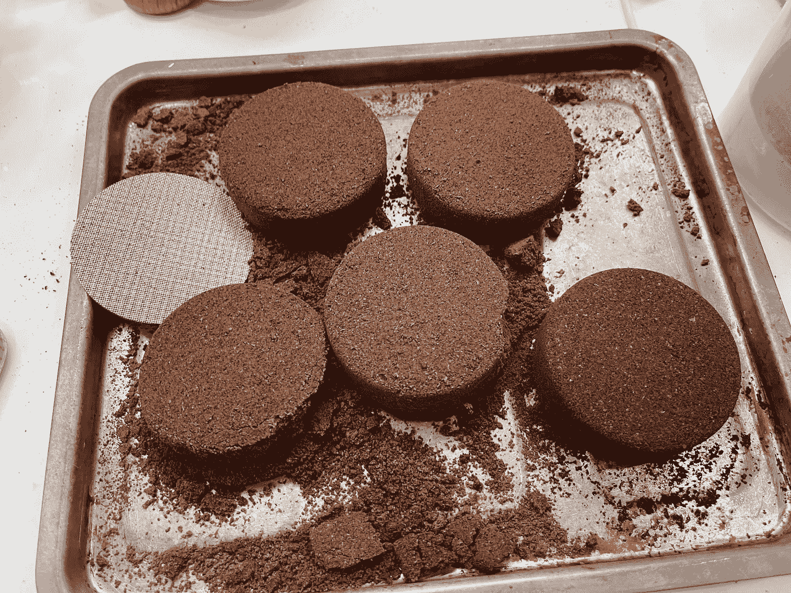

仔细观察圆盘，没有发现任何通道；低流量区域最终会比圆盘的其他部分更暗。随着设置的增加，颜色会稍微变暗，但这可能只是白平衡或场景照明。

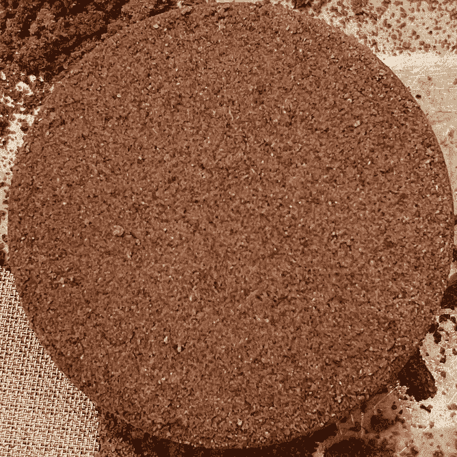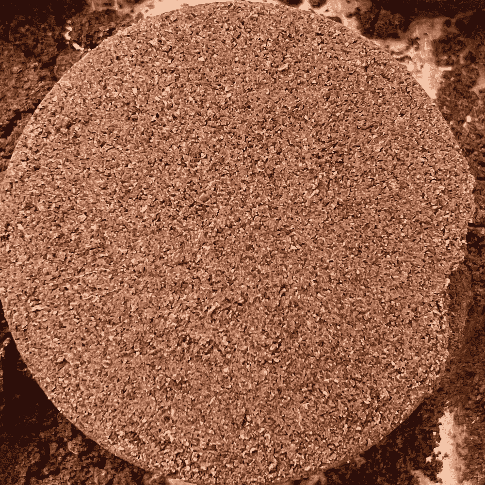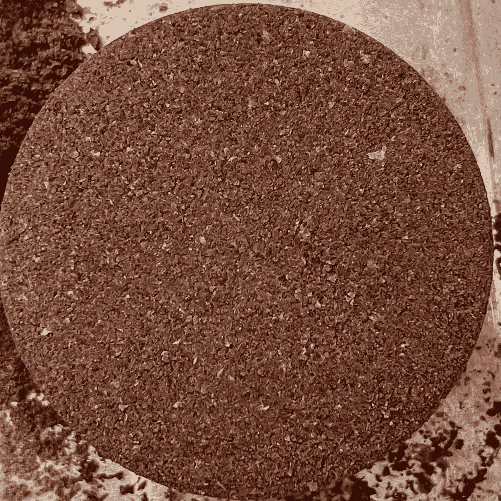

S0、S5、S10、S15 和 S20

# 数据分析

我将从总溶解固体(TDS)和提取率(EY)开始，因为它表明粗磨粒的提取是有限度的。它还显示了比认为可能的更高的提取(> 30% EY)，但这可以用对照样品来解释。

所以控制是用过的咖啡渣，在开发过程中，我重新研磨咖啡并再次运行。第一次运行 grounds 时，我的总 EY 为 2.01%，第二次运行时，我的 EY 为 0.85%，这就是我在此图中使用的值。

所以我根据这两张对照照片的第一张、第二张和第三张的 EY 修正了所有的 EY 值。这意味着我计算提取物的克数，并从对照中减去估计的克数。这里有一个例子来说明计算。

现在，当我们考虑通过控制和最坏情况控制进行调整时，假设咖啡中的总可溶物约为 30%，第三 EY(总 EY)看起来更合理。

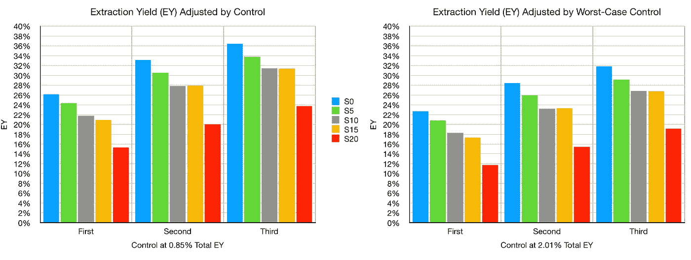

趋势非常明显，但我注意到第二和第三部分的 TDS 在所有镜头中几乎相同。研磨尺寸对初始 EY 影响最大，也许这与预灌注占据第一次注射的一半有关。令人好奇的是，在预注入压力下运行该程序，以查看提取如何变化。

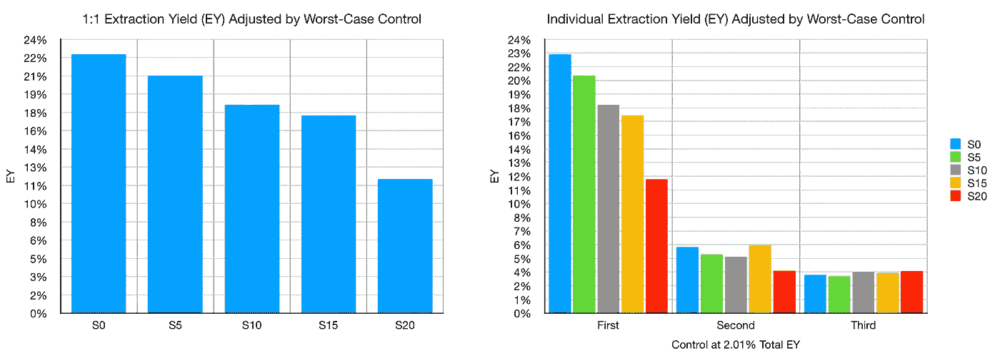

如果我们看一下趋势，似乎最大的下降发生在从设置 15 到设置 20。

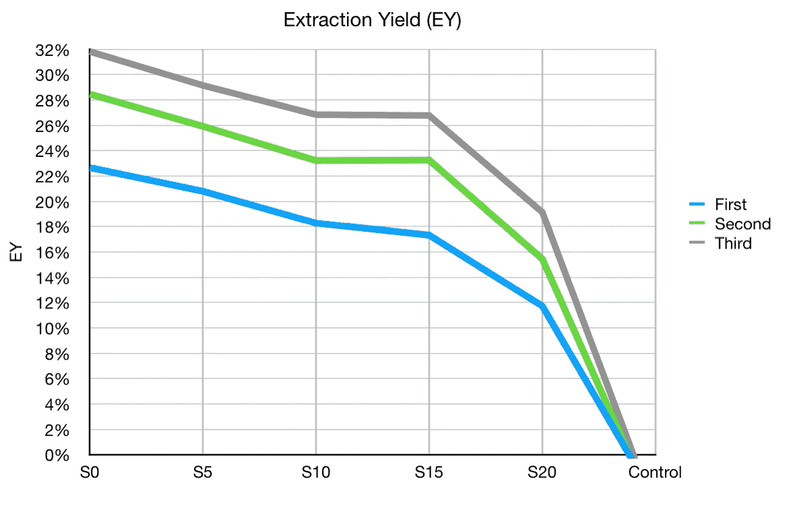

累积 EY

另一种观点:

## 喷射流

既然收集了流量数据，我们就来看看。我用产出重量对时间的原始数据来表示，我调整了咖啡开始装满杯子时的所有流量。

通过估计斜率，设置 15 似乎是一个异常值。

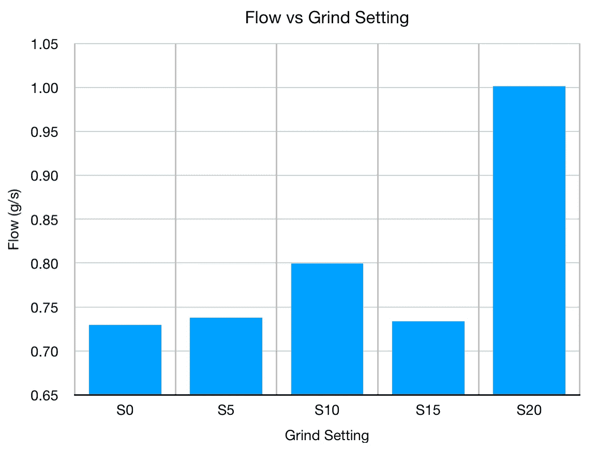

## 拍摄时间

对于拍摄时间，我测量了覆盖过滤器(TCF)的时间，以及我拉第一个和第二个杯子的时间。趋势只是轻微的，除了第一次，我没有足够的时间分辨率来区分对时间的影响。似乎有一个小趋势，但我需要更多的小数点和潜在的更多数据来对结果有信心。

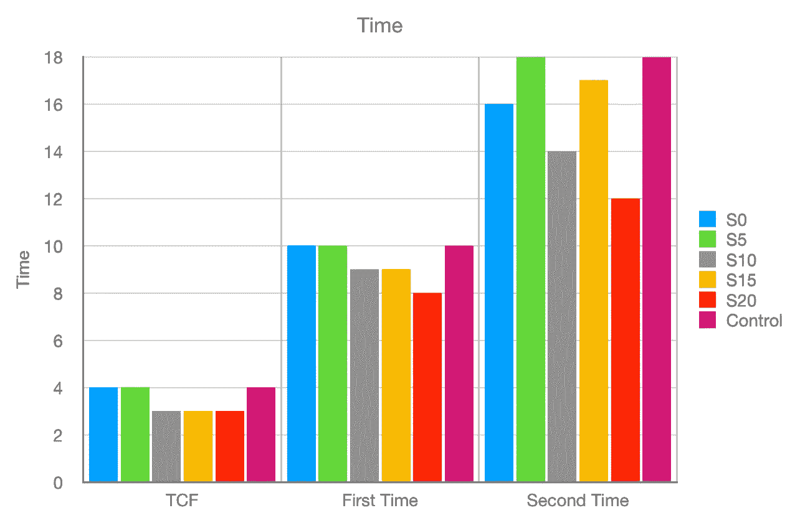

这些实验表明，就提取而言，较大的研磨设置对浓缩咖啡有很大的限制。虽然许多低于 20 的研磨设置在提取率上更接近，但这为如何提高提取率提供了指导。

纸和布的技术之所以有效，是因为它们可以在不产生沟流的情况下变得更精细。分层发射也增加了提取，因为它们减少了局部沟道效应。对于给定的研磨粒度和给定的咖啡豆，有一个基本的限制，虽然这个信息似乎是给定的，但这个实验有助于解决咖啡领域数据匮乏的问题。

如果你愿意，可以在 Twitter 和 YouTube 上关注我，我会在那里发布不同机器上的浓缩咖啡视频和浓缩咖啡相关的东西。你也可以在 [LinkedIn](https://www.linkedin.com/in/robert-mckeon-aloe-01581595?source=post_page---------------------------) 上找到我。也可以关注我[中](https://towardsdatascience.com/@rmckeon/follow)。

# [我的进一步阅读](https://rmckeon.medium.com/story-collection-splash-page-e15025710347):

[浓缩咖啡系列文章](https://rmckeon.medium.com/a-collection-of-espresso-articles-de8a3abf9917?postPublishedType=repub)

[工作和学校故事集](https://rmckeon.medium.com/a-collection-of-work-and-school-stories-6b7ca5a58318?source=your_stories_page-------------------------------------)

[个人故事和关注点](https://rmckeon.medium.com/personal-stories-and-concerns-51bd8b3e63e6?source=your_stories_page-------------------------------------)

[乐高故事启动页面](https://rmckeon.medium.com/lego-story-splash-page-b91ba4f56bc7?source=your_stories_page-------------------------------------)

[摄影启动页面](https://rmckeon.medium.com/photography-splash-page-fe93297abc06?source=your_stories_page-------------------------------------)

[使用图像处理测量咖啡研磨颗粒分布](https://link.medium.com/9Az9gAfWXdb)

[改善浓缩咖啡](https://rmckeon.medium.com/improving-espresso-splash-page-576c70e64d0d?source=your_stories_page-------------------------------------)

[断奏生活方式概述](https://rmckeon.medium.com/a-summary-of-the-staccato-lifestyle-dd1dc6d4b861?source=your_stories_page-------------------------------------)

[测量咖啡研磨分布](https://rmckeon.medium.com/measuring-coffee-grind-distribution-d37a39ffc215?source=your_stories_page-------------------------------------)

[咖啡萃取](https://rmckeon.medium.com/coffee-extraction-splash-page-3e568df003ac?source=your_stories_page-------------------------------------)

[咖啡烘焙](https://rmckeon.medium.com/coffee-roasting-splash-page-780b0c3242ea?source=your_stories_page-------------------------------------)

[咖啡豆](https://rmckeon.medium.com/coffee-beans-splash-page-e52e1993274f?source=your_stories_page-------------------------------------)

[浓缩咖啡用纸质过滤器](https://rmckeon.medium.com/paper-filters-for-espresso-splash-page-f55fc553e98?source=your_stories_page-------------------------------------)

[浓缩咖啡篮及相关主题](https://rmckeon.medium.com/espresso-baskets-and-related-topics-splash-page-ff10f690a738?source=your_stories_page-------------------------------------)

[意式咖啡观点](https://rmckeon.medium.com/espresso-opinions-splash-page-5a89856d74da?source=your_stories_page-------------------------------------)

[透明 Portafilter 实验](https://rmckeon.medium.com/transparent-portafilter-experiments-splash-page-8fd3ae3a286d?source=your_stories_page-------------------------------------)

[杠杆机维护](https://rmckeon.medium.com/lever-machine-maintenance-splash-page-72c1e3102ff?source=your_stories_page-------------------------------------)

[咖啡评论和想法](https://rmckeon.medium.com/coffee-reviews-and-thoughts-splash-page-ca6840eb04f7?source=your_stories_page-------------------------------------)

[咖啡实验](https://rmckeon.medium.com/coffee-experiments-splash-page-671a77ba4d42?source=your_stories_page-------------------------------------)