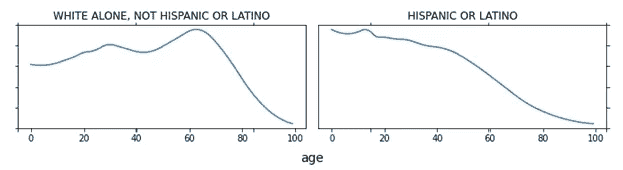
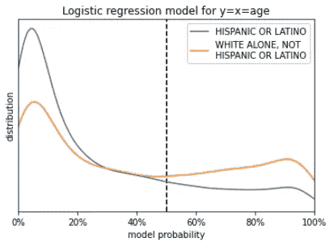

# 衡量年龄差异时的“公平性”

> 原文：<https://towardsdatascience.com/measuring-fairness-when-ages-differ-177d9597dd3b?source=collection_archive---------29----------------------->

## [公平和偏见](https://towardsdatascience.com/tagged/fairness-and-bias)

安娜·范德·斯特尔在 [Unsplash](https://unsplash.com?utm_source=medium&utm_medium=referral) 上的照片

构建公平性度量标准通常包括将人群分成子组，然后检查不同组之间模型性能的差异。例如，您可以按性别划分人口，然后测量女性与男性的准确率和假阳性率。然而，当亚人群的基本年龄分布不同，并且你的结果随年龄而变化时，公平指标的差异是不可避免的，即使没有群体成员的内在影响。这是真的，即使一个模型“调整”年龄。

年龄并不是唯一的——任何关键预测因素的变化都会导致公平指标的差异。然而，我认为年龄值得特别考虑。在美国(和许多其他地方)，种族/民族群体在年龄特征上有很大差异，这有可能影响许多模型[1]。尽管美国总人口中的性别差异没有那么极端，但我发现实际上年龄经常因性别而异——例如，在美国劳动力市场上，女性比男性更年轻，这可能是由于一些出生队列的教育差异和家庭照顾责任[2]。至少在我的经验中，大多数用于建模的人口显示了不同利益群体在公平性度量上的年龄差异。年龄也是一个需要考虑的重要因素，因为它影响人们生活的方方面面，从收入、健康状况到行为。此外，年龄通常被认为是一个敏感的特征，这有时意味着它被忽略，而它的影响可能需要深思熟虑。即使年龄不适合用作决策依据，但在模型验证期间忽略它也可能是一个错误。

例如，假设我们想要对公司员工的 401(k)参与进行建模，也许是为了构建有针对性的电子邮件活动来增加注册人数。当我们构建模型时，我们可能会发现它预测男性的参与率更高。仅仅根据年龄，其中一些是可以预测的；在劳动力中，男性的平均年龄更大，年龄与退休计划的获得和参与有关[3]。此外，假设平均年龄接近职业生涯中期(30-50 岁)，我们预计年龄较大的群体(男性)收入更高[4]，这也可能增加男性的储蓄率。

如果我们检查这个模型的公平指标，我们会看到性别之间的差异，无论年龄是否包括在模型中。如果模型包含年龄特征(或代理)，我们可能会看到男性的假阳性率更高，因为他们更有可能具有中等的参与概率。相比之下，如果不包括年龄，我们可能会预计女性的假阳性率更高，因为我们隐含地假设每个人的“平均”年龄特征，这意味着高估了女性。我还没有提到收入等特征的性别差异，这将导致额外的差异。在评估这个模型时，我们必须注意年龄分布、性别效应以及算法中的错误或偏差造成的差异。

在这篇文章中，我用美国人口普查数据来说明公平指标如何受到人口年龄差异的影响，即使没有任何群体成员的直接影响。计算可以在 Jupyter (Python 3)笔记本上进行[5]。按种族/民族划分的年龄数据从 2019 年美国人口普查中下载，并用于模拟随机和基于年龄的变化过程。

模拟的过程不依赖于种族/民族；不同群体之间的差异仅仅是因为年龄。为简单起见，我只显示两个组的结果，选择一个相对较老的组(只有白人，不是西班牙裔或拉丁裔)和一个相对较年轻的组(西班牙裔或拉丁裔)。为数据构建逻辑回归模型，并在这些种族/民族群体中构建公平性度量。我证明了仅由于年龄分布造成的公平性度量的巨大差异。年龄分层可以部分缓解度量差异。

# 人口年龄特征

人口普查数据可直接下载；这个过程在 Jupyter 笔记本[5]中有说明。我使用的是 2019 年美国社区调查按种族/民族划分的年龄数据(“B01001”表)[1]。这一来源包含按年龄、性别和种族/族裔群体统计的八个种族/族裔群体。计数以不同大小的年龄组提供，例如 18-19 岁与 65-74 岁。我结合了性别统计，并使用平滑法构建了一个更细粒度的分布。这使我能够以一年的分辨率获得按种族/民族划分的*近似*年龄分布。我选择的亚人群的结果曲线如下所示。

两个种族/民族群体的大致年龄分布，基于 2019 年美国社区调查数据[1]。图片作者。

我选择这两个群体，是因为他们相对“年轻”和“年老”。在下面的部分中，我将人群限制在 18 岁以上。我从上述每个分布中随机抽取 5000 个人，总数据集由 10000 个成年人组成，平均分布在各个种族/民族群体中。

在我的样本中，西班牙裔或拉丁裔群体的成年人口年龄中值为 43 岁，而非西班牙裔或拉丁裔群体的白人年龄中值为 53 岁。这些中值差异很大(~10 年)，但白人在高年龄时相对“肥胖”的尾巴也有助于预测和度量值的差异。具有相似中间值但极端值不同的人群会显示出很大的差异，特别是当年龄效应是非线性的时候(这里，我使用一个简单的线性模拟)。

# 模拟和建模

我模拟了一个简单的二元过程，这个过程依赖于一个变量，这个变量独立于年龄和种族/民族，并且随着年龄线性增长。对于样本中的每个人，我将概率构造为:

*概率* = -6 + *x* + 0.1 * *年龄* +(随机噪声)

在上面的例子中，年龄是以年来衡量的，x 具有随机正态分布。随机噪声分量是随机正态的，但权重为 0.1。选择模拟系数，使基本比率约为 1/3 的阳性结果，并使年龄和 x 的相对影响相似。我使用上述概率从每个案例的二项分布中抽取样本，给每个人分配一个二元(0/1)结果。

然后，我将模拟的二进制结果拟合到一个逻辑回归模型，即 *y* = *x* + *年龄*。由于我的模拟过程与我的模型匹配得如此之好，我的拟合产生了输入系数； *x* 的模型系数为 1.029823，*年龄*的系数为 0.10084。然后，我对 sklearn.linear_model 使用 predict()函数。LogisticRegression 对象为每个人生成结果(这实际上是一个 50%的阈值)。公平性度量，例如假阳性率，是通过比较模拟结果与模拟结果来构建的。

# 公平性度量结果

我查看了三个常见的公平性指标:假阳性率、假阴性率和模型准确性。下表显示了选定种族/民族群体的结果:

模型 *y* = *x* + *年龄*按种族/民族分组的公平性度量结果。

这两种人群的错误率有很大不同。单独白人组的假阳性率是两倍多，而假阴性趋势相反，西班牙裔或拉丁裔组的错误率几乎是两倍。

虽然在这个简单的例子中，两组的准确性度量是相似的，但是在一个更复杂的模型中，决策阈值是可调的，我们可以看到这个度量是变化的。例如，通常通过最大化 f1 度量来设置阈值。这通常将决策阈值推向更低的概率值，潜在地降低了更可能产生积极结果的组的准确性。

# 度量差异是意料之中的

这两类人群在公平性方面的差异并不令人惊讶。研究人员已经表明，对于基础率不同的校准模型来说，误差率差异是不可避免的[6，7]。

我的简单示例是一个近乎完美的模型，这意味着模型概率与个别情况下的“实际”概率非常相似(对于大多数应用程序，实际的个人概率是不可知的)。根据定义，这个模型是非常精确的。虽然这个例子是不现实的，但它提供了文献中概述的原则的可视化描述。如果我们按种族/民族检查模型概率的分布，我们会看到:

按种族/民族划分的模型输出直方图。图片作者。

以误报为例。阳性预测可以由位于虚线右侧的概率分布曲线部分下面的区域表示，该区域表示 50%决策阈值。假阳性是(1-概率)乘以曲线的积分。因此，因为只有白人，而不是西班牙裔或拉丁裔曲线在虚线的右侧具有更大的权重，特别是在不接近 100%概率的地区，我们预计会有更多的假阳性。

很难想象在曲线上我们会看到相同的假阳性率和不同的总体率。Kleinberg 等人表明，这种情况可能发生在琐碎的条件下——例如，当我们完全知道每个人的结果，没有假阳性或假阴性时；这将由两组在 0%和 100%的双峰表示[6]。

在现实世界的模型中，概率不会如此完美地反映潜在的过程，但我们仍然希望当基本利率不同时，模型概率分布曲线不会重叠。一个群体的曲线将更多地向其他群体的右边或左边移动。根据决策阈值的位置，我们在图中产生假阳性或假阴性的区域有更大的“权重”。

# 将年龄纳入公平指标

一个潜在的缓解年龄差异的策略是按年龄对人群进行分层，然后比较年龄组内的种族/民族结果。针对假阳性率，这种解决方案的一种尝试如下所示:

在 y = x +年龄模型中，按种族/民族和年龄段划分的假阳性率。

在上面，我们看到按年龄分层有助于减少指标的差异。然而，一些差异仍然被认为是有意义的。例如，对于 40-69 岁的年龄组，白人的假阳性率比西班牙裔或拉丁裔高 51%。这是因为潜在的白人群体，而不是西班牙裔或拉美裔群体，有更多的人接近年龄上限，而西班牙裔或拉美裔群体倾向于低端。

选择要检查的年龄组可能很棘手，尤其是在数据有限的情况下。在年龄组内，年龄分布的形状最好是相似的，或者是平坦的。在实践中，如果不使用细粒度的年龄级别，这可能很难实现。在美国，只有白人，而不是西班牙裔或拉丁裔群体在 70 岁左右有一个大的峰值，而大多数其他人口在该值附近显示出下降趋势。有时，特定的年龄水平与您正在建模的过程相关；例如，教育储蓄、退休和健康保险资格都有特定的或截止年龄。因此，在选择存储桶时，业务问题和年龄分布形状都很重要。

虽然按年龄分层是一种艺术形式，但即使是简单的划分也会产生明显的效果，这可以帮助你决定年龄是否需要进一步考虑。因此，即使只有两个大桶，通常也值得按年龄对公平性指标进行分层。

# 包括还是忽略年龄

一个误解是，如果一个模型“调整”(合并)年龄，公平指标也将被纠正。然而，因为年龄影响基本费率，我们期望公平性度量差异，包括准确性和错误率差异，无论模型是否包含年龄。上面，我已经展示了即使是一个包含年龄的近乎完美的模型的差异。

如果我构建一个忽略年龄的模型，精度会下降，这是意料之中的，因为这个模型不是模拟过程的完美近似(见 Jupyter 笔记本[5])。如果没有年龄分层，种族/民族类别之间的一些指标看起来更相似，主要是因为错误率对每个人来说都更糟。同样，按年龄分层减少了群体度量差异。

在这个模型中加入年龄在某种程度上就像“水涨船高”——它降低了总体错误率。然而，包含年龄可能会使模型显得不太公平，因为群体差异可能会变得更加明显。

# 最后的想法

似乎与种族/民族、性别等相关的公平性度量差异。，可能有年龄的原因。即使当一个模型包含了年龄，甚至没有群体成员的独立影响，这样的“失败”也会出现。

按年龄对指标进行分层可以部分纠正一些指标差异。此外，考虑年龄可能影响结果的机制也很重要。年龄的影响是否主要与另一个因素相关，例如收入、教育、健康状况、婚姻状况或工作级别？还是有独立的作用？是否存在与性别或种族的互动？

决定一个模型是公平还是不公平需要理解差异的原因。如果不考虑年龄效应，试图修正或调整模型以均衡度量标准可能会产生意想不到的后果。此外，因为年龄差异而“原谅”跨(例如)种族/民族群体的错误率差异可能合理，也可能不合理。伦理审查委员会和利益相关者应考虑背景，并询问与年龄分布相关的问题，然后仅根据公平性指标做出判断。

# 参考

[1]美国人口普查局， [B01001 表格](https://data.census.gov/cedsci/all?q=B01001) (2019)，美国社区调查。

[2]国会预算办公室，[影响 25 至 54 岁人口劳动力参与的因素](https://www.cbo.gov/system/files/115th-congress-2017-2018/reports/53452-lfpr.pdf) (2018)，报告，2 月 7 日。

[3]皮尤慈善信托基金，[跨代退休计划的获取和参与](https://www.pewtrusts.org/-/media/assets/2017/02/ret_retirement_plan_access_and_participation_across_generations.pdf) (2017)。

[4]美国劳工部劳工统计局，[2005 年按年龄和性别分列的收入差异](https://www.bls.gov/opub/ted/2006/oct/wk1/art01.htm) (2006 年)，《经济日报》。

[5].v .凯里，GitHub 库，[https://github.com/vla6/Blog_age_fairness](https://github.com/vla6/Blog_age_fairness)。

[6] J. Kleinberg，S. Mullainathan 和 M. Raghavan，[风险分值公平确定中的内在权衡](https://arxiv.org/pdf/1609.05807.pdf) (2017)，《理论计算机科学创新论文集》。

[7] G. Pleiss，M. Raghavan，F. Wu，J. Kleinberg 和 K. Q. Weinberger，[关于公平性和校准](https://arxiv.org/abs/1709.02012) (2017)，神经信息处理系统进展，5680–5689。