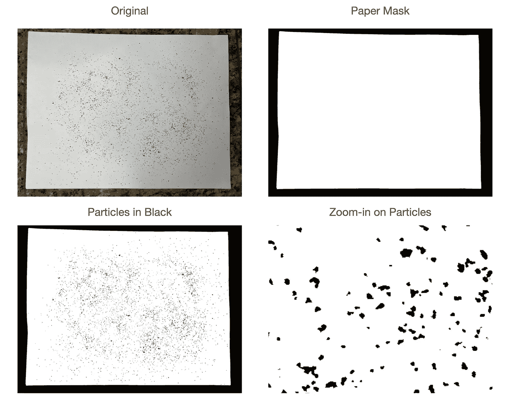
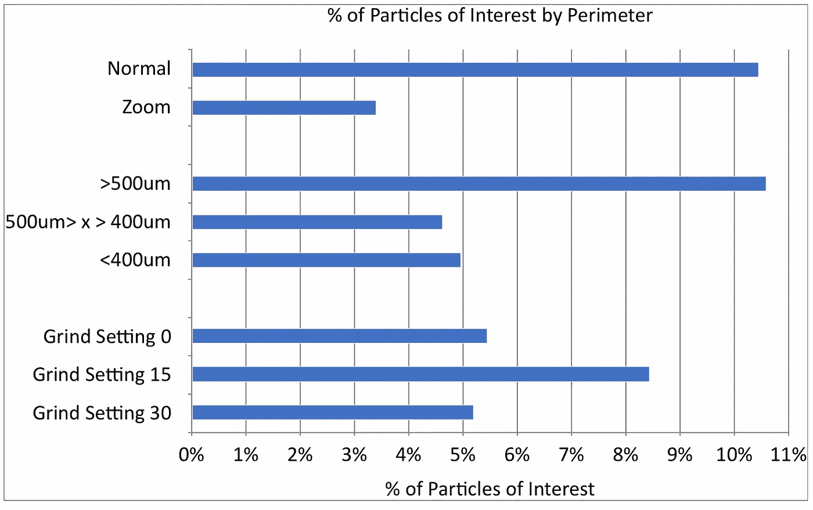

# 使用先进的图像处理技术测量咖啡渣中的微粒

> 原文：<https://towardsdatascience.com/measuring-fines-in-coffee-grounds-using-advanced-image-processing-148f048bdb7?source=collection_archive---------37----------------------->

## 咖啡数据科学

## 使用图像处理了解磨床性能第 3 部分

之前，我探索了如何使用[几个筛子结合成像](https://link.medium.com/dAiasIZU5db)来给出看起来不错的颗粒分布，以帮助检查研磨机。现在，我将深入研究这些图片，看看有什么可以改进和清理的地方。我在一些图片中注意到了一些问题，其中一个令人困扰的问题是微粒聚集在一起或者粘在较大的颗粒上。

# 快速回顾

我拍了一张照片，用一张纸确定了测量地面的真实情况(像素到毫米)，然后用一个阈值来寻找粒子。

所有图片由作者提供

# 连接的组件

在我将咖啡渣的图像转换成二值图像后，我使用连接的组件找到所有的单个粒子:

1.  8-连通性:一个像素与另一个像素相连，如果它在 8 个周围像素中的任何一个。
2.  4-连通性:如果一个像素在上方、下方、右侧或左侧，但不在对角线上，则该像素与另一个像素相连。4-连通性是 8-连通性的子集。

所有图片由作者提供

在这个咖啡颗粒的特写视图中，我注意到一些颗粒以这样的方式连接在一起。

粒子强度的假颜色

所以我在寻找连通分量时切换到了 4-连通性，这似乎让我获得了几个百分比的粒子。

# 重叠粒子

然后我看了一些重叠的粒子。所以我看了一些假彩色的图像。

有一些奇怪的形状。下面，似乎大部分的碎片都有多个粒子重叠。

粒子有许多重叠的方式，尤其是当它们大小不同时，如下图所示:

# 基于形状移除粒子

所以我看了形状的周长和等效直径。如果这些差不多相等，那么这个质点就是一个圆。在最好的情况下，咖啡渣是球形的，但正如我们之前看到的，[咖啡不是圆形的](https://rmckeon.medium.com/coffee-is-not-round-5c102491be4c)。似乎有相当多的粒子不是圆形的，如下图所示:

我专注于宽度超过几个像素的粒子，我想研究周长/Pi:等效直径的比值大于 1.1 的粒子。这个数字是任意的，但我想我会这样开始。有趣颗粒的数量随着我在普通和变焦图片中观察咖啡的方式、通过筛子和通过研磨设置而变化。

所以我看了几个例子:

有可能这些粒子可以用图像强度来分离，但我想我会把它们扔掉。当它们在被成像的粒子总数中没有那么大时，为什么要担心它们呢？

# 颗粒尺寸的亚像素近似

咖啡颗粒的困难在于它们可能非常小。一旦你看到一个 1 x 1 像素的粒子，它大约是 100 微米，你不知道它是否真的更小。所以我用平均像素强度来估计更小的颗粒。

单个 1 像素直径的像素可以处于最大强度或更小。通常，超过几个像素的好粒子在中心具有最大强度，而不是在侧边。考虑到图像中没有其他可能造成混乱的攻击者，这允许更高的分辨率。

# 对粒子分布的影响

让我们从最初的 8-连接开始:

在这里，我们有 4 个连接，我删除了缺乏圆形的粒子，并通过强度作为亚像素近似计算直径:

这里有一个比较，但可能很难看出:

如果我们在不使用筛选知识的情况下观察地面的图像，我们也可以应用这些额外的技术。这些变得更加合理，但是 15 和 30 在这里很难区分。我认为使用少量粉末的筛子对于更精确的测量仍然很重要。

左:8-从地面图像连接，右:4-使用强度连接相同的图像并丢弃坏数据

对单个咖啡颗粒进行成像更加复杂，因为它们并不总是表现良好。使用具有两个筛网的筛子确实大大改进了这种计算，并且使得确定颗粒分布更加容易。但是，这不是首选方法。

如果你愿意，可以在 Twitter 和 YouTube 上关注我，我会在那里发布不同机器上的浓缩咖啡视频和浓缩咖啡相关的东西。你也可以在 [LinkedIn](https://www.linkedin.com/in/robert-mckeon-aloe-01581595?source=post_page---------------------------) 上找到我。也可以关注我[中](https://towardsdatascience.com/@rmckeon/follow)。

# [我的进一步阅读](https://rmckeon.medium.com/story-collection-splash-page-e15025710347):

[浓缩咖啡系列文章](https://rmckeon.medium.com/a-collection-of-espresso-articles-de8a3abf9917?postPublishedType=repub)

[工作和学校故事集](https://rmckeon.medium.com/a-collection-of-work-and-school-stories-6b7ca5a58318?source=your_stories_page-------------------------------------)

[个人故事和关注点](https://rmckeon.medium.com/personal-stories-and-concerns-51bd8b3e63e6?source=your_stories_page-------------------------------------)

[乐高故事首页](https://rmckeon.medium.com/lego-story-splash-page-b91ba4f56bc7?source=your_stories_page-------------------------------------)

[摄影飞溅页面](https://rmckeon.medium.com/photography-splash-page-fe93297abc06?source=your_stories_page-------------------------------------)

[使用图像处理测量咖啡研磨颗粒分布](https://link.medium.com/9Az9gAfWXdb)

[浓缩咖啡过滤器:分析](/espresso-filters-an-analysis-7672899ce4c0?source=your_stories_page-------------------------------------)

[浓缩咖啡过滤篮:可视化](https://medium.com/@rmckeon/espresso-filter-baskets-visualized-189043a8929d?source=your_stories_page-------------------------------------)

[建模咖啡研磨机](/modeling-coffee-gringers-afb7c4949d6b?source=your_stories_page-------------------------------------)

[浓缩咖啡过滤器对比:佩萨多 vs VST](/espresso-filter-comparison-pesado-vs-vst-18a1321e62d?source=your_stories_page-------------------------------------)

[浓缩咖啡篮(VST):有脊与无脊](https://medium.com/swlh/espresso-baskets-vst-ridged-vs-ridgeless-89ac52767f13?source=your_stories_page-------------------------------------)

[IMS superficial vs VST:小样浓缩咖啡过滤器对比](/ims-superfine-vs-vst-a-small-sample-espresso-filter-comparison-4c9233e194?source=your_stories_page-------------------------------------)

浓缩咖啡模拟:计算机模型的第一步

[克鲁夫:对技术状态的进一步分析](https://medium.com/overthinking-life/kruve-further-analysis-on-the-state-of-the-art-18cf2f3b142c?source=your_stories_page-------------------------------------)

克鲁夫咖啡筛:一项分析

[咖啡篮隆隆声:机器人 vs 铂尔曼 vs 体面](/espresso-basket-rumble-robot-vs-pullman-vs-decent-9a63e9963a74?source=your_stories_page-------------------------------------)