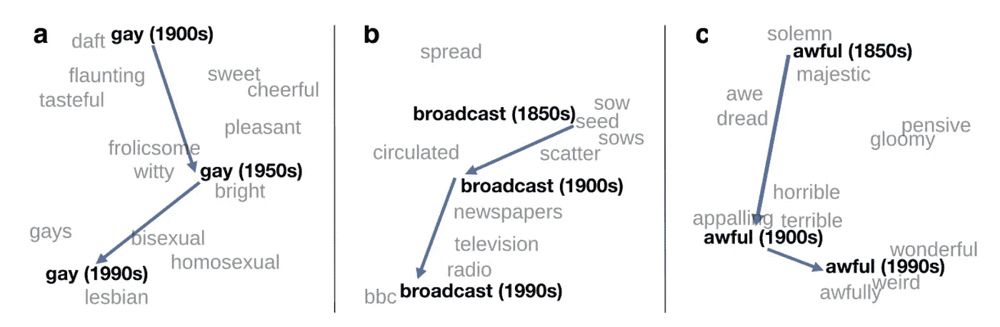
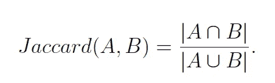

# 使用时间词嵌入测量语义变化

> 原文：<https://towardsdatascience.com/measuring-semantic-changes-using-temporal-word-embedding-6fc3f16cfdb4?source=collection_archive---------10----------------------->

## [思想和理论](https://towardsdatascience.com/tagged/thoughts-and-theory)

## 如何使用时间单词嵌入来测量单词演变的指南，以及关于嵌入方法稳定性的一些考虑

字典的目的是捕捉词义，但是我们可以使用 NLP 来捕捉词义吗？照片由[亚伦·伯顿](https://unsplash.com/@aaronburden?utm_source=medium&utm_medium=referral)在 [Unsplash](https://unsplash.com?utm_source=medium&utm_medium=referral) 上拍摄

如果我想知道单词随着时间的推移是如何变化的呢？例如，我可能想量化某些词(如“面具”或“锁定”)在新冠肺炎疫情之前的使用方式，以及它们在疫情中是如何演变的。从语言和文化的角度以及从政策的角度来看，检测单词的用法如何以及何时随时间变化是有用的(例如，在事件或政策实施之后，某些单词的使用方式是否发生了变化？).

**语义变化**(有时也叫*语义移位*、*语义漂移、*和*语言演变* ) 是指词义随时间的演变。语言学家长期以来一直对测量、研究和量化语义变化感兴趣。单词可以在很长一段时间(即几十年或几个世纪)内发生变化，其中单词的核心含义会发生变化；或者在较短的时间内(即几个月或几年)，由于文化事件(如技术进步)而发生变化。

跟踪语义变化的一种方法是统计原始词频(Hilpert & Gries，2009 年)或统计一个词随着时间推移与另一个词搭配的频率(Heyer，Holz & teres niak，2009 年)。更复杂的工作建立在*分布式语义*的基础上，分布式语义根据一个词的邻居来衡量这个词的语义变化。分布语义学建立在这样的假设上，即出现在相同上下文中的单词往往具有相似的含义。语言学家约翰·弗斯是这一领域的先驱，他在著名的声明中这样描述它:“你可以通过一个人交的朋友来了解这个人”(弗斯，1957)。

下面的例子显示了三个词在几十年里的演变，这在 Hamilton 等人(2016)写的论文中有所描述。我们可以评估在不同时间点最常与关键字相关联的上下文单词，并比较这些上下文来确定单词如何随时间变化。例如,“可怕”这个词在 19 世纪 50 年代已经从威严和庄严的同义词转变为 20 世纪初表示恐怖，20 世纪 90 年代表示怪异和奇妙。下图中的关系是使用**时态单词嵌入捕获的。**

从汉密尔顿等人(2016)写的论文中可以看出，“历时词嵌入揭示了语义变化的统计规律。”此处链接到论文[。](https://arxiv.org/pdf/1605.09096.pdf)

# 什么是时间词嵌入？

最近，使用神经单词嵌入或使用神经网络语言建模方法训练的单词来表示单词变得流行起来。在这种情况下，通过在大型文本语料库上训练，为每个单词学习密集向量。神经单词嵌入扩展了*分布语义*的思想，因为每个单词的向量表示基于其上下文单词的分布。

假设感兴趣的语料库包含与时间戳相关联的文档，则该语料库可以被划分成不同粒度的时间段:几十年、几年、几个月、几周、几天，或者有时甚至几个小时。这完全取决于数据集和项目的上下文。为对应于所选时间段的每个子进程训练单词嵌入。这些嵌入被称为**时间单词嵌入**(也称为历时单词嵌入或动态单词嵌入)。

本文将关注 Word2Vec，因为它训练速度快，并且在磁盘空间和内存消耗方面便宜(Levy，Goldberg，& Dagan，2015)。此外，Word2Vec 是一种流行的测量语义变化的方法，已在许多有影响力的研究论文中使用(作为研究的重点或作为比较的基准)。

还有许多其他方法来训练时态单词嵌入，这不是本文的重点。例如，其他单词嵌入，如 GloVe 和 FastText，可以以类似的方式用于测量语义变化。像 [Compass-aligned 分布式嵌入](https://cade.readthedocs.io/en/latest/readme.html)这样的包使得训练你自己的对齐时态嵌入变得容易(基于 Word2Vec)。基于转换器的模型，如 BERT，也已经被用于跟踪大型文本语料库中的时间性。评估更全面的时态单词嵌入列表超出了本文的范围；更完整的清单，建议读者查阅[库图佐夫等人，(2018)](https://www.aclweb.org/anthology/C18-1117) 或[塔玛塞比等人，(2019)](http://arxiv.org/abs/1811.06278) 所做的调查。

## 使用时间单词嵌入测量变化

回想一下，每个单词对应一个密集的向量表示，这是通过在大型文本语料库上进行训练来学习的。可以在一个时间段计算一个词的**余弦相似度**，在下一个时间段计算同一个词的余弦相似度，以测量语义变化。Montariol (2021)描述了两种可用于跟踪语义随时间变化的方法:

1.  初始漂移，计算在时间 *t=0* 时一个字相对于该字的变化
2.  增量漂移，计算从一个时间片到下一个时间片的字的变化

还可以计算两个感兴趣的单词之间的余弦相似度，以查看这两个单词相对于彼此如何随时间变化。例如，在[论文](http://ceur-ws.org/Vol-2831/paper3.pdf)“基于扩散的时态单词嵌入”(Farhan 等人，2020 年)中，作者展示了单词“COVID”在 2020 年的几个月中与四个单词(中国、流行病、疫情、患者)的余弦相似性。这种方法允许研究人员可视化趋势，例如一个词与其他关键词的相似度如何随时间变化。需要注意的是，作为研究者，你需要提前准备好感兴趣的单词列表。

## 训练时态单词嵌入

在不同时态语料库上独立训练的神经单词嵌入(如 Word2Vec)无法直接比较。为每个时间片学习的向量空间是不同的-也就是说，在相同数据上训练的模型可能产生具有相同最近邻但不同坐标的向量空间(Kulkarni 等人，2014 年)。这是由于单词向量的随机初始化以及处理文档的顺序所产生的训练过程的随机方面(Hellrich & Hahn，2016)。因此，为了确保两个向量空间是可比较的，它们必须通过统一的坐标系对齐。

注意，对于基于计数的嵌入，例如 PPMI(正逐点互信息)，对齐是不必要的，因为可以直接比较所有时间片的共生矩阵的交集。对齐通常通过使用线性变换将所有嵌入空间映射到公共向量空间来完成。对齐向量空间的最流行的方法之一是使用正交 Procrustes 分析来学习两个嵌入空间之间的线性映射，首先由 Hamilton 等人在 2016 年提出。使用正交 Procrustes 来对齐嵌入空间仍然是一种流行的方法，代码和项目是[公开可用的](https://nlp.stanford.edu/projects/histwords/)。

然而，研究也表明不稳定性可能来自对齐时间单词嵌入。而正交 Procrustes 是对齐时间嵌入最常用的方法之一(戈宁，贾瓦哈尔，塞达和戈德堡，2020；Montariol，2021)，它容易受到一些限制。首先，这是一个复杂的对准过程，并且在该过程中可能会引入误差。第二，该方法需要使用所有嵌入空间中词汇的交集来对齐嵌入空间，这意味着不能比较在稍后时间点出现的新词。最后，该程序需要大量的训练数据，这些数据可能无法用于所有的数据集(Dubossarsky、Weinshall 和 Grossman，2017)。

## 单词嵌入的稳定性

除了用于通过线性变换对齐单词嵌入的方法的不稳定性之外，研究人员还对单词嵌入模型的稳定性和脆弱性提出了质疑。例如，可以通过改变不同的超参数来测量单词嵌入模型的稳定性和一致性。Hellrich 和 Hahn (2016)评估单词嵌入的可靠性，通过几个相同参数化的 Word2Vec 模型的前 N 个最近邻居的交集来测量。作者发现，可靠性取决于模型被训练的时期数。此外，基于他们发现用相同的超参数训练的模型产生不一致的最近邻，他们建议训练几个相同参数的模型并将它们组合成一个集成以确保稳健的结果。Pierrejean 和 Tanguy (2018)改变了其他超参数，如体系结构(即 CBOW 和 SGNS)、语料库、上下文窗口大小和嵌入维度大小，发现在不同的嵌入空间中，相同单词的最近邻居有很大的变化。

Antoniak 和 Mimno (2018)通过显示单词嵌入对变量(如文档顺序、语料库大小和随机种子)的微小变化的敏感性，强调了单词嵌入的脆弱性。作者在不同的文档大小和语料库上为四个不同的嵌入模型训练了 50 个模型。对模型进行三种文档顺序设置的训练:*固定*(原始顺序的文档)*混洗*(随机顺序的文档)*自举*(替换取样的文档)。Jaccard 相似性用于比较用每个配置组合训练的模型的前 N 个最近邻。Jaccard 相似性度量两个集合之间共享项目的比例。两个集合 A 和 B 的 Jaccard 相似度计算如下:

Antoniak 和 Mimno (2018)发现，在目标词的最邻近词及其排名方面，词嵌入模型有很大的可变性，即词作为目标词的最近邻近词出现的顺序。对于自举文档来说，这种可变性增加了，因为这放大了“突发”单词的影响，这些单词在本地很常见，但在全球很少见。作者得出结论，由于这种巨大的差异，嵌入不能提供语言或语料库的客观观点，建议未来的研究对多个自举模型的结果进行平均。

作为一种解决方案，戈宁等人(2020)提出了一种替代方法来测量时间变化，而不需要对齐单独的嵌入，他们声称这种方法可能不稳定，不太可靠。作者建议用最近的邻居来代表意义。使用在不同时间语料库上训练的单词之间的前 N 个最近邻居的交集来测量语义变化。该度量用于相同单词嵌入算法的多次运行，并且能够以高稳定性检测语义变化。作者建议使用这种比较时间单词嵌入的更简单的方法，因为它比使用常见的正交 Procrustes 方法进行时间对齐更容易解释和稳定。

# 一个简单的实验

如上所示，虽然为了直接比较它们，有必要对齐在诸如 Word2Vec 的神经方法上训练的时间嵌入，但是这样做太多会引入不稳定性。围绕这个问题的一个解决方案是使用更简单的方法来衡量变化。一种替代方法是在两个不同的时间点测量一个单词的最近邻集的 Jaccard 相似性，而不是对齐并使用余弦相似性来比较不同嵌入空间中的单词。

此外，训练单词嵌入本身可能引入脆弱性。每个时间片仅训练一个单词嵌入可以捕捉有意义的变化，但是也会引入大量噪声。几名研究人员提出的一个解决方案是训练许多模型并对结果进行平均，创建一个模型的*集合*。此外，训练文档可以被混洗或引导，以将更多鲁棒性引入训练过程。

在这里，我将逐步设计最简单的实验来训练时态单词嵌入。

1.  收集你的文本语料库。像处理任何 NLP 项目一样清理文本，然后确定要将文本划分为哪些时间间隔。这可能是几十年到几天的时间，取决于您的数据。您还需要确保有足够的数据来为每个时间间隔的模型定型。例如，如果您每天只有几十或几百个文档，那么您可能希望将时间窗口扩展到一周或一个月。
2.  选择你喜欢的单词嵌入模型。带 SGNS 的 Word2Vec 可能是最容易开始的——[Gensim](https://radimrehurek.com/gensim/models/word2vec.html)对于训练模型来说相当容易。
3.  为每个带时间戳的子公司培训多个(> 50 个)模型。您可以尝试为模型的每次运行改变超参数:随机种子、时期的数量、上下文窗口的大小。您也可以尝试使用不同的文本来训练您的模型-通过打乱文档的顺序，以及使用替换来引导您的文档，以确保某些文档在某些模型中可以多次看到，而在其他模型中根本看不到。对每个时间步长完成该步骤。
4.  您不能对模型间的嵌入进行平均，因为它们不在同一个嵌入空间中，但是您可以在不同的嵌入空间中查找相同单词的最近邻。例如，如果您已经在关于疫情的报纸文章语料库上进行了训练，并且对单词“mask”如何随着时间的推移而演变感兴趣，您可以为每个模型确定单词“mask”的前 50 个最近邻，然后计算这些最近邻的 Jaccard 相似性。更高的相似性得分将表明更大的稳定性——尽管对超参数和训练文档进行了所有的调整，但为单词“mask”学习的向量表示是相当一致的。较低的相似性得分表明较低的稳定性。在每个时间步中完成所有模型的这一步。
5.  选择一个阈值(可以针对每个时间步长，可以针对您感兴趣的每个关键词)来确定哪些词作为最近邻对于每个时间步长是稳定的。例如，您可以确定，如果单词在一个时间步长中有 95%的时间显示为“mask”的最近邻，则这些单词被视为“稳定的”最近邻。在每个时间步中完成所有模型的这一步。
6.  对每个时间步长取稳定的最近邻，计算集合的 Jaccard 相似性分数。这将指示一个单词的最近邻在时间轴上变化了多少。您可以针对您感兴趣的多个不同的关键字完成此过程。
7.  或者，您可以创建一组感兴趣的关键字，并查看每个时间步长的最近邻的 Jaccard 相似性，以生成您自己的度量。您可以随时跟踪该指标，以确定相似性度量在哪个时间点下降或上升。

这些只是入门的建议。你可能想知道最近邻的稳定性和那个词的频率之间的关系。您可能对单词的总体变化感兴趣，并且根据您的语料库，您可以调整阈值来确定稳定的最近邻。你也可能有兴趣看看哪些单词是不稳定的。例如，如果一个单词显示为“mask”的最近邻居，具有非常高的余弦相似度，但只有 30%的时间，那么该单词可能被用于非常特定(但不普遍)的情况。这样的调查将取决于你是否对单词如何随时间变化感兴趣，或者对单词如何被使用的有趣和具体的例子感兴趣。

# 结论

本文试图解释什么是时间词嵌入，以及它们如何被用来跟踪语义随时间的变化。讨论了关于单词嵌入的稳定性和对齐不同嵌入空间的常用方法的问题。描述了设计简单实验的步骤，并讨论了未来项目的潜在途径。时间词嵌入是自然语言处理中一个令人兴奋的研究领域，目前正被用于许多不同的子领域。我希望这个介绍有助于解释其中的一些概念。

# 参考

安东尼亚克博士和米米诺博士(2018 年)。基于嵌入的词语相似度的稳定性评估。计算语言学协会汇刊，6，107-119。

布卢姆尔德湖(1933 年)。语言。英国牛津:霍尔特。(第 573 页)。

Dubossarsky、d . wein shall 和 e . Grossman(2017 年 9 月)。失去控制:语义变化的规律和单词表征模型中的固有偏差。《2017 年自然语言处理经验方法会议论文集》(第 1136-1145 页)。

法尔汉，a .，巴兰科，R. C .，侯赛因，硕士和阿克巴，M. (2020)。基于扩散的时态单词嵌入。

弗斯，J. (1957)。语言学理论概要 1930-1955。牛津。

h .戈宁、g .贾瓦哈尔、d .塞达赫和 y .戈德堡(2020 年)。一种简单、可解释且稳定的方法，用于跨语料库检测具有用法变化的单词。在 ACL 中。doi:10.18653/v1/2020 . ACL-main . 51

汉密尔顿，W. L .，莱斯科维奇，j .，&茹拉夫斯基，D. (2016 年 8 月)。历时词汇嵌入揭示了语义变化的统计规律。《计算语言学协会第 54 届年会论文集》(第 1 卷:长篇论文)(第 1489–1501 页)。德国柏林:计算语言学协会。

Hellrich，j .，& Hahn，U. (2016 年 12 月)。坏公司|神经嵌入空间中被认为有害的邻域。《第 26 届计算语言学国际会议:技术论文》(2785-2796 页)。日本大阪:COLING 2016 组委会。

Heyer，g .，Holz，f .，和 Teresniak，S. (2009 年)。主题随时间的变化——通过主题意义的变化来跟踪主题。(第 228 页)

m .希尔贝特和 S. T .格里斯(2009 年)。评估多阶段历时语料库的频率变化:历史语料库语言学和语言习得研究的应用。文学和语言计算，24 (4)，385-401。

kulkarni v .、Al-Rfou r .、Perozzi b .、s .和 skie na(2014 年 11 月)。语言变化的统计显著性检测。arXiv:1411.3315 [cs]。

库图佐夫，a .，奥夫列里德，l .，希曼斯基，t .，&维尔达尔，E. (2018，8 月)。历时词汇嵌入和语义转移:一个综述。《第 27 届国际计算语言学会议论文集》(第 1384-1397 页)。美国新墨西哥州圣达菲:计算语言学协会。

o .利维、y .戈德堡和 I .达甘(2015 年)。利用从单词嵌入中获得的经验改进分布相似性。计算语言学协会汇刊，3，211–225。

Martinc，m .，Montariol，s .，Zosa，e .，& Pivovarova，L. (2020 年 4 月)。捕捉单词用法的演变:只是增加更多的簇？2020 年网络会议的配套会议录，343–349。

Montariol，S. (2021 年)。使用单词嵌入的历时语义变化模型(巴黎萨克莱大学博士论文)。

皮尔雷让，b .，&坦吉，L. (2018，6 月)。走向定性单词嵌入评估:测量邻居变化。《计算语言学协会北美分会 2018 年会议论文集:学生研究工作坊》(第 32-39 页)。美国路易斯安那州新奥尔良:计算语言学协会。

北达科他州塔玛塞比、洛里博林和阿贾托特(2019 年 3 月)。词汇语义变化的计算方法综述。arXiv:1811.06278 [cs]。