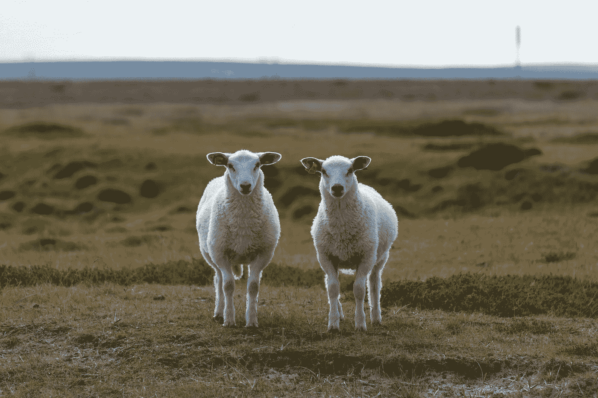
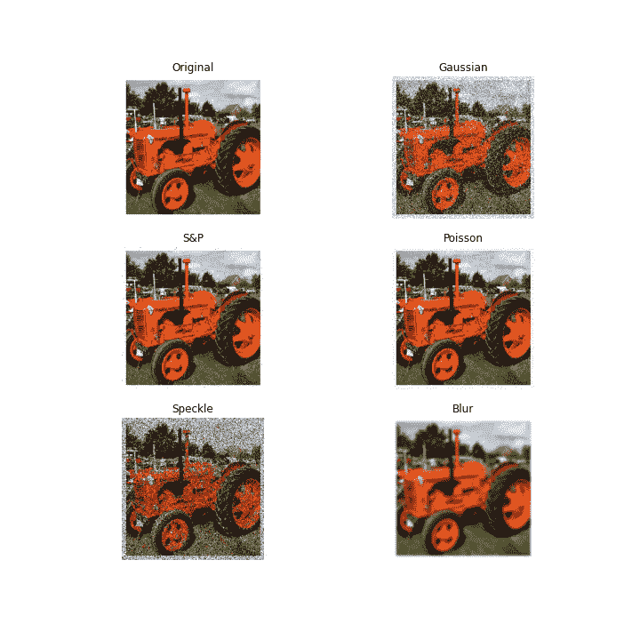
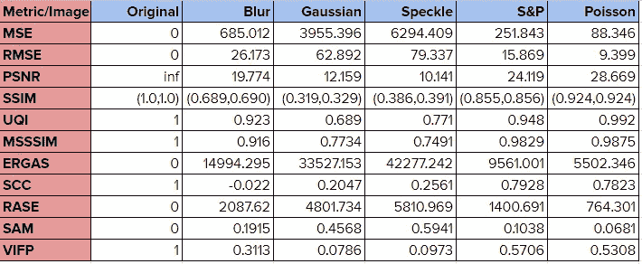

# 使用 Python 度量两幅图像的相似性

> 原文：<https://towardsdatascience.com/measuring-similarity-in-two-images-using-python-b72233eb53c6?source=collection_archive---------4----------------------->

## 了解如何用几行代码在 Python 中实现各种相似性度量。

[约尔根·哈兰](https://unsplash.com/@jhaland?utm_source=medium&utm_medium=referral)在 [Unsplash](https://unsplash.com?utm_source=medium&utm_medium=referral) 拍摄的照片

对于人眼来说，很容易分辨出两个给定图像的质量有多相似。例如，在下面的网格中显示的各种类型的空间噪声中，我们很容易将它们与原始图像进行比较，并指出扰动和不规则性。然而，如果想要量化这种差异，我们需要数学表达式。

图像中不同类型的简单噪声。图片作者。

在本文中，我们将了解如何使用一行代码实现以下相似性度量:

*   均方误差
*   均方根误差(RMSE)
*   峰值信噪比( [PSNR](https://ieeexplore.ieee.org/abstract/document/1284395/) )
*   结构相似指数( [SSIM](https://ieeexplore.ieee.org/abstract/document/1284395/) )
*   全球质量形象指数( [UQI](https://ieeexplore.ieee.org/document/995823/) )
*   多尺度结构相似性指数( [MS-SSIM](https://ieeexplore.ieee.org/abstract/document/1292216/)
*   erreur Relative global adidimensionnelle de synthèse([ERGAS](https://hal.archives-ouvertes.fr/hal-00395027/))
*   空间相关系数( [SCC](https://www.tandfonline.com/doi/abs/10.1080/014311698215973) )
*   相对平均光谱误差( [RASE](https://ieeexplore.ieee.org/document/1304896/)
*   光谱角度映射器( [SAM](https://ntrs.nasa.gov/search.jsp?R=19940012238) )
*   视觉信息保真( [VIF](https://ieeexplore.ieee.org/abstract/document/1576816/) )

[*sewar*](https://pypi.org/project/sewar/)*库可以用来实现所有这些指标(以及更多)。*

*从安装 *sewar* 开始:*

*`pip install sewar`*

*然后导入必要的模块，*

*这些模块很好用，可以直接调用，如下图。*

*对于每种噪声方法，我们可以看到下面的相似性结果。*原始*栏显示原始图像与自身比较后的分数，以便查看 ***理想*** 分数。*

**

*不同类型去噪方法的相似性度量得分*

*每种去噪方法的值都与从上面的图像网格中直观获得的结果相对应。例如，S&P(盐和胡椒)和泊松方法添加的噪声不容易被肉眼看到。然而，我们可以通过仔细观察图像来发现它们。在相似性得分中，我们可以看到，与其他去噪方法相比，S&P 和泊松显示出更接近理想值的值。从其他噪声方法和度量也可以得到类似的观察结果。*

*从结果来看，似乎 ERGAS、MSE、SAM 和 VIFP 可以足够灵敏地捕捉到添加的噪声并返回放大的分数。*

*但是这种简单的量化能有什么用呢？*

*最常见的应用是将重新生成或重建的图像与其原始的干净版本进行比较。GANs 最近在图像去噪和清洁方面做得非常好，这是出了名的[——这些指标可以用来衡量模型在视觉观察之外重建图像的实际效果。使用这些相似性度量来评估大量生成图像的再生质量可以减少在视觉上评估模型的人工工作。](https://iopscience.iop.org/article/10.1088/1742-6596/1550/3/032127/pdf)*

*此外，已经观察到，当与其良性对应物比较时，相似性度量也可以用于突出图像中[对抗性攻击](https://www.sciencedirect.com/science/article/pii/S209580991930503X)的存在。因此，这些分数可以作为量化这些攻击带来的扰动量的度量。*

*让我们在评论中讨论这些图像相似性度量在现实生活中更有趣的应用方式！*

> *请关注并支持一位 AI 爱好者！*
> 
> *感谢您从头到尾的阅读！您可以通过 LinkedIn 联系我，获取任何信息、想法或建议。*