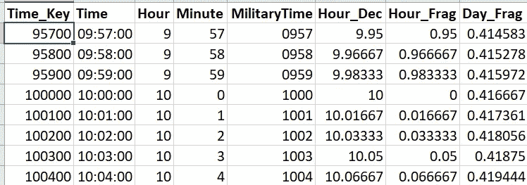
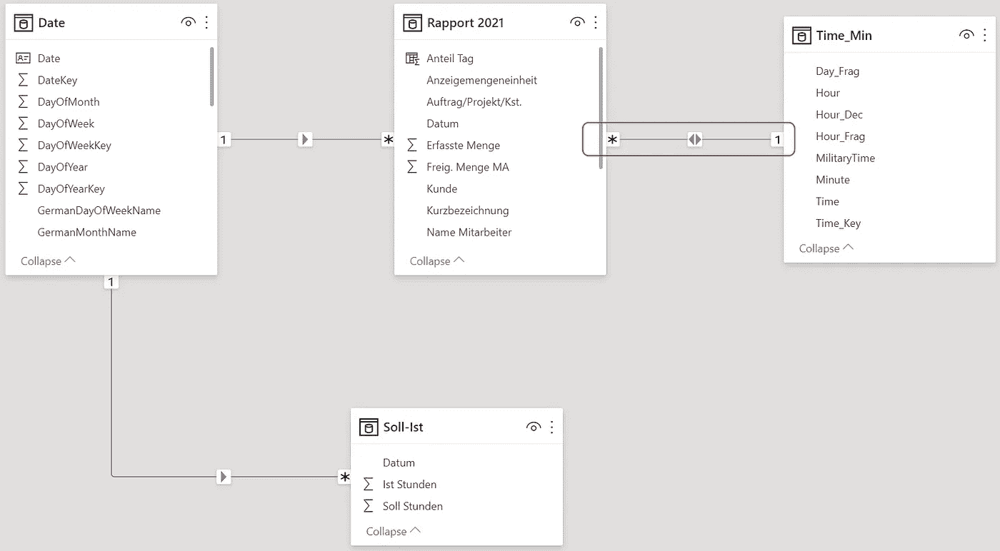
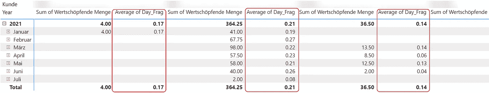
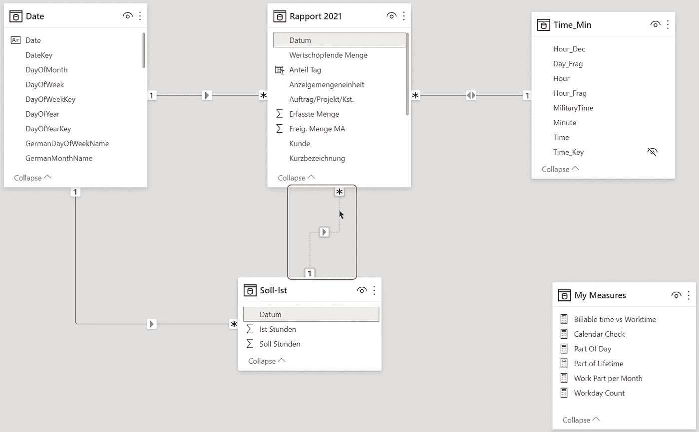
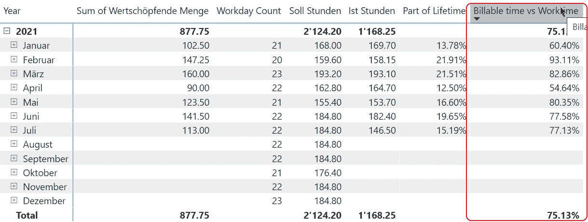
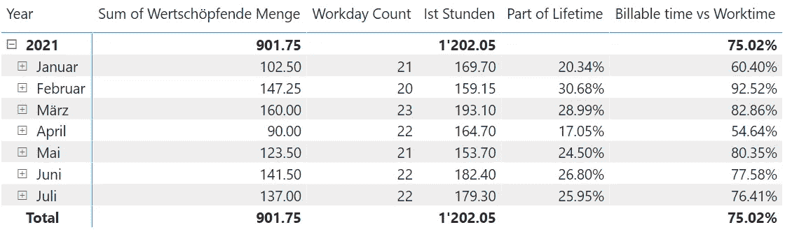

# 在 Power BI 中衡量工作-生活平衡

> 原文：<https://towardsdatascience.com/measuring-work-life-balance-in-power-bi-a7e82ed5204b?source=collection_archive---------46----------------------->

## “我花在工作上的时间占我时间的百分比是多少？”。几天前我向自己提出了这个问题。这篇文章向您展示了我是如何处理这个问题以及如何解决这个挑战的。


由[奥斯丁·尼尔](https://unsplash.com/@arstyy?utm_source=medium&utm_medium=referral)在 [Unsplash](https://unsplash.com?utm_source=medium&utm_medium=referral) 上拍摄的照片

# 介绍

前几天，我问自己:我工作的时间占多少百分比？

作为一个 Power BI 爱好者，我想用 Power BI 来回答这个问题。

这篇文章就像一个日志，在其中你可以看到我是如何处理这个问题的，以及我是如何解决这个问题的。

# 对数据的质疑

首先，问题究竟是什么？

每天，我想知道工作时间占一天 24 小时的百分比。

每月，我想知道与每个月所有日子的小时数相关的平均百分比。另外，我想计算工作时间总和与每月工作时间总和的关系。

我想知道在这两个级别上我的总工作时间与计费时间的比率。

因为我只有实际年份的数据，所以我不必在年份级别计算任何东西。

我有两组数据:

*   按客户列出的所有计费小时列表
*   不分收费与否的工时列表

# 准备数据模型

我将这两个数据集加载到 Power BI 中，并添加了一个日期表。

因为我需要对时间数据进行分析，所以我需要一个时间表。

我创建了一个具有以下属性的时间表:

*   Time_Key
    格式为 hhmmss 的键列，没有前导零
*   时间
    时间栏
*   小时
    当前时间的小时
*   分钟
    当前时间的分钟
*   军事时间
    hhmm 格式的时间，带前导零
*   以分钟为小数的小时
*   Hour_Frag
    每分钟的小时分数
*   Day_Frag
    一天中每分钟的分数

以下是时间表的摘录:



图 1 —我的时间表摘录

我如何计算这些数字的精确公式超出了本文的范围。
想了解详情请留言，我会就这个话题写个描述。

# 调整数据模型

我必须调整我的数据模型:



图 2 —我的数据模型

查看表 Time_Min 和 Rapport 2021(=报告 2021)之间的关系。

因为我想使用 Time_Min 表作为维度和事实表，所以我必须将关系设置为双向过滤。

我怀疑我必须对其他表做同样的事情，因为我想合并表“Rapport 2021”和“Soll-Ist”(=目标与有效小时数)中的数据。

**注意:**表名和列名都是德语，因为我的数据源提供的数据使用了德语。我会尽我所能把一切翻译成英语

# 简单平均数

第一步是看我的数据简单平均的结果是什么。

正如您在下面的屏幕截图中看到的，结果看起来很不正确:



图 3 —第一个平均值结果

平均值将计算所有行的平均值，而不考虑粒度。平均值似乎产生了错误的结果，但它为我指明了接下来要遵循的方法。

计算几天的平均值是没有意义的。我需要得到天数，然后除以小时数。

但是，有一天，平均值是正确的。

# 不同计算的处理

我需要评估计算级别(月或日)，并对这两个级别执行不同的计算。

我将通过以下中间措施来实现:

```
Calendar Check =
SWITCH(TRUE()
    , HASONEVALUE(‘Date’[DateKey]), “Date”
    , HASONEVALUE(‘Date’[MonthKey]), “Month”
    , “Others”
)
```

MonthKey 列标识每年的每个月。例如，2021 年 6 月是 202106

现在，我可以在所有其他测量中使用这个测量的结果，并决定哪个计算是正确的。

# 计算部分生命时间

首先，我想在每月的水平上计算我的工作时间与我一生的比率。

例如:

1.  一天有 24 小时
2.  我一天工作 8 小时
3.  部分工作时间是 8 / 24 = 33.3%

当我处于每月级别时，我不能使用 Time_Min 表，因为它最多只能显示 24 小时。但是，我一个月工作超过 24 小时。

因此，我需要执行以下计算:

```
Work Part per Month =VAR SumOfHours = SUM(‘Rapport 2021’[Wertschöpfende Menge])VAR HoursPerMonth = COUNTROWS(‘Date’) * 24VAR WorkPartPerMonth = DIVIDE(SumOfHours , HoursPerMonth)RETURN
    WorkPartPerMonth
```

SumOfHours 变量包含计费小时数的总和(= wertschpfende Menge)。

变量 HoursPerMonth 计算实际周期中的天数，并将其乘以 24(小时)。

为了只考虑工作日，不考虑周末，我每月用这个时间:

```
CALCULATE(COUNTROWS(‘Date’)
    ,’Date’[IsWorkday] = TRUE()) * 24
```

计算结果通过 SumOfHours 除以 HoursPerMonth 存储在变量 WorkPartPerMonth 中。

第二，我想在每日级别计算相同的比率。

我的数据模型允许我汇总实际工作时间和 Day_Frag 数量，因为两者都是一天的时间，不能超过 24 小时。

现在我可以计算 Day_Frag 的和来得到正确的结果。

当过滤器上下文为每天选择 Time_Min 表中的匹配行时，我可以计算 Day_Frag 的总和来获得正确的结果。

衡量标准如下:

```
Part of Lifetime =
SWITCH(TRUE()
    ,[Calendar Check] = “Date”
        ,SUM(‘Time_Min’[Day_Frag])
    ,[Calendar Check] = “Month”
        ,[Work Part per Month]
    ,BLANK()
    )
```

衡量标准[每月工作部分]有效，其他任何级别也有效。但是，由于我的数据只涵盖了 2021 年，我只考虑了每日和每月的水平。

# 计算工作时间和计费时间之间的关系

现在我必须解决最后一个问题:我想知道我的总工作时间与这两个级别的计费时间的比率。

Soll-list 表包含一个每天小时数的列表，分为两列:

1.  这是我每天必须工作的小时数(目标工作时间)
2.  Ist:这是我一天工作的小时数(有效工作时间)

我开始思考如何计算这个量。

我首先想到的是使用 LOOKUPVALUE()根据 Rapport 2021 表中的日期从 Soll-list 表中获取值。

正如我在另一篇文章中解释的那样，[不要从优化代码开始。可能不是个好主意](https://medium.com/codex/dont-start-with-optimized-code-it-may-not-be-a-good-idea-2e9c6afa85a1)；我喜欢简单优雅的解决方案。我不认为 LOOKUPVALUE 是一个简单的解决方案。

第二种方法是将关系设置为双向过滤。
我不想走这条路，因为这种方法会有不良副作用，

最后，我决定在两个表之间再添加一个关系:



图 Rapport 2021 和 Soll-list 之间的新关系

然后，我创建了一个新的方法来划分这两个数字:

```
Billable time vs Worktime = DIVIDE(
        SUM(‘Rapport 2021’[Wertschöpfende Menge])
        , SUM(‘Soll-Ist’[Ist Stunden])
    )
```

起初，我很惊讶它居然有效:



图 5 —计费时间与工作时间

然后我意识到两个表上的过滤上下文都是通过日期表设置的。所以我不需要再做什么来得到正确的结果。

# 结论

我在报告开发期间写了这篇文章。

我期望在这个例子中有更复杂的代码，因为时间计算可能会很棘手。
幸好没有发生这种情况。

我认为这是由于良好的数据模型。

花时间考虑一个好的数据模型来简化 DAX 代码总是有意义的。

Time_Min 表帮助我计算了结果，尽管我没有使用这个表中的所有列。

但是我得到的最大好处是清楚地定义了需求和我想要回答的问题。
有了明确的要求，我集中精力做我需要做的事情，而不是我喜欢做的事情。

还是那句话，明确需求的时间是值得的。

结果如下:



图 6 —计算结果

如你所见，我 17 %到 31 %的时间花在工作上，75%的工作时间是收费的，考虑到我在 1 月和 4 月休假，而且我在 4 月进行了为期 3 天的培训，这已经不错了。

不幸的是，我在 7 月初失去了一个客户。尽管如此，我仍然有 76.4%的计费工作时间。

我想我可以为这些结果感到高兴。


Ian Stauffer 在 [Unsplash](https://unsplash.com?utm_source=medium&utm_medium=referral) 上拍摄的照片