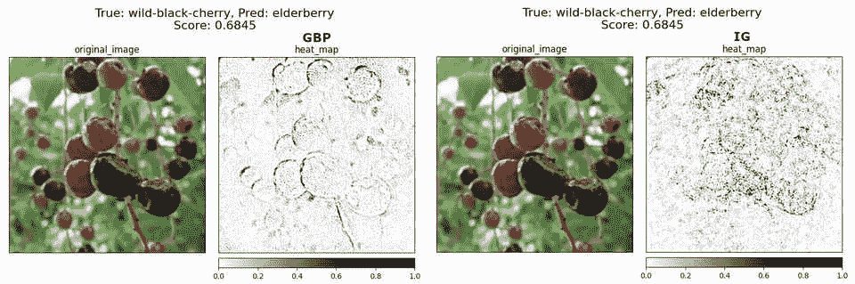
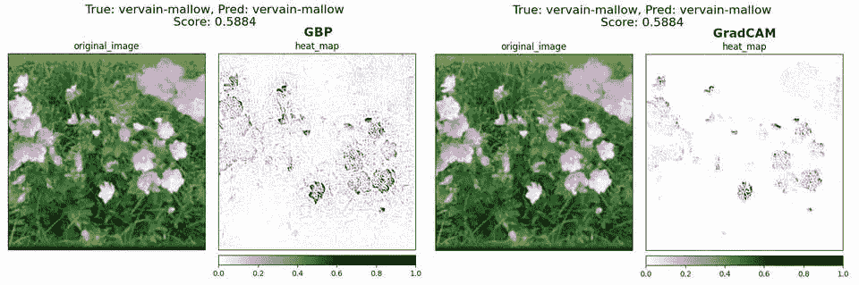
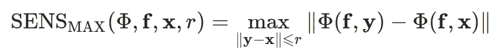
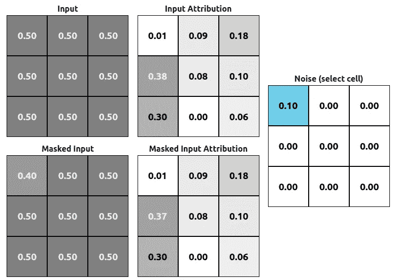
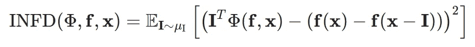
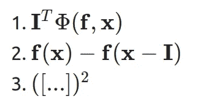
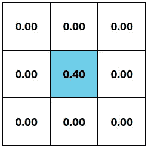
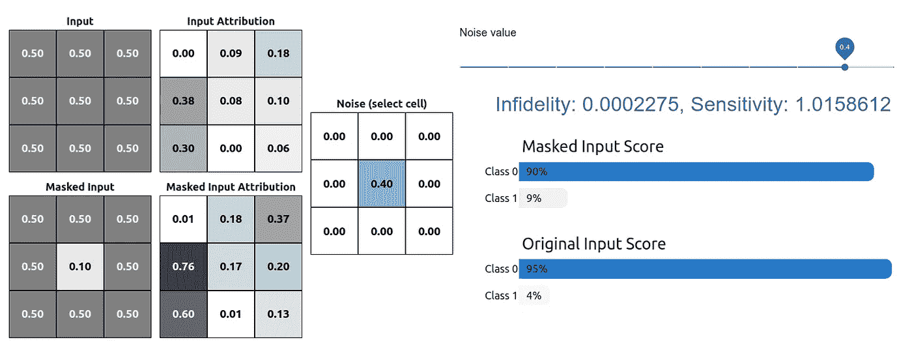

# 用不忠和敏感来衡量 XAI 方法

> 原文：<https://towardsdatascience.com/measuring-xai-methods-with-infidelity-and-sensitivity-a0625770f17b?source=collection_archive---------31----------------------->

## [模型可解释性](https://towardsdatascience.com/tagged/model-interpretability)，理解 ML

## XAI 方法的不忠和敏感性测量背后的直觉。

可解释的人工智能( **XAI** )一年比一年受欢迎。每年我们都有更多的方法来解释我们的模型是如何工作的。大多数方法的唯一问题是比较。

我们有两种方法:

*   定量—基于某个数值
*   定性—基于意见/调查

让我告诉你问题在哪里:

*图 1:相同图像的引导反向传播 vs 集成梯度解释，图像来源:* [*食用野生植物数据集*](https://www.kaggle.com/gverzea/edible-wild-plants)

这里我们用两种方法对同一个预测(由 ResNet18 模型完成)进行了两种解释，[导向反向传播](https://arxiv.org/pdf/1412.6806.pdf) ( **GPB** )和[综合梯度](https://arxiv.org/abs/1703.01365) ( **IG** )。正如你所看到的，预测的类是不正确的，但是为什么它应该是 *elderberry* 的两种解释是完全不同的。作为一个对植物一无所知的人，我会说 GPB 的解释更好，也许是这样的。我们可以问更多的人，最后收集所有的答案，决定哪一个更好。在此之前，让我们跳到一个不同的例子。

*图 2:引导反向传播 vs GradCAM 对同一图像的解释，图像来源:* [*食用野生植物数据集*](https://www.kaggle.com/gverzea/edible-wild-plants)

在这种情况下，我们看到一个不同的方法，叫做 [**GradCAM**](https://arxiv.org/abs/1610.02391) 。这个例子没有上一个例子那么明显。GradCAM 的版本噪点更少(更专注于花卉)，但没有专家，我们无法确定哪一个更好。我们仍然可以进行民意测验，得到一些答案，但是这个答案是有效的吗？当然，我们可以测试 100 张甚至 1000 张图像，并想出一个关于哪种方法更好的好主意，但当我们的数据集有 10k 张图像时，这不会扩大规模，我们需要使用 5 种不同的模型来比较 5 种不同的方法。

这是*定性*方法的一个问题。我们可以比较一些例子，但如果我们想在比较投票中增加另一种方法，这不会给我们提供任何有意义的指标。这里是当*定量*方法来临的时候。定量方法的想法是有某种可复制的度量标准，允许我们比较数值。在[关于解释的(不)保真度和敏感度](https://arxiv.org/abs/1901.09392)、*叶志宽*等人的论文中提出了两个度量(称为**不忠**和**敏感度**)，这应该是对那种解释([显著图](https://en.wikipedia.org/wiki/Saliency_map))的客观评价。

# 灵敏度

让我们从第二个开始，因为它更容易解释。顾名思义，这个测量告诉我们这个方法有多“灵敏”。

## 其中:

*   **φ**是一个解释函数
*   f 是一个黑盒模型
*   **x** 是一个输入
*   ***r*** 叫做*输入邻域半径*

灵敏度定义为输入的微小扰动引起的解释中的**变化。为了计算 **SENS** 值，我们必须进行这些小扰动，并检查我们的属性相对于未改变输入的原始属性是如何变化的。**

> *原文还将那些*、【小扰动】、*称为*、【无关紧要的扰动】、*，这一措辞很重要，因为在衡量不忠时，我们也在实施扰动，但这些扰动是*、【重大扰动】、*。知道其中区别是很好的。*

你可能会问“那个*半径*是怎么回事？”(r 参数)。基本上是均匀分布*U {-r，r}* 的上下界。现在，当我们知道这些参数时，下面是一些例子:

*图 3:原始输入和扰动输入的属性。这不是一个“无关紧要的干扰”,而是一个直观显示差异的干扰，来源:凯末尔·艾尔丹姆*

图三。是在对 3x3x1 图像(灰度)进行操作的简单模型的帮助下做出的。我们从原始的**输入**中减去 **0.1 噪声**，并根据新的**屏蔽输入**计算属性。我们可以看到属性发生了变化( **(2，1)** 在**屏蔽输入属性**网格上的位置)。本例产生的**敏感度值约为 0.01** (稍大一些，因为其他属性也发生了变化，但这种变化非常小)。可能会出现灵敏度值为 0 的情况。

*图 4:零灵敏度示例，来源:凯末尔艾尔丹姆*

这个例子是假的(在下面的应用程序中检查)，但我这样做只是为了告诉你什么时候属性可能等于 0。在这种情况下(图 4 ),我们也应用了一些扰动(在(1，1)位置上为-0.1 ),但是新屏蔽输入的属性保持不变。这是灵敏度值为 0 的唯一情况。IRL 灵敏度值不是基于一个扰动计算，而是基于 10 个或更多个扰动。

# 无信仰

不忠比敏感更复杂一点。结果是获得了比属性更多的值(还有分数和噪声本身)。不忠的等式看起来像:

## 其中:

*   **φ**是一个解释函数
*   f 是一个黑盒模型
*   **x** 是一个输入
*   ***我*** 是一个*显著的摄*

这次我们要处理的是一个重大扰动。这篇文章讨论了很多扰动，但是最后，我们有两个主要的选择:

*   **噪声基线**——仅使用高斯随机向量
*   **正方形移除** —移除像素的随机子集

从实现和使用的角度来看，第一个选项更容易。我们只需要使用高斯分布生成一个与输入形状相同的向量(确切地说，它是一个张量)。所有的 ML 库都已经内置了这个方法。好的，但是这个计算到底是什么样子的呢？

我们可以把不忠等式分成两部分甚至三部分:

## @1

我们需要使用原始输入来计算属性，并将其乘以转置噪声向量。这可能看起来很简单(确实如此)，但是有一件重要的事情需要注意。因为我们使用我们的原始噪声向量，如果它有一些 0 值，那么放置在这些值的转置位置上的属性值将被清除(乘以 0)。

*图 5:只有一个值不等于 0 的噪声，来源:凯末尔艾尔丹姆*

在类似于图 5 中的噪声的情况下，只有来自(2，2)(转置矩阵在这种情况下看起来完全相同)位置的属性值被用于最终得分计算。

## @2

这部分甚至更简单，因为我们只是得到我们的黑盒模型输出，并从扰动前的值中减去扰动后的值。

## @3

这并不完全是一个独立的部分，但是我们不希望有任何负数，所以我们只是平方结果。

# 演示

> 不幸的是，我不能在 Medium 文章中包含应用程序。原始演示可从 https://erdem . pl/2021/03/measuring-xai-methods-with-fifthy-and-sensitivity # demo 获得

现在你知道计算是怎样的了，我准备了一个简单的展示应用程序，你可以玩不同的噪音，并检查它如何影响不忠或/和敏感性。记住，这个例子中的噪声值非常大，通常甚至*显著扰动*也比这个小得多。

演示截图，该应用可在 [https://erdem.pl](https://erdem.pl/2021/03/measuring-xai-methods-with-infidelity-and-sensitivity#demo) 获得，来源:凯末尔艾尔丹姆

此应用程序使用一个模型，该模型采用 3x3x1 输入图像并预测分配给两个类别之一。这只是一个简单的模型，你不应该担心它的有用性(它没有任何用处)。我创建它只是为了展示选定的噪音对不忠和敏感的影响。用更大的网格来显示同样的效果会让人不舒服。

# 结论

我已经介绍了两种方法，可以用来定量测量和比较不同的 XAI 方法。我目前正在写一篇论文，讨论这些方法有多有用，以及我们是否应该用它们来比较不同的方法。

如果您对使用这些方法感兴趣，您可以尝试一下 [Captum 库](https://captum.ai/)以及它们对这些方法的实现:

*   [对 Captum 的不忠](https://captum.ai/api/metrics.html#infidelity)
*   [Captum 中的灵敏度](https://captum.ai/api/metrics.html#sensitivity)

# 参考资料:

*   深度网络的公理化归属，Mukund Sundararajan 等人 2017 [arxiv 1703.01365](https://arxiv.org/abs/1703.01365)
*   力求简单:全卷积网络，约斯特·托拜厄斯·斯普林根贝格等人，2015 年 [arxiv 1412.6806](https://arxiv.org/pdf/1412.6806.pdf)
*   关于解释的保真度和灵敏度，叶志宽等人 2019 [arxiv 1901.09392](https://arxiv.org/abs/1901.09392)
*   Grad-CAM:通过基于梯度的定位来自深度网络的视觉解释，R. R. Selvaraju 等人 2016 [arxiv 1610.02391](https://arxiv.org/abs/1610.02391)

*最初发布于*[*https://erdem . pl*](https://erdem.pl/2021/03/measuring-xai-methods-with-infidelity-and-sensitivity)*。*