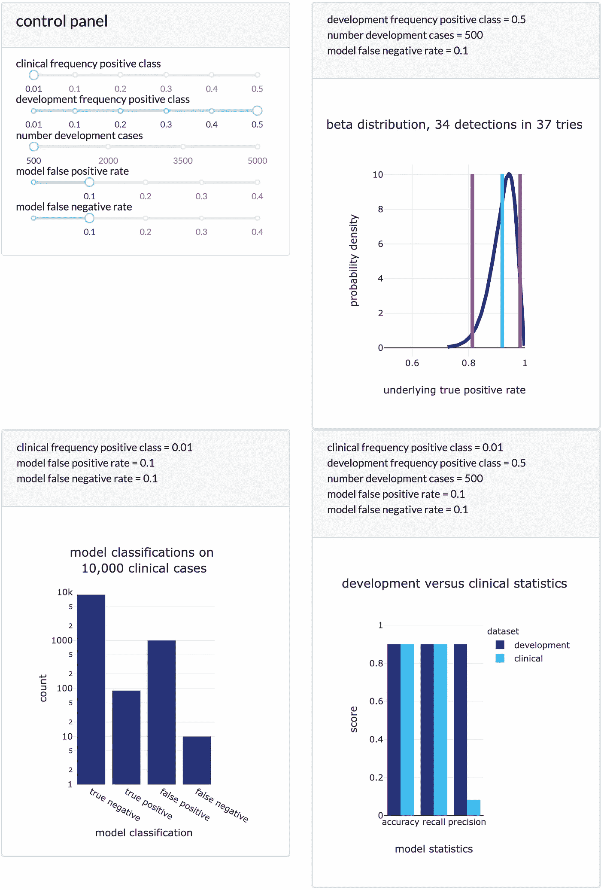
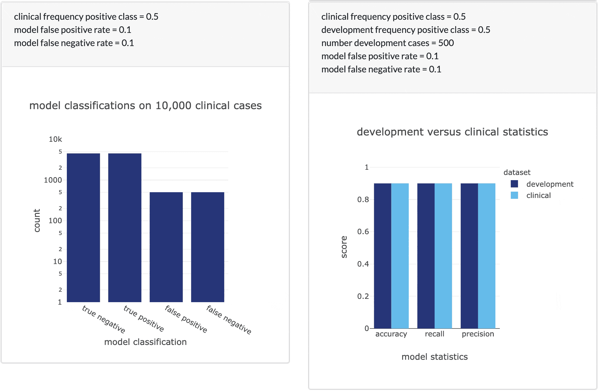
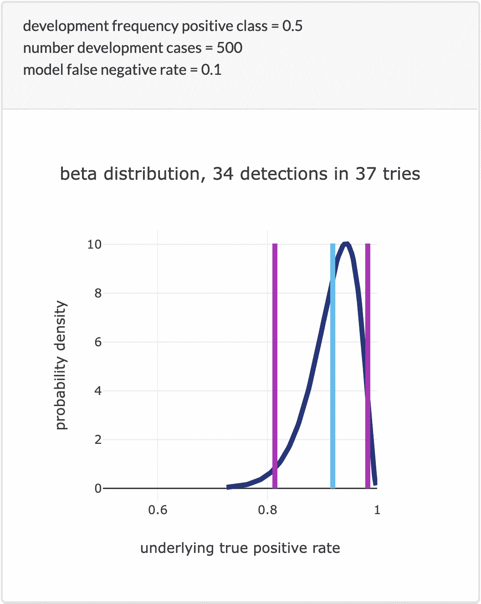

# 医疗人工智能:为什么临床医生向左滑动

> 原文：<https://towardsdatascience.com/medical-ai-why-clinicians-swipe-left-f3bbaa3a660e?source=collection_archive---------12----------------------->

## [行业笔记](https://towardsdatascience.com/tagged/notes-from-industry)

## 你的医疗 AI 会被临床医生拒绝的最常见原因以及如何克服

图片由[艾文·菲利克斯](http://www.evinschuleroils.com/)提供。

所以，你已经找到了工业使用的成功训练算法，现在你想训练一种算法来帮助医生帮助病人。为医学应用开发算法是一项具有挑战性的工作，但也是一项值得做的工作；人工智能有可能彻底改变医学实践，就像自动化已经彻底改变了几乎所有其他行业一样。公共医疗数据集随时可用。Kaggle 和其他网站定期举办医疗应用竞赛。然而，很少有算法被 FDA 批准用于临床。

关于为什么会这样的全面讨论超出了本文的范围([关于这个话题的讨论在网上比比皆是](https://www.google.com/search?q=why+is+medical+AI+so+hard))。然而，本文将帮助您克服医学算法被临床医生拒绝的一个最常见的原因。**数据科学家经常使用数据集开发医疗机器学习模型和神经网络，这些数据集包含与现实世界中看到的非常不同的医疗状况分布。这种差异导致在平衡的、精选的数据集上表现良好的模型在临床上变得几乎无用。为了解决这种差异，研究人员应该使用两个具有不同类别分布的数据集来验证医学应用的模型:一个数据集富含稀有条件，有助于生成统计能力；和第二数据集，其条件分布等于该模型在临床中将面对的分布。**

# 一个例证

想想美国最普遍的癌症:皮肤癌(美国癌症协会 2021)。每年，美国被诊断患有皮肤癌的人数比所有其他癌症的总和还要多。压倒性地，最威胁生命的皮肤癌是侵袭性黑色素瘤，因为黑色素瘤经常在淋巴结、肝脏和大脑等其他器官中不受控制地转移和生长(皮肤癌基金会 2021)。被称为组织病理学专家的组织专家将大多数皮肤生长诊断为良性(想想痣、雀斑、皮肤标签)。在典型的诊所中，不到 1%的皮肤病被诊断为侵袭性黑色素瘤(Ianni 等人，2020)。诊断皮肤损伤的标准实践是通过活组织检查去除生长物，并使用显微镜观察生长物的组织。2015 年，美国进行了超过 500 万次皮肤活检。大多数皮肤病理学或皮肤病理学诊所几乎跟不上大量的活检。单个活检和患者接受诊断之间的时间可以从几天延长到几周，这意味着患者可能被迫等待开始关键的治疗。[由于多种原因，病理学目前正在经历一场变革](https://digitalpathologyassociation.org/about-digital-pathology),从活检的人工显微镜分析转变为对这些活检的高分辨率扫描图像的审查。在这些扫描上训练的计算机视觉模型具有巨大的潜力，可以通过识别可能的侵袭性样本并标记它们以便立即诊断来加快侵袭性疾病的诊断。

让我们想象一个数据科学家想要训练一个模型来检测皮肤活检扫描中的侵袭性黑色素瘤。最简单的方法是收集大约一半黑色素瘤，一半非黑色素瘤的数据集，同时确保收集不同的非黑色素瘤扫描集。让我们想象一下，该模型被训练为在保留的测试集上最大化 F1 分数，并且训练后的模型达到 90%的准确率，同时具有平衡的错误率——这绝非易事。研究人员将这些结果报告给临床合作伙伴，他们一起进行一项初步的前瞻性研究，这意味着他们对未来 6 个月内访问诊所的所有患者进行模型性能测量，以确定模型的效用。

# 问题是

令研究人员震惊和沮丧的是，临床医生在模型中测量的错误率与开发期间测量的错误率相差甚远——检测到的假阳性比真阳性检测多得多。通过模型精度(也称为阳性预测值)来测量模型的阳性检测中为真阳性检测(而不是假阳性检测)的比例。在开发过程中，研究人员测量的精确度接近 90%，但在临床研究中，临床医生发现精确度接近 10%。这意味着有 80%的惊人差距。开发时的表现和学习时的表现怎么会有这么大的差距？

显而易见的答案是，开发过程中数据集的类别分布与模型在临床中面临的类别分布不同。在临床环境中，医生按时间顺序诊断疾病——类别分布遵循一般人群中的疾病患病率。普通人群中良性疾病的患者比罕见的危及生命的疾病多得多——谢天谢地！收集了某个诊所在一段时间内看到的所有病例(例如一年内诊所的所有病例)的数据集具有长尾:大多数观察结果是良性的，只有少数会包含最罕见的或最威胁生命的情况。

在本文中，我们将遵循按时间顺序排列的临床类别分布的数据集称为“顺序数据集”在开发过程中，研究人员使用了一个丰富的数据集，其中包含的黑色素瘤比医生在临床工作量中看到的病例还要多。如果检测罕见疾病的模型在丰富、平衡的测试数据集上得到验证，顺序工作流程中的错误率将不同于模型开发过程中测量的错误率，因为在临床中，模型在对非黑色素瘤样本进行分类时比黑色素瘤样本进行了更多的“尝试”。让我们更详细地讨论这两种类型的数据集。

## 问题的交互式说明

在上面的例子中，开发数据集的属性和临床条件分布的属性导致了开发和临床指标之间的巨大差异。为了说明数据集的属性如何影响开发和临床中的模型性能，[我们在 Google Colab 上包含了一个模拟模型性能的交互式图形](https://colab.research.google.com/drive/1oTMnocwsmiw0yQ2dHJBR-fekVMF7z-xw?usp=sharing)。

五个参数控制模拟，并创建三个图。前两个参数是阳性类别在临床和发展中的频率。第三个参数是开发数据集中案例的数量。最后两个参数是开发期间在测试集上测量的假阳性率和假阴性率。控制每个图的参数显示在图的上方。我们假设建模测试集是整个开发数据集的 15%。

第一个输出图通过显示由测试集中真阳性(α)和假阴性(β)检测的数量参数化的β分布的平均值(天蓝色)和 95%置信区间(品红色)来指示模型真阳性率的不确定性。贝塔分布通过测量观察到的成功和失败的分布从基础事实成功率中产生的可能性来模拟“成功率”中的不确定性(有关更多信息，请参见[贝塔分布—直觉、示例和推导](/beta-distribution-intuition-examples-and-derivation-cf00f4db57af))。有了足够的观察，这个分布的平均值将收敛到模型真阳性率(1 减去假阴性率)，因为参数化率是最有可能产生开发期间测量的真阳性百分比的比率。在开发测试集中有足够的阳性类的观察值时，beta 分布的天蓝色平均值将为 1 减去假阴性率。然而，这个比率并不是唯一的潜在成功率，它可以产生在模型测试期间发现的成功和失败的分布的单一观察。如果该分布的平均值远离峰值，并且如果分布上的误差棒太大，则发育测量的真阳性率没有足够的统计能力，这意味着临床中的真阳性率很有可能与发育中测量的成功率非常不同。

第二和第三个图使用参数化的错误率显示了模型在 10，000 个临床病例上的性能。第一个图显示了每个分类的日志出现次数或计数，第二个图显示了使用这些计数的一些统计数据:准确度、召回率和精确度。

图 1:托管在 Google Colab 上的 Python Plotly Dash 中的一个交互式图形(此处显示截图)，模拟了一个具有平衡或不平衡数据集的模型的开发和临床性能。图片作者。

# 丰富数据集的不足之处

在上面的例子中，模型的临床精度与开发精度如此不同，因为黑色素瘤在病理学家的案例中只占很小的比例。只要开发和临床中阳性类的百分比相差很远，丰富的数据集将提供较差的临床精度估计(图 2)。

图 2:当平衡数据集上的开发精度固定为 90%时，随着临床中阳性类的频率从 50%降低到 1%,临床精度下降。图片作者。

# 序列数据集的不足之处

条件的长尾分布是皮肤癌独有的吗？幸运的是，不是这样的。疾病流行率和疾病侵袭性通常以相关的长尾分布——罕见疾病通常是最威胁生命的。从进化的角度来看，侵略性的常见疾病是灭绝的前兆，以至于英语中有一个术语来形容常见的侵略性疾病:疫情。值得庆幸的是，大流行很少发生，尽管我们现在正经历着一场大流行。然而，这给研究人员留下了两个选择来训练检测威胁生命状况的模型:选项 A，在包含大量罕见状况观察结果的极其庞大的前瞻性数据集上训练；选项 B，在丰富的数据集上训练。选项 A 通常实际上是不可实现的，所以选项 B 仍然是不可避免的最佳选择。

在开发监督二进制分类模型以检测诊断皮肤组织图像中的黑色素瘤时，该模型对最威胁生命的皮肤病类型——侵袭性黑色素瘤表现良好是至关重要的。在包含最近 5000 名去皮肤诊所就诊的患者的活检的庞大数据集中，只有大约 50 个样本预计是侵袭性黑色素瘤。考虑到用于验证和测试的典型数据集划分，研究人员只剩下大约 35 个活检用于训练，7 个活检用于验证和测试。这引发的第一个问题是，很难用如此少的正面类的例子来训练模型——交叉验证只能进行模型开发到此为止。第二个更重要的问题是，这种罕见的、危及生命的条件下的测试实例如此之少，使得生成统计能力来证明这种罕见条件下的良好测试性能极其困难(图 3)。这就是为什么用于疾病检测建模的公共挑战数据集相对平衡的原因——这些数据集已经用来自罕见情况的示例进行了丰富，以提供与真实阳性示例一样多的真实阴性示例。

图 3:随着开发案例数量的增加，真阳性率的界限变得更紧，但是即使是一个非常大的顺序开发数据集，其中阳性类的百分比很小，也没有足够的阳性类的测试观察。图片作者。

# 解决方案

那么，有什么办法呢？如果研究人员只报告丰富测试数据集的统计数据，在临床上罕见情况下的表现将与报告的表现截然不同。如果研究人员仅使用序列数据集开发一个模型，该模型在测量罕见疾病亚型的模型性能时将在统计上不足。如何克服这些问题？

为临床使用开发的模型必须报告连续测试数据集的测试统计数据，以便研究人员测量的性能统计数据与临床产生的统计数据相匹配。如果无法获得连续数据集，则可以在普通人群中观察到的频率下，通过对丰富的测试数据集进行自举随机采样，模拟普通人群中的疾病患病率分布。

为了在检测罕见的、威胁生命的疾病时产生统计能力，还必须使用丰富的数据集来训练医学应用的模型。具有足够稀有类观察值的巨大序列数据集难以收集。稀有类的太少观察导致模型训练差，并且产生对测量的模型性能的信任的能力差。

当报告了强化方案和序贯方案中的表现时，医生可以放心地利用模型，因为医生已经充分了解了模型在罕见的侵袭性疾病中的表现，并且医生对模型在他们的日常临床工作流程中的表现有正确的预期。

通常一个模型可以被调整来减少一种类型的误差，代价是增加其他类型的误差。为了平衡临床中的错误率，具有比精确度更高的临床召回率的可调模型有时可以被调整为更低的假阳性率，同时保持临床精确度相等(通过加权损失函数，或模型预测后处理，以及其他技术)。在模型开发期间调整误差，使得误差在顺序数据集中平衡，这减轻了在开发期间测量的预期性能和在临床中部署的模型的实际性能之间的差异。临床医生需要知道如何期望模型在临床中执行，以及该模型如何在功能强大的数据集上执行，以决定该模型在他们的实践中是否可以接受。

# 最后的想法

算法有很多机会来改善医疗实践，并且每个建模情况都是独特的。在本文中，我们将重点放在开发涉众希望在临床中平衡误差的情况上。训练医学人工智能肯定还有其他有效的目标。例如，如果目标是最大化回忆，即使是低精度的模型也可能对特定的诊所有用。诊所可能会发现获得一组病例的价值，这些病例几乎肯定包含所有阳性病例，即使精确度较低，也可能允许他们有效地对病例进行优先排序。从另一个角度来看这个高召回、低精度的模型，该模型提供了一个非常纯粹的案例集合，这些案例实际上保证*而不是*包含正类。医学人工智能仍然是一个非常年轻的学科，所以医学人工智能最有用的应用可能还没有被发现。

然而，为了开发有用的算法，并能够向医生解释它们的性能，研究人员需要清楚地了解对训练模型有用的丰富数据集和可能的长尾条件的实际临床分布之间的差异。如果人工智能研究人员能够更深入地了解在临床上部署算法的挑战，这些知识将加速医疗实践的人工智能革命，让病人护理变得更好。

## 参考

美国癌症协会。2021.*癌症事实&数字 2021* 。[https://www . cancer . org/content/dam/cancer-org/research/cancer-facts-and-statistics/annual-cancer-facts-and-figures/2021/cancer-facts-and-figures-2021 . pdf](https://www.cancer.org/content/dam/cancer-org/research/cancer-facts-and-statistics/annual-cancer-facts-and-figures/2021/cancer-facts-and-figures-2021.pdf.)

Ianni、Julianna D .、Rajath E. Soans、Sivaramakrishnan Sankarapandian、Ramachandra Vikas Chamarthi、Devi Ayyagari、Thomas G. Olsen、Michael J. Bonham 等。"为现实世界量身定制:一个完整的载玻片图像分类系统，在模拟预期病理学工作量的未切割多站点数据上进行验证."科学报告 10 (3217)。[https://doi.org/10.1038/s41598-020-59985-2.](https://doi.org/10.1038/s41598-020-59985-2.)

皮肤癌基金会。2021.“黑色素瘤概述。”[https://www . skin cancer . org/skin-cancer-information/melanoma/。](https://www.skincancer.org/skin-cancer-information/melanoma/.)