# 医疗成本预测

> 原文：<https://towardsdatascience.com/medical-cost-prediction-4876e3449adf?source=collection_archive---------8----------------------->

## R 中的数据科学

## 能否根据人们的数据准确预测医疗成本？


[Bermix 工作室](https://unsplash.com/@bermixstudio?utm_source=medium&utm_medium=referral)在 [Unsplash](https://unsplash.com?utm_source=medium&utm_medium=referral) 上拍摄的照片

```
**Table of Contents**· [Library](#374c)
· [Dataset](#572d)
· [Data Cleaning](#f78b)
· [Exploratory Data Analysis](#7ae7)
· [Metrics and Validation Strategy](#38e4)
· [Modeling](#49dd)
  ∘ [Linear Regression](#7a27)
  ∘ [Polynomial Regression](#47bb)
  ∘ [Model Evaluation](#9184)
· [Conclusion](#7a50)
```

健康保险公司只有在收取的费用超过其受益人的医疗费用时才能盈利。另一方面，即使某些疾病在某些人群中更为普遍，医疗成本也很难预测，因为大部分资金来自于患者的罕见疾病。本文的目的是根据人们的数据，包括年龄、体重指数、吸烟与否等，准确预测保险费用。此外，我们还将确定影响保险成本的最重要的变量是什么。这些估计可用于创建精算表，根据预期的治疗费用来设定更高或更低的年度保费价格。这是一个回归问题。

# 图书馆

我们将完全使用 r。首先，导入所有需要的库。

```
library(dplyr)          # data wrangling
library(ggplot2)        # graphing
library(caret)          # machine learning functions
library(MLmetrics)      # machine learning metrics
library(car)            # VIF calculation
library(lmtest)         # linear regression model testing
library(GGally)         # correlation plot
```

# 资料组

原始数据集可在 [Kaggle](https://www.kaggle.com/mirichoi0218/insurance) 上获得。在本文中，它已经被随机分为训练和测试数据集。让我们读一读。

```
train <- read.csv("train.csv", stringsAsFactors=TRUE)
test <- read.csv("test.csv", stringsAsFactors=TRUE)
glimpse(train)#> Rows: 1,070
#> Columns: 7
#> $ age      <int> 37, 18, 23, 32, 58, 25, 36, 34, 53, 45, 20, 60, 58, 34, 60, 18, 38, 23, 39, 43, 26, 18, 19, 61, 49, 31, 55, 55, 23, ...
#> $ sex      <fct> male, male, female, male, female, female, male, female, male, male, male, female, female, male, male, female, male, ...
#> $ bmi      <dbl> 34.100, 34.430, 36.670, 35.200, 32.395, 26.790, 35.200, 33.250, 31.350, 24.310, 32.395, 28.700, 27.170, 35.815, 29.6...
#> $ children <int> 4, 0, 2, 2, 1, 2, 1, 1, 0, 5, 1, 1, 0, 0, 0, 0, 1, 3, 5, 1, 1, 0, 2, 1, 1, 1, 2, 1, 0, 1, 1, 0, 0, 2, 2, 0, 0, 0, 1,...
#> $ smoker   <fct> yes, no, yes, no, no, no, yes, no, no, no, no, no, no, no, no, no, no, no, no, yes, no, no, no, yes, no, no, no, no,...
#> $ region   <fct> southwest, southeast, northeast, southwest, northeast, northwest, southeast, northeast, southeast, southeast, northw...
#> $ charges  <dbl> 40182.246, 1137.470, 38511.628, 4670.640, 13019.161, 4189.113, 38709.176, 5594.846, 27346.042, 9788.866, 2362.229, 1...
```

如我们所见，我们得到了这些特征:

1.  `age`:第一受益人的年龄
2.  `sex`:保险签约人性别，女，男
3.  `bmi`:体重指数，提供相对于身高体重相对较高或较低的理解，使用身高体重比的体重客观指数( *kg* / *m* )，理想值为 18.5 至 24.9
4.  `children`:健康保险覆盖的儿童人数，受抚养人人数
5.  `smoker`:吸烟还是不吸烟
6.  `region`:受益人在美国的居住区域，东北、东南、西南、西北。
7.  `charges`:由健康保险支付的个人医疗费用

由于我们预测保险成本，`charges`将是我们的目标特性。

# 数据清理

首先，我们可以从上面看到，每个特性都已经有了正确的类型。让我们检查在训练数据集上是否有任何重复的观察。

```
train[duplicated(train), ]#>     age  sex   bmi children smoker    region  charges
#> 268  19 male 30.59        0     no northwest 1639.563
```

有一个。两个人不太可能有相同的年龄、性别、身体质量指数和来自同一地区的孩子，都不吸烟，并且有完全相同的医疗费用。我们可以删除这个重复的行。

```
train <- train %>% distinct()
```

太好了！现在，我们检查缺失值。

```
colSums(is.na(train))#>      age      sex      bmi children   smoker   region  charges 
#>        0        0        0        0        0        0        0colSums(is.na(test))#>      age      sex      bmi children   smoker   region  charges 
#>        0        0        0        0        0        0        0
```

厉害！没有缺失值。

# 探索性数据分析

这里有一些描述性统计数据。

```
summary(train)#>       age            sex           bmi           children    smoker          region       charges     
#>  Min.   :18.00   female:543   Min.   :15.96   Min.   :0.00   no :850   northeast:249   Min.   : 1122  
#>  1st Qu.:26.00   male  :526   1st Qu.:26.32   1st Qu.:0.00   yes:219   northwest:253   1st Qu.: 4747  
#>  Median :39.00                Median :30.40   Median :1.00             southeast:294   Median : 9447  
#>  Mean   :39.11                Mean   :30.73   Mean   :1.08             southwest:273   Mean   :13212  
#>  3rd Qu.:51.00                3rd Qu.:34.80   3rd Qu.:2.00                             3rd Qu.:16587  
#>  Max.   :64.00                Max.   :53.13   Max.   :5.00                             Max.   :63770
```

就分类特征而言，除了`smoker`之外，数据集的每个类别都有相似的人数。我们不吸烟的人比吸烟的人多，这是有道理的。`charges`本身价格相差很大，从 1000 美元左右到 64000 美元。

让我们看看`charges`的分布。

```
ggplot(data = train, aes(x = charges)) + 
  geom_density(alpha = 0.5) + 
  ggtitle("Distribution of Charges")
```

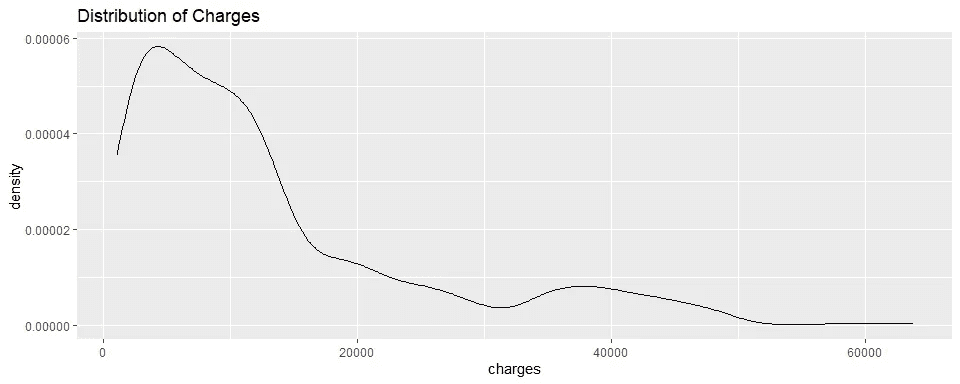

这种分布是右偏的，右边有一条长尾巴。在 40，000 美元左右有一个凸起，也许是另一个隐藏的分布。要挖掘这一点，我们需要分类特征。

```
for (col in c('sex', 'region', 'children', 'smoker')) {
  plot <- ggplot(data = train,
                 aes_string(x = col, y = 'charges', group = col, fill = col)) + 
            geom_boxplot(show.legend = FALSE) + 
            ggtitle(glue::glue("Boxplot of Medical Charges per {col}"))
  print(plot)
}
```

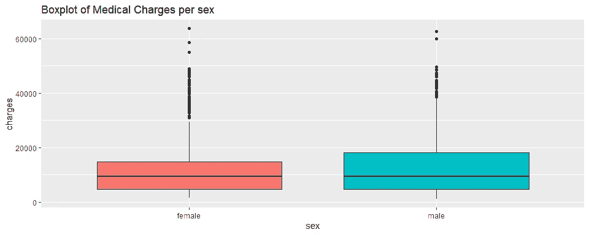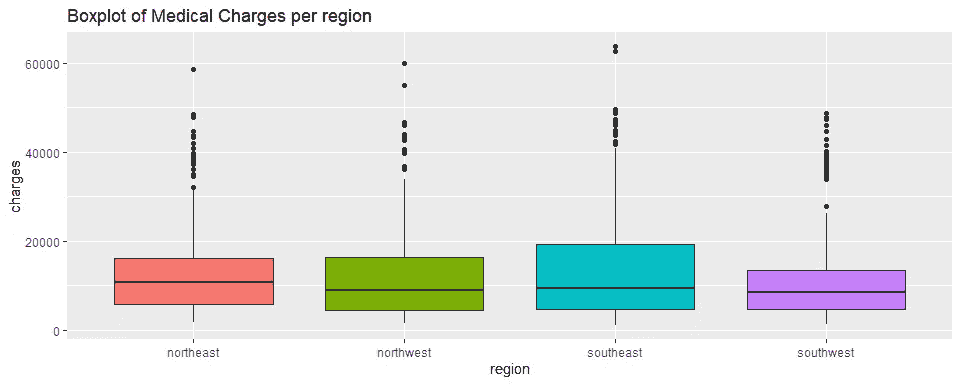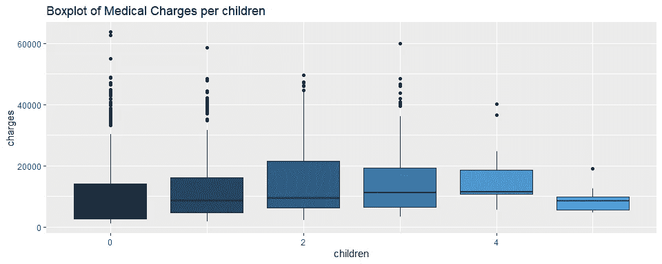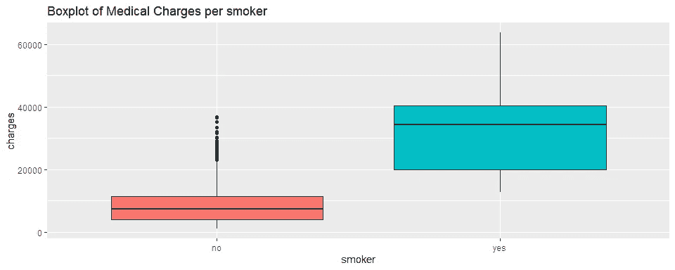

就给出的`charges`而言，`sex`和`region`在每个类别中没有显著差异。我们可以看到随着`children`的增加`charges`有增加的趋势。最后，`smoker`似乎与健康保险给予的`charges`有显著差异。

让我们再次画出`charges`的分布，现在将它们归类到`smoker`中。

```
ggplot(data = train, aes(x = charges, fill = smoker)) + 
  geom_density(alpha = 0.5) + 
  ggtitle("Distribution of Charges per Smoking Category")
```

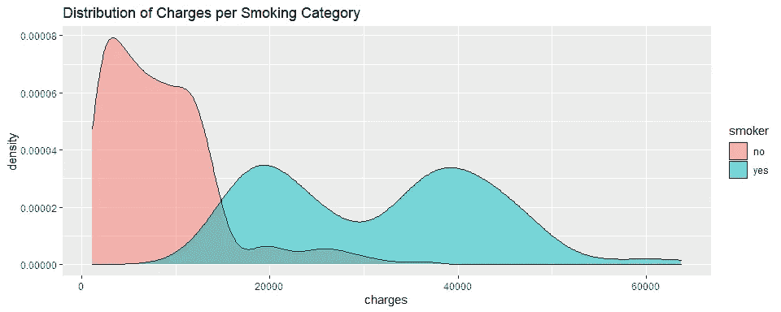

看看我们找到了什么！吸烟者肯定比不吸烟者有更多的`charges`。

下面我们根据`smoker`因子，通过`age`、`bmi`、`children`来分析一下医疗`charges`。

```
for (feat in c('age', 'bmi', 'children')) {
  plot <- ggplot(data = train, aes_string(x = feat, y = 'charges', group = 'smoker', fill = 'smoker', col = 'smoker')) + 
    geom_jitter() + 
    geom_smooth(method = 'lm') +
    ggtitle(glue::glue("Charges vs {feat}"))  
  print(plot)
}
```

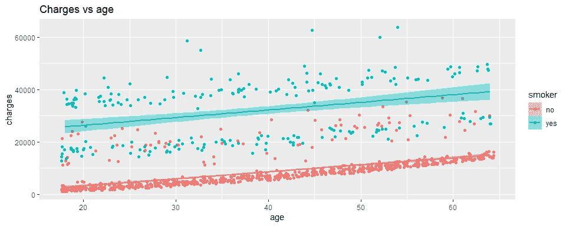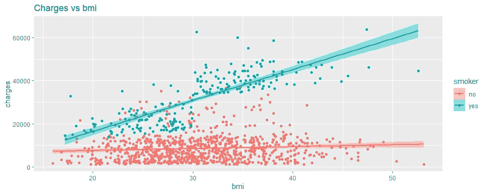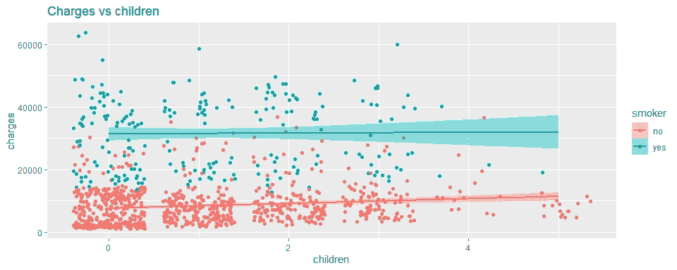

`smoker`似乎对医疗的影响最大`charges`，尽管`charges`与`age`、`bmi`和`children`一起成长。此外，孩子越多的人吸烟越少。

最后，我们有如下特征之间的相关性。

```
ggcorr(train %>% mutate_if(is.factor, as.numeric), label = TRUE)
```

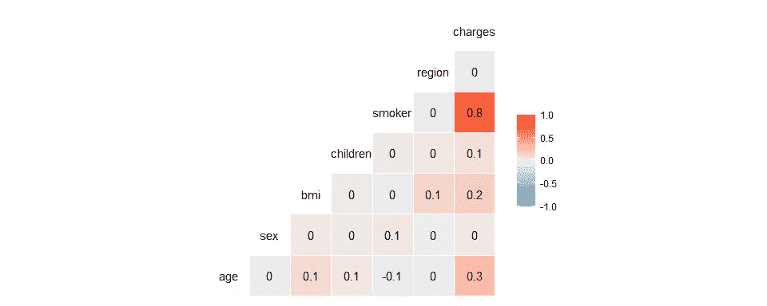

正如我们所看到的，除了`smoker`和`charges`之外，特征之间几乎没有相关性。

# 度量和验证策略

我们将使用平均绝对误差(MAE)、均方根误差(RMSE)和均方根对数误差(RMSLE)作为衡量标准。这三个指标的使用取决于业务角度。为了理解我们的意思，考虑一下`charges`的一次观察的真实价值是 10，000 美元。假设模型预测与真实值完全相同，除了这个模型预测为 *x* 的特定观察值。我们将把 *x* 从$1，000 变到$19，000，并查看产生的错误。

```
true <- 10000
pred <- seq(from = 1000, to = 19000, length.out = 181)
x <- pred - true
rmse <- (x ^ 2) ^ 0.5
rmsle <- ((log(pred) - log(true)) ^ 2) ^ 0.5

par(mfrow = c(1, 2))
plot(x = x, y = rmse, 
     type = "l", 
     main = "Root Mean Squared Error", 
     xlab = "Error (prediction - actual)", ylab = "RMSE")
plot(x = x, y = rmsle, 
     type = "l", 
     main = "Root Mean Squared Logarithmic Error", 
     xlab = "Error (prediction - actual)", ylab = "RMSLE")
```

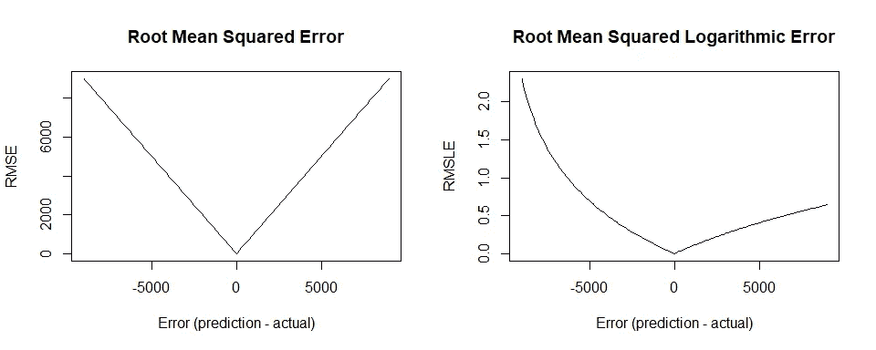

正如我们所看到的，RMSLE 对于实际变量的低估比高估招致了更大的惩罚。另外，RMSLE 度量只考虑预测值和实际值之间的相对误差，误差的大小并不显著。另一方面，如果误差范围增大，RMSE 值的大小也会增大。这意味着当低估不可取时，RMSLE 应该比 RMSE 更有用。

梅和 RMSE 对错误的方向漠不关心。由于误差在平均之前被平方，因此 RMSE 对大误差给予相对较高的权重。这意味着当大误差特别不理想时，RMSE 应该比 MAE 更有用。

了解了指标，我们只需将新数据`test.csv`应用于模型并查看指标得分，即可验证模型的性能。由于数据较少，我们不做 k 重交叉验证。

# 建模

我们将为这个问题建立和训练线性回归模型。首先，让我们使用模型中所有可用的特性。

## 线性回归

线性回归将通过使用*反向消除*的自动特征选择来实现。从使用所有特征开始，*反向消除*过程将迭代地丢弃一些特征并评估模型，直到找到一个具有最低阿凯克信息标准(AIC)的特征。给定一组数据模型，AIC 根据信息损失估计每个模型相对于其他模型的质量。更低的 AIC 意味着更好的模型。我们将使用`step()`函数以贪婪的方式应用*反向消除*。

```
temp <- lm(charges ~ ., data = train)
step(temp)#> Start:  AIC=18667.88
#> charges ~ age + sex + bmi + children + smoker + region
#> 
#>            Df   Sum of Sq          RSS   AIC
#> - region    3   136779757  40475571916 18666
#> - sex       1       43071  40338835230 18666
#> <none>                     40338792158 18668
#> - children  1   294681919  40633474078 18674
#> - bmi       1  4133255306  44472047465 18770
#> - age       1 13330028969  53668821128 18971
#> - smoker    1 95616334451 135955126610 19965
#> 
#> Step:  AIC=18665.5
#> charges ~ age + sex + bmi + children + smoker
#> 
#>            Df   Sum of Sq          RSS   AIC
#> - sex       1      120916  40475692832 18664
#> <none>                     40475571916 18666
#> - children  1   288132465  40763704381 18671
#> - bmi       1  4147134564  44622706480 18768
#> - age       1 13500662196  53976234111 18971
#> - smoker    1 96273590176 136749162092 19965
#> 
#> Step:  AIC=18663.5
#> charges ~ age + bmi + children + smoker
#> 
#>            Df   Sum of Sq          RSS   AIC
#> <none>                     40475692832 18664
#> - children  1   288027795  40763720627 18669
#> - bmi       1  4151671360  44627364191 18766
#> - age       1 13508639838  53984332670 18969
#> - smoker    1 96513856276 136989549108 19965

#> 
#> Call:
#> lm(formula = charges ~ age + bmi + children + smoker, data = train)
#> 
#> Coefficients:
#> (Intercept)          age          bmi     children    smokeryes  
#>    -11905.1        254.9        320.6        429.9      23586.1
```

将最佳模型保存为`lm_all`，然后进行预测。之后，计算指标。

```
lm_all <- lm(formula = charges ~ age + bmi + children + smoker, data = train)
y_pred <- predict(lm_all, test)
mae <- MAE(y_pred, test$charges)
rmse <- RMSE(y_pred, test$charges)
```

要计算 RMSLE，请注意，我们必须让预测和目标变量的值为正，否则对数将导致 NaN。正如我们在下面检查的，我们在预测中确实有一个负值，观测值 149。克服这个问题的一个常见方法是在训练模型之前使用`charges`的`log()`，然后使用`exp()`将预测转换回来。但是，由于我们之前已经使用了线性回归模型而没有取`charges`的`log()`，我们将坚持使用这个模型。带有负面预测的观察值将从 RMSLE 计算中简单地丢弃。

```
y_pred[y_pred <=0]#>       149 
#> -87.05982rmsle <- RMSLE(y_pred[-149], test$charges[-149])
lin_reg <- cbind("MAE" = mae, "RMSE" = rmse, "RMSLE" = rmsle)
lin_reg#>           MAE     RMSE     RMSLE
#> [1,] 3941.464 5672.102 0.5455373
```

我们得到上述误差。对于梅和 RMSE，我们可以将它们解释为模型预测`charges`与真实值分别有 3941 美元和 5672 美元的平均差异。然而，我们不能再用`charges`来解释 RMSLE 了。请注意，RMSE 总是大于或等于梅。其实我们有这个不等式: *MAE ≤ RMSE ≤ √n×MAE* 。

## 多项式回归

我们可以通过*特征工程*来改进我们的模型，具体来说，就是通过创建新的特征来捕捉现有特征之间的交互。这被称为多项式回归。其思想是生成一个新的特征矩阵，该矩阵由次数小于或等于指定次数的特征的所有多项式组合组成。例如，如果输入样本是二维的并且具有[ *a* ， *b* ]的形式，则 2 次多项式特征是[1， *a* ， *b* ， *a* ， *ab* ， *b* 。我们将使用 2 度。

我们不希望在生成多项式组合的过程中包含`charges`，所以我们从`train`和`test`中取出`charges`，分别保存为`y_train`和`y_test`。

```
y_train <- train$charges
y_test <- test$charges
```

从 EDA 我们知道`sex`和`region`与`charges`没有关联。我们可以放弃他们。此外，由于多项式组合对分类特征没有意义，我们将`smoker`突变为数字。

```
X_train <- train %>% 
  select(-c(charges, sex, region)) %>% 
  mutate(smoker = as.numeric(smoker))
X_test <- test %>% 
  select(-c(charges, sex, region)) %>% 
  mutate(smoker = as.numeric(smoker))
```

我们使用下面的公式来应用多项式组合。

```
formula <- as.formula(
  paste(
    ' ~ .^2 + ', 
    paste('poly(', colnames(X_train), ', 2, raw=TRUE)[, 2]', collapse = ' + ')
  )
)

formula#> ~.^2 + poly(age, 2, raw = TRUE)[, 2] + poly(bmi, 2, raw = TRUE)[, 
#>     2] + poly(children, 2, raw = TRUE)[, 2] + poly(smoker, 2, 
#>     raw = TRUE)[, 2]
#> <environment: 0x0000020d27017690>
```

然后，将`y_train`和`y_test`插回到新的数据集。

```
train_poly <- as.data.frame(model.matrix(formula, data = X_train))
test_poly <- as.data.frame(model.matrix(formula, data = X_test))
train_poly$charges <- y_train
test_poly$charges <- y_test
colnames(train_poly)#>  [1] "(Intercept)"                        "age"                                "bmi"                               
#>  [4] "children"                           "smoker"                             "poly(age, 2, raw = TRUE)[, 2]"     
#>  [7] "poly(bmi, 2, raw = TRUE)[, 2]"      "poly(children, 2, raw = TRUE)[, 2]" "poly(smoker, 2, raw = TRUE)[, 2]"  
#> [10] "age:bmi"                            "age:children"                       "age:smoker"                        
#> [13] "bmi:children"                       "bmi:smoker"                         "children:smoker"                   
#> [16] "charges"
```

我们可以看到我们的新数据集`train_poly`和`test_poly`现在有 16 列:

1.  `(Intercept)`是由常数 1 组成的列，这是多项式中的常数项。
2.  `age`、`bmi`、`children`、`smoker`为原始特征。
3.  `age²`、`bmi²`、`children²`、`smoker²`都是正方形的原始特征。
4.  `age x bmi`、`age x children`、`age x smoker`、`bmi x children`、`bmi x smoker`、`children x smoker`是四个特征对之间的六种相互作用。
5.  `charges`是目标特征。

现在，我们准备制作模型。像往常一样，我们从所有的特征开始，使用*反向消除*一路向下。

```
temp <- lm(formula = charges ~ ., data = train_poly)
step(temp)#> Start:  AIC=18196.7
#> charges ~ `(Intercept)` + age + bmi + children + smoker + `poly(age, 2, raw = TRUE)[, 2]` + 
#>     `poly(bmi, 2, raw = TRUE)[, 2]` + `poly(children, 2, raw = TRUE)[, 2]` + 
#>     `poly(smoker, 2, raw = TRUE)[, 2]` + `age:bmi` + `age:children` + 
#>     `age:smoker` + `bmi:children` + `bmi:smoker` + `children:smoker`
#> 
#> 
#> Step:  AIC=18196.7
#> charges ~ `(Intercept)` + age + bmi + children + smoker + `poly(age, 2, raw = TRUE)[, 2]` + 
#>     `poly(bmi, 2, raw = TRUE)[, 2]` + `poly(children, 2, raw = TRUE)[, 2]` + 
#>     `age:bmi` + `age:children` + `age:smoker` + `bmi:children` + 
#>     `bmi:smoker` + `children:smoker`
#> 
#> 
#> Step:  AIC=18196.7
#> charges ~ age + bmi + children + smoker + `poly(age, 2, raw = TRUE)[, 2]` + 
#>     `poly(bmi, 2, raw = TRUE)[, 2]` + `poly(children, 2, raw = TRUE)[, 2]` + 
#>     `age:bmi` + `age:children` + `age:smoker` + `bmi:children` + 
#>     `bmi:smoker` + `children:smoker`
#> 
#>                                        Df   Sum of Sq         RSS   AIC
#> - `age:smoker`                          1      638029 25718637159 18195
#> - `bmi:children`                        1      817883 25718817013 18195
#> - age                                   1     5612815 25723611945 18195
#> - `age:children`                        1     9673381 25727672511 18195
#> - `age:bmi`                             1    26766877 25744766007 18196
#> - `children:smoker`                     1    45654901 25763654030 18197
#> - children                              1    47711668 25765710798 18197
#> <none>                                                25717999130 18197
#> - `poly(children, 2, raw = TRUE)[, 2]`  1    63400816 25781399946 18197
#> - `poly(bmi, 2, raw = TRUE)[, 2]`       1   257208016 25975207146 18205
#> - `poly(age, 2, raw = TRUE)[, 2]`       1   258018286 25976017416 18205
#> - bmi                                   1   446640632 26164639762 18213
#> - smoker                                1  2015205306 27733204436 18275
#> - `bmi:smoker`                          1 13705549198 39423548327 18651
#> 
#> Step:  AIC=18194.73
#> charges ~ age + bmi + children + smoker + `poly(age, 2, raw = TRUE)[, 2]` + 
#>     `poly(bmi, 2, raw = TRUE)[, 2]` + `poly(children, 2, raw = TRUE)[, 2]` + 
#>     `age:bmi` + `age:children` + `bmi:children` + `bmi:smoker` + 
#>     `children:smoker`
#> 
#>                                        Df   Sum of Sq         RSS   AIC
#> - `bmi:children`                        1      828285 25719465444 18193
#> - age                                   1     4976641 25723613800 18193
#> - `age:children`                        1     9825302 25728462461 18193
#> - `age:bmi`                             1    26787718 25745424877 18194
#> - `children:smoker`                     1    45119820 25763756979 18195
#> - children                              1    47286634 25765923793 18195
#> <none>                                                25718637159 18195
#> - `poly(children, 2, raw = TRUE)[, 2]`  1    63295487 25781932646 18195
#> - `poly(bmi, 2, raw = TRUE)[, 2]`       1   257419441 25976056600 18203
#> - `poly(age, 2, raw = TRUE)[, 2]`       1   257631866 25976269025 18203
#> - bmi                                   1   447419331 26166056489 18211
#> - smoker                                1  2445531784 28164168943 18290
#> - `bmi:smoker`                          1 13756292505 39474929664 18651
#> 
#> Step:  AIC=18192.76
#> charges ~ age + bmi + children + smoker + `poly(age, 2, raw = TRUE)[, 2]` + 
#>     `poly(bmi, 2, raw = TRUE)[, 2]` + `poly(children, 2, raw = TRUE)[, 2]` + 
#>     `age:bmi` + `age:children` + `bmi:smoker` + `children:smoker`
#> 
#>                                        Df   Sum of Sq         RSS   AIC
#> - age                                   1     5196666 25724662109 18191
#> - `age:children`                        1    11062155 25730527598 18191
#> - `age:bmi`                             1    27346149 25746811593 18192
#> - `children:smoker`                     1    46443285 25765908729 18193
#> <none>                                                25719465444 18193
#> - `poly(children, 2, raw = TRUE)[, 2]`  1    63858086 25783323530 18193
#> - children                              1   101526014 25820991458 18195
#> - `poly(bmi, 2, raw = TRUE)[, 2]`       1   256592182 25976057625 18201
#> - `poly(age, 2, raw = TRUE)[, 2]`       1   258013469 25977478912 18201
#> - bmi                                   1   446982085 26166447529 18209
#> - smoker                                1  2466700190 28186165633 18289
#> - `bmi:smoker`                          1 13890308278 39609773722 18652
#> 
#> Step:  AIC=18190.98
#> charges ~ bmi + children + smoker + `poly(age, 2, raw = TRUE)[, 2]` + 
#>     `poly(bmi, 2, raw = TRUE)[, 2]` + `poly(children, 2, raw = TRUE)[, 2]` + 
#>     `age:bmi` + `age:children` + `bmi:smoker` + `children:smoker`
#> 
#>                                        Df   Sum of Sq         RSS   AIC
#> - `age:children`                        1    10800698 25735462807 18189
#> - `age:bmi`                             1    22525274 25747187384 18190
#> - `children:smoker`                     1    46333040 25770995149 18191
#> <none>                                                25724662109 18191
#> - `poly(children, 2, raw = TRUE)[, 2]`  1    59835331 25784497440 18192
#> - children                              1    97931108 25822593218 18193
#> - `poly(bmi, 2, raw = TRUE)[, 2]`       1   252131105 25976793215 18199
#> - bmi                                   1   441828081 26166490190 18207
#> - `poly(age, 2, raw = TRUE)[, 2]`       1   527300413 26251962522 18211
#> - smoker                                1  2465304613 28189966723 18287
#> - `bmi:smoker`                          1 13885998170 39610660279 18650
#> 
#> Step:  AIC=18189.43
#> charges ~ bmi + children + smoker + `poly(age, 2, raw = TRUE)[, 2]` + 
#>     `poly(bmi, 2, raw = TRUE)[, 2]` + `poly(children, 2, raw = TRUE)[, 2]` + 
#>     `age:bmi` + `bmi:smoker` + `children:smoker`
#> 
#>                                        Df   Sum of Sq         RSS   AIC
#> - `age:bmi`                             1    24487435 25759950242 18188
#> <none>                                                25735462807 18189
#> - `children:smoker`                     1    49159638 25784622445 18190
#> - `poly(children, 2, raw = TRUE)[, 2]`  1    64458233 25799921040 18190
#> - children                              1   235234433 25970697239 18197
#> - `poly(bmi, 2, raw = TRUE)[, 2]`       1   255427192 25990889999 18198
#> - bmi                                   1   439409358 26174872164 18206
#> - `poly(age, 2, raw = TRUE)[, 2]`       1   548137618 26283600425 18210
#> - smoker                                1  2461486940 28196949747 18285
#> - `bmi:smoker`                          1 13883155020 39618617827 18649
#> 
#> Step:  AIC=18188.44
#> charges ~ bmi + children + smoker + `poly(age, 2, raw = TRUE)[, 2]` + 
#>     `poly(bmi, 2, raw = TRUE)[, 2]` + `poly(children, 2, raw = TRUE)[, 2]` + 
#>     `bmi:smoker` + `children:smoker`
#> 
#>                                        Df   Sum of Sq         RSS   AIC
#> <none>                                                25759950242 18188
#> - `children:smoker`                     1    49343171 25809293413 18189
#> - `poly(children, 2, raw = TRUE)[, 2]`  1    75043200 25834993442 18190
#> - `poly(bmi, 2, raw = TRUE)[, 2]`       1   246287385 26006237626 18197
#> - children                              1   257057142 26017007384 18197
#> - bmi                                   1   414955971 26174906212 18204
#> - smoker                                1  2440592260 28200542501 18283
#> - `bmi:smoker`                          1 13871440992 39631391233 18647
#> - `poly(age, 2, raw = TRUE)[, 2]`       1 14593600500 40353550742 18666

#> 
#> Call:
#> lm(formula = charges ~ bmi + children + smoker + `poly(age, 2, raw = TRUE)[, 2]` + 
#>     `poly(bmi, 2, raw = TRUE)[, 2]` + `poly(children, 2, raw = TRUE)[, 2]` + 
#>     `bmi:smoker` + `children:smoker`, data = train_poly)
#> 
#> Coefficients:
#>                          (Intercept)                                   bmi                              children  
#>                            11544.691                              -820.904                              1711.975  
#>                               smoker       `poly(age, 2, raw = TRUE)[, 2]`       `poly(bmi, 2, raw = TRUE)[, 2]`  
#>                           -18804.065                                 3.319                                -9.138  
#> `poly(children, 2, raw = TRUE)[, 2]`                          `bmi:smoker`                     `children:smoker`  
#>                             -154.913                              1405.110                              -458.435
```

将最佳模型保存为`lm_poly`，然后预测。之后，计算指标。现在，我们很幸运在预测中没有负值，因此可以直接应用 RMSLE 计算。

```
lm_poly <- lm(formula = charges ~ bmi + children + smoker + `poly(age, 2, raw = TRUE)[, 2]` + 
    `poly(bmi, 2, raw = TRUE)[, 2]` + `poly(children, 2, raw = TRUE)[, 2]` + 
    `bmi:smoker` + `children:smoker`, data = train_poly)

y_pred <- predict(lm_poly, test_poly)
mae <- MAE(y_pred, test$charges)
rmse <- RMSE(y_pred, test$charges)
rmsle <- RMSLE(y_pred, test$charges)

poly_reg <- cbind("MAE" = mae, "RMSE" = rmse, "RMSLE" = rmsle)
poly_reg#>           MAE     RMSE     RMSLE
#> [1,] 2835.106 4327.179 0.3926167
```

## 模型评估

来看看我们原来的线性回归模型的总结。

```
summary(lm_all)#> 
#> Call:
#> lm(formula = charges ~ age + bmi + children + smoker, data = train)
#> 
#> Residuals:
#>    Min     1Q Median     3Q    Max 
#> -11734  -2983  -1004   1356  29708 
#> 
#> Coefficients:
#>              Estimate Std. Error t value             Pr(>|t|)    
#> (Intercept) -11905.11    1060.63 -11.225 < 0.0000000000000002 ***
#> age            254.87      13.52  18.844 < 0.0000000000000002 ***
#> bmi            320.64      30.69  10.447 < 0.0000000000000002 ***
#> children       429.86     156.22   2.752              0.00603 ** 
#> smokeryes    23586.13     468.26  50.370 < 0.0000000000000002 ***
#> ---
#> Signif. codes:  0 '***' 0.001 '**' 0.01 '*' 0.05 '.' 0.1 ' ' 1
#> 
#> Residual standard error: 6168 on 1064 degrees of freedom
#> Multiple R-squared:  0.7359, Adjusted R-squared:  0.7349 
#> F-statistic: 741.3 on 4 and 1064 DF,  p-value: < 0.00000000000000022
```

我们有四个特征，所有这些特征对`charges`都很重要(有真实的影响，而不是由于随机和抽样)。从这些系数中，我们知道一个不吸烟、没有孩子、身体质量指数为零的零岁老人将被医疗保险收取 11905 美元(我们知道这种情况是不可能的)。此外，由于`smoker`在所有特性中具有最大的系数，所以在所有其他特性都固定的情况下，`smoker`中的单位变化比其他特性中的单位变化产生更大的变化。在这种情况下，假设所有其他特征都是固定的，不吸烟者将比吸烟者少 23，586 美元的`charge`，这是有道理的。

该模型还具有 0.7349 的调整后 R 平方，这意味着该模型及其特征解释了`charges`中总变化的 73%。

现在，让我们将其与新的多项式回归模型进行比较。

```
summary(lm_poly)#> 
#> Call:
#> lm(formula = charges ~ bmi + children + smoker + `poly(age, 2, raw = TRUE)[, 2]` + 
#>     `poly(bmi, 2, raw = TRUE)[, 2]` + `poly(children, 2, raw = TRUE)[, 2]` + 
#>     `bmi:smoker` + `children:smoker`, data = train_poly)
#> 
#> Residuals:
#>      Min       1Q   Median       3Q      Max 
#> -11017.7  -1932.9  -1339.8   -559.8  29962.3 
#> 
#> Coefficients:
#>                                         Estimate  Std. Error t value             Pr(>|t|)    
#> (Intercept)                           11544.6914   3699.3731   3.121              0.00185 ** 
#> bmi                                    -820.9038    198.6602  -4.132            0.0000388 ***
#> children                               1711.9751    526.3834   3.252              0.00118 ** 
#> smoker                               -18804.0652   1876.3926 -10.021 < 0.0000000000000002 ***
#> `poly(age, 2, raw = TRUE)[, 2]`           3.3189      0.1354  24.505 < 0.0000000000000002 ***
#> `poly(bmi, 2, raw = TRUE)[, 2]`          -9.1376      2.8703  -3.183              0.00150 ** 
#> `poly(children, 2, raw = TRUE)[, 2]`   -154.9126     88.1557  -1.757              0.07916 .  
#> `bmi:smoker`                           1405.1099     58.8124  23.891 < 0.0000000000000002 ***
#> `children:smoker`                      -458.4348    321.7241  -1.425              0.15447    
#> ---
#> Signif. codes:  0 '***' 0.001 '**' 0.01 '*' 0.05 '.' 0.1 ' ' 1
#> 
#> Residual standard error: 4930 on 1060 degrees of freedom
#> Multiple R-squared:  0.8319, Adjusted R-squared:  0.8307 
#> F-statistic: 655.9 on 8 and 1060 DF,  p-value: < 0.00000000000000022
```

我们有八个特征，除了`children:smoker`之外，所有这些特征在`charges`上都很重要。从这些系数中，我们知道一个不吸烟的零岁无子女且身体质量指数为零的人将被医疗保险收取 11，540 美元(我们知道这种情况是不可能的)。此外，由于`smoker`在所有特性中具有最大的系数，所以在所有其他特性都固定的情况下，`smoker`中的单位变化比其他特性中的单位变化产生更大的变化。在这种情况下，假设所有其他特征都是固定的，一个不吸烟的人将比一个吸烟的人多 18800 美元。等等，什么！？从这个分析中，我们知道通过使用多项式组合向我们的模型引入新特征，关于模型的假设可能改变，并且模型的解释可能误导。

该模型的调整后 R 平方为 0.8307，这意味着该模型及其特征解释了`charges`中总变化的 83%。换句话说，这个多项式回归模型比早期的线性回归模型捕获了更多的方差`charges`。

但是不要自高自大！使用线性回归模型时，需要满足几个假设:

1.  **数据的线性度**

我们需要确保预测值和目标变量之间存在线性关系。这可以通过直观地查看每对预测变量和目标变量之间的相关性来实现。

```
cols <- c('age', 'children', 'bmi', 'smoker')

temp <- train %>% 
  select(cols) %>% 
  mutate(smoker = as.numeric(smoker))
temp$charges <- y_train
ggcorr(temp, label = T)
```

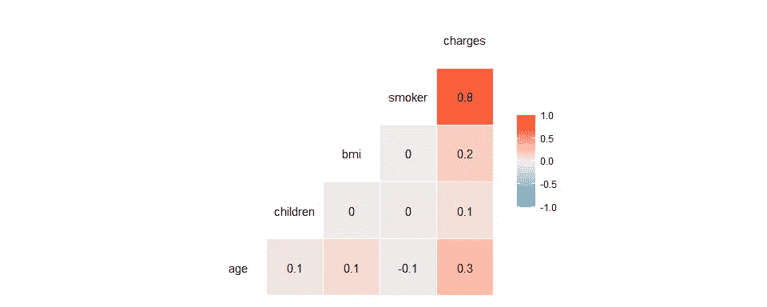

另一种方法是使用皮尔逊积差相关的假设检验。

*   H0:预测者与`charge`没有关联
*   H1:预测器与`charge`相关

```
for (col in cols) {
  cor <- cor.test(temp[, col], temp$charges)
  print(round(cor$p.value, 4))
}#> [1] 0
#> [1] 0.0062
#> [1] 0
#> [1] 0
```

由于每个预测值-目标值对的 p 值低于α(0.05)，因此拒绝 H0。我们可以有把握地说，预测因素与目标变量相关。

现在，对于多项式回归。

```
cols <- c('bmi', 'children', 'smoker', 'poly(age, 2, raw = TRUE)[, 2]', 
          'poly(bmi, 2, raw = TRUE)[, 2]', 'poly(children, 2, raw = TRUE)[, 2]', 
          'bmi:smoker', 'children:smoker')

ggcorr(train_poly %>% select(c(cols, 'charges')), hjust = 1, layout.exp = 2, label = T)
```

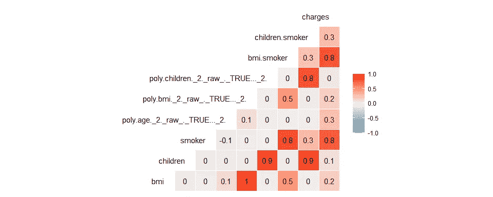

```
for (col in cols) {
  cor <- cor.test(train_poly[, col], train_poly$charges)
  print(round(cor$p.value, 4))
}#> [1] 0
#> [1] 0.0062
#> [1] 0
#> [1] 0
#> [1] 0
#> [1] 0.1327
#> [1] 0
#> [1] 0
```

我们可以说，预测因子与目标变量相关，除了`children²`。

**2。残差的正态性**

线性回归模型的残差应该是正态分布的，因为我们期望得到零值附近的残差。为了看到这一点，我们可以绘制残差直方图。

```
hist(lm_all$residuals)
```

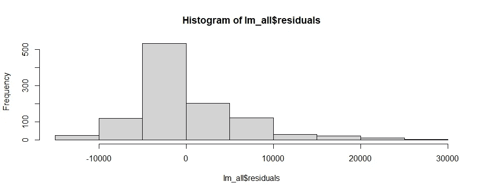

另一种方法是用夏皮罗-维尔克检验我们的残差。

*   H0:残差呈正态分布
*   H1:残差不是正态分布的

```
shapiro.test(lm_all$residuals)#> 
#>  Shapiro-Wilk normality test
#> 
#> data:  lm_all$residuals
#> W = 0.89481, p-value < 0.00000000000000022
```

因为 p 值低于 alpha (0.05)，所以拒绝 H0。因此，残差不是正态分布的。

现在，对于多项式回归。

```
hist(lm_poly$residuals)
```

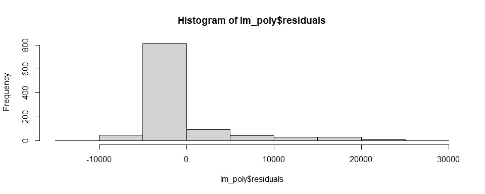

```
shapiro.test(lm_poly$residuals)#> 
#>  Shapiro-Wilk normality test
#> 
#> data:  lm_poly$residuals
#> W = 0.65297, p-value < 0.00000000000000022
```

同理适用，残差不是正态分布。

**3。同方差**

异方差是指变量在其值域内的可变性不相等的情况。在线性回归模型中，如果其误差的方差在整个目标变量范围内显示出不等的变化，则表明存在异方差，这意味着残差中存在非随机模式。我们可以通过绘制拟合值与残差图来直观地看到这一点。

```
plot(lm_all$fitted.values, lm_all$residuals)
abline(h=0, col = "red")
```

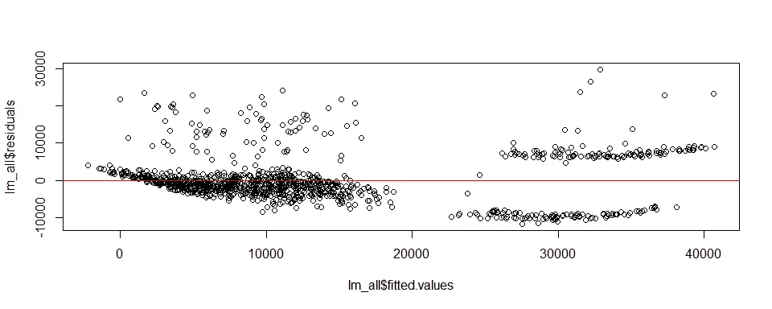

另一种方法是使用 Breusch-Pagan 假说。

*   H0:同性恋
*   H1:异方差

```
bptest(lm_all)#> 
#>  studentized Breusch-Pagan test
#> 
#> data:  lm_all
#> BP = 89.206, df = 4, p-value < 0.00000000000000022
```

因为 p 值低于 alpha (0.05)，所以拒绝 H0。这意味着残差具有异方差性。

现在，对于多项式回归。

```
plot(lm_poly$fitted.values, lm_poly$residuals)
abline(h=0, col = "red")
```

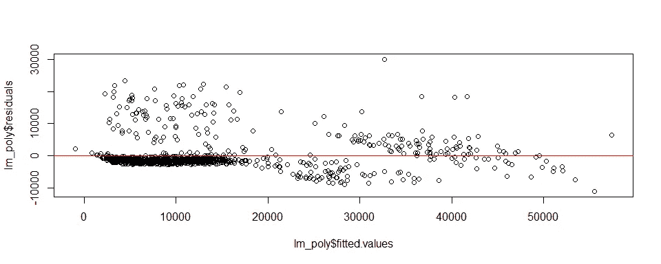

```
bptest(lm_poly)#> 
#>  studentized Breusch-Pagan test
#> 
#> data:  lm_poly
#> BP = 13.059, df = 8, p-value = 0.1098
```

因为 p 值高于 alpha (0.05)，所以接受 H0。这意味着残差满足同方差假设。

**4。预测值之间没有多重共线性**

评估多重共线性的统计工具之一是方差膨胀因子(VIF)。简而言之，VIF 是一种在我们的模型中测量预测因子间多重共线性影响的方法。VIF < 10 表示预测值之间没有多重共线性。

```
vif(lm_all)#>      age      bmi children   smoker 
#> 1.018303 1.013178 1.004060 1.003712vif(lm_poly)#>                                  bmi                             children                               smoker 
#>                            66.442833                            17.844408                            25.228626 
#>      `poly(age, 2, raw = TRUE)[, 2]`      `poly(bmi, 2, raw = TRUE)[, 2]` `poly(children, 2, raw = TRUE)[, 2]` 
#>                             1.020981                            56.740085                             6.702367 
#>                         `bmi:smoker`                    `children:smoker` 
#>                            32.271971                            11.527064
```

在线性回归模型中未发现多重共线性，但在多项式回归模型中发现多重共线性。这是有意义的，因为多项式回归中的某些要素是通过将线性回归模型中的两个要素相乘而创建的。

# 结论

```
result <- rbind(lin_reg, poly_reg)
rownames(result) <- c("Linear Regression", "Polynomial Regression")
result#>                            MAE     RMSE     RMSLE
#> Linear Regression     3941.464 5672.102 0.5455373
#> Polynomial Regression 2835.106 4327.179 0.3926167
```

对于线性回归这样的简单模型，特征工程在改进模型方面起着重要的作用。在本文中，我们通过对 2 阶特征进行多项式组合来应用这一技术。我们看到模型有了显著的提高，MAE 为 2835，RMSE 为 4327，RMSLE 为 0.39。然而，在这个过程中，一些关于线性回归的假设可能会失效。还有，抽烟对钱包不好！！


🔥你好！如果你喜欢这个故事，想支持我这个作家，可以考虑 [***成为会员***](https://dwiuzila.medium.com/membership) *。每月只需 5 美元，你就可以无限制地阅读媒体上的所有报道。如果你注册使用我的链接，我会赚一小笔佣金。*

🔖*想了解更多关于经典机器学习模型如何工作以及如何优化其参数的信息？或者 MLOps 大型项目的例子？有史以来最优秀的文章呢？继续阅读:*


[艾伯斯·乌兹拉](https://dwiuzila.medium.com/?source=post_page-----4876e3449adf--------------------------------)

## 从零开始的机器学习

[View list](https://dwiuzila.medium.com/list/machine-learning-from-scratch-b35db8650093?source=post_page-----4876e3449adf--------------------------------)8 stories

[艾伯斯·乌兹拉](https://dwiuzila.medium.com/?source=post_page-----4876e3449adf--------------------------------)

## 高级优化方法

[View list](https://dwiuzila.medium.com/list/advanced-optimization-methods-26e264a361e4?source=post_page-----4876e3449adf--------------------------------)7 stories

[艾伯斯·乌兹拉](https://dwiuzila.medium.com/?source=post_page-----4876e3449adf--------------------------------)

## MLOps 大型项目

[View list](https://dwiuzila.medium.com/list/mlops-megaproject-6a3bf86e45e4?source=post_page-----4876e3449adf--------------------------------)6 stories

[艾伯斯·乌兹拉](https://dwiuzila.medium.com/?source=post_page-----4876e3449adf--------------------------------)

## 我最好的故事

[View list](https://dwiuzila.medium.com/list/my-best-stories-d8243ae80aa0?source=post_page-----4876e3449adf--------------------------------)24 stories

艾伯斯·乌兹拉

## R 中的数据科学

[View list](https://dwiuzila.medium.com/list/data-science-in-r-0a8179814b50?source=post_page-----4876e3449adf--------------------------------)7 stories[](https://dwiuzila.medium.com/membership)