# 胸部 x 光片上的医学图像字幕

> 原文：<https://towardsdatascience.com/medical-image-captioning-on-chest-x-rays-a43561a6871d?source=collection_archive---------12----------------------->

## 使用 Tensorflow 和 Keras 创建图像字幕深度学习模型，该模型可以编写自动医疗报告，作为自我案例研究的一部分

Olga Guryanova 在 [Unsplash](https://unsplash.com?utm_source=medium&utm_medium=referral) 上的照片

# 目录

1.  商业问题
2.  使用机器学习来解决业务问题
3.  评估指标(BLEU 分数)
4.  资料组
5.  现有解决方案
6.  探索性数据分析
7.  数据预处理
8.  输入数据管道
9.  先决条件
10.  我的实验和实现细节
11.  总结和结果
12.  结论
13.  未来的工作
14.  链接到我的个人资料
15.  参考

# **1。商业问题**

医学成像是创建用于临床分析的身体内部的视觉表示以及一些器官或组织的功能的视觉表示的过程。它们被广泛用于医院和诊所来确定骨折和疾病。医学图像由专门的医学专业人员阅读和解释，并且他们关于被检查区域的每个身体的发现通过书面医学报告传达。撰写医疗报告的过程通常需要大约 5-10 分钟。一天之内，医生们要写上百份的医疗报告，这要花很多时间。本案例研究的目的是建立一个深度学习模型，自动编写胸部 x 光医疗报告的印象部分，减轻医疗专业人员的一些负担。在这里，我将从印第安纳大学获取一个公开可用的数据集，该数据集由胸部 X 射线图像和报告(XML 格式)组成，其中包含关于 X 射线的发现和印象的信息。目标是预测附在图像上的医学报告的印象。

# 2.使用机器学习来解决业务问题

这个问题是一个图像字幕任务。对于这个数据集，我们得到了一些不同患者的图像和 xml 格式的报告。图像名称和患者的信息都包含在 xml 文件中。我们将使用 regex 从 xml 文件中提取这些数据，并将其转换成 dataframe。然后，我们可以使用预训练的模型从图像中获取信息，使用这些信息，我们可以使用 LSTMs 或 GRUs 生成字幕。

# 3.评估指标(BLEU 分数)

BLEU score 代表双语评估替角。这里我们将使用 BLEU 分数作为衡量标准。BLEU score 比较预测句子中的每个单词，并将其与参考句子进行比较(这也是在 n 元语法中完成的)，并根据原始句子中预测的单词数返回分数。BLEU 分数不是比较翻译性能的好指标，因为具有相同意思的相似单词将被扣分。因此，我们不仅要使用 n-gram BLEU 评分，还要对预测字幕进行采样，并手动将其与原始参考字幕进行比较。BLEU 分数范围从 0 到 1。

> **预测文字:**《狗在跳》
> 
> **参考文本:**《狗在跳》

在这种情况下，我们的 BLEU 分数(n-grams)为 1。这里有一些非常好的文章，可供进一步阅读。

 [## BLEU —双语评估替补演员

### 理解 BLEU 的逐步方法，理解机器翻译(MT)有效性的度量标准

towardsdatascience.com](/bleu-bilingual-evaluation-understudy-2b4eab9bcfd1)  [## Python -机器学习掌握中计算文本 BLEU 分数的简明介绍

### BLEU，或双语评估替补，是一个比较文本的候选翻译与一个或多个…

machinelearningmastery.com](https://machinelearningmastery.com/calculate-bleu-score-for-text-python/) 

# 4.资料组

在这里，我将从印第安纳大学获取一个公开可用的数据集，该数据集包括胸部 X 射线[图像](https://academictorrents.com/details/5a3a439df24931f410fac269b87b050203d9467d)和[报告](https://academictorrents.com/details/66450ba52ba3f83fbf82ef9c91f2bde0e845aba9)(XML 格式)，其中包含关于 X 射线的比较、指示、发现和印象的信息。本案例研究的目标是预测附在图像上的医疗报告的印象。

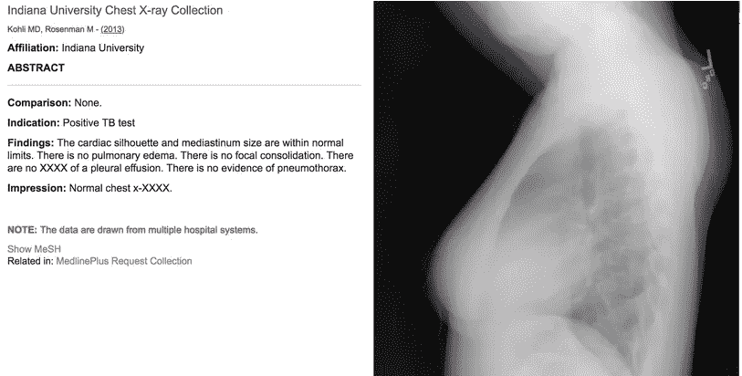

[取自数据源](https://academictorrents.com/details/66450ba52ba3f83fbf82ef9c91f2bde0e845aba9)的样本报告

# 5.现有解决方案

【Keras 图片说明|作者 Harshall Lamba :这里他使用了 flicker 8k 图片作为数据集。每张图片都有 5 个标题，他已经把它们储存在字典里了。对于数据清理，他将小写应用于所有单词，并删除了特殊符号和带数字的单词(如“hey199”等)。).在提取独特的单词后，他去除了所有在整个语料库中出现频率小于 10 的单词，这样模型可以对异常值具有鲁棒性。现在他给每个标题加上“开始序列”和“结束序列”。对于图像的预处理，他使用了具有图像净数据集权重的 inception v3 模型。图像被发送到该模型，倒数第二层的输出被获取(2048 大小向量，瓶颈特征)并保存这些向量。对于字幕的预处理，他对字幕进行了标记化，并找出了字幕中句子的最大长度(发现是 34)，这样他就可以用它来填充。他已经为单词嵌入(200 维)使用了预训练的手套向量，并且还为嵌入层设置了 trainable = False。

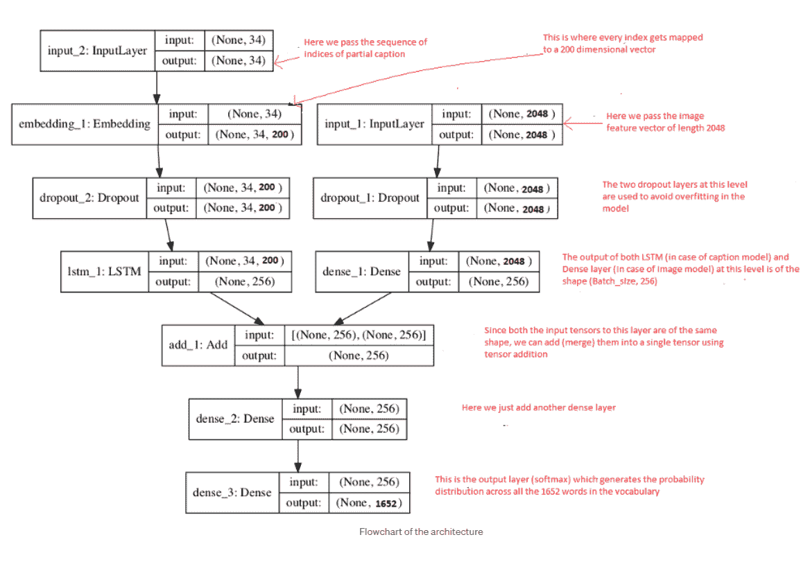

[来源](/image-captioning-with-keras-teaching-computers-to-describe-pictures-c88a46a311b8)

这是他用于培训的模型架构，不言自明。上述模型的输出给出了一个概率值，对于该概率值，单词在句子中出现的概率最高。在这里，他使用了贪婪搜索法(获得句子中接下来出现概率最高的单词)。然后用 0.001 的初始学习率和每批 3 张图片(批量大小)训练该模型 30 个时期。然而，在 20 个时期之后，学习率降低到 0.0001。使用的损失是分类交叉熵，而使用的优化器是 Adam。

[使用注意力机制的图像字幕| sub ham Sarkar | The Startup](https://medium.com/swlh/image-captioning-using-attention-mechanism-f3d7fc96eb0e):这里他使用了注意力机制进行图像字幕。使用的数据集和以前一样是 flickr8k。这里，训练大小是 6000 幅图像，验证数据大小是 1000 幅图像，测试数据大小是 1000。对于预处理，他删除了标点符号，数字值和单个字符。然后，他创建了一个包含文件名和标题列的数据帧。他将每张图像重新调整为 224*224*3，然后输入到 ImageNet VGG 16 模型上进行预训练。这里他只取了卷积部分(include_top=False)。他移除了最后一个密集层，并将倒数第二层的输出作为主干特征。

对于字幕，他进行了标记化，并添加了<unk>作为标记，用于识别那些不在词汇表中的单词。他用语料库中找到的最大句子长度(=39)填充了标记化序列。</unk>

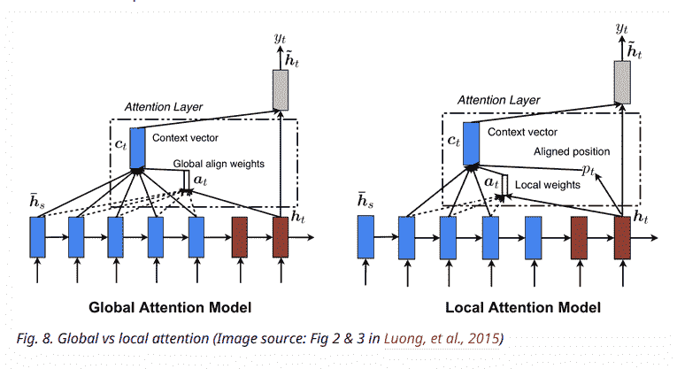

[来源](https://arxiv.org/pdf/1508.04025.pdf)

对于注意机制，他使用了全局注意和局部注意，但没有将它们结合起来，而是给出了选择使用哪种注意的选项，在代码文件中，他只使用了局部注意。全局注意力将图像视为一个整体，而局部注意力集中在图像的特定部分(在图像字幕的情况下)。这是通过考虑隐藏状态以导出上下文向量来完成的。全局注意力考虑所有的隐藏向量，而局部注意力考虑每个目标词的隐藏向量的特定窗口。

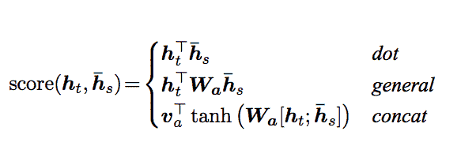

[全球关注](https://medium.com/swlh/image-captioning-using-attention-mechanism-f3d7fc96eb0e)

这里的编码器是 VGG 16 型。解码器是 RNN。他在这里使用 GRU。他在这里使用了教师强制方法，由此他在训练期间的不同时间步长输入实际记号作为下一个输入，而不是解码器 gru 的预测记号。全局注意力和局部注意力的不同步骤解释如下:

注意机制:

1.  这里被认为是编码器隐藏状态的特征是来自 VGG-16 的特征。
2.  先前的解码器隐藏状态和解码器输出通过解码器 gru 来生成新的隐藏状态和预测概率得分。
3.  使用来自编码器的所有隐藏状态和新的解码器隐藏状态，我们将计算注意力分数。这些注意力分数然后被软最大化，以给出概率分数(所有部分都应该被关注)
4.  使用这个概率分数，他通过将每个分数乘以编码器隐藏状态(这里是 cnn 特征)来计算上下文向量，然后将其交给 GRU。
5.  重复此操作，直到达到填充长度。

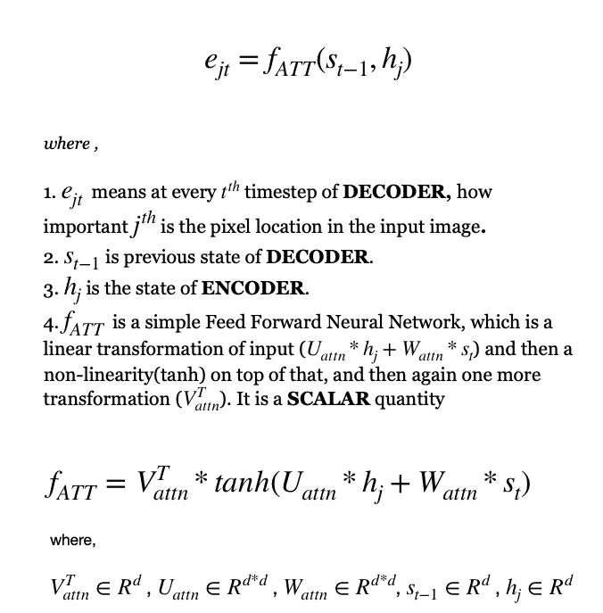

[局部注意](https://medium.com/swlh/image-captioning-using-attention-mechanism-f3d7fc96eb0e)

现在为了评估字幕，他使用了两种方法波束搜索和贪婪搜索。这里，为波束搜索考虑的预测数量是 b=3，7，10(最佳预测)。射束预测获得最大概率的字幕(即，这里他对每个单词的概率值求和，并评估该句子/字幕的最终概率)。

在这里，他使用了 BLEU 评分作为评估预测的标准。他建立了一个自定义的损失函数，只根据标题中的单词进行惩罚。他使用了 Adam 优化器。

[一个很好的博客，用于进一步了解注意机制。](http://jalammar.github.io/visualizing-neural-machine-translation-mechanics-of-seq2seq-models-with-attention/)

# 6.探索性数据分析

## 形象

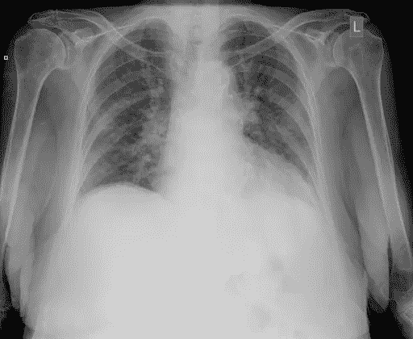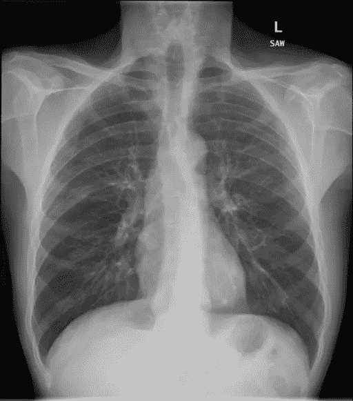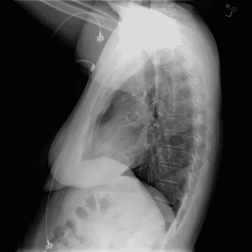

来自数据集的 x 射线

我们可以看到数据集的 3 个样本图像。这些是从正面和侧面拍摄的胸部 x 光片。

## 报告

[取自数据源的样本报告](https://academictorrents.com/details/66450ba52ba3f83fbf82ef9c91f2bde0e845aba9)

这是一份报告样本。报告以 xml 格式存储。我们将摘录报告中的比较、指示、发现和印象部分。这是使用 regex 完成的。[这是一个非常好的网站，我用它来测试我的正则表达式代码，这对你们会很有帮助。](https://regex101.com/)

数据中的报告数为 3955。

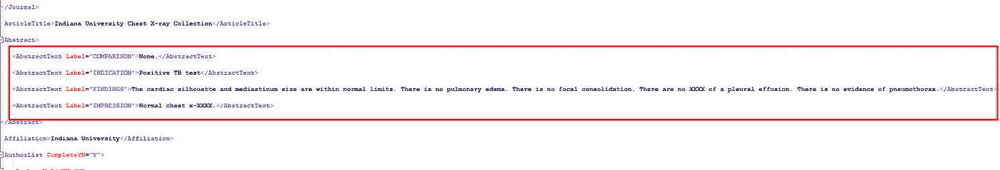

在 xml 文件中，报告信息是这样存储的。

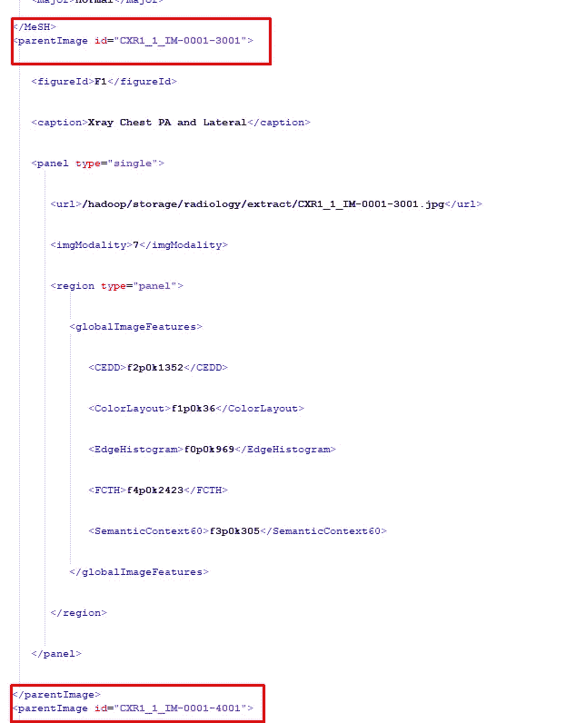

这是与此报告相关联的两个图像文件。现在，我们将了解与报告相关联的图像数量的最大值和最小值。

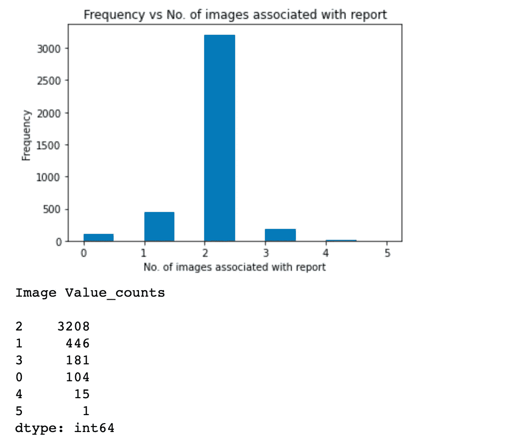

我们可以看到，与一个报告相关联的图像的最大数量可以是 5，而最小数量是 0。我们将提取报告的所有信息部分，即比较、指示、调查结果和印象部分，并使用正则表达式和字符串操作将相关报告的相应 2 幅图像(我们将 2 幅图像作为输入，因为 2 幅图像是与报告关联的最高频率)提取到具有 xml 报告文件名的数据帧中。对于超过 2 张的图像，我们将使用新图像和相同信息创建新的数据点。

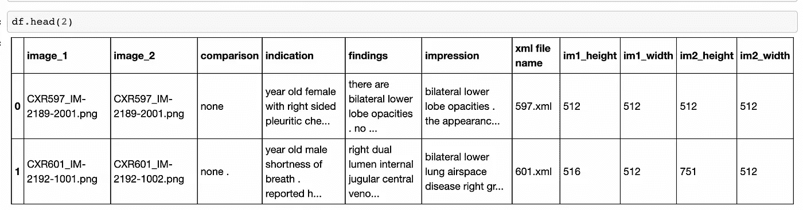

这是我们从 xml 报告中提取信息后得到的样本数据帧

发现数据帧中缺少值。从数据帧中删除所有 image_1 和 impression 值为空的数据点。然后，对于在图像 2 中发现的所有缺失值，使用与图像 1 相同的数据路径进行填充。

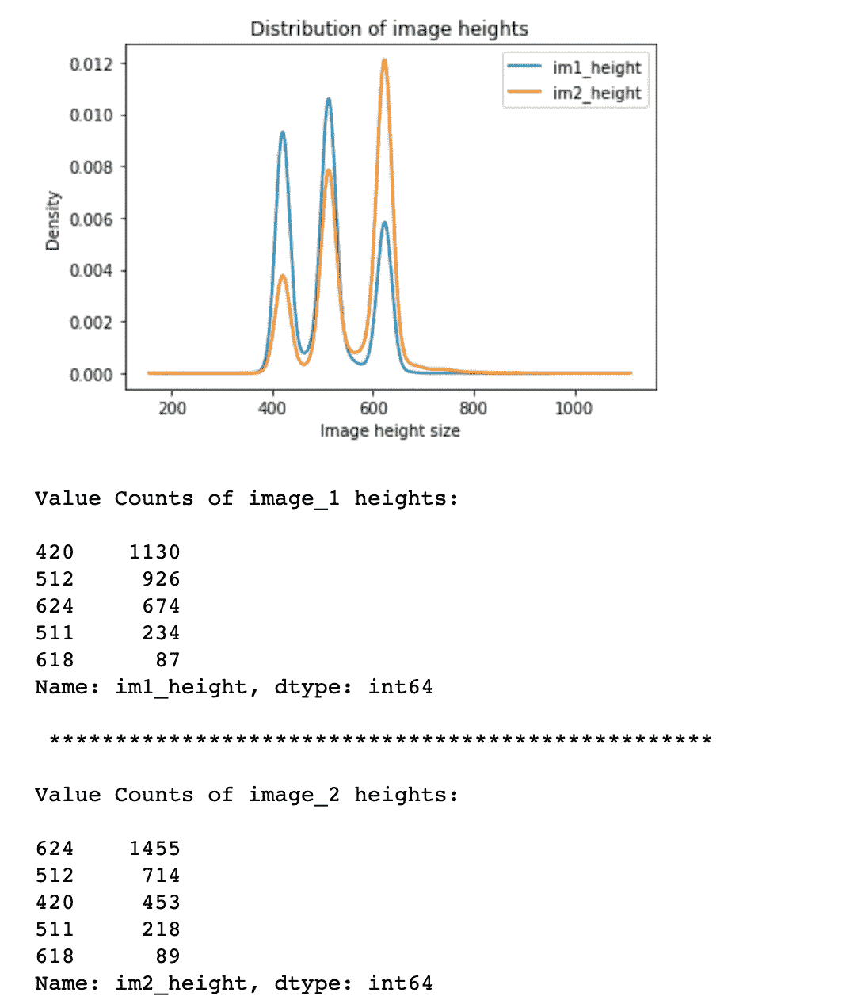

图像 1 和图像 2 的高度分布

从上图中我们可以看出，420 是 image1 最常见的图像高度，而 624 是最常见的图像高度。对于所有数据点，两幅图像的宽度只有一个唯一值，即 512。由于预先训练的模型是为正方形大小的图像建模的，我们可以选择 224*224(与 VGG16 的输入相同)作为图像的指定大小。因此，我们将所有的图像调整为 224*224 的形状。

## 带有说明的示例图像

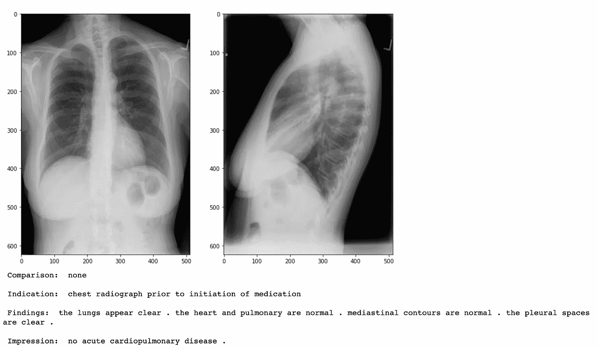

图像+标题

我们可以看到，发现是从 X 射线的观察，而印象是推断获得的。在本案例研究中，我将尝试根据两幅图像预测医疗报告的印象部分。

## 所有印象值的词云

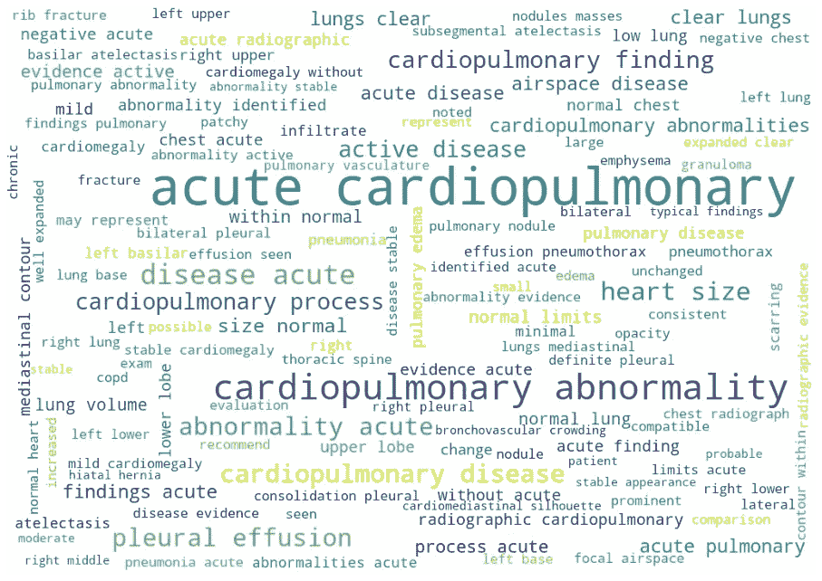

我们可以从上面的词云看到，有几个词的频率较高，即“急性心肺”和“心肺异常”。我们将通过观察 impression 特性的值计数来进一步研究这一点。

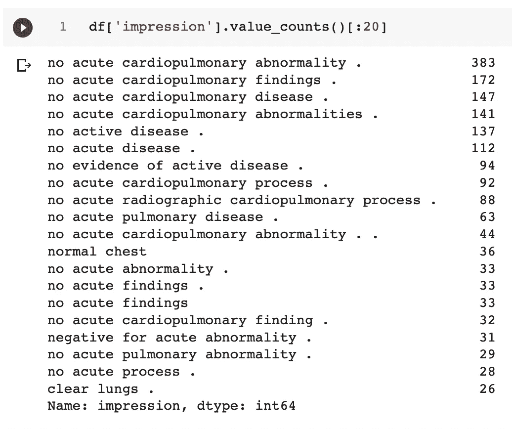

印象列中最常出现的前 20 个值

从上面的值计数中，我们可以看到前 20 个最频繁出现的单词具有相同的含义，因此相同的信息表明一种类型的数据在该数据中占主导地位。我们将对数据应用一组上采样和下采样，以便模型不会为整个数据集输出相同的值，即减少过拟合。

# 7.数据预处理

因为从我们所看到的大多数 x 光片来看，大多数数据点都有类似含义的标题，即“无疾病”或“无急性心肺异常”。因此，为了减少过度拟合，首先我将删除所有重复的数据点(即那些与一个标题相关联的图像超过 2 个的数据点)，只保留一个，然后根据印象值计数将数据集分成两个，其中一个所有印象值计数都大于 5 (other1)，另一个是印象列开始和结束时的 value_counts <=5 (other2). Then split the other1 data with test_size=0.1\. A sample of 0.05*other2.shape[0] will be then taken and will be added on to the test data that was split. The other data from the other2 will be appended to train.

Now I will upsample and downsample the train dataset. For that I will further divide the dataset into 3, one with impression value counts greater than or equal to 100 (df_majority), 2nd one with value counts lesser than or equal to 5 (df_minority) and final one where the impression value counts between 100 and 5 (df_other). Then df_majority and df_other will be downsampled and df_minority will be upsampled. Finally the number of datapoints of the resulting concatenated dataframe is 4487.

After sampling, the text will be added ‘<start>和“<end>”。现在，在安装了标记器之后，我决定使用标题长度的第 80 个百分位值作为每个印象的最大填充值。</end></start>

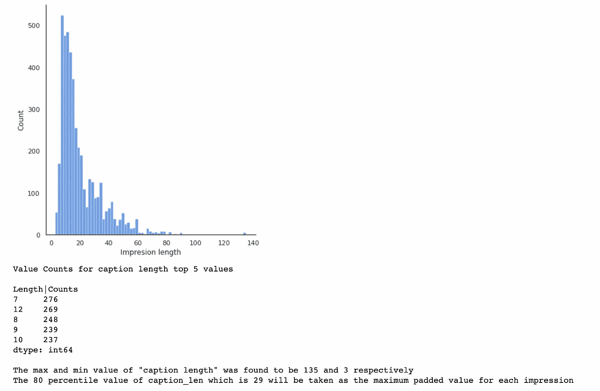

# 8.输入数据管道

首先，我将解释如何为这个案例研究创建输入数据管道。首先，我将创建一个名为 Dataset 的类，它包含 __getitem__，_ _ len _ _ method。__getitem__ 方法在调用 Dataset 类的对象时被调用，并向其传递元素索引(如 a[i])。__len__ 方法必须存在于每个具有 __getitem__ 的类中，getitem__ 返回类数据集包含的项数(这里是 df 中的行数)。这里我将应用翻转的随机增加(左，右和上，下)。还发现应用浮雕和锐化大大降低了模型的性能，所以它被丢弃。数据集类将输出两个调整大小的图像特征向量和填充的标记化的真实字幕输入(不包含<end>)和真实字幕输出(不包含<start>)。</start></end>

我创建的下一个类叫做 Dataloader，它继承自 tf.keras.utils.Sequence 类。这里，数据加载器将成批输出数据点，其中第 I 个索引将输出为(图像 1，图像 2，输入标题)，输出标题。它将返回第 I 个索引的 batch_size 个数据点。

# 9.**先决条件**

这些是读者为了完全理解建模部分而必须熟悉的一些主题:

1.  [转移学习](https://keras.io/guides/transfer_learning/)
2.  [注意机制](https://www.tensorflow.org/tutorials/text/image_captioning)
3.  [模型子类 API](https://www.tensorflow.org/guide/keras/custom_layers_and_models)
4.  [编码器解码器型号](https://www.tensorflow.org/tutorials/text/nmt_with_attention)

# 10.我的实验和实现细节

对于建模部分，我已经创建了 3 个模型。每个都有相似的编码器，但解码器架构完全不同。

## 编码器

编码器部分将获取两个图像，并将其转换成主干特征，以提供给解码器。对于编码器部分，我将使用 CheXNET 模型。

[CheXNET 模型](https://arxiv.org/pdf/1711.05225.pdf)是一个 Denset121 分层模型，针对数百万张胸部 x 光图像进行训练，用于 14 种疾病的分类。我们可以加载该模型的权重，并通过该模型传递图像。顶层将被忽略。

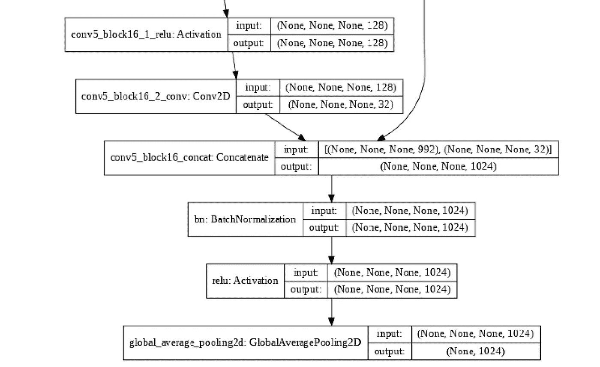

CheXNET 的最后几层

现在我将创建一个包含 chexnet 模型的图像编码器层，这个模型和之前描述的一样。在这里，我将设置 chexnet 模型可训练为假。

## 简单编码器解码器模型

这个模型将是我们的基线。在这里，我将建立一个图像字幕模型的简单实现。该架构如下所示:

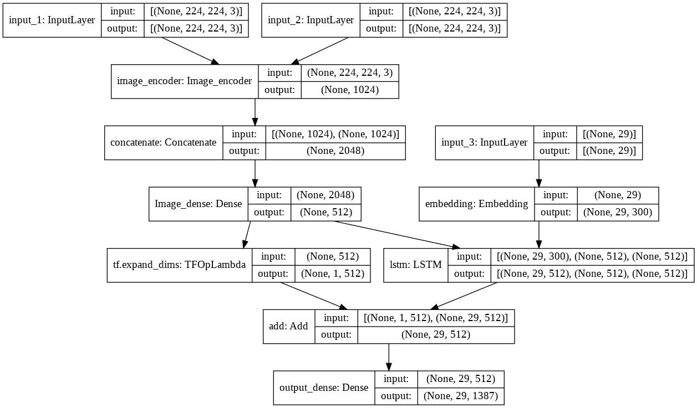

简单编码器解码器模型

在这里，我将通过 Image_encoder 层传递两个图像，并将两个输出连接起来，然后通过密集层传递。填充的标记化字幕将通过一个嵌入层，我们将使用预训练的手套向量(300 维)作为该层的初始权重。这将被设置为可训练的，然后它通过 LSTM，LSTM 的初始状态是从图像密集层的输出。这些然后被添加，然后通过 output_dense 层，其中输出的数量将是在顶部应用 softmax 激活的词汇大小。

为了训练，我选择了“adam”优化器，并创建了一个基于稀疏分类损失的损失函数，其中我只考虑了真实字幕中单词的损失。

## 注意力模型

在这个模型中，我将使用全局注意力和 concat 公式。

[全球关注](https://medium.com/swlh/image-captioning-using-attention-mechanism-f3d7fc96eb0e)

全球注意力层

对于解码器，我创建了一个单步解码器层，它接收解码器输入、编码器输出和状态值。decoder_input 将是任何字符令牌数。这将通过嵌入层传递，然后通过嵌入输出和 encoder_output 将通过关注层传递，关注层将产生上下文向量。然后，上下文向量将通过 RNN(这里将使用 GRU ),初始状态为先前解码器的状态。

一步解码器

解码器模型将所有输出存储在一个 tf 中。TensorArray 并返回它。在这里，我将使用教师强制方法来训练 RNN，而不是传递上一个 rnn 的输出，我将传递下一个原始令牌。

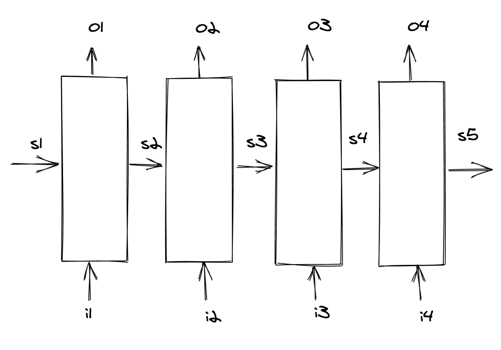

RNN 解码器(图片由作者提供)

s1 在这里是零。所有的 I 在通过关注层和编码器输出后将成为原始的令牌。

## 最终定制模型

在这里，我将使用一个自定义的编码器和解码器，与注意力模型相同。

对于这个模型的编码器部分，我将从 chexnet 模型中提取主干特征，特别是第三层的输出。这将是 Image_encoder 层的输出。然后，我将通过全局流和上下文流来传递它，这实际上是受另一个用于图像分割目的的模型的启发。这将在下面解释。

**全局流和上下文流:**该架构实现取自[注意力引导的链式上下文聚合图像分割](https://arxiv.org/abs/2002.12041v3)(具体来说是**链式上下文聚合模块(CAM)** )，它用于图像分割，但我将使用它来提取图像信息。这里我要做的是，图像编码器(即 chexnet)的输出将被发送到全局流。那么来自 chexnet 和全局流的输出将被连接并发送到上下文流。这里将只使用一个上下文流，因为我们的数据集很小，如果使用更复杂的架构，可能会导致欠匹配。**这里** **全局流提取图像的** **全局信息，而上下文流将获取图像的局部特征**。然后，来自全局流和上下文流的输出将被求和，然后在整形、应用批量规范和丢失之后被发送到解码器。

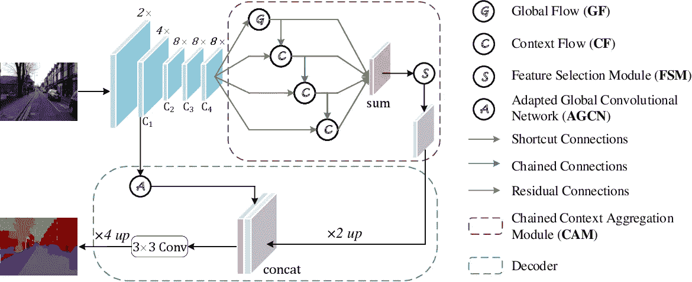

[用于图像分割的注意力引导的链式上下文聚合](https://arxiv.org/abs/2002.12041v3)

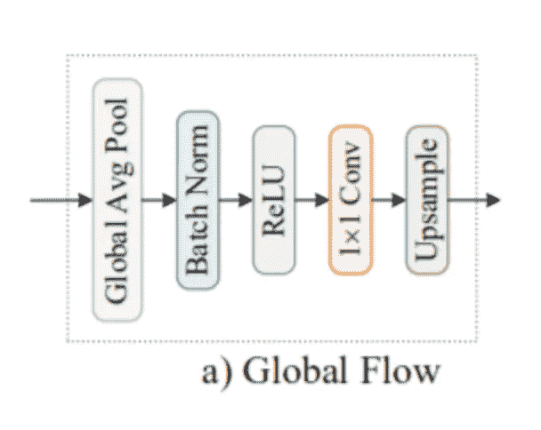

全球流动

**全局流程**

1.  这里，全局流将从图像编码器层获取信息，然后我将应用全局平均池，这将产生(batch_size，1，1，过滤器数量)。
2.  然后，我们将对与输入相同的形状应用批量标准化、relu、1*1 卷积和上采样。

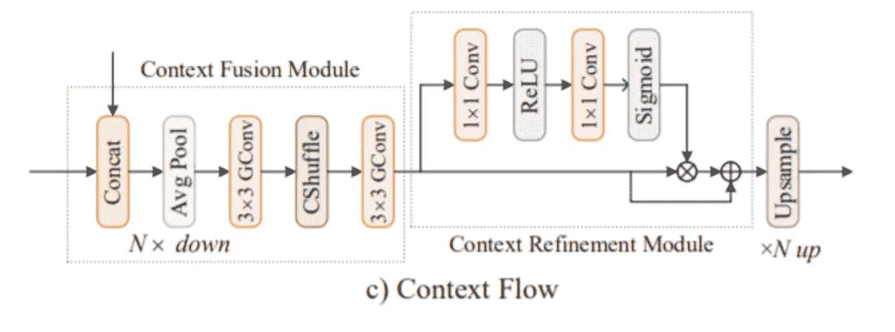

上下文流

**上下文流程**

1.  我们将从全局流和图像编码器层获得数据，并将其连接到最后一个轴上。
2.  然后应用平均池，将特征图的大小减少 N*倍。
3.  那么 3×3 的单个卷积将被应用两次。(不会应用任何 CShuffle)
4.  之后，我们将应用 1*1 卷积，随后是 relu 激活，然后再次应用 1*1 卷积，随后是 sigmoid 激活。这与来自上下文融合模块的输出相乘，然后添加到来自上下文细化模型的输出，该输出然后将以与输入相同的大小被上采样(这里 conv2d 转置将用于获得与输入相同数量的滤波器)。

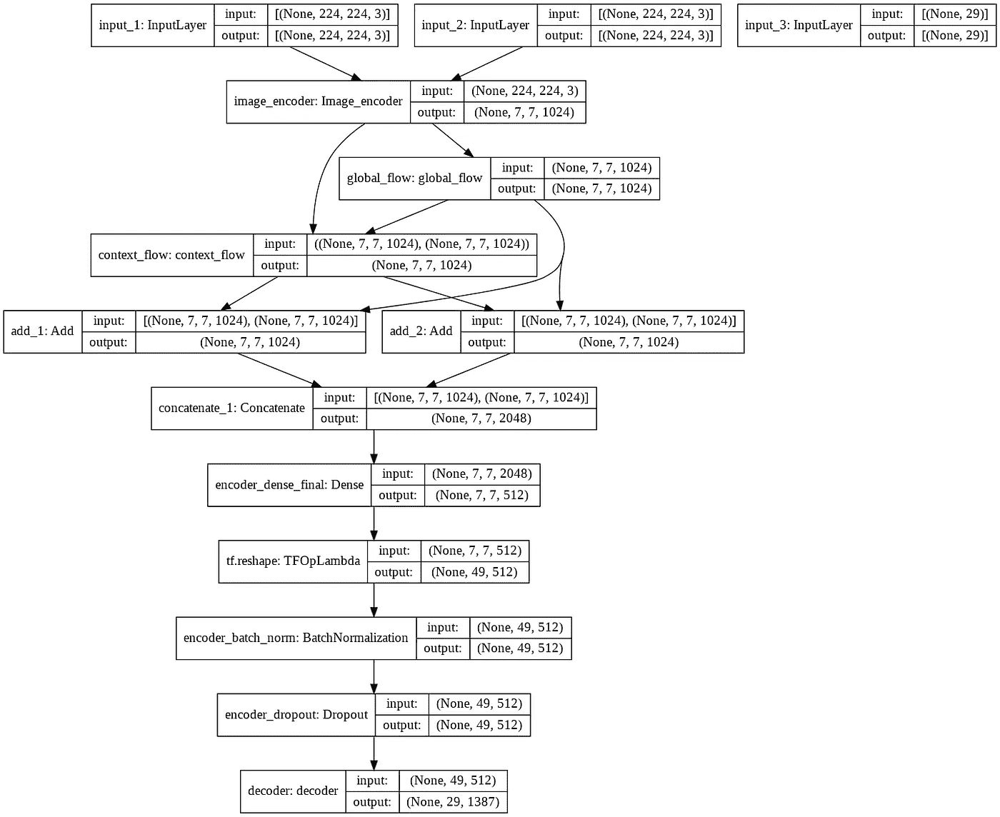

定制最终模型

上下文流和全局流的总和输出将被连接(这里 add_1 和 add_2 分别是 image_1 和 image_2 的结果),然后将被发送到密集层，该密集层将滤波器的数量转换为 512，在一系列整形、批量归一化和丢弃之后，该密集层将被发送到解码器。解码器架构与注意力模型的架构相同。

# 11.总结和结果

使用波束搜索和贪婪搜索方法来分析预测。贪婪搜索只输出每个时间步中最可能出现的单词，而波束搜索通过乘以每个时间步中每个单词的概率，得到概率最高的句子，从而显示出最可能出现的句子。贪婪搜索比波束搜索快得多，而波束搜索被发现产生正确的句子。关于该主题的进一步阅读材料:

 [## 如何实现用于自然语言处理的波束搜索解码器-机器学习掌握

### 自然语言处理任务，如字幕生成和机器翻译，涉及生成序列的…

machinelearningmastery.com](https://machinelearningmastery.com/beam-search-decoder-natural-language-processing/)  [## 波束搜索的直观解释

### 波束搜索的简单易懂的解释

towardsdatascience.com](/an-intuitive-explanation-of-beam-search-9b1d744e7a0f) 

## 简单编码器解码器模型

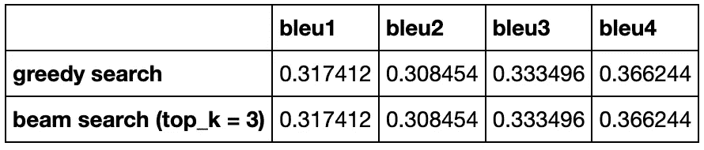

简单编码器解码器模型的 BLEU 分数

发现贪婪搜索和波束搜索(top_k = 3)的 bleu 分数是相似的，因此我们可以说最佳模型将基于简单编码器解码器模型的贪婪搜索，因为它是最快的。发现 top_k = 5 的 bleu 分数非常慢，因此将其丢弃。

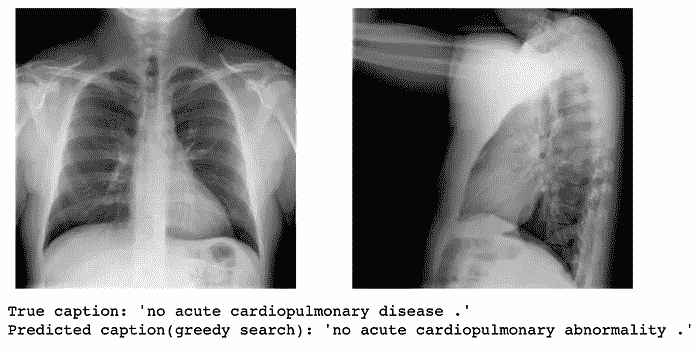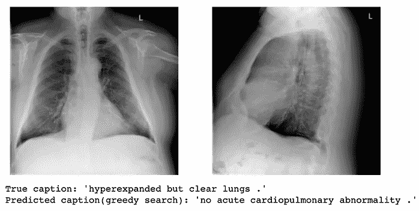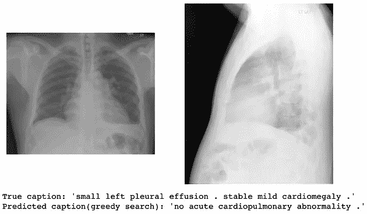

样本测试数据的结果

从上面我们可以看到，模型已经为所有图像预测了相同的标题。结果发现，模型预测所有图像的标题相同，如下所示:

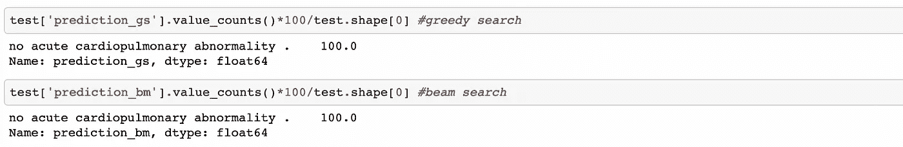

预测字幕的值计数

从上述结果中，我们可以看到，对于每个数据点，该模型都预测“没有急性心肺异常”，这表明该模型已经过拟合。由于这是一个基线模型，我们可以检查其他模型的预测，并将它们的性能与此进行比较。

## 注意力模型

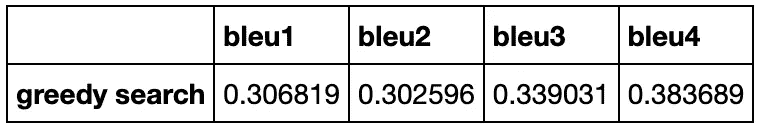

注意力模型的 BLEU 分数

基于 bleu 评分，该模型的表现类似于简单基线模型。发现波束搜索(top_k = 3)在预测一个字幕时很慢，因此放弃了该方法。现在，我们将观察一些随机预测，看看模型的表现如何:

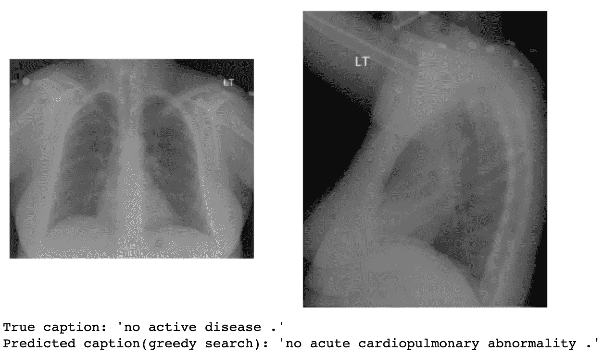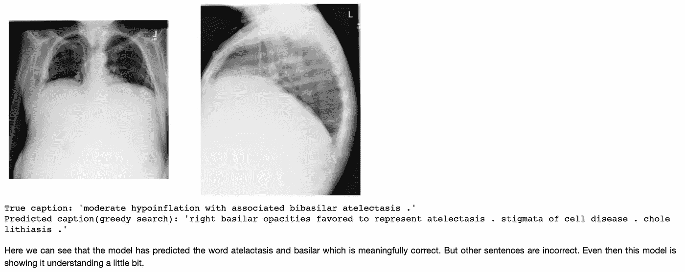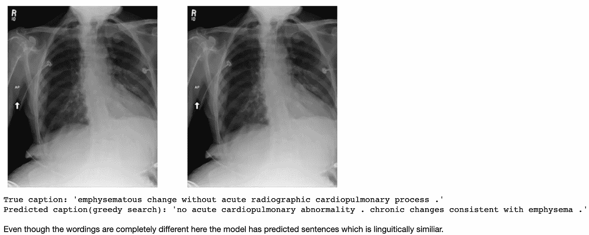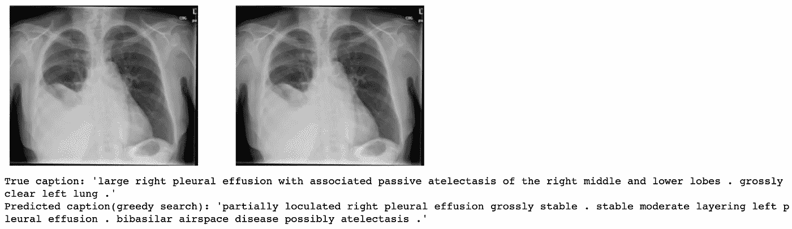

这里也有一些单词预测正确

该模型比简单基线模型表现得更好，因为它产生了具有更高可变性并且还保持语言相似的字幕。从预测的值计数中可以看出，模型预测的句子比基线模型具有更大的可变性。

## 最终定制模型

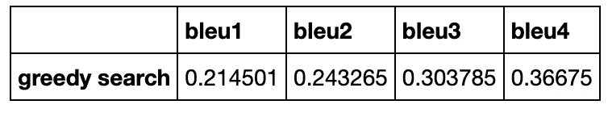

最终定制模型的 Bleu 分数

与其他两种型号相比，这种型号也产生了类似的蓝色。查看预测的值计数，我们可以看到有一点可变性，比基线模型好，但不如第二个模型好。

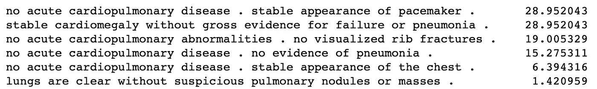

最终自定义模型的预测值计数百分比

这里也与注意力模型的情况相同，发现波束搜索(top_k = 3)在预测一个字幕时很慢，因此该方法被丢弃。

测试数据的一些随机预测如下所示:

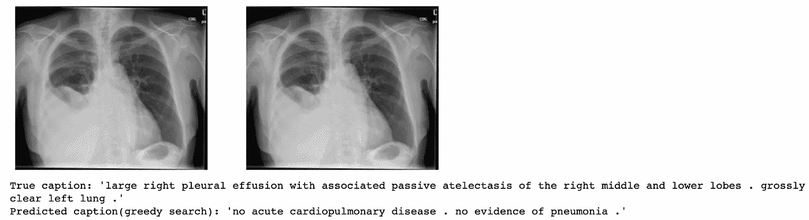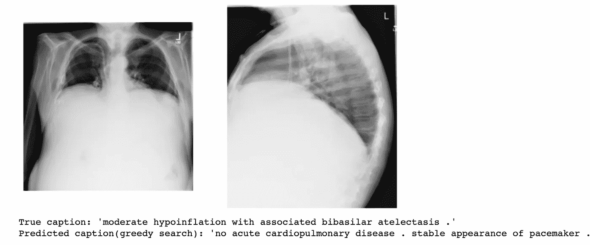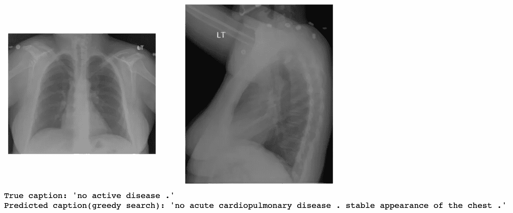

从上面我们可以观察到，该模型仅正确预测了那些没有疾病的图像，而对于其他图像则没有。我们可以得出结论，注意模型是三个模型中表现最好的模型。

# 12.结论

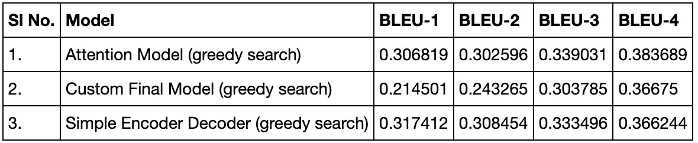

每种方法的最佳模型按累积 BLEU-4 分数降序排列

就 bleu 分数而言，这些是每种方法的最佳模型。此处，列表根据**累积 BLEU-4** 分数进行排序。我们得到的最佳模型是注意力模型(贪婪搜索)。该模型的性能远远优于其他两个模型，因为它能够比其他模型更正确地输出疾病名称和一些观察结果。其他模型仅输出标题，假设显示的所有数据点都属于“无疾病类别”。简单的编码器/解码器模型只能为整个数据集输出一个字幕，这表明过拟合。具有更大可变性的更多数据(特别是带有疾病的 X 射线)更有助于模型更好地理解，并有助于减少对“无疾病类别”的偏见。

# 13.未来的工作

1.  我们可以使用 BERT 来获得字幕嵌入，而不是使用具有手套向量权重的嵌入层，并将其用作解码器的输入。
2.  我们可以尝试使用简单的解码器，而不是在最终的定制模型中使用注意力解码器。
3.  我们也可以使用可视化 BERT。或者尝试在解码器中使用 GPT-2 或 GPT-3 来生成字幕。
4.  获得更多带有疾病的 X 射线图像，因为该数据集中可用的大多数数据都属于“无疾病”类别。

# 14.链接到我的个人资料— Github 代码和 LinkedIN

你可以在这个 [**github 链接**](https://github.com/ashishthomaschempolil/Medical-Image-Captioning-on-Chest-X-rays) 上找到这个案例研究的完整代码。你可以在 [**Linkedin**](https://www.linkedin.com/in/ashishthomas7/) 或者**ashishthomas7@gmail.com**联系我。我还使用 Streamlit 创建了一个 **Web 应用程序。可以在这里** 查看 app [**。**](https://share.streamlit.io/ashishthomaschempolil/medical-image-captioning-on-chest-x-rays/main/final.py)

# 15.参考

1.  唐，刘，张，江，张，[注意引导的链式上下文聚合语义切分(2020)](https://arxiv.org/abs/2002.12041v3)
2.  [应用人工智能课程](https://www.appliedaicourse.com/)
3.  [https://towards data science . com/image-captioning-with-keras-teaching-computers-to-description-pictures-c 88 a 46 a 311 b 8](/image-captioning-with-keras-teaching-computers-to-describe-pictures-c88a46a311b8)
4.  [https://medium . com/swlh/image-captioning-using-attention-mechanism-f 3d 7 fc 96 eb0e](https://medium.com/swlh/image-captioning-using-attention-mechanism-f3d7fc96eb0e)
5.  【https://medium.com/r/? URL = https % 3A % 2F % 2f machinelearningmastery . com % 2f beam-search-decoder-natural-language-processing % 2F
6.  [https://medium.com/r/?URL = https % 3A % 2F % 2f towards data science . com % 2 fan-intuitive-explain-of-beam-search-9b1d 744 e 7a 0 f](/an-intuitive-explanation-of-beam-search-9b1d744e7a0f)
7.  [https://medium.com/r/?URL = https % 3A % 2F % 2f towards data science . com % 2f bleu-双语-评估-替角-2b4eab9bcfd1](/bleu-bilingual-evaluation-understudy-2b4eab9bcfd1)
8.  [https://medium.com/r/?URL = https % 3A % 2F % 2f machinelearningmastery . com % 2f calculate-bleu-score-for-text-python % 2F](https://machinelearningmastery.com/calculate-bleu-score-for-text-python/)