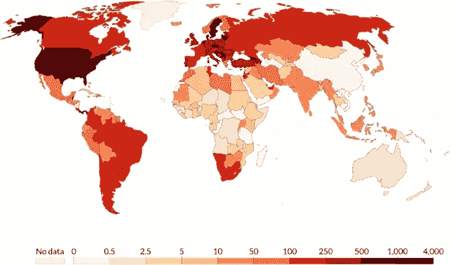
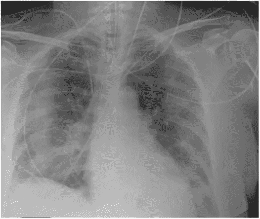
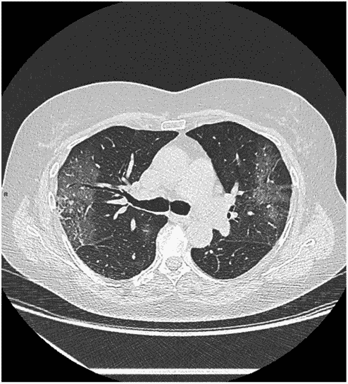
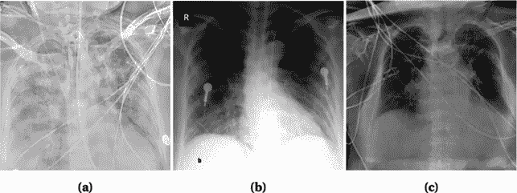

# 新冠肺炎的医学影像诊断

> 原文：<https://towardsdatascience.com/medical-image-diagnosis-in-covid-19-ba5f6664efe9?source=collection_archive---------41----------------------->

## 这篇综述介绍了人工智能在新型冠状病毒医学图像上的应用

图来源:[此处](https://www.coe.int/en/web/artificial-intelligence/ia-e-lotta-contro-il-coronavirus-covid-19)

在这篇综述中，我将介绍可用的医学图像类型，已发布的深度学习模型的概述，当前挑战和可能的解决方案的概述，以及您可以使用的数据集的链接。最后，如果你想深化某些主题，我还会列出一些可用的资源。而且，我会提供文献参考来探讨。

**指数**

1.  **医学图像的数据类型**
2.  **在 COVID 医学图像中使用人工智能**
3.  **当前挑战**
4.  **结论**
5.  **可用数据集**
6.  **其他资源**
7.  **参考书目**

# **简介**

自其爆发以来，新型冠状病毒已有超过 1 亿例病例，并导致超过 250 万人死亡(1)。最常见的症状是发热、咳嗽和发烧，而一些患者还经历了:腹泻、恶心、食欲不振(2，3)。然而，许多被感染的人是无症状的，是潜在的传染源。Covid 检测通常通过逆转录聚合酶链反应(RT-PCR)进行(4)。尽管做了很多努力，但测试结果需要 2-3 个小时和专家处理(平均在 24-48 小时内处理完)，而快速测试仍然存在高假阴性率的问题。此外，在许多国家，工具包的成本和稀缺是重要的问题。然而，这种测试只能检测病毒 RNA，而不能提供患者感染的信息。医学图像提供了对病人状况的洞察。在这篇综述中，我们将重点介绍对患者分层和检测肺部受累很重要的医学影像技术。

图一。每百万人口中的病例数。图来源:(5)

# **医学图像的数据类型**

**胸透(CXR)** 。CXR 已被用于检测肺部受累。观察到的主要特征是肺结节、玻璃样阴影(GGO、肺密度增加)和间质改变(6)。

图二。新型冠状病毒病人的 CXR。图来源:(7)

**胸部 CT**。这是最准确的诊断方法(尽管 RT-PCR 可在早期检测到感染，因为 CXR 可能在症状出现后 4-5 天保持正常)并提供进展的证据(8，9)。CT 的另一个优点是其检测肺栓塞的能力。缺点是 CT 费时且不容易获得(也更贵)。CT 发现的主要特征是 GGO，网状影(小的线性阴影)。研究人员在一些病例中发现了胸腔积液和肺纤维化。在 SARS 和 MERS 等其他冠状病毒感染中也发现了类似的异常(尽管一些研究表明 COVID 导致双侧参与，而 SARS 和 MERS 导致单侧参与(10))。

图三。一个新型冠状病毒病人的 CT。图来源:(7)

**胸部超声**。虽然 CT 和 CXR 是最常用的方法，但一项初步研究显示 CT 扫描和胸部超声之间的结果相似(11)。主要研究是胸膜线的不规则性(距离不规则、不连续和厚度增加(12))。该技术侵入性较小，但是也不太灵敏，并且不能检查肺部的深层区域。

# **在 COVID 医学图像中使用人工智能**

人工智能可以帮助早期诊断和识别有并发症风险的患者。此外，人工智能可以帮助识别与严重疾病相关的风险因素或优化治疗计划。不同的小组已经开发了用于肺部疾病的分类和量化的算法。通常，算法的主要任务是选择肺，提取特征以便检测肺异常。大多数算法是在 CT 或 CXR 图像上训练的，因为有许多可用的数据集。像转移学习(结合已经训练好的学习算法)、集成学习(结合来自多个模型的预测)、级联网络(串联结合两个或多个模型)这样的技术已经被用于提高准确性。我们将在下面看到一些例子。

**基于 CT 图像的算法**

我们将介绍一些新开发的算法。李等人使用的数据集包括胸部 CT 检查、肺炎和其他病例。他们使用 ResNet-50 提取特征并检测新冠肺炎病例。他们的算法能够区分新冠肺炎和肺炎，尽管它不能评估新冠肺炎病例的严重程度(13)。

Jin 等人使用了从不同中心收集的 10，000 个图像的数据集(分为四类，新冠肺炎，肺炎，非肺炎，流感)，他们使用了卷积神经网络(CNN)。该算法取得了良好的性能，但仍然高度依赖于感染规模(14)。Chen 等人提出了基于 UNet++的模型(15)来检测，实现了 94.34%的灵敏度和 99.16%的特异性(16)。

然而，由于是基于分割的算法，缺点是依赖于手动分割进行训练，这对操作者的可变性是敏感的。郑等人在 3D CT 上使用了一种周监督算法。使用 UNet 分割肺部区域，然后使用 3D 深度神经网络预测 COVID 感染的概率(17)。这项研究的缺点是训练样本有限(499 CT)。另一种称为细节关系提取神经网络(DRE 网络)的算法由 Ying 等人开发，用于对 COVID 或肺炎患者进行分类。DRE 网络是一种 ResNet-50 算法，在顶部具有特征金字塔网络(FPN)以提取特征(18)。

**基于 CXR 图像的算法**

CXR 的一个优点是它可以与 RT-PCR 并行进行，并且它是一种快速和广泛的技术(被认为是临床中的标准设备和存在的便携式系统)。使用人工智能对 CXR 图像进行诊断的研究较少。Abbas 等人在 1746 个图像的数据集上使用 CNN 模型，而 Wang 等人提出了另一种基于 CNN 的模型，使用不同的数据集(19，20)。一项有趣的研究使用迁移学习来比较新冠肺炎检测中的 5 个预训练模型(ResNet-50、inception V3、ResNet-101、ResNet-152 和 Inception-ResNet2)。他们的研究显示 ResNet-50 的准确率最高(98%)，但即使数据集很大，也只有一小部分来自新型冠状病毒患者(7406 张图像中的 341 张)(21)。

主要挑战是大型数据集的可用性有限。Khalifa 等人提出使用生成对抗网络(GAN)来生成其他图像(数据增强)，然后通过迁移学习进行分类(在他们的案例中，基于 ResNet-18 的模型实现了最高的准确性)(22)。

**当前挑战**

*   **Covid 数据集稀缺**。尽管有大量的数据集，但许多数据集只包含少数来自新型冠状病毒患者的图像(有过度拟合的风险)。数据扩充、迁移学习、少量学习是潜在的解决方案。
*   **阶级失衡**。有许多关于肺炎或正常肺图像的数据集，并且许多具有新型冠状病毒病例的数据集呈现更多的第一类图像。因此，该模型对新型冠状病毒的精确度较低。重采样、随机欠采样策略、合成少数过采样(SMOTE)、为成本函数中的类分配权重是用于不平衡问题的一些策略。
*   **神器**。在 CXR 图像中，经常出现外部物体(电线、项链)、注释错误(左右颠倒)、文本注释。这导致预测减少，并且图像清理是一项耗时的任务。肺部分割(U-Net 等)。
*   **低对比度**。直方图均衡化是一种解决方案。
*   **相似的临床表现**。有些病例中，病毒性肺炎表现出与新型冠状病毒相似的症状。

图 4。外部对象的示例。图来源:(23)

# **结论**

经过研究人员的努力，在很短的时间内，已经取得了许多进展。一个理想的人工智能检测系统必须是强大和稳定的(输出不应随着人口统计和患者相关的变化而变化，如考虑合并症和年龄)。它必须是快速的、经济的、可靠的、可重复的。

我们提出了许多研究，但在将它们纳入临床实践之前，有必要进行进一步的临床验证。然而，我们仍然需要一些基准数据集来比较这些模型。开发的大多数模型都能够识别晚期新型冠状病毒，而我们需要能够识别早期患者的模型。此外，我们需要能够预测受感染患者结果的模型。另一个挑战是区分新型冠状病毒与 SARS 和 MERS(我们需要增加标记数据的数量)。

# **可用数据集**

**CT 数据集:**

40 名患者的 100 个轴位 CT:[此处](http://medicalsegmentation.com/covid19/)

20 CT 扫描带分割:[此处](https://www.kaggle.com/andrewmvd/covid19-ct-scans)

来自 216 名患者的 349 张 CT 图像:[此处](https://github.com/UCSD-AI4H/COVID-CT)

**CXR 数据集:**

数据集:[此处](https://www.kaggle.com/khoongweihao/covid19-xray-dataset-train-test-sets)

3616 张新型冠状病毒图像(以及更多来自非 COVID 患者的图像):[此处](https://www.kaggle.com/tawsifurrahman/covid19-radiography-database)

另一个数据集也增加了训练数据:[这里是](https://www.kaggle.com/darshan1504/covid19-detection-xray-dataset)

另一个数据集:[这里](https://www.kaggle.com/masumrefat/chest-xray-images-pneumonia-and-covid19)

另一个数据集:[这里](https://www.sirm.org/category/senza-categoria/covid-19/)

**混合** **CT/CXR 数据集**

包含大量 CXR 和 CT 图像的混合数据集:[此处](https://data.mendeley.com/datasets/8h65ywd2jr/3?__cf_chl_captcha_tk__=04ee0e86e4dfd83031ecacdf20024b1e7abf716b-1616609973-0-AY9FfW3fr9ui_Qo_ULjl4mKsty6xF_so1lNvpkWlzlyQlNRGlinBdmYpcP4sEMjODu8hMv-P_EO5SFa6_KfPAAH4krdYE5QtmF4ukD3qauHd252ONk0e_Q83J8KVlYFDLPDEmI_QewhGNFEasIvDvqjNaciR4eAKrwfV6bbmf1f1J7g6WlmzhmOLSLBBGSqDlwepKdc8u2UGGZoNrU6zo2yGJD4wOMmKwzOloPsWUW4ed_YIYqrVG0RX0MBkL-Pekw-fXbgVShgJCyJ4dApsoQpOt3kGpRzNlLxTZu_5EjvnSA_ruHaxtK17vkbhD7DGg1knvOfIaRJmofjeTVfhc7qo5dFqn6HlTv7s75NUBEiT6ndGN5LU-Xxwxsj957CucjjZRbo3-mioda5e_pHi2wmV00DgXG4nBVsgJP-PvcfbTbN3YpHDnvBrHTa5Poe4P0oY2tBqHT5bzBULOcBza157ePXICZpqDrGHmHxdGMclm04rv1Mg8m-N6tixzT402AzdnOkhjuBlMsF-2k0UjbFt8oZZ6KD-xgg-MNj-33j-G1B_leq8sIZtOOP-6Z-q6w)

**其他资源**

转移学习:[此处](https://machinelearningmastery.com/transfer-learning-for-deep-learning/)

特色金字塔网(FPN): [此处](/review-fpn-feature-pyramid-network-object-detection-262fc7482610)

少投学习:[此处](https://medium.com/quick-code/understanding-few-shot-learning-in-machine-learning-bede251a0f67)

# **参考书目**

1.冠状病毒新冠肺炎(2019-nCoV)。可从以下网址获取:[https://gisanddata . maps . ArcGIS . com/apps/ops dashboard/index . html #/BDA 7594740 FD 40299423467 b48e 9 ECF 6](https://gisanddata.maps.arcgis.com/apps/opsdashboard/index.html#/bda7594740fd40299423467b48e9ecf6)【2021 年 3 月 22 日获取】

2.傅莉，王 B，袁 T，陈 X，敖 Y，Fitzpatrick T，李 P，周 Y，林 Y，段 Q，等.中国冠状病毒病 2019(新冠肺炎)的临床特征:一项系统综述和荟萃分析.J 感染(2020)**80**:656–665。doi:10.1016/j jinf . 2020 . 03 . 041

3.Cholankeril G，Podboy A，Aivaliotis VI，Tarlow B，Pham EA，斯潘塞 SP，Kim D，Hsing A，Ahmed A .严重急性呼吸综合征冠状病毒 2 型患者并发胃肠道表现的高患病率:来自加利福尼亚州的早期经验*胃肠病学*(2020)**159**:775–777。doi:10.1053/j . gastro . 2020 . 04 . 008

4.闫春，崔军，黄 L，杜 B，陈 L，薛 G，李 S，张 W，赵 L，孙 Y，等.逆转录环介导等温扩增技术快速可视化检测 2019 新型冠状病毒株.*临床微生物感染*(2020)**26**:773–779。doi:10.1016/j.cmi

5.Suri JS，Agarwal S，Gupta SK，Puvvula A，Biswas M，Saba L，Bit A，Tandel GS，Agarwal M，Patrick A，等,《使用人工智能对新冠肺炎感染肺中急性呼吸窘迫综合征的特征进行描述性综述》。计算机生物医学 (2021) **130** :104210。doi:10.1016/j . comp biomed . 20021 . 102102020315

6.Jacobi A，Chung M，Bernheim A，Eber C .冠状病毒病-19(新冠肺炎)的便携式胸部 X 线检查:图片综述。*临床成像*(2020)**64**:35–42。doi:10.1016/j . clinimag . 2020 . 04 . 001

7.Benameur N，Mahmoudi R，Zaid S，Arous Y，Hmida B，Bedoui MH。利用医学影像技术和人工智能进行新型冠状病毒诊断:综述。*临床成像*(2021)**76**:6–14。doi:10.1016/j . clinimag . 2021 . 01 . 019

8.艾涛，杨志，侯红，詹春，陈春，吕伟，陶青，孙志，夏。冠状病毒病 2019(新冠肺炎)胸部 CT 和 RT-PCR 检测的相关性:1014 例报告。*放射学*(2020)doi:10.1148/radiol . 20027 . 263636363606

9.疑似新冠肺炎感染患者的胸部 CT:RT-PCR 的可靠替代方法*Am J Emerg Med*(2020)**38**:2730–2732。doi:2016 年 4 月 10 日

10.新型冠状病毒肺炎的胸部 CT 影像特点及临床价值。*临床放射*(2020)**75**:335–340。2002 年 3 月 20 日

11.2019-2020 年流行期间新型冠状病毒肺炎的肺部超声检查结果。*重症监护医疗*(2020)1–2。doi:10.1007/s 00134–020–05996–6

12.新冠肺炎肺炎的超声征象和模式。*超声波 J*(2020)**12**:doi:10.1186/s 13089–020–00171-w

13.李，秦，徐，尹，王，孔，白，陆，方，宋，等。人工智能在胸部 CT 上鉴别新冠肺炎与社区获得性肺炎。*放射学*(2020)doi:10.1148/radiol . 20025 . 202020202006

14.金春，陈伟，曹勇，徐志，谭志，张 X，邓 L，郑 C，周军，石宏，等。一个用于诊断的人工智能系统的开发与评价。(2020 年)2020 . 03 . 20 . 20。33360 . 38363836366 土井:10.1101/2020 . 03 . 20 . 353838363636

15.周，Siddiquee MMR，Tajbakhsh N，梁 J. UNet++:一种用于医学图像分割的嵌套 U-Net 体系结构。*深度学习 Med 影像肛门多模态学习 Clin Decis 支持(2018)*(2018)**11045**:3–11。doi:10.1007/978–3–030–00889–5 _ 1

16.基于深度学习的 2019 新型冠状病毒肺炎高分辨率计算机断层扫描检测模型。科学报告(2020)**10**:doi:10.1038/s 41598–020–76282–0

17.郑，邓，傅，周，冯，马，刘，王。基于深度学习的胸部 CT 图像弱标记新冠肺炎检测。*medRxiv*(2020)2020 . 03 . 12 . 2020。50306 . 38668686666doi:10.1101/2020.03 . 12 . 153536736736

18.应生，郑生，李 L，张 X，张 X，黄 Z，陈 J，赵 H，王 R，崇 Y，等。深度学习使新型冠状病毒(新冠肺炎)的准确诊断与 CT 图像。medRxiv(2020)2020 . 02 . 23 . 2002 . 2930。doi:10.1101/2020.02 . 23 . 2323233333326

19.使用 DeTraC 深度卷积神经网络对胸部 X 射线图像中的新冠肺炎进行分类。*arXiv:200313815【cs，eess，stat】*(2020)可在:[http://arxiv.org/abs/2003.13815](http://arxiv.org/abs/2003.13815)【2021 年 3 月 24 日获取】

20.王 L，林，黄 A. COVID-Net:一种用于从胸部 X 射线图像中检测新冠肺炎病例的定制深度卷积神经网络设计。 *Sci 报告*(2020)**10**:doi:10.1038/s 41598–020–76550-z

21.使用 X 射线图像和深度卷积神经网络自动检测冠状病毒疾病(新冠肺炎)。*arXiv:2003 10 849【cs，eess】*(2020)可在:[http://arxiv.org/abs/2003.10849](http://arxiv.org/abs/2003.10849)【2021 年 3 月 24 日获取】

22.哈利法·NEM、塔哈·MHN、哈桑尼恩·艾、埃尔加姆拉维·s .使用胸部 X 射线数据集，基于生成性对抗网络和微调深度迁移学习模型检测冠状病毒(新冠肺炎)相关性肺炎。*arXiv:2004 01 184【cs，eess】*(2020)可在:[http://arxiv.org/abs/2004.01184](http://arxiv.org/abs/2004.01184)【2021 年 3 月 24 日获取】

23.拉赫曼 S，萨克 S，米拉杰 MAA，尼哈尔拉，纳迪姆哈克阿克姆，诺曼 AA。深度学习驱动的放射影像新冠肺炎自动检测:一项比较分析。*科宁电脑*(2021)1–30。doi:10.1007/s 12559–020–09779–5