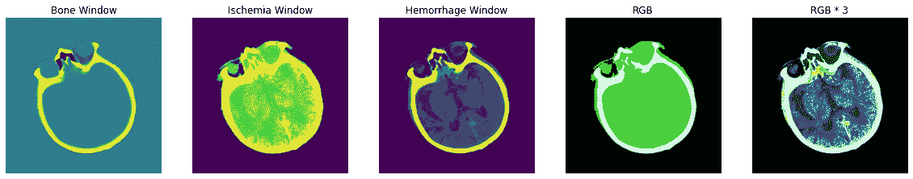
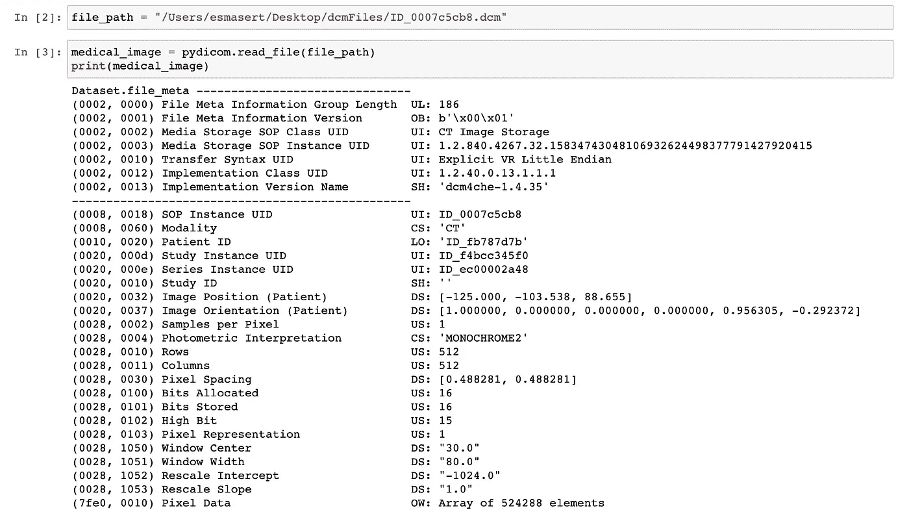
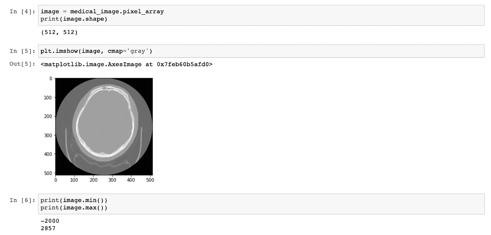
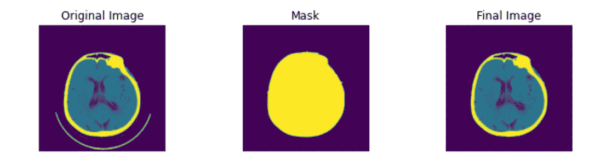
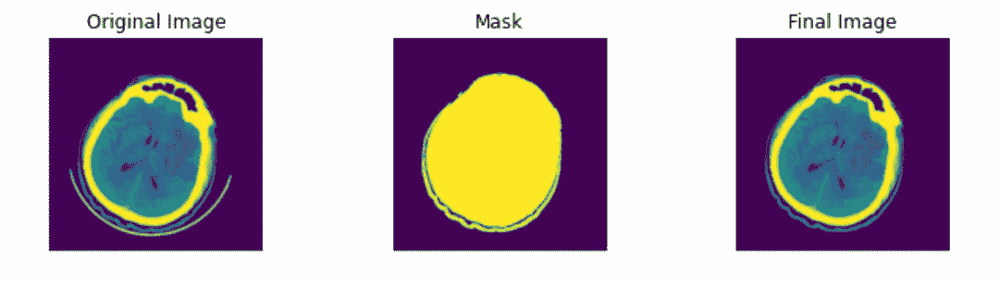
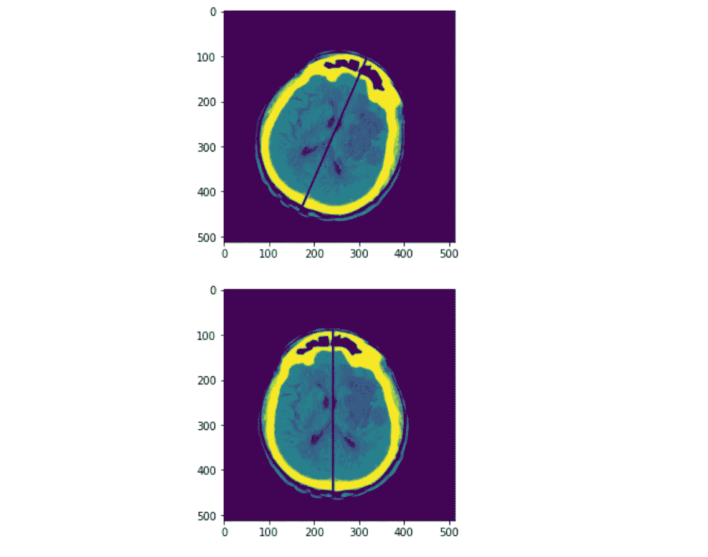
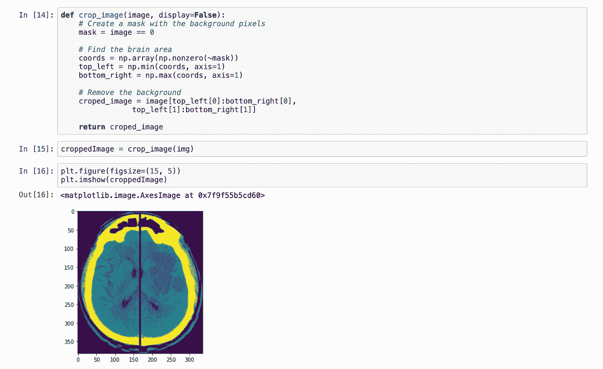
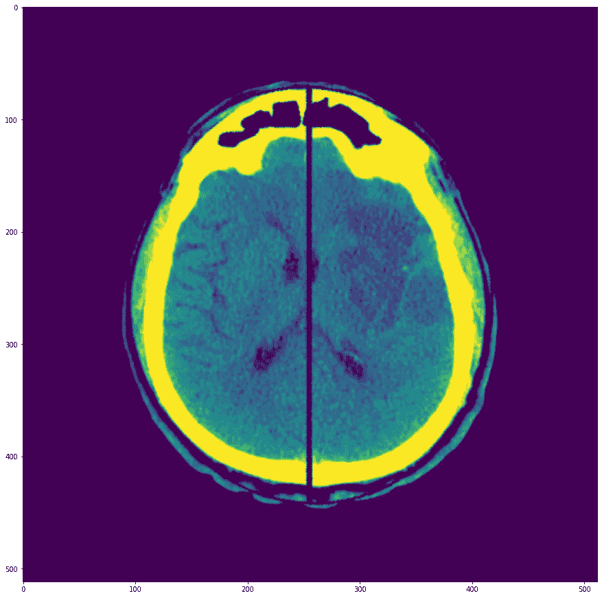

# 基于 Python 的医学图像预处理

> 原文：<https://towardsdatascience.com/medical-image-pre-processing-with-python-d07694852606?source=collection_archive---------3----------------------->

## 用于训练模型的 dicom 图像预处理概述。



CT 图像- *作者提供的图像*

## 数据怎么样

在这篇文章中，我将解释如何用简单的例子预处理美丽的医学图像来训练任何人工智能模型，以及如何通过所有预处理阶段为模型准备数据以给出最高的结果。

我要用的数据是一堆 2D 大脑 CT 图像。它们是 DICOM 格式的。您可以简单地将这些操作应用于您自己的数据，以从您的模型中获得更有效的结果。

在我们开始编码之前，让我们先讨论一下医学数据。首先我来解释一下什么是 CT。

计算机断层扫描是一种扫描，它拍摄从不同角度发送到身体的 X 射线图像，并使用计算机处理器进行组合，以访问身体各个部位的骨骼、血管和软组织的横截面图像(切片)。这些图像提供了比常规 x 射线图像更详细的信息。这样，患者的骨骼、静脉或组织中的异常被检测到。这就是为什么，可以对病人作出更准确的诊断，并相应地继续治疗。

现在我们来讨论一下，DICOM 格式是什么。

DICOM 是医学数字成像和通信的首字母缩写。这种格式的文件很可能以“dcm”文件扩展名保存。DICOM 既是一种通信协议，也是一种文件格式；这意味着患者可以在一个文件中存储医疗信息，如超声和 MRI 图像及其信息。而 png 或 jpg 文件只包含图片的名称、日期和像素数；dicom 格式包括病人的信息，图片的开窗间隔，我们称之为元数据。简而言之，它包括更详细的患者信息。这种格式不仅可以将所有数据保存在一起，还可以确保信息在支持 DICOM 格式的设备之间传输。我从 [Kaggle](https://www.kaggle.com/c/rsna-intracranial-hemorrhage-detection/data) 那里拿了几张 dcm 图像。

```
**import** **pydicom** file_path = "/Users/esmasert/Desktop/basicsDcm/10095.dcm"
medical_image = pydicom.read_file(file_path)
print(medical_image)
```



阅读 Dicom 文件— *作者图片*



*作者图片*

在对 CT 和 dicom 做了基本的总结之后，让我们继续进行预处理。在图像的预处理阶段，我使用了 5 个步骤。

这些步骤是:变换到 HU，去除噪声，倾斜校正，裁剪图像和填充。

在将这些预处理步骤应用到数据之后，我们看到模型精度得到了显著提高。我正在讲解预处理方法。要以更清晰的格式查看代码，您可以访问这个[链接](https://github.com/esmasert/Medical-Image/blob/main/PreprocessingDcmImages.ipynb)。

在以 DICOM 格式加载我们的图像数据后，我们将把它转换成 Hounsfield 单位形式。

## **变身胡**

Hounsfield 单位(HU)是一种无线电波强度的相对定量测量单位，放射科医生使用它来更好地解释和理解计算机断层扫描(CT)图像。在 CT 重建期间使用组织内辐射的吸收/衰减系数来产生灰度图像。线性变换产生显示为灰色调的 Hounsfield 标度。更致密的组织，具有更大的 X 射线束吸收，具有正值并且看起来更亮；密度较低的组织对 X 射线束的吸收较少，具有负值，看起来较暗。[1]Hounsfield 单位是以著名的 Godfrey Hounsfield 爵士命名的，他有计算机断层摄影的部分发明，并因此获得诺贝尔奖。

我们可以通过使用重新调整截距和重新调整坡度标题来获得 HU:

```
**def** transform_to_hu(medical_image, image):
    intercept = medical_image.RescaleIntercept
    slope = medical_image.RescaleSlope
    hu_image = image * slope + intercept

    **return** hu_image**def** window_image(image, window_center, window_width):
    img_min = window_center - window_width // 2
    img_max = window_center + window_width // 2
    window_image = image.copy()
    window_image[window_image < img_min] = img_min
    window_image[window_image > img_max] = img_max

    **return** window_image
```

如果您想要图像的特定区域，您可以调整图像的窗口。

## **去除噪音**

在预处理过程中，去除噪声是一个非常重要的阶段，因为实施后数据得到改善，我们可以更清楚地看到它。因此，模型可以被更好地训练。[2]

```
**def** remove_noise(file_path, display=**False**):
    medical_image = pydicom.read_file(file_path)
    image = medical_image.pixel_array

    hu_image = transform_to_hu(medical_image, image)
    brain_image = window_image(hu_image, 40, 80) #bone windowing

    segmentation = morphology.dilation(brain_image, np.ones((1, 1)))
    labels, label_nb = ndimage.label(segmentation)

    label_count = np.bincount(labels.ravel().astype(np.int))
    label_count[0] = 0

    mask = labels == label_count.argmax()

    mask = morphology.dilation(mask, np.ones((1, 1)))
    mask = ndimage.morphology.binary_fill_holes(mask)
    mask = morphology.dilation(mask, np.ones((3, 3)))
    masked_image = mask * brain_image **return** masked_image
```



*作者图片*



*作者图片*

## **倾斜校正:**

倾斜校正是大脑图像对齐的一种建议方式。当脑部 CT 图像经历倾斜时，它可能导致医学应用的不对准。这很重要，因为当我们训练模型时，它可以通过相同的排列看到整个数据。手动校正大规模数据的倾斜既费时又费钱。因此，需要一种在训练前的预处理中执行倾斜校正的自动方法。

```
img=numpy.uint8 (iskemiMaskedImg)
contours, hier =cv2.findContours (img, cv2.RETR_EXTERNAL, cv2.CHAIN_APPROX_SIMPLE)
mask=numpy.zeros (img.shape, numpy.uint8)

*# find the biggest contour (c) by the area*
c = max(contours, key = cv2.contourArea)

(x,y),(MA,ma),angle = cv2.fitEllipse(c)

cv2.ellipse(img, ((x,y), (MA,ma), angle), color=(0, 255, 0), thickness=2)

rmajor = max(MA,ma)/2
**if** angle > 90:
    angle -= 90
**else**:
    angle += 96
xtop = x + math.cos(math.radians(angle))*rmajor
ytop = y + math.sin(math.radians(angle))*rmajor
xbot = x + math.cos(math.radians(angle+180))*rmajor
ybot = y + math.sin(math.radians(angle+180))*rmajor
cv2.line(img, (int(xtop),int(ytop)), (int(xbot),int(ybot)), (0, 255, 0), 3)

pylab.imshow(img)
pylab.show()

M = cv2.getRotationMatrix2D((x, y), angle-90, 1)  *#transformation matrix*

img = cv2.warpAffine(img, M, (img.shape[1], img.shape[0]), cv2.INTER_CUBIC)

pylab.imshow(img)
pylab.show()
```



*作者图片*

## **裁剪图像并添加填充:**

需要对图像进行裁剪，以将大脑图像置于中心，并去除图像中不必要的部分。此外，一些大脑图像可能被放置在一般图像中的不同位置。通过裁剪图像和添加填充，我们将确保几乎所有的图像都在普通图像本身的相同位置。



*作者图片*

```
**def** add_pad(image, new_height=512, new_width=512):
    height, width = image.shape

    final_image = np.zeros((new_height, new_width))

    pad_left = int((new_width - width) // 2)
    pad_top = int((new_height - height) // 2)

    *# Replace the pixels with the image's pixels*
    final_image[pad_top:pad_top + height, pad_left:pad_left + width] = image

    **return** final_image
```



作者图片

下面是结果！一个干净的，正确的和居中的大脑图像。准备好进去训练了。

我在下面附上了参考资料。非常感谢 https://vincentblog.xyz/！它确实帮助我更深入地理解了图像处理。

如果您有任何建议或问题，请在下面评论。非常感谢！

## **参考文献**

1.  [https://www.ncbi.nlm.nih.gov/books/NBK547721/](https://www.ncbi.nlm.nih.gov/books/NBK547721/)
2.  [https://Vincent blog . XYZ/posts/medical-images-in-python-computed-tomography](https://vincentblog.xyz/posts/medical-images-in-python-computed-tomography)
3.  [https://link . springer . com/article/10.1007/s 10278-020-00400-7](https://link.springer.com/article/10.1007/s10278-020-00400-7)
4.  【https://www.eyewated.com 