# 使用 Azure 机器学习的医学成像

> 原文：<https://towardsdatascience.com/medical-imaging-with-azure-machine-learning-b5acfd772dd5?source=collection_archive---------16----------------------->


图片由微软提供。

> 安德烈亚斯·科普和哈姆克·阿尔克马德

# 概观

医疗人工智能(AI)应用提供了显著的社会效益。它们通过提高医疗保健专业人员的工作效率，在日常工作流程中为他们提供帮助，扩大了医疗保险的覆盖范围。智能医疗设备用于低人口偏远地区的健康筛查。基于人工智能的早期疾病检测的突破实现了积极主动、往往侵入性更小的治疗，并且可以挽救生命。

此外，随着人们使用智能应用程序进行健康监测和自我检查，医学正变得越来越民主化。然而，这不是要取代医生的访问。相反，患者会收到来自应用程序的指示，提示他或她向医生寻求澄清。医生从患者的日常生活中获得补充的有价值的健康数据。

基于 X 射线、CT、MRI、显微镜或其他成像技术的医学计算机视觉用例尤为重要。给定足够质量和数量的训练数据，算法可以可靠地发现异常，有时甚至超过医疗专业人员。但是医学计算机视觉也有自己的挑战。

*   医学成像技术使用的光学分辨率通常为每维 100，000 像素，远远超过当今计算机视觉神经网络架构的能力。
*   可解释性是关键。机器学习算法倾向于利用工件和目标类之间的相关性作为捷径。例如，躺在床上的病人的射线照片通常比典型的 x 射线照片具有更低的图像质量。患者不能移动的事实可能与医疗状况相关。因此，该算法可能会了解到模糊的 x 射线图像与肺炎等特定疾病有关，而不是了解疾病的真正潜在视觉模式。
*   医疗患者信息属于我们能想到的最敏感的数据。因此，隐私是一个大问题。在医疗保健组织中，关于使用或训练基于受保护患者数据的 ML 模型的监管和隐私影响，存在许多不确定性。

微软 AI Ranger 团队在 Github.com/Azure/medical-imaging 的[下提供了几个计算机视觉演示，用于学习目的和在医疗场景中重用。](https://github.com/Azure/medical-imaging)

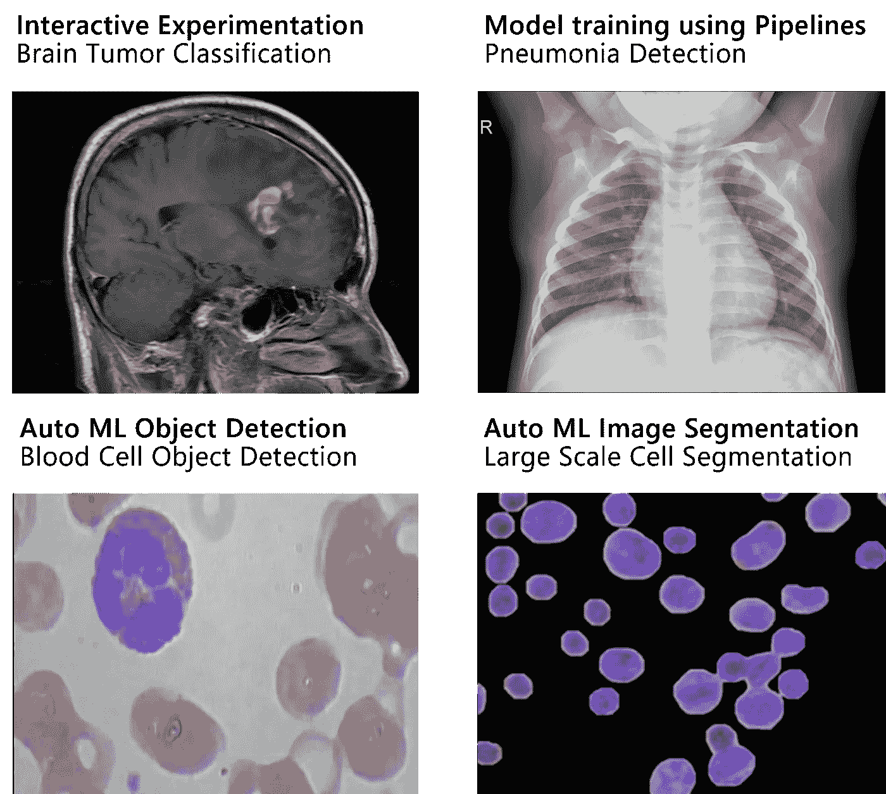

医学影像库用例。作者图片。

我们的 Python 笔记本的目的是展示如何使用 [Azure Machine Learning](https://azure.microsoft.com/en-us/services/machine-learning/#product-overview) 来支持医疗成像和数据和模型管理、部署、实验跟踪和可解释性等领域的其他用例。此外，我们涵盖了各种数据科学方法，从使用 PyTorch 的手动模型开发到图像的自动机器学习。另一个重点是提供基于 MLOps 的例子，用于自动化医疗用例的机器学习生命周期，包括新数据可用时的再培训。

# 脑肿瘤检测的交互式实验

与其他癌症不同，脑瘤属于相当罕见的疾病。每 100，000 人中大约有 7 人患恶性脑瘤。可靠的诊断是基于成像技术，如磁共振成像(MRI)。功能性 MRI 用于外科手术的准备，因为其与邻近区域的关系可以很好地可视化。

对于我们的脑肿瘤分类演示，我们使用代表以下诊断(类别)的 MRI 图像数据集:**神经胶质瘤、脑膜瘤、垂体瘤、无瘤**。

数据集可以从这个位置下载:[脑肿瘤分类(MRI) | Kaggle](https://www.kaggle.com/sartajbhuvaji/brain-tumor-classification-mri) 。我们的笔记本可以在这里找到:[互动-实验](https://github.com/Azure/medical-imaging/blob/main/notebooks/1-interactive-experimentation.ipynb)。

Azure 机器学习支持几个创作选项，包括 Jupyter、JupyterLab、Visual Studio 代码和 Azure ML Studio 中的集成笔记本体验。后一个选项支持智能感知代码完成、代码片段和协作功能，如注释和共同编辑。

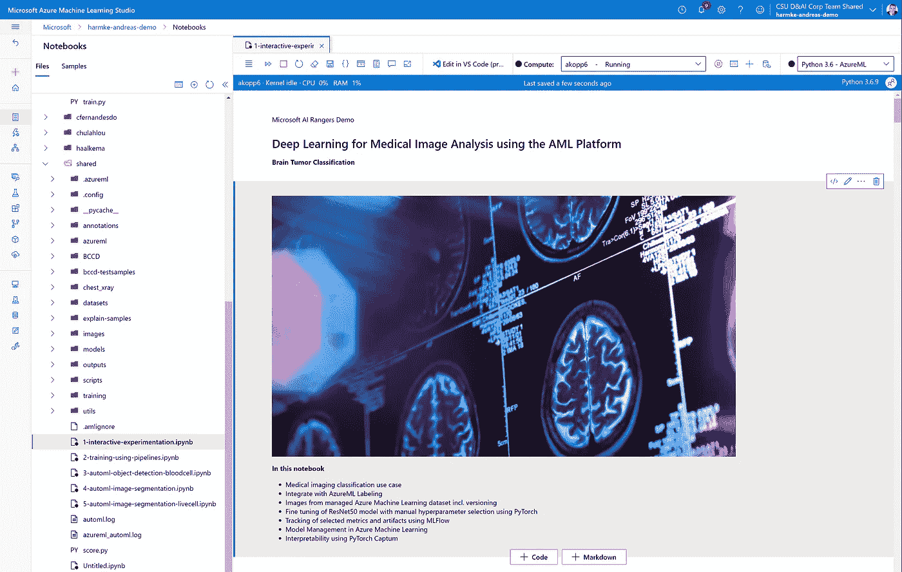

Azure 机器学习工作室的笔记本体验。作者图片。

本演示的一个主要目的是展示一位经验丰富的数据科学家如何利用该平台进行灵活的实验，同时管理所有相关资产。我们使用流行的 MLflow 库来管理 Azure ML 服务的实验。

脑肿瘤图像训练数据被用作 Azure ML 中的版本化数据集。我们提取最新版本的数据作为我们培训的基础。首先，我们执行预处理和基本数据扩充(例如，旋转、水平翻转)来训练更一般化的模型。由于这是训练工作流的关键部分，我们存储预处理配置参数和一组实验运行的结果样本图像:

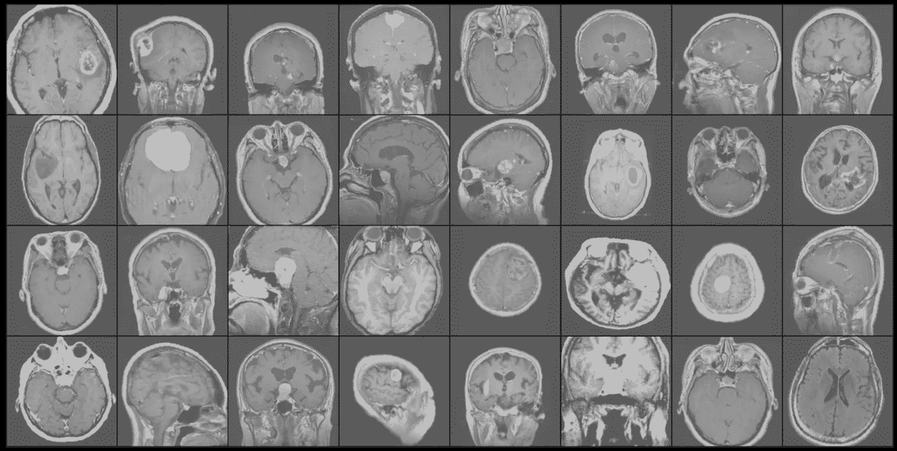

预处理后的脑肿瘤样本图像。作者图片。

使用预训练的 ResNet50 卷积神经网络(CNN)来建立模型。我们还将模型架构记录为实验运行的资产，以便以后可以对其进行审查。这对于确保实验几个月甚至几年后的可追溯性特别有用。

既然我们已经准备好了数据和架构，我们就可以训练模型了。我们正在使用一组基本的超参数(例如优化器、学习率、批量)，我们还会在手动超参数流程中对其进行跟踪、审查和调整。

我们正在利用一个基于 Tesla V100 GPU 的 Azure 计算实例进行培训。我们的 PyTorch 训练循环运行 15 个时期，并返回与具有最佳验证准确性的时期相关联的模型。

为了评估模型在看不见的数据上的表现，我们检查了一组基于测试集的指标。一个结果是混淆矩阵，它也是 Azure 机器学习中的交互式资产:

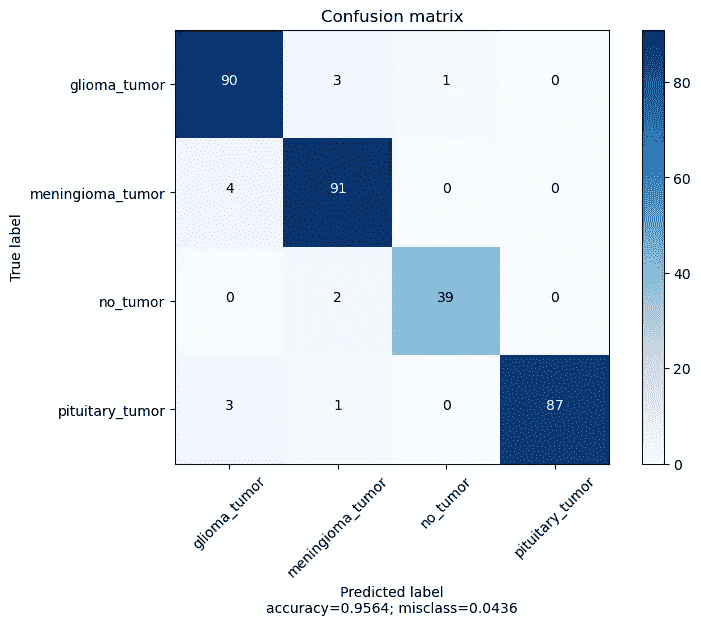

测试集混淆矩阵。作者图片。

通过这个实验，我们实现了大约 96%的测试集准确性，这与我们在训练过程中观察到的验证结果一致。

为了获得对模型预测至关重要的图像相关部分的视觉指示，我们使用 PyTorch Captum 进行解释。

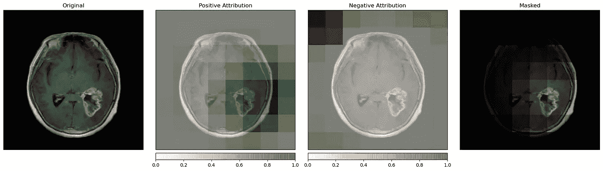

Grad-CAM 对预测类的解释。作者图片。

这些样本显示了被分类为神经胶质瘤肿瘤的脑肿瘤图像的梯度加权类别激活映射(Grad-CAM)。Grad-CAMs 使用流入最终图层的渐变来生成本地化地图，突出显示预测输出的重要区域。虽然 Grad-cam 很有帮助，但这是一种相当粗糙的可视化方法。存在更高级的可解释性技术(例如，分层相关性传播),其更精确地显示关键区域。

我们将 Grad-CAM 热图与本次实验的其他运行资产存储在一起，以提高可追溯性。

训练深度学习模型是一个迭代的实验过程。我们通常在调整预处理、尝试各种架构和调整超参数的同时重复我们的实验，以连续改进模型的性能。进行数十次不同配置的训练是常见的做法。

Azure ML 的实验管理功能支持这一优化过程，这样我们就不会迷失在难以理解的试错练习中。每次我们提交培训流程时，都会创建一次运行，同时跟踪配置设置和最终的性能指标(例如，分类准确性)。

查看 Azure ML Studio 中的实验概述，我们看到了从第一个原型到完成的脑肿瘤检测模型的开发里程碑。

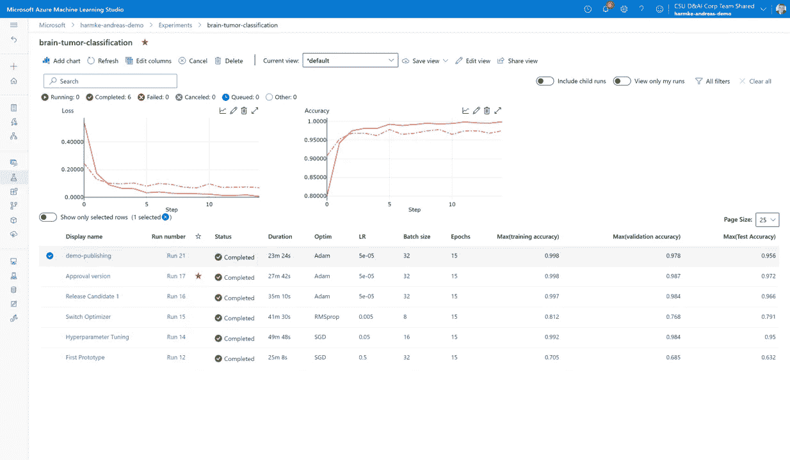

用 Azure ML 跟踪 ML 实验。作者图片。

我们观察选择的超参数以及我们的选择如何影响模型性能。从准确性指标来看，我们发现验证准确性从我们第一个原型的 68.5%提高到了最终模型的 97.8%。

我们选择维护的所有资产(例如，预处理图像样本、神经网络架构定义、混淆矩阵、CAM 解释)都存储在每次运行的上下文中。

# 使用 MLOps 自动检测肺炎

肺炎是由细菌或病毒引起的呼吸道感染。它影响到许多人，特别是在发展中国家和不发达国家，那里污染严重、不卫生的生活条件和过度拥挤相对普遍，对儿童的影响尤其大。

肺炎的早期诊断对确保治愈性治疗和提高存活率至关重要。胸部 x 光成像是诊断肺炎最常用的方法。然而，胸部 x 光检查是一项具有挑战性的任务，并且容易出现主观可变性。在这个笔记本中，用于检测病毒性或细菌性肺炎的医学图像的相对较小的公共数据集用于训练肺炎分类模型。该数据集包含 5218 张 x 射线图像，具有两类诊断结果:3876 例(病毒性或细菌性)肺炎(74%)和 1342 例无发现(“正常”)(26%)。

您可以在这个位置下找到数据集:[胸部 x 光图像(肺炎)| Kaggle](https://www.kaggle.com/paultimothymooney/chest-xray-pneumonia)


来自肺炎数据集的样本图像。作者图片。

在[笔记本](https://github.com/Azure/medical-imaging/blob/main/notebooks/2-training-using-pipelines.ipynb)中，展示了三种不同的方法来使用 Azure ML 的独特功能训练模型。所有方法都利用 Python 的 Azure ML SDK 来配置和提交训练运行到 Azure ML。数据科学家和人工智能开发人员可以使用 Azure ML SDK，通过 [Azure 机器学习服务来构建和运行机器学习模型。](https://docs.microsoft.com/en-us/azure/machine-learning/overview-what-is-azure-ml)不同类型的训练运行允许模型的灵活开发，因为运行可以被配置为在各种计算目标上执行。

笔记本从训练一个基线模型开始，该模型被配置为运行在带有 GPU 虚拟机的 Azure 集群上。第二部分展示了一种调整超参数的方法，使用了一种称为 Hyperdrivestep 的特殊类型的管道步骤。此功能允许您定义要优化的不同参数，以及训练脚本。

笔记本的第三部分也是最后一部分转换了在 Azure ML 管道中运行的远程实验。Azure ML 管道是可独立执行的工作流/步骤集，用于完成机器学习任务。管道是 ML 生命周期自动化的一个很好的工具，因此也是 MLOps 的一个很好的工具。

下图显示了 MLOps 流程的概况。它包含将机器学习模型引入生产的步骤，从培训到部署。此外，基于触发器，该模型被周期性地重新训练。触发器可以基于重现、模型性能(监控)或新的可用训练数据。


MLOps 流程。作者图片。

在笔记本中，根据训练数据集中的文件更改来实现重新训练触发器。这可以使用 Azure ML SDK 来完成:

```
reactive_schedule = Schedule.create(workspace,  name="MyReactiveSchedule",
description="Based on input file change.",
pipeline_id=pipeline_endpoint_by_name.id,
experiment_name='experiment_name',
datastore=datastore,
data_path_parameter_name="input_data")
```

# 具有自动机器学习的血细胞检测

在前面的分类示例中，需要几个手动步骤:我们选择或创建一个特定的 CNN 架构，并提供定制代码来训练 PyTorch 模型。

现在，我们利用 Azure 新的图像自动机器学习功能来简化这一过程，同时将其应用于更具挑战性的计算机视觉用例。

使用 AutoML for Images，我们只需要提供带标签的训练图像并设置训练框架参数。然后，AutoML for Images 有助于为我们想要优化的给定性能指标(例如，分类精度)找到预处理、神经网络架构和超参数的最佳组合。

AutoML for Images 目前支持基于以下计算机视觉架构的多类和多标签分类、对象检测和实例分割。

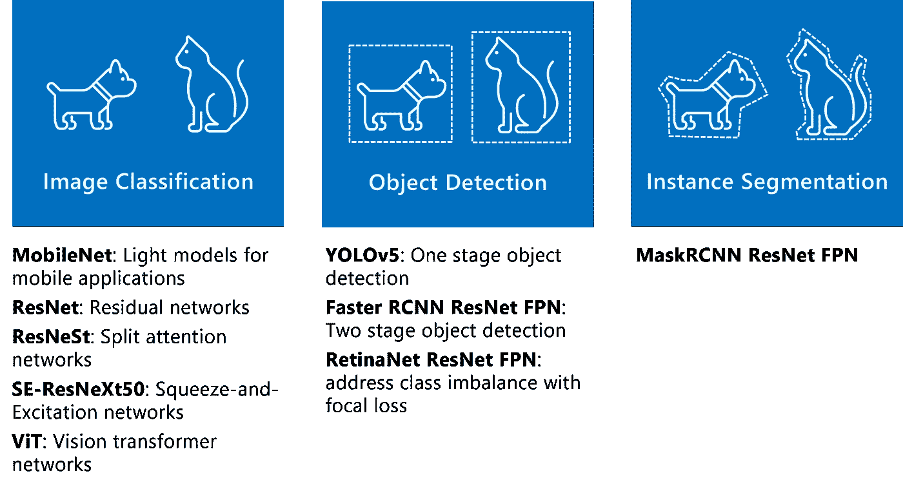

图像任务和架构的自动化 ML。作者图片。

查看[文档](https://docs.microsoft.com/en-us/azure/machine-learning/how-to-prepare-datasets-for-automl-images)或该视频，了解更多关于图像自动化 ML 的信息:

在这个[演示笔记本](https://github.com/Azure/medical-imaging/blob/main/notebooks/3-automl-object-detection-bloodcell.ipynb)中，我们使用 AutoML 进行血细胞对象检测，并在下面的示例中进行实例分割。

我们用于本演示的小规模数据集包含三个类别:**红细胞(RBC)、白细胞(WBC)、血小板。**

你可以从这个位置下载数据集: [BCCD 数据集| Kaggle](https://www.kaggle.com/surajiiitm/bccd-dataset) 。

连接到 Azure ML workspace 后，我们创建一个新的(或连接到现有的)计算集群用于培训。在本演示中，我们指定了一个具有 4 个节点的 GPU 集群，用于并行化具有不同配置的训练运行，以实现超参数优化。

第一次运行笔记本时，我们需要提供训练数据，并将基于 Pascal VOC 的注释(血细胞类定义和边界框坐标)转换为 AutoML for Images 期望的基于 JSONL 的格式。该笔记本包括示例注释转换代码。转换后，批注和图像文件被上传并注册为托管 Azure ML 数据集。您可以在所有后续运行中重复使用这些数据集，而无需再次上传数据。

在我们的演示中，我们指定了一个专用的验证数据集。这是一个可选步骤。如果没有提供验证数据集，AutoML for Images 将使用 20%的训练样本进行验证。

根据训练数据和配置的数量，优化过程可能需要几个小时。因此，建议在提交一系列超参数调整运行之前，执行一次训练运行作为基线。

使用我们的对象检测模型的默认参数来训练 YOLOV5 模型的配置很简单:

```
from azureml.train.automl import AutoMLImageConfig
from azureml.automl.core.shared.constants import ImageTask
from azureml.train.hyperdrive import GridParameterSampling, choiceimage_config_yolov5 = AutoMLImageConfig(task=ImageTask.IMAGE_OBJECT_DETECTION, compute_target=compute_target, training_data=training_dataset, validation_data=validation_dataset, hyperparameter_sampling=GridParameterSampling({'model_name': choice('yolov5')}), iterations=1)automl_image_run = experiment.submit(image_config_yolov5)
```

除了指定任务类型和 GPU 集群，我们还将训练和验证数据集作为参数以及所需的模型类型进行传递。平均精度(mAP)被自动选择为优化对象检测任务的主要度量。

经过 10 个时期的训练后，该模型达到了 83.4%的 mAP。该指标考虑了正确分类的对象数量，以及真实情况和预测边界框之间的正确重叠区域。实验的所有指标都可以在 Azure ML Studio 中的相应运行下进行跟踪。

83.4%的平均精度是一个很好的结果，因为我们没有优化任何超参数。我们能否通过利用 AutoML 针对图像的超参数优化功能来实现更好的性能？

对于第二个实验，我们指定了一个参数空间，该参数空间基于两个计算机视觉架构、学习速率的范围、优化器选择、图像大小和其他参数。

AutoML for Images 通过从定义的参数空间中随机选择配置来训练一系列模型。通过选择提前终止策略，我们可以确保低性能配置被提前终止，从而释放计算资源用于更多试验。

超参数扫描的结果可以在 Azure ML Studio 的实验部分观察到:

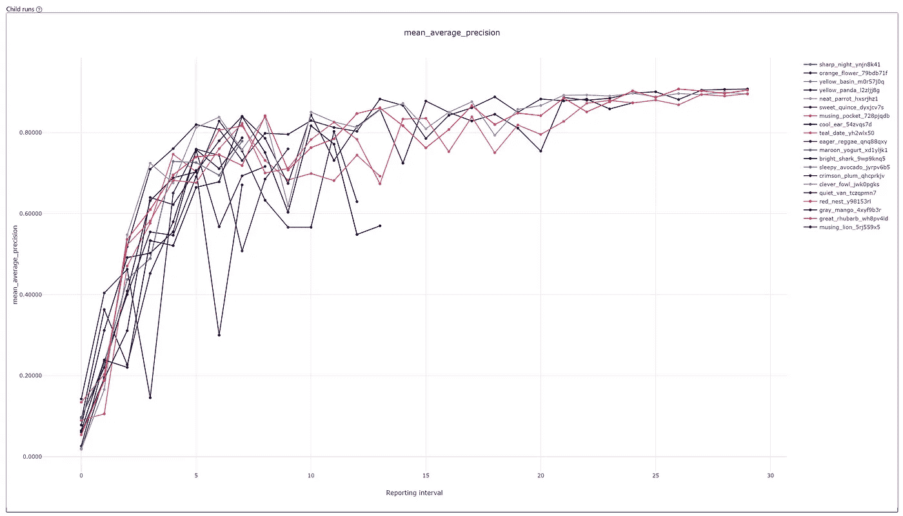

图像优化过程的自动化 ML 的结果。作者图片。

在提交的 20 个试验中，有 5 个表现不佳的试验被提前终止。最佳运行实现了 92.9 %的 mAP，超出初始基线运行 9.5 个百分点。

有几个选项可以将模型部署到实际生产中。在我们的演示笔记本中，我们将模型部署到一个可扩展的 Azure Kubernetes 服务中。为了查看我们最佳的血细胞物体检测模型的运行情况，我们提供了基于如下几个测试样本的预测:

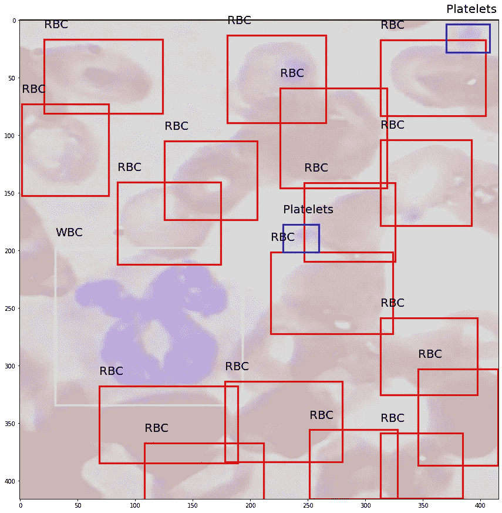

血细胞目标检测模型的预测。作者图片。

# 基于自动机器学习的大规模细胞分割

存储库中的[第四个笔记本](https://github.com/Azure/medical-imaging/blob/main/notebooks/4-automl-image-segmentation-livecell.ipynb)使用 Azure Auto ML 的图像分割功能，应用于细胞分割。单个细胞的精确分割能够探索复杂的生物学问题，但由于低对比度和高对象密度，这需要复杂的成像处理管道。

LIVECell 数据集是一个大规模的显微图像数据集，例如 2021 年 8 月发布的 2D 细胞培养物中单个细胞的分割。它包含高质量的手动注释和专家验证的图像，是目前同类中最大的。关于数据集的更多信息可以在这里找到: [LIVECell 数据集| live cell(sartorius-research . github . io)](https://sartorius-research.github.io/LIVECell/)

以下示例概述了 LIVECell 数据集的形态多样性:

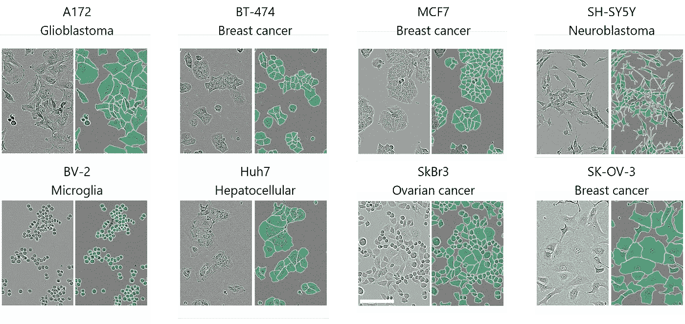

LIVECell 数据集中包含的八种细胞类型的形态多样性。图片基于 Edlund，c .、Jackson，T.R .、Khalid，N. *等*live cell——一个用于无标记活细胞分割的大规模数据集。 *Nat 方法* 18 **，**1038–1045(2021)。https://doi.org/10.1038/s41592–021–01249–6.

创建标注数据集的挑战之一是为具有不同背景的团队成员提供合适的工具，以便在数据标注项目中进行协作。[Azure ML 中的数据标签功能](https://docs.microsoft.com/en-us/azure/machine-learning/how-to-create-image-labeling-projects)是创建、管理和监控标签项目的中心位置。除了常规图像格式，该服务还支持 DICOM 图像，这是医疗保健人工智能医学图像标签的行业标准格式。支持的项目类型有图像分类、对象检测(边界框)和实例分割(多边形)。下图显示了图像分割的标注体验。

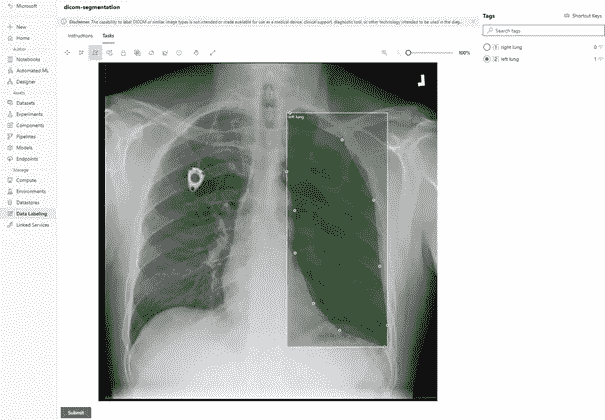

用于实例分割的 Azure ML 标记工具。作者图片。

LIVECell 数据集已经被标记，所以我们使用数据集提供的注释。笔记本中的第一步是将 LIVECell 注释转换为 Azure AutoML for Images 支持的结构。之后，我们展示如何将数据作为 Azure ML 数据集进行检索。之后，我们将展示如何为图像分割任务配置运行。

图像的自动化 ML 通过迭代不同的模型参数并比较结果模型的性能来提高数据科学家的性能。下图显示了由 Auto ML 创建的输出图，该图显示了哪些模型配置已经过测试以及相应的模型性能。

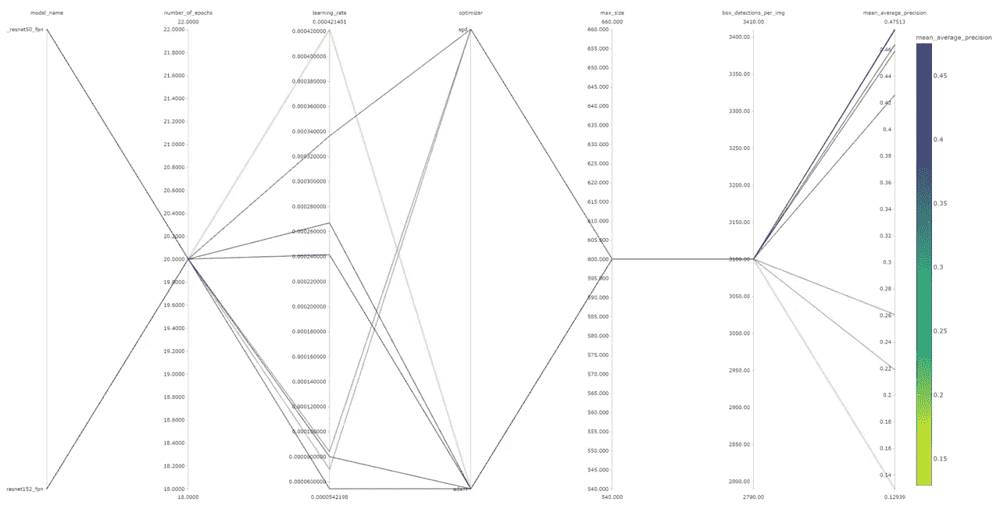

自动 ML 超参数优化器输出图。作者图片。

该笔记本还提供了代码，用于将生成的模型作为 webservice 部署为 Azure Kubernetes 服务中的容器。通过这样做，我们可以根据看不见的细胞图像进行推断。下面的图像显示了一些由 Auto ML 模型生成的预测分割，与原始图像和地面真实分割相邻，以供参考。请注意，在这个实验中，我们只使用了 50%的可用训练数据。我们希望能够通过使用完整的数据集进行训练来提高模型的性能。

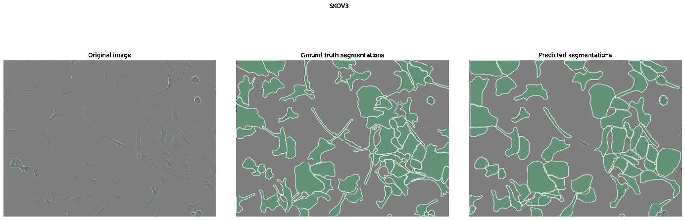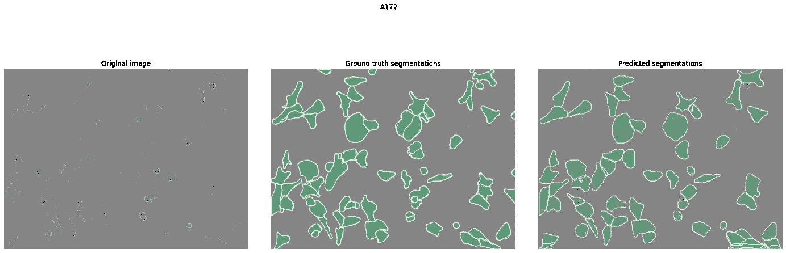

由我们的自动 ML 模型生成的预测分割。作者图片。

我们希望这个概述对您有用。随意看看我们的 GitHub 代码库 [**这里**](https://github.com/Azure/medical-imaging) **。我们非常感谢您的问题、反馈和想法，因为我们计划在未来扩展这个库！**